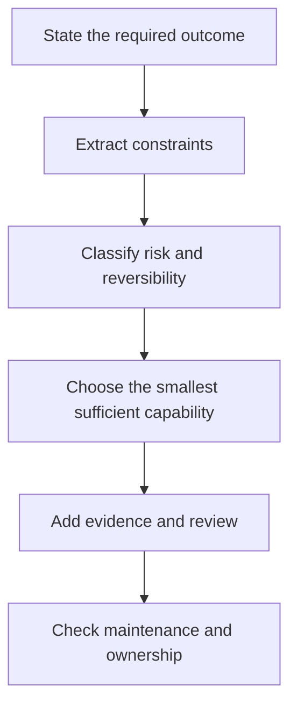

# Study the Decisions, Not the Vocabulary

> A certification blueprint is a map of decisions a competent practitioner can defend. Treat it as a list of terms and you will study the least useful part of the exam.

**Type:** Learn
**Languages:** Python
**Prerequisites:** None
**Time:** ~75 minutes

## Learning Objectives

- Convert a certification blueprint into a weighted study plan.
- Separate stable engineering principles from product details that can change.
- Build an evidence ledger that records decisions, reasons, and official sources.
- Practice scenario judgment without using dumps or reconstructing live questions.
- Define a readiness gate based on domain performance, not one flattering mock score.

## The Problem

Maya has spent two weeks memorizing feature names. She can define a Project, a context window, and a connector. Then she meets a scenario.

A team wants to summarize a confidential weekly report. The source file changes every Friday. The final summary goes to executives. The options include pasting the report into a new chat, adding it to an old Project, connecting the live source, and building a custom application. Every option can produce a summary. Only one fits the update cadence, review requirement, data policy, and maintenance burden.

Maya searches her memory for the definition of a connector. The scenario is asking for a decision.

That distinction controls this entire curriculum. The official guides describe tasks such as selecting a product, validating an output, managing knowledge, and escalating risk. A definition can support those tasks. It cannot perform them for you.

The exams also use a scaled score. A practice percentage is not an official score, and no community mock can predict the result. Your job is to build enough judgment that unfamiliar scenarios still feel structured.

## The Concept

### The blueprint is a job model

Each domain represents part of the work expected from the target role. The weight estimates how much of the scored exam is drawn from that domain. Weight is not difficulty. A small domain can still contain difficult questions. Weight tells you how to allocate practice.

For Associate Foundations, the largest domain is output evaluation and validation. That is a signal. The role is not merely someone who can ask Claude for an answer. It is someone who can decide whether the answer is fit to use.

Use three labels while reading every objective:

1. **Know:** facts or vocabulary you must recall.
2. **Do:** a procedure you must perform.
3. **Decide:** a tradeoff you must resolve from constraints.

Most weak study plans overinvest in Know. Most scenario questions concentrate on Do and Decide.

### Stable principles and changeable facts

Some knowledge changes slowly:

- Sensitive data needs an approved handling path.
- A claim needs evidence before it enters a consequential deliverable.
- Persistent instructions should be concise, scoped, and maintained.
- Irreversible actions deserve stronger review than reversible drafts.
- A larger model is wasteful when a smaller model meets the measured requirement.

Other knowledge can change between the day this lesson is written and the day you study:

- Model names, prices, and context limits.
- Plan eligibility and feature availability.
- Product navigation and interface labels.
- Connector capabilities and approval behavior.
- Certification fees, policies, and access rules.

The second group must carry a verification date and an official source. This curriculum was checked against the July 2026 version 1.0 guides. Before scheduling an exam, open the current official guide and certification FAQ again.

### The scenario decision stack

When several answers sound reasonable, inspect the scenario in this order:



The smallest sufficient capability matters. If a direct chat produces a one-time draft safely, a managed Project may be unnecessary. If a source changes every day, a pasted copy may be too stale. If the workflow performs a consequential action, convenience does not outrank approval.

### Wrong answers are usually locally correct

Good distractors are rarely nonsense. They solve the wrong problem, ignore one constraint, or add unnecessary machinery.

Common shapes include:

- **Capability without fit:** The feature can do the task, but not under the stated privacy or freshness requirement.
- **Maximum power by default:** The largest model is selected without a measured need.
- **Prompt-only repair:** A prompt is rewritten when the failure actually comes from stale knowledge or a missing source.
- **Automation without ownership:** A workflow has no reviewer, escalation route, or maintenance owner.
- **Policy after execution:** Sensitive material is processed first and classified later.
- **One successful example:** A single polished output is treated as evidence of reliability.

### Build an evidence ledger

Your notes should record decisions, not copied paragraphs. Use one entry per objective:

```json
{
  "objective": "Choose when human verification is required",
  "decision_rule": "Require independent review when an error could create material harm or the claim lacks authoritative evidence",
  "counterexample": "A low-risk brainstorming list can be reviewed by the author during normal editing",
  "artifact": "claim-evidence matrix",
  "official_source": "URL and verification date",
  "confidence": "practiced"
}
```

The counterexample is essential. If you cannot name when a rule should not apply, you probably memorized a slogan rather than learned a boundary.

## Build It

Create a seven-row Associate Foundations ledger, one row per domain. For each row, write:

- The domain weight.
- Two decisions you expect to make.
- One artifact that proves you can perform the work.
- One failure mode you want to recognize quickly.
- One official source.
- Your current confidence: unseen, understood, practiced, or timed.

Then allocate ten study hours proportionally. Start with the mathematical allocation, but adjust for weakness. A 21 percent domain where you already perform strongly may need less remediation than a 12 percent domain you have never used.

Use this formula:

```text
domain hours = total hours x domain weight x weakness multiplier
```

Normalize the final numbers so they add back to your available time. A weakness multiplier of 1.5 is reasonable for an unfamiliar domain. Do not use a multiplier to avoid high-weight work you dislike.

Finally, build an error log for practice questions. Record:

- The decision you made.
- The constraint you missed.
- Why the selected option looked attractive.
- The rule that would have produced a better answer.
- A new scenario where the same rule applies.

Reviewing the error log is more valuable than repeatedly taking the same mock.

### Use a cadence, not a cram pile

Use this four-stage cadence as a curriculum heuristic. Stretch it across four
weeks or compress it into the time you actually have:

1. **Orient:** Read the current guide, take one untouched diagnostic, and map
   every miss to an objective and a confidence level.
2. **Build:** Complete the required lessons and learner-owned artifacts. Run the
   tests rather than treating code, policy, or architecture examples as prose.
3. **Transfer:** Solve new scenarios, defend why each plausible alternative
   loses, and repair weak domains using the error log.
4. **Simulate:** Take fresh timed sets under the published closed-book rules,
   review correct guesses, and stop adding new material immediately before the
   assessment.

Classify every miss before choosing remediation:

- **Recall gap:** You did not know a stable fact or definition.
- **Stale fact:** You remembered a product detail that needs current official verification.
- **Missed constraint:** You ignored privacy, freshness, latency, cost, authority, or reversibility.
- **Sequence error:** You chose a valid action at the wrong lifecycle stage.
- **Surface confusion:** You selected a capable product or tool that was not the smallest maintainable fit.
- **Evidence failure:** You accepted confidence, citation presence, or one successful run as proof.
- **Overengineering:** You added architecture before the scenario required it.

The category determines the repair. A stale fact needs documentation lookup. A
missed constraint needs new scenarios. A sequence error needs a lifecycle map.
Rereading the same explanation is not a universal study strategy.

## Interactive Lab

Use the route-map figure to change domain confidence and available hours. Watch how a weak, high-weight domain changes the study sequence instead of treating every objective equally.

```figure
00-certification-route-map
```

## Practice Lab

Run the local scenario scorer, then change one confidence label and observe the weighted study order. Break the domain weights or allocated hours and confirm that the runner refuses an invalid plan.

## Shipped Artifact

The filled artifact in `outputs/readiness-plan.json` is a complete ten-hour Associate Foundations plan. It includes all seven blueprint domains, current confidence, two decisions per domain, a failure mode, an official source, a concrete artifact to produce, a four-stage practice cadence, and a wrong-answer taxonomy.

## Verify It

Validate the packet and its tests without an API key:

```bash
cd certifications/claude/lessons/00-certification-strategy/code
python3 main.py
python3 -m unittest discover tests -v
```

The validator proves that domain weights and allocated hours reconcile, every source is dated and official, every domain has practice evidence, and remediation covers distinct failure classes. Replace the filled values with your own after the example passes.

## Capstone Connection

The six-question quiz checks whether you can reason from weights, dated facts, constraints, and error evidence. Carry the validated plan into the capstone for your chosen route. In the Associate route, it becomes the coverage and readiness record for lesson 29.

## Use It

Use the curriculum in four passes.

**Pass one: orient.** Read the current guide, take the diagnostic once, and mark weak domains. Do not study the diagnostic answers until you finish it.

**Pass two: build.** Complete the lessons and their artifacts. Run the workweek capstone without notes. The capstone forces product selection, knowledge maintenance, prompting, validation, governance, and handoff into one workflow.

**Pass three: explain.** For each decision, explain why the best alternative loses under the stated constraints. Explanation exposes shallow confidence.

**Pass four: time.** Take the full mock under closed-book conditions. Review every answer, including correct guesses. A guessed correct answer is not mastered.

A conservative readiness gate is:

- Two fresh, timed practice sets at or above your target.
- No domain below 75 percent on raw practice scoring.
- Every capstone artifact complete.
- Every missed question explained in terms of a missed constraint.
- At least ten minutes remaining on a full mock.

This is a study gate, not a prediction of Anthropic's scaled score.

## Exam Decision Patterns

- Prefer the option that satisfies all explicit constraints over the option with the most features.
- Treat words such as current, confidential, recurring, approved, auditable, and executive as architectural inputs.
- Separate content quality from workflow quality. A good answer produced through an unapproved data path is still the wrong solution.
- Prefer a maintained source over a copied snapshot when freshness matters.
- Add human review where consequence, uncertainty, or irreversibility is high.
- Verify product facts against current official material instead of trusting a remembered interface.

## Common Traps

- Using live-question dumps. They violate program rules and train recognition instead of judgment.
- Treating a longer answer as more likely to be correct.
- Memorizing exact prices without a date.
- Equating the biggest model with the safest choice.
- Taking many low-quality mocks instead of studying explanations.
- Counting a familiar scenario as proof you can handle an unfamiliar one.
- Confusing a raw practice percentage with the official scaled score.

## Exercises

1. Take one objective from each domain and label it Know, Do, or Decide. Defend each label.
2. Write a scenario where a Project is unnecessary and another where a Project is the simplest maintainable choice.
3. Find one product fact in this curriculum that could change. Verify it in an official source and record the date.
4. Rewrite a weak error-log entry, "I forgot the answer," into a missed-constraint explanation.
5. Design a personal readiness gate that is stricter than one mock score but achievable inside your available time.

## Key Terms

| Term | Meaning |
|---|---|
| Blueprint | The official domain and objective map used to define exam scope |
| Scaled score | A transformed exam score that is not equal to raw percentage correct |
| Distractor | An incorrect option designed to be plausible under an incomplete reading |
| Decision rule | A reusable way to choose from alternatives under known constraints |
| Evidence ledger | A dated record connecting an objective to a rule, artifact, and official source |
| Readiness gate | A set of conditions required before attempting the next assessment stage |

## Further Reading

- [Anthropic Partner certification catalog](https://anthropic-partners.skilljar.com/page/partner-certifications)
- [Anthropic certification FAQ](https://anthropic-partners.skilljar.com/page/faq-certifications)
- [Claude Certified Associate Foundations exam guide](https://everpath-course-content.s3-accelerate.amazonaws.com/instructor%2F6nizmqk8tpzpfjvt6qmmav7rh%2Fpublic%2F1783542847%2FClaude+Certified+Associate+%E2%80%93+Foundations+Exam+Guide.pdf)
- [CCAR-F Exact Mechanics Review](../../../references/ccar-f-exact-mechanics.md)
- [Prompt Engineering: Techniques and Patterns](../../../../../phases/11-llm-engineering/01-prompt-engineering/)
- [Evaluation and Testing LLM Applications](../../../../../phases/11-llm-engineering/10-evaluation/)
