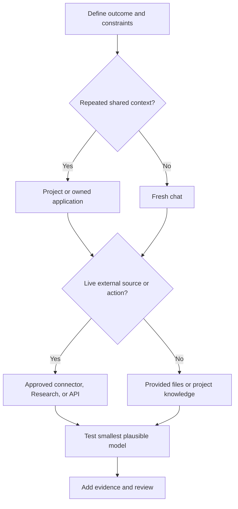

# Choose the Smallest Surface That Can Carry the Work

> Product selection is architecture at knowledge-work scale. The wrong surface can make correct output stale, unreviewable, or needlessly expensive.

**Type:** Learn
**Languages:** Python
**Prerequisites:** [Study the Decisions, Not the Vocabulary](../../00-certification-strategy/), [Managed LLM Platforms](../../../../../phases/17-infrastructure-and-production/01-managed-llm-platforms/)
**Time:** ~90 minutes

## Learning Objectives

- Choose among chat, Projects, Research, files and Artifacts, connectors, and programmatic surfaces.
- Explain the durable role of Haiku, Sonnet, and Opus without depending on a specific model version.
- Match a surface and model to quality, speed, cost, freshness, and governance constraints.
- Compare direct Anthropic, Amazon Bedrock, Google Vertex AI, and Microsoft Foundry deployment paths with an architecture decision record.
- Identify when memory, project knowledge, or a new conversation is the correct continuity mechanism.
- Mark changeable product facts with an official source and verification date.

## The Problem

An operations lead prepares a weekly competitor brief. She opens last week's chat, pastes three new links, asks for an update, and forwards the result.

The output is polished. It also cites an old product price from the previous conversation, misses a policy change in an internal document, and contains a competitor claim with no source. The failure did not begin with wording. It began with the chosen work surface.

An old chat carried stale context. Pasted links did not guarantee comprehensive research. The internal policy was not part of the available knowledge. The workflow had no claim-verification step.

The exam objective is called product and model selection, but the real skill is boundary design. You decide what Claude can see, what it can remember, what it can retrieve, what it can create, and how much reasoning capacity the task deserves.

## The Concept

### Start with the work, not the feature menu

Describe the task along six dimensions:

| Dimension | Question |
|---|---|
| Recurrence | Is this one-time, repeated, or continuous? |
| Knowledge | Is the required source small, large, private, or changing? |
| Freshness | Can yesterday's copy be wrong today? |
| Output | Is the result a reply, report, file, analysis, or reusable workflow? |
| Consequence | What happens if the result is wrong or the action is unintended? |
| Collaboration | Does one person use it, or must a team share and maintain it? |

Only then choose the surface.

### Chat is for bounded conversational work

A new chat is often the correct default for a one-time task with a clear input. It gives you a clean context boundary. Use it for drafting, brainstorming, explaining, transforming supplied text, and short analysis.

A long-running chat becomes dangerous when old assumptions quietly influence new work. Restart when the objective changes, the context contains conflicting instructions, or you cannot explain which earlier messages still matter. Before restarting, extract a short, verified handoff if continuity is needed.

Chat search and memory can recover prior context, but they are not substitutes for an approved source of truth. Memory is useful for preferences and durable working context. A policy, price list, or customer record belongs in a maintained system with ownership and dates.

### Projects are maintained context boundaries

A Project groups focused chats with project instructions and a knowledge base. It is a better fit when the same stable context supports repeated work, such as a brand guide, research program, operating procedure, or client engagement.

The advantage is not merely storage. It is repeatability. Each new conversation starts inside an intentional boundary.

The risk is stale configuration. A Project that contains last quarter's policy can make the same wrong decision consistently. Every Project needs an owner, source inventory, review cadence, and removal process.

Official product behavior changes. As checked on August 8, 2026, Anthropic's help material says Projects can contain instructions and uploaded knowledge, and can use retrieval when knowledge approaches context limits. Availability, limits, and plan requirements must be verified again in the current help center.

### Cowork is a steerable task loop

Cowork is a product surface for multi-step knowledge work, not a separate deployment path and not an exam objective in this lesson. As verified on August 9, 2026, Anthropic's current help material describes an outcome-driven task loop: you describe the result, review the approach, watch progress, and steer or redirect the work while it runs. Projects can provide standing files, links, instructions, and memory for related tasks. Skills provide reusable workflows, while plugins can package skills, connectors, agents, and hooks.

Use Cowork when the result is a real file or coordinated task across approved sources and the work benefits from human steering. Keep the file boundary narrow: current documentation says local access is limited to connected folders, file operations pass through permissions, and permanent deletion requires explicit approval. For sensitive files, unfamiliar plugins, consequential actions, or broad computer access, use manual approval, stay close to the task, and review the resulting files. A long-running loop does not transfer accountability to the model.

### Research is for multi-source investigation

Use Research when the task requires broad information gathering, several searches, synthesis, and citations. A direct web search is better for a narrow current fact. Research is better for questions such as comparing markets, reviewing several papers, or reconciling public sources with connected internal material.

Research does not remove the need to judge sources. A long report can still cite weak evidence, combine claims from different dates, or miss a private constraint. Treat citations as navigation to evidence, not automatic proof.

### Files and Artifacts make the output inspectable

Choose an output form based on what happens next. Inline text is appropriate when the answer will be read and discarded. A structured table is better when fields must be compared. A downloadable document or spreadsheet is better when the result enters a business process.

The artifact should expose assumptions, sources, dates, and unresolved items. A beautiful file that hides uncertainty is harder to review than a plain table with a clear evidence column.

File creation and editing capabilities can change by surface, plan, file type, and size. Verify current limits before designing a recurring workflow around them.

### Connectors trade copying for live, permissioned access

Connectors let Claude retrieve from or act within external services. They are useful when source freshness matters and manual copy-paste would drift.

Do not select a connector merely because one exists. Check:

- Whether it is read-only or can mutate data.
- Which permissions it inherits from the connected account.
- Whether every action requires approval.
- What data is retained with the conversation.
- Whether organization administrators must enable it.
- Whether the connector exposes the exact content type you need.

As checked on August 8, 2026, official documentation says Google Workspace connectors can search Gmail, work with Calendar and Drive, and require explicit approval for actions. It also documents limitations, including content that may not be visible. Those details are changeable product facts.

### API and coding surfaces are for owned software behavior

Move to an API, Claude Code, or an agent runtime when you need deterministic integration, custom interfaces, automated tests, versioned configuration, or repeated execution inside a software system.

Do not build an application to avoid learning how to configure a Project. Do build one when the workflow needs a contract that the chat product cannot express, such as a typed output schema, application-owned authorization, or automated evaluation on every release.

### Deployment is a control-plane decision

Choosing a work surface and choosing where Claude runs are different decisions. A Project can be the right employee surface while a separate application uses a cloud-hosted API. Do not hide both choices behind the word "Claude."

As verified on August 9, 2026, official Anthropic documentation describes four deployment paths that an enterprise architecture review should compare:

| Path | Control plane and procurement | Strong fit when | Recheck before approval |
|---|---|---|---|
| Claude for Enterprise and direct Claude API | Anthropic administers the human product and first-party API services. Enterprise seats and direct API workspaces are separate usage shapes. | Direct Anthropic procurement is acceptable, first-party product access matters, and no cloud marketplace is mandatory. | Enterprise identity and seat policy, API authentication, workspace budgets, data terms, available features, and model lifecycle. |
| Amazon Bedrock | AWS-native authentication, billing, regions, quotas, and AWS-managed inference boundaries. | The organization already governs production AI through AWS IAM, AWS procurement, and AWS compliance controls. | Model access, regional endpoint, feature differences, AWS data handling, quotas, and the exact Bedrock API generation. |
| Google Vertex AI | Google Cloud project identity, billing, and global, multi-region, or regional endpoints. | The workload belongs in an existing Google Cloud landing zone and its IAM, billing, logging, and residency controls. | Model and feature support, endpoint geography, provisioned versus pay-as-you-go capacity, and Google Cloud data handling. |
| Microsoft Foundry | Azure-native endpoints and authentication with Azure Marketplace billing. Current documentation describes Azure-hosted and Anthropic-hosted choices. | Azure procurement, Entra identity, Azure RBAC, and Foundry operations are already the approved path. | Hosting option, deployment type, region or data zone, model and feature support, and current processor terms. |

These rows are not a ranking. They are a map of ownership. The best path is the one that satisfies the organization's constraints with the fewest new control planes.

Treat direct Anthropic access as one procurement family, but keep its controls explicit. Claude for Enterprise governs named people and shared work. The direct Claude API governs application workloads through API organizations and workspaces. A seat is not API capacity, and an API spend limit is not a seat policy.

The partner clouds also differ in who operates and processes each layer. As verified on August 9, 2026, Anthropic's data-retention documentation says Anthropic is the data processor for the first-party Claude API and Microsoft Foundry, while the cloud provider is the data processor for Amazon Bedrock and Google Cloud. Foundry additionally has hosting choices whose boundaries must be read from the current Foundry page. Record the exact offering, region, and hosting option instead of writing only "Azure" or "AWS."

### Score the requirement, not the provider

Write the decision criteria before meeting a vendor:

| Criterion | Architecture question |
|---|---|
| Cloud commitment | Which landing zones, network controls, logging systems, and support teams already exist? |
| Procurement | Must consumption flow through a cloud marketplace or a direct Anthropic agreement? |
| Compliance and data boundary | Who is the processor, where does inference run, what may leave the boundary, and which retention terms apply? |
| Identity | Will humans use enterprise SSO and SCIM, or will workloads use cloud identity, federation, or scoped API credentials? |
| Seats and budgets | Are you buying named-user access, application tokens, provisioned capacity, or more than one of these? Where are limits enforced? |
| Operational control | Who owns model enablement, quotas, regions, logs, incident response, deprecation work, and feature verification? |

Weight each criterion for the actual workload, score every path with a short reason, and compute the result. A score without a reason is decoration. A score copied to a different organization is misinformation.

Finish with an architecture decision record. State the chosen path, rejected alternatives, consequences, and review triggers. Cloud commitment, processor terms, required features, or procurement can change, so an accepted decision still needs a review date.

### Model families are roles, not status levels

The durable family pattern is:

- **Haiku:** prioritize speed and low cost for narrow, well-specified, high-volume work.
- **Sonnet:** balance capability, latency, and cost for most professional workflows.
- **Opus:** prioritize capability for the hardest reasoning, synthesis, and agentic work where measured quality earns the additional cost or latency.

Exact generations, aliases, prices, context limits, output limits, thinking modes, and platform availability change. Never teach a version table as permanent knowledge. Use the live models overview and pricing page.

Selection requires evidence. Run representative examples on the smallest plausible model. Escalate only when measured failures remain after fixing the prompt, context, and validation design.



## Build It

Create a product-selection record with two linked decisions.

First, choose the work surface for the weekly competitor brief.

1. State the output: a two-page executive brief with a source appendix.
2. Set freshness: public claims no older than seven days; internal product facts from the current approved roadmap.
3. Choose Research for broad public collection and an approved connector or maintained Project source for internal documents.
4. Choose a model by testing a representative five-source brief on two family tiers.
5. Compare factual coverage, unsupported claims, latency, and review time.
6. Require a human owner to approve the final claims.
7. Record the product documentation and date used for each changeable fact.

Your decision record should include rejected alternatives. Explain why reusing the old chat loses on stale context, and why a custom application is premature if the native workflow meets the requirement.

Second, complete a deployment decision matrix for an application workload:

1. Write a concrete workload and the six deployment criteria before assigning scores.
2. Compare Claude for Enterprise and direct API access, Amazon Bedrock, Google Vertex AI, and Microsoft Foundry.
3. Weight each criterion from one to five for this workload.
4. Give every candidate a one-to-five fit score and a reason for every criterion.
5. Link every changeable platform claim to current official documentation and record the verification date.
6. Select the highest weighted fit, then write the ADR consequences and review triggers.

Do not manipulate weights to force a preferred provider. If a hard compliance rule disqualifies a path, state it as a gate before scoring.

## Interactive Lab

Use the model-fit figure to change recurrence, freshness, consequence, collaboration, and output constraints. The point is not to find one universally best surface. It is to observe which constraint makes a simpler surface stop fitting.

```figure
01-claude-model-fit
```

## Practice Lab

Run the local fit scorer, then make the cheaper model fail one gate or make a simpler surface satisfy every constraint. Change the deployment weights, break a candidate score, or remove dated evidence. The recommendation must change from evidence, not from a product or cloud preference.

## Shipped Artifact

`outputs/product-selection-record.json` contains a filled work-surface decision for the weekly competitor brief plus a deployment matrix and ADR for a regulated Azure-based application. The deployment section covers all four current paths, six weighted criteria, scenario-specific reasons, dated official evidence, consequences, and review triggers.

## Verify It

Run the deterministic validator and its tests:

```bash
cd certifications/claude/lessons/01-claude-product-and-model-landscape/code
python3 main.py
python3 -m unittest discover tests -v
```

The validator rejects undated product facts, a model choice absent from the benchmark, missing human ownership, decisions with no rejected alternative, incomplete deployment paths, arithmetic drift, an ADR that ignores the highest weighted fit, and missing official evidence. Adapt the filled record to one recurring workflow you own.

## Capstone Connection

The lesson quiz tests product and model fit under changing constraints. The artifact feeds product selection and source-boundary decisions into capstones 29 through 32, where you must defend why a smaller or more native surface loses.

## Use It

Use this compact decision card before starting work:

```text
Outcome:
Recurrence:
Required sources and freshness:
Sensitivity:
Output form:
Human owner:
Chosen surface:
Chosen model family:
Chosen deployment path:
Cloud commitment and procurement route:
Data boundary and processor:
Human seats versus application budget:
Why smaller or simpler alternatives fail:
Changeable facts verified on:
```

If you cannot fill the source and owner fields, you are not ready to prompt.

For model selection, keep a tiny comparison set. Ten representative tasks are more useful than one heroic example. Include easy, ordinary, ambiguous, and failure-prone cases. Measure whether the smaller model clears the requirement. Do not compare prose style alone.

## Exam Decision Patterns

- One-time bounded transformation usually starts in a fresh chat.
- Repeated work with shared stable context points toward a maintained Project.
- Broad, current, multi-source investigation points toward Research.
- Fresh external data or external action points toward an approved connector or owned integration.
- Structured, automated, testable behavior points toward an API or coding surface.
- Existing AWS governance and procurement can make Bedrock the smallest operational change.
- Existing Google Cloud governance and endpoint requirements can make Vertex AI the smallest operational change.
- Existing Azure procurement, identity, and Foundry operations can make Microsoft Foundry the smallest operational change.
- Direct Anthropic access can fit when direct procurement and first-party controls are acceptable, but enterprise seats and API workloads remain separate decisions.
- Select the smallest model that meets measured quality, not the model with the strongest reputation.
- Restart when old context is more likely to contaminate than help.

## Common Traps

- Reusing an old chat because it feels convenient.
- Treating memory as an authoritative database.
- Uploading a file once and assuming it will remain current.
- Selecting Research for a simple fact lookup.
- Giving a connector more authority than the task requires.
- Hardcoding current model prices into a permanent decision rule.
- Choosing Opus before testing whether Sonnet or Haiku meets the target.
- Building a custom application when a maintained native surface is sufficient.
- Choosing a cloud from a feature headline while ignoring procurement, identity, and incident ownership.
- Treating a named-user seat as application capacity or an API budget as a seat policy.
- Writing "runs in our cloud" without recording the exact offering, hosting option, endpoint geography, and processor.
- Freezing today's model and feature support into a permanent provider matrix.

## Exercises

1. Choose a surface for a one-time rewrite, a recurring policy Q&A workflow, a five-source market report, and an automated ticket classifier. Defend each choice.
2. Create two cases where a connector is worse than a file upload.
3. Compare a small and large model on five representative tasks. Define success before running them.
4. Audit one Project you use. List its owner, stale sources, persistent instructions, and review date.
5. Find one current product limit in the official help center and record it as a dated fact rather than a permanent rule.
6. Score the four deployment paths for one application in your organization, then change the cloud-commitment weight and explain whether the ADR should change.

## Key Terms

| Term | Meaning |
|---|---|
| Work surface | The product boundary through which inputs, context, tools, and outputs are managed |
| Project knowledge | Files or sources maintained for conversations inside a Project |
| Memory | User-controlled continuity derived from prior work, separate from authoritative source data |
| Connector | A permissioned link to an external service or data source |
| Research | A multi-step information-gathering and synthesis capability |
| Smallest sufficient capability | The least complex surface and model that meets all measured requirements |
| Deployment path | The commercial and operational route through which people or applications access Claude |
| Control plane | The system that owns identity, policy, billing, quotas, deployment, and operational configuration |
| Architecture decision record | A dated record of a decision, its context, alternatives, consequences, and review triggers |

## Further Reading

- [Models overview](https://platform.claude.com/docs/en/about-claude/models/overview)
- [Authentication](https://platform.claude.com/docs/en/manage-claude/authentication)
- [Workspaces](https://platform.claude.com/docs/en/manage-claude/workspaces)
- [Set up single sign-on](https://support.claude.com/en/articles/13132885-set-up-single-sign-on-sso)
- [Claude Enterprise spend limits](https://platform.claude.com/docs/en/manage-claude/spend-limits-api)
- [API and data retention](https://platform.claude.com/docs/en/manage-claude/api-and-data-retention)
- [Claude in Amazon Bedrock](https://platform.claude.com/docs/en/build-with-claude/claude-in-amazon-bedrock)
- [Claude on Google Cloud](https://platform.claude.com/docs/en/build-with-claude/claude-on-vertex-ai)
- [Claude in Microsoft Foundry](https://platform.claude.com/docs/en/build-with-claude/claude-in-microsoft-foundry)
- [What are Projects?](https://support.claude.com/en/articles/9517075-what-are-projects)
- [Get started with Claude Cowork](https://support.claude.com/en/articles/13345190-get-started-with-claude-cowork)
- [Use Claude Cowork safely](https://support.claude.com/en/articles/13364135-use-claude-cowork-safely)
- [Use Skills in Claude](https://support.claude.com/en/articles/12512180-use-skills-in-claude)
- [Install Cowork plugins](https://claude.com/docs/cowork/guide/plugins)
- [When to use web search, extended thinking, and Research](https://support.claude.com/en/articles/11095361-when-should-i-use-web-search-extended-thinking-and-research)
- [Use connectors to extend Claude](https://support.claude.com/en/articles/11176164-use-connectors-to-extend-claude-s-capabilities)
- [Use Google Workspace connectors](https://support.claude.com/en/articles/10166901-use-google-workspace-connectors)
- [Context Engineering](../../../../../phases/11-llm-engineering/05-context-engineering/)
- [Model Routing](../../../../../phases/17-infrastructure-and-production/16-model-routing/)
