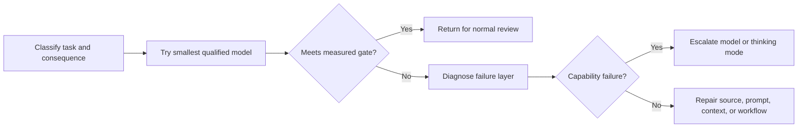

# Spend Capability Where Failure Is Expensive

> Model selection is not a ranking exercise. It is an allocation problem across quality, latency, context, and cost.

**Type:** Learn
**Languages:** Python
**Prerequisites:** [Choose the Smallest Surface That Can Carry the Work](../../01-claude-product-and-model-landscape/), [Caching, Rate Limiting and Cost Optimization](../../../../../phases/11-llm-engineering/11-caching-cost/)
**Time:** ~90 minutes

## Learning Objectives

- Estimate token and workflow cost without relying on a memorized price table.
- Select a model using measured quality, latency, and consequence.
- Explain sampling non-determinism and why a release claim needs repeated evaluation.
- Choose speed, effort, and thinking settings only after current model and platform verification.
- Distinguish model failure from prompt, context, source, and workflow failure.
- Use routing, caching, batching, and output limits as separate optimization levers.

## The Problem

A support team routes every request to the most capable model. The first month looks successful. Quality is high, but response time is inconsistent and the bill is four times the forecast.

The manager responds by moving everything to the fastest model. Cost falls. Escalation summaries now omit exceptions, and complex refund cases receive confident but incomplete recommendations.

Both designs use model names as policy. Neither describes the work.

A production decision starts with the cost of failure. A typo in an internal brainstorm is cheap. A missing exception in a refund decision is more expensive. The model, prompt, context, source quality, and review process should reflect that difference.

## The Concept

### Tokens are a workload measure

Models process tokens, not pages or words. Input tokens include instructions, conversation history, supplied documents, tool definitions, and retrieved content. Output tokens include the response and, depending on the product or API, reasoning-related computation or other billed units described by current pricing.

For planning, separate four buckets:

```text
total input = stable instructions + task input + retrieved knowledge + prior turns
total output = requested answer + structured metadata
```

Do not hide all input inside one number. Stable instructions may benefit from caching. Retrieved knowledge may be pruned. Prior turns may be summarized or discarded. Task input usually cannot be removed.

### Use variables before live prices

Prices change. The durable equation does not:

```text
request cost = input_tokens / 1,000,000 x input_rate
             + output_tokens / 1,000,000 x output_rate
             + tool or feature charges
```

For a workflow:

```text
workflow cost = request cost x requests per case x cases per month
              + review cost
              + failure and rework cost
```

Review and rework matter. A cheaper model that creates twice as much human correction may be the expensive choice.

Consider an illustrative, not current, rate card. Model A costs 1 unit for input and 5 for output. Model B costs 3 and 15. A case uses 20,000 input tokens and 2,000 output tokens. Model B costs three times as much per call. If Model A passes 98 percent of triage cases and hard cases can be detected, route the ordinary work to A and escalate the uncertain remainder. If hard cases cannot be detected safely, the routing design is incomplete.

### Quality needs a threshold, not a vibe

Define the minimum acceptable result before testing models. Useful dimensions include:

- Required facts present.
- Unsupported claims absent.
- Instructions followed.
- Output schema valid.
- Latency below the workflow limit.
- Human correction time below a threshold.
- Safety and privacy controls preserved.

The best model is the least expensive option that clears every required threshold with adequate margin. Average quality alone is not enough. A model can score well overall while failing every high-consequence edge case.

### Sampling produces a distribution, not a replay

At each generated token, a language model has a distribution over possible continuations. Sampling selects from that distribution. A temperature setting, on models that accept it, changes how concentrated the distribution is. It does not turn model inference into a deterministic function.

Official Anthropic API documentation states that even temperature zero is not fully deterministic. Identical requests can produce different results through the first-party API and partner clouds. A pinned model ID stabilizes the model weights, but Anthropic's model-versioning documentation also says serving infrastructure such as routing, safety classifiers, and sampling logic can change.

This changes what counts as evidence:

- One passing response proves one response passed.
- A single average hides tail failures and run-to-run variation.
- Deterministic validators can check schema and arithmetic, but they cannot make generation deterministic.
- Repeated trials on the same versioned task reveal minimum quality, variance, severe failures, and tail latency.
- A model, prompt, tool, platform, or serving-mode change requires a fresh comparison.

Use at least three independent runs per configuration for a small learning exercise. Production sample size must come from the risk and variance you observe, not from this minimum. Compare risk slices separately and prefer gates such as minimum critical-case quality and p95 latency over one flattering mean.

Sampling controls themselves are changeable product facts. As verified on August 9, 2026, current Anthropic Messages guidance says Claude 4.7 and later reject non-default `temperature`, `top_p`, or `top_k` values. Older supported models may still accept some of them. Never copy a sampling setting from an older request without checking the current model and platform documentation.

### Diagnose the failure layer

When output is weak, ask where the failure originated:

1. **Requirement failure:** Success was never defined.
2. **Source failure:** The necessary fact was absent or stale.
3. **Context failure:** Relevant evidence was buried, truncated, or mixed with conflicting material.
4. **Prompt failure:** Instructions or output criteria were unclear.
5. **Model failure:** The model lacked the capability despite good inputs and criteria.
6. **Workflow failure:** Review, escalation, or tool behavior was missing.

Upgrading the model helps mainly with layer five. It may conceal the others for a while, which makes the system harder to debug.

### Latency has several components

Users experience more than total wall-clock time:

- Time before the first visible output.
- Time between streamed chunks.
- Total generation time.
- Tool and retrieval time.
- Human approval time.

A more capable model may reduce the number of retries while taking longer per call. A smaller model may respond quickly but create more loops. Measure the complete workflow.

### Route by observable constraints

A simple routing policy might classify work into three lanes:

| Lane | Example | Policy |
|---|---|---|
| Routine | Format a supplied update | Fast model, strict template |
| Ambiguous | Compare conflicting notes | Balanced model, source requirements |
| Consequential | Recommend an exception | Capable model plus mandatory review |

The classifier itself can fail. Use deterministic signals where possible: document length, task type, sensitivity label, requested action, or explicit user selection. Log route decisions and audit misroutes.



### Caching, batching, and limits solve different problems

**Prompt caching** reduces the cost and latency of repeatedly processing stable prompt prefixes when the current model and platform support it. It does not make stale instructions correct.

**Semantic caching** reuses a prior result for a sufficiently similar request. It needs a freshness policy and is risky for personalized, rapidly changing, or consequential work.

**Batch processing** trades response time for cost and throughput. It fits offline work such as nightly classification or bulk extraction, not interactive work with a user waiting.

**Output limits** prevent unnecessarily long responses. They also truncate work if set below the task's requirement. Ask for the smallest useful output and validate completeness.

**Context pruning** removes irrelevant input before it is billed and before it distracts the model. More context is not automatically more knowledge.

### A configuration is a dated bundle

Model choice is only one configuration lever:

| Lever | What it changes | What to measure |
|---|---|---|
| Model | Baseline capability, price, supported features, and lifecycle | Quality by risk slice, cost, latency, compatibility |
| Speed | Serving speed where a fast mode is supported, often at a price premium | Output tokens per second, time to first token, p95 latency, accepted-outcome cost |
| Effort | How much work and token spend the model applies across text, thinking, and tool use where supported | Quality, tool-call count, output tokens, latency, cost |
| Thinking | Whether and how the model allocates explicit reasoning where supported | Hard-case quality, thinking tokens, total output, latency, cost |
| Prompt and output contract | Instructions, evidence boundaries, format, and requested length | Instruction following, schema validity, correction time |
| Sampling | Randomness controls on model generations that still accept them | Outcome variation, severe failures, style diversity |

As verified on August 9, 2026, the official models overview lists `claude-sonnet-5` and `claude-opus-5` as the exact Claude API IDs. Sonnet 5 has adaptive thinking on by default, accepts disabled thinking, and supports the low and high effort values used in the artifact. Opus 5 accepts adaptive thinking and the medium effort value used in the artifact.

Fast mode is narrower. Current official documentation lists Opus 5 and Opus 4.8, not Sonnet 5, and limits the feature to the Claude API, including Managed Agents rather than partner platforms. It is a research preview that requires access, `speed: "fast"`, and the `anthropic-beta: fast-mode-2026-02-01` header. It uses the same model with faster inference and premium pricing; it does not promise higher intelligence. Availability, support, and pricing can change independently.

Do not build a permanent compatibility matrix into routing code or study notes. Before every experiment:

1. Record the exact model ID and platform.
2. Open the current official pages for model support, thinking, effort, speed, and pricing.
3. Mark each proposed configuration as `docs-supported` or `docs-unsupported` with a date and source. Documentation support does not prove that your account has preview access.
4. Do not trial an unsupported combination or assume it will silently fall back.
5. Run supported configurations repeatedly against the same task set and gate.

Change one lever at a time when the platform permits it. If support forces you to change both model and speed, call that a routing alternative, not proof that speed alone caused the outcome.

### A scaled exam score is not a percentage

As verified on August 9, 2026, Anthropic's certification FAQ reports results on a scaled score from 100 to 1,000 with a minimum passing score of 720. Scaling equates exam forms that can have different difficulty.

Therefore, 720 is never evidence that 72 percent correct is the raw pass line. This curriculum's quiz and mock percentages are raw practice scores. They are not convertible to the official scaled score and cannot predict an exam result.

## Build It

Create a ten-case model selection benchmark for a weekly operations workflow.

- Four routine formatting and classification cases.
- Three ambiguous synthesis cases.
- Two cases with conflicting source material.
- One consequential case that must escalate to a human.

Define a rubric before running any model:

```json
{
  "required_facts": 4,
  "unsupported_claims_allowed": 0,
  "format_valid": true,
  "latency_seconds_max": 20,
  "human_correction_minutes_max": 3,
  "consequential_case_must_escalate": true
}
```

Test the smallest plausible model family first. Record input and output tokens, latency, rubric score, and correction time. Escalate only the failing cases. Compare the routed workflow against sending all ten cases to the larger model.

Your report must answer:

- Which cases can safely use the smaller model?
- Which observable signal routes a case upward?
- Which failures were not model failures?
- How much cost does routing save under an illustrative volume?
- What happens when the router is uncertain?

Then create a mode-trials artifact for one ambiguous or consequential case:

1. Define minimum quality, maximum p95 latency, maximum mean cost, and a minimum repeated-run count before seeing results.
2. Propose at least three configurations that vary speed, effort, or thinking.
3. Verify each exact model and platform combination in current official documentation. Preserve one documented unsupported combination as a rejected option.
4. Run every supported configuration at least three times with the same prompt, sources, tools, and grading rubric.
5. Record quality, latency, cost, and an outcome fingerprint for every run.
6. Reconcile minimum quality, p95 latency, and mean cost from raw runs.
7. Select the least costly supported configuration that clears every gate.

The provided artifact compares low and high effort, adaptive and disabled thinking, standard and fast serving on one model, and an unsupported fast combination. Its `standard` speed is a normalized experiment label for omitting the request field. Its fast configuration separately records the required preview access, request field, and beta header. It is a dated example, not a reusable compatibility table or proof of account entitlement.

## Interactive Lab

Use the risk figure to change consequence, uncertainty, reversibility, and review strength. It makes the hidden cost of a false pass visible before you optimize token spend.

```figure
02-responsible-ai-risk
```

## Practice Lab

Run the ten-case routing benchmark. Change a consequential case to skip review, duplicate a case ID, or misstate the routed cost and watch deterministic validation fail. Then remove a repeated mode run, change a reconciled p95 value, attempt the documented unsupported mode, or select a configuration that fails cost. Repair the evidence instead of weakening the gate.

## Shipped Artifact

`outputs/model-routing-benchmark.json` preserves the ten-case routing contract across routine, ambiguous, conflicting-source, and consequential work. It includes measured gates, chosen lanes, token estimates, review time, and a comparison between routing and using the larger model for every case.

`outputs/mode-trials.json` is the applied configuration artifact. It records current-doc evidence, speed, effort, thinking, fast-mode request prerequisites, repeated quality, p95 latency, mean cost, unsupported combinations, the selected mode, and rerun triggers.

The support statements are dated from official documentation and use `docs-supported`, not live-request-verified, as their status. The quality, latency, and cost values are illustrative exercise data, not provider runs or benchmark results. Replace them with repeated results from your own task set and account.

## Verify It

Verify the benchmark without calling a provider:

```bash
cd certifications/claude/lessons/02-model-selection-and-token-economics/code
python3 main.py
python3 -m unittest discover tests -v
```

The validator preserves the original benchmark checks and separately validates the mode trials. It requires current official support evidence, an explicit illustrative-measurement label, fast-mode request prerequisites, at least three repeated runs per docs-supported mode, observed outcome fingerprints, reconciled summaries, an unattempted docs-unsupported option, and selection of the least costly passing configuration. It makes no hardcoded claim about which future model supports which mode.

## Capstone Connection

The quiz tests routing, failure-layer diagnosis, and cost reasoning. Use the validated benchmark as model-selection evidence in capstones 29 through 32, then replace the illustrative measurements with results from your own representative cases.

## Use It

Use this decision sentence:

```text
For [task class], choose [model family or mode] because it clears [quality gate]
across [repeated runs] within [p95 latency and mean cost limit]. Escalate when
[observable condition], and require [review rule] when [consequence threshold].
Model, platform, speed, effort, and thinking support checked in official docs on [date].
```

If your justification is only "it is smarter," you have not finished the decision.

Review the live models overview and pricing pages before running the benchmark. Save the exact model identifiers in the benchmark results, not in the timeless policy. This prevents a model alias change from silently invalidating your evidence.

Keep unsupported configurations in the decision record, not in production requests. Their rejection explains why a tempting mode was not tested and creates a clear trigger for future verification.

## Exam Decision Patterns

- Fix missing criteria, sources, and context before paying for more capability.
- Use the smallest model that clears a representative quality gate.
- Include human correction and failure cost, not only token price.
- Route consequential or ambiguous work upward using observable signals.
- Batch only when the workflow tolerates delayed completion.
- Cache stable, reusable material only when freshness and isolation permit it.
- Treat model features, pricing, and limits as dated facts.
- Repeat probabilistic evaluations; a low temperature or pinned model ID does not guarantee identical output.
- Compare speed, effort, and thinking as measured configuration choices, not status levels.
- Treat 720 as a scaled certification score, never as a raw percentage.

## Common Traps

- Choosing by family reputation instead of a task benchmark.
- Comparing models on one easy example.
- Reporting average quality while hiding critical-case failures.
- Calling every poor output a model limitation.
- Adding context until cost and distraction rise together.
- Reusing cached output after the underlying source changes.
- Omitting review time from the cost model.
- Routing with an opaque classifier and no audit trail.
- Declaring a prompt deterministic because one run passed or temperature was low.
- Copying a speed, effort, thinking, or sampling setting from a different model or platform.
- Silently downgrading an unsupported mode instead of failing closed and recording the incompatibility.
- Comparing mean latency while hiding a tail that violates the user-facing objective.
- Converting the 720 scaled exam threshold into a raw 72 percent target.

## Exercises

1. Calculate monthly cost symbolically for a workflow with 50,000 cases and two model tiers.
2. Write three deterministic routing signals for a support workflow.
3. Diagnose five failures as requirement, source, context, prompt, model, or workflow problems.
4. Identify a task that should use batch processing and one that must remain interactive.
5. Verify one current thinking feature in official documentation and record model, platform, and date.
6. Run one configuration three times, preserve outcome fingerprints, and explain what a single run would have hidden.
7. Find one currently unsupported mode combination in official documentation and record it without sending a request.

## Key Terms

| Term | Meaning |
|---|---|
| Token economics | The relationship between input, output, request volume, model rates, and workflow cost |
| Quality gate | A measurable threshold a candidate configuration must clear |
| Routing | Selecting a model or execution lane from task signals |
| Escalation | Moving uncertain or consequential work to greater capability or human review |
| Prompt caching | Reusing provider-side computation for stable prompt material |
| Rework cost | Human or machine effort required to correct an inadequate output |
| Sampling | Selecting generated tokens from model probability distributions |
| Mode trial | A repeated, dated evaluation of one exact model, platform, speed, effort, and thinking configuration |
| Tail latency | A high-percentile latency measure such as p95 that exposes slow requests hidden by an average |
| Scaled score | A transformed exam result used to equate forms, not a raw percentage correct |

## Further Reading

- [Models overview](https://platform.claude.com/docs/en/about-claude/models/overview)
- [Create a Message API reference](https://platform.claude.com/docs/en/api/messages/create)
- [Working with Messages](https://platform.claude.com/docs/en/build-with-claude/working-with-messages)
- [Model IDs and versioning](https://platform.claude.com/docs/en/about-claude/models/model-ids-and-versions)
- [What's new in Claude Sonnet 5](https://platform.claude.com/docs/en/about-claude/models/whats-new-sonnet-5)
- [What's new in Claude Opus 5](https://platform.claude.com/docs/en/about-claude/models/whats-new-opus-5)
- [Claude pricing](https://platform.claude.com/docs/en/about-claude/pricing)
- [Thinking](https://platform.claude.com/docs/en/build-with-claude/thinking)
- [Effort](https://platform.claude.com/docs/en/build-with-claude/effort)
- [Fast mode](https://platform.claude.com/docs/en/build-with-claude/fast-mode)
- [Prompt caching](https://platform.claude.com/docs/en/build-with-claude/prompt-caching)
- [Batch processing](https://platform.claude.com/docs/en/build-with-claude/batch-processing)
- [Anthropic certification FAQ](https://anthropic-partners.skilljar.com/page/faq-certifications)
- [Caching, Rate Limiting and Cost Optimization](../../../../../phases/11-llm-engineering/11-caching-cost/)
- [Prompt and Semantic Caching Economics](../../../../../phases/17-infrastructure-and-production/14-prompt-semantic-caching/)
- [Model Routing as a Cost-Reduction Primitive](../../../../../phases/17-infrastructure-and-production/16-model-routing/)
