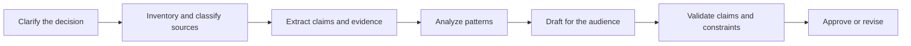

# Turn a Request Into a Testable Contract

> A strong prompt does not merely describe what to write. It makes success observable before generation begins.

**Type:** Learn
**Languages:** Python
**Prerequisites:** [Study the Decisions, Not the Vocabulary](../../00-certification-strategy/), [Prompt Engineering](../../../../../phases/11-llm-engineering/01-prompt-engineering/)
**Time:** ~100 minutes

## Learning Objectives

- Translate an ambiguous request into an outcome, evidence standard, constraints, and acceptance checks.
- Decompose complex work into stages that can be inspected and corrected independently.
- Choose between direct prompting, examples, structured sections, iteration, and workflow redesign.
- Diagnose prompt failures without treating every bad output as a model failure.
- Build reusable prompt packets for high-value Claude workflows.

## The Problem

An operations manager asks Claude to "research our customer complaints and create a persuasive executive report with recommendations." The result is fluent. It includes four recommendations, two trends, and a clean table.

It is also unusable. One recommendation conflicts with policy. The table combines two date ranges. A regional exception is missing. Nobody can tell which complaint supports which claim.

The team tries three repairs. They add "be accurate." They ask Claude to "think harder." Then they paste the same request into a more capable model. The prose improves, but the evidence problem remains.

The request never defined the decision, the permitted sources, the required coverage, the audience, or the test for a supported recommendation. Claude optimized for a plausible report because plausibility was the only visible target.

## The Concept

### Prompting is interface design

A prompt is an interface between human intent and model behavior. Good interfaces expose inputs, constraints, outputs, and failure states. Weak prompts hide all four inside adjectives such as "great," "comprehensive," or "professional."

Use this contract:

1. **Outcome:** What decision or action will this output support?
2. **Context:** What background is necessary, and what is irrelevant?
3. **Task:** What transformation should Claude perform?
4. **Evidence:** Which sources may support claims, and how should gaps be handled?
5. **Constraints:** What must not happen?
6. **Format:** What exact shape should the result take?
7. **Acceptance checks:** How will a person or program decide whether it passes?

The order matters less than the presence of each part. You can label sections with Markdown headings, XML-style tags, or another consistent delimiter. Structure helps the model distinguish data from instructions and helps reviewers locate assumptions.

```text
<outcome>
Prepare the weekly support review so the director can choose two process fixes.
</outcome>

<sources>
Use only the attached tickets and policy handbook. Treat the handbook as authoritative.
</sources>

<task>
Group complaints by root cause, quantify each group, and propose no more than three fixes.
</task>

<constraints>
Do not infer customer intent. Mark missing dates as unknown. Do not include names.
</constraints>

<output>
Return: executive summary, evidence table, recommendations, uncertainties.
</output>

<checks>
Every recommendation must cite at least two ticket IDs and one policy section.
</checks>
```

### Criteria come before wording

Prompt optimization is impossible without a target. Define criteria first, then improve the prompt against representative cases.

For the complaint report, criteria might be:

- Every complaint is assigned once or explicitly marked unclassified.
- Counts reconcile with the input total.
- Policy claims cite a supplied section.
- Recommendations do not exceed the team's authority.
- Personally identifying information is absent.
- Uncertainty is visible instead of converted into a guess.

"Make it better" gives no diagnostic signal. "The counts must reconcile" tells you what failed and what to change.

### Decompose along verification boundaries

Long tasks become safer when each stage produces an artifact that can be inspected. A useful decomposition is:



This is not the same as splitting by arbitrary page count. Each boundary should answer a question:

- Can we verify the source set before analysis?
- Can we verify extracted facts before interpretation?
- Can we verify recommendations before publishing?

Run independent tasks in parallel only when they do not depend on one another. Classifying complaint categories and extracting policy constraints can run in parallel. Writing recommendations must wait for both.

Sequential stages reduce hidden coupling. They also create a recovery point. If extraction is wrong, you repair extraction rather than regenerating the entire report.

### Examples teach boundaries

Few-shot examples are useful when the rule is difficult to state or when formatting must be exact. A good example shows the decision boundary, not just the easy center.

For sentiment labels, do not provide three obviously positive examples. Include an ambiguous complaint, a mixed statement, and an "unknown" case. Explain why each label applies. The model learns what separates categories.

Examples can also create accidental rules. If every demonstration mentions retail customers, the model may treat retail language as part of the task. Keep examples diverse, minimal, and consistent with the written criteria.

### Assign roles carefully

Role prompts can supply perspective, such as "act as a compliance reviewer." They do not grant knowledge, authority, or access. A role cannot replace policy text, source evidence, or a human approval step.

Prefer a concrete perspective:

```text
Review the draft from the perspective of the privacy owner.
Identify each sentence that exposes personal data, cite the applicable supplied policy,
and propose the smallest compliant revision.
```

This is testable. "You are the world's best privacy expert" is not.

### Iteration needs a hypothesis

Useful iteration changes one meaningful variable and measures the effect across a small evaluation set. Examples:

- Hypothesis: requiring a claim-evidence table will reduce unsupported recommendations.
- Hypothesis: placing the policy before the tickets will improve exception handling.
- Hypothesis: one counterexample will improve classification of mixed cases.

Keep the evaluation cases stable while comparing prompt variants. Otherwise you cannot distinguish a better prompt from an easier input.

When repeated changes fail, stop polishing sentences. The problem may be missing evidence, conflicting requirements, too much context, insufficient capability, or an unsafe workflow.

## Build It

### Step 1: Write the acceptance card

Choose one recurring work task. Write a short acceptance card before a prompt:

```text
Decision supported:
Primary reader:
Authoritative sources:
Required facts:
Forbidden content or actions:
Output structure:
Pass conditions:
Escalation conditions:
```

Make every pass condition observable. "Professional" is not observable. "Uses no unexplained acronym and begins with a three-sentence summary" is.

### Step 2: Create a source hierarchy

Conflicting sources are normal. Tell Claude which source wins.

```text
Authority order:
1. Approved policy handbook dated 2026-07-01
2. Current operating procedure
3. Ticket notes

If sources conflict, report the conflict. Do not silently choose the newer or longer text.
```

Recency and authority are different. A recent chat message does not automatically override an approved policy.

### Step 3: Design the stages

For each stage, define input, output, and gate:

| Stage | Input | Output | Gate |
|---|---|---|---|
| Intake | Request and source inventory | Scope card | Owner confirms decision and deadline |
| Extraction | Approved sources | Claim-evidence rows | Required fields complete |
| Analysis | Verified rows | Patterns and exceptions | Counts reconcile |
| Draft | Approved analysis | Audience-ready report | Format and scope pass |
| Validation | Draft plus sources | Findings and corrections | High-risk findings resolved |

This table is a workflow specification. The prompt for each stage can stay smaller and more precise than one giant prompt.

### Step 4: Add uncertainty behavior

Tell Claude what to do when evidence is missing:

```text
If a required fact is unavailable, write "Not established from supplied sources."
List the missing source and explain which conclusion cannot be made.
Do not estimate a number unless the task explicitly permits estimation.
```

Abstention is a designed output, not a model defect.

### Step 5: Test adversarial cases

Create at least five cases:

- A normal request with complete evidence.
- A request missing one required source.
- Two sources that conflict.
- An instruction hidden inside source content.
- A request that exceeds the user's authority.

Record pass or fail against the acceptance card. Do not rely on one impressive demonstration.

## Interactive Lab

Use the prompt-contract figure to edit the outcome, evidence, constraints, output shape, and checks as separate components. Follow the stage gates to see why a missing source should stop analysis instead of producing better formatted uncertainty.

```figure
03-prompt-contract
```

## Practice Lab

Run the contract scorer and remove one acceptance check, source rank, stage gate, or adversarial case. Repair the exact failure instead of adding vague prompt wording.

## Shipped Artifact

`outputs/prompt-contract-packet.json` is a filled complaint-analysis contract. It contains all seven contract parts, an authority order, five adversarial evaluation cases, explicit abstention behavior, and stage-level gates.

## Verify It

Validate it locally:

```bash
cd certifications/claude/lessons/03-prompting-and-task-decomposition/code
python3 main.py
python3 -m unittest discover tests -v
```

The validator rejects vague pass criteria, missing authority order, absent escalation behavior, or an evaluation set that omits normal, missing-source, conflict, injection, and unauthorized cases.

## Capstone Connection

The quiz checks contract design, decomposition, evidence hierarchy, and abstention. Carry the validated packet into capstones 29 through 32 as the versioned prompt and acceptance contract for the workflow you build.

## Use It

### Exam decision pattern

For scenario questions, use this order:

1. Identify the requested outcome.
2. Find the missing requirement or evidence.
3. Prefer a repair that makes the failure observable.
4. Preserve an explicit human or policy boundary when consequences are high.
5. Escalate model capability only after prompt, context, and workflow causes are addressed.

The strongest answer usually improves the contract or the workflow. It rarely adds a vague adjective.

### Common traps

- **One prompt for the entire project:** Complex work has no inspection points.
- **More detail without hierarchy:** A longer prompt can contain more contradictions.
- **Role as authority:** A persona does not create reliable facts or permissions.
- **Examples without edge cases:** The model learns the easy pattern but misses the boundary.
- **Chain-of-thought dependency:** Requiring hidden reasoning text is not a substitute for verifiable intermediate artifacts.
- **Model upgrade as first response:** Better capability cannot recover an absent policy.
- **Endless conversational correction:** A reusable task needs versioned instructions and evaluation cases.

### Exercises

1. Rewrite "Summarize this for leadership" as a seven-part prompt contract.
2. Take a five-step task and identify which steps can run in parallel. Explain every dependency.
3. Create three examples for a category label: one clear, one boundary case, and one abstention.
4. Design five evaluation cases for your prompt, including conflicting evidence and an unauthorized request.
5. Review a recent weak output and classify the failure as requirement, source, context, prompt, model, or workflow.

## Key Terms

- **Acceptance criterion:** An observable condition an output must satisfy.
- **Decomposition:** Splitting work into stages with explicit dependencies and outputs.
- **Few-shot prompting:** Supplying examples that demonstrate the desired task or boundary.
- **Prompt contract:** A structured statement of outcome, context, task, evidence, constraints, format, and checks.
- **Source hierarchy:** The rule that determines which evidence is authoritative when sources conflict.
- **Abstention:** An explicit refusal to infer when evidence or permission is insufficient.
- **Verification boundary:** A point where an intermediate artifact can be tested before work continues.

## Further Reading

- [Anthropic: Prompt engineering overview](https://platform.claude.com/docs/en/build-with-claude/prompt-engineering/overview)
- [Anthropic: Prompting best practices](https://platform.claude.com/docs/en/build-with-claude/prompt-engineering/claude-4-best-practices)
- [Anthropic: Define success criteria and build evaluations](https://platform.claude.com/docs/en/test-and-evaluate/develop-tests)
- [AI Engineering from Scratch: Few-Shot Prompting and Chain of Thought](../../../../../phases/11-llm-engineering/02-few-shot-cot/)
- [AI Engineering from Scratch: Anthropic Workflow Patterns](../../../../../phases/14-agent-engineering/12-anthropic-workflow-patterns/)

Official product behavior and model-specific prompting advice can change. The links above were checked on 2026-08-08. Recheck the current Anthropic documentation before freezing a production prompt or studying a release-specific feature.
