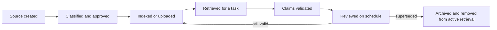

# Put Each Fact in the Right Kind of Context

> Context is temporary attention. Knowledge is maintained evidence. Memory is continuity. Caching is reuse. Mixing them creates confident stale answers.

**Type:** Learn
**Languages:** Python
**Prerequisites:** [Turn a Request Into a Testable Contract](../../03-prompting-and-task-decomposition/), [Context Engineering](../../../../../phases/11-llm-engineering/05-context-engineering/)
**Time:** ~105 minutes

## Learning Objectives

- Distinguish chat context, Project instructions, Project knowledge, memory, connectors, retrieval, and API prompt caching.
- Choose what to persist, retrieve, summarize, refresh, or discard.
- Build a source registry with authority, ownership, sensitivity, and freshness metadata.
- Reduce context overload without deleting required evidence.
- Explain which Claude product behaviors are changeable and must be verified in current documentation.

## The Problem

A team creates a Claude Project for quarterly planning. They upload policy files, meeting notes, sales exports, and an old product roadmap. They also add Project instructions that say, "Use the latest approved plan."

Three months later, Claude recommends a launch date from the old roadmap. The date is present in Project knowledge, appears in several historical meeting notes, and conflicts with a newer decision stored in a connector. The response sounds certain because the context contains repeated evidence for the wrong answer.

The team calls this a hallucination. It is mostly a knowledge-management failure. They treated a Project as a document warehouse, memory as an authority source, and retrieval as a guarantee of truth.

More context is not the same as better context. A trustworthy system knows which facts are temporary, which are authoritative, and who is responsible for keeping them current.

## The Concept

### Seven mechanisms, seven jobs

Claude can receive or reuse information through several mechanisms. Their exact availability, limits, and names can change by plan and product. The durable distinction is their job.

| Mechanism | Primary job | Main risk |
|---|---|---|
| Current chat context | Carry the present conversation | Old turns consume attention or conflict |
| Project instructions | Set reusable behavior and constraints | Broad instructions become stale or ambiguous |
| Project knowledge | Supply a maintained body of reference material | Files lack ownership or freshness controls |
| Memory | Preserve useful continuity across conversations | Remembered preference is mistaken for approved fact |
| Connectors | Access an external system under current permissions | Source permissions, sync, or freshness are misunderstood |
| Retrieval | Select relevant chunks from a larger corpus | Relevant-looking text is incomplete or low authority |
| Prompt caching | Reuse stable API prompt prefixes efficiently | Dynamic content is cached or invalidation is ignored |

A feature can support more than one job, but the distinctions prevent category errors. Memory can remind Claude that you prefer concise reports. It should not silently become the source of the current refund policy. A connector can expose the latest file. It does not prove that the file is approved.

### Context has an attention budget

A large context window increases capacity, not certainty. Every extra document creates competition for attention and another opportunity for contradiction.

Think in four layers:

```text
context package = governing instructions
                + task-specific input
                + retrieved authoritative evidence
                + minimal continuity
```

Keep stable instructions stable. Add only the task input required for the current decision. Retrieve evidence using metadata and authority rules. Carry prior conversation only when it changes the current task.

Long conversations often accumulate abandoned plans, corrected facts, and formatting experiments. Starting a fresh conversation with a verified brief can be safer than continuing indefinitely. Summarize only after separating decisions from discussion.

### Retrieval is selection, not verification

Retrieval systems usually rank chunks by relevance. Relevance does not answer:

- Is this source approved?
- Is it current?
- Does it cover the entire rule or only an excerpt?
- Does a higher-authority source conflict?
- May this user access the source?

Attach metadata to each source and filter before or alongside semantic relevance. A minimal registry includes:

| Field | Question |
|---|---|
| Source ID | Can a claim point back to it? |
| Owner | Who is accountable for accuracy? |
| Authority | Is it policy, procedure, note, or draft? |
| Effective date | When did it become valid? |
| Review date | When must it be checked again? |
| Sensitivity | Who may process or view it? |
| Supersedes | Which earlier source is no longer authoritative? |
| Retrieval tags | Which tasks and regions does it cover? |

Documents without an owner or review date are candidates for quarantine, not automatic ingestion.

### Instructions and knowledge are different

Instructions describe behavior. Knowledge supplies evidence.

An instruction might say:

```text
For refund questions, cite the governing section and expose regional conflicts.
```

Knowledge should contain the actual approved refund policy. Putting policy prose into behavioral instructions can make maintenance harder. Putting behavioral rules in random knowledge files can make them easy to miss.

When Project instructions conflict with a user's request or a supplied source, the resolution depends on the product's instruction hierarchy and organizational policy. Do not invent a hierarchy. Test the actual surface and document the expected precedence.

### Memory is continuity, not a database of record

Memory is useful for stable preferences and ongoing context: preferred tone, recurring goals, or the fact that a project exists. It becomes dangerous when a remembered claim is treated as current operational truth.

Use three questions before relying on memory:

1. Could this fact have changed?
2. Is there an authoritative source that is cheap to check?
3. What is the consequence if the remembered fact is wrong?

If drift is plausible and the consequence matters, verify. In a workflow, label memory-derived context and keep citations to the actual source of record.

### Prompt caching is an economic mechanism

API prompt caching can reduce repeated processing of a stable prefix. It does not improve truth and does not create long-term memory.

Place reusable content before dynamic content when the current API's caching behavior supports that pattern:

```text
stable prefix: system rules + tool definitions + approved reference corpus
dynamic suffix: user request + fresh retrieval + current state
```

Candidates for caching are large, repeated, and stable. Poor candidates change per request or contain data that should not persist beyond its approved boundary.

Cache lifetime, minimum sizes, pricing, model support, and invalidation behavior are changeable product facts. Verify them in the current official documentation. Design correctness must not depend on a stale cache.

### Context quality needs lifecycle ownership

Knowledge has a lifecycle:



The hard work is not uploading. It is approving, refreshing, and retiring.

## Build It

### Step 1: Inventory the context

For one recurring workflow, list every information source and classify it:

```text
Behavioral instruction:
Task input:
Authoritative knowledge:
Reference knowledge:
Conversation continuity:
External connected data:
Temporary calculation:
```

If one item appears in several categories, decide which copy is authoritative and how duplicates will be removed.

### Step 2: Create a source registry

Build a simple table or JSON record for each source:

```json
{
  "source_id": "refund-policy-uk",
  "owner": "customer-operations",
  "authority": "approved-policy",
  "effective_date": "2026-07-01",
  "review_date": "2026-10-01",
  "sensitivity": "internal",
  "supersedes": "refund-policy-uk-2025"
}
```

Dates here are illustrative. Use your actual records. Reject or flag sources with a past review date.

### Step 3: Design retrieval with abstention

Define the retrieval contract:

- Filter by user permission, region, product, and active status.
- Prefer approved policy over discussion notes.
- Retrieve enough surrounding text to preserve exceptions.
- Return source IDs and effective dates with chunks.
- Abstain when required authority is absent.
- Expose conflicts instead of merging them invisibly.

Test a normal case, a stale source, a permissions mismatch, a conflict, and an out-of-scope question.

### Step 4: Budget the prompt

Measure or estimate each context bucket. If the prompt is overloaded, reduce it in this order:

1. Remove duplicate and superseded material.
2. Exclude unrelated conversation turns.
3. Retrieve narrower authoritative sections with adequate surrounding context.
4. Replace discussion history with a verified decision record.
5. Split the task at a verification boundary.

Do not begin by deleting safety constraints or required evidence.

### Step 5: Establish maintenance

Assign an owner and cadence:

| Asset | Owner | Review trigger | Retirement rule |
|---|---|---|---|
| Project instructions | Workflow owner | Process change | Replace old version |
| Policy knowledge | Policy owner | Approval or review date | Remove superseded copy |
| Retrieval index | Platform owner | Source update | Reindex and verify |
| Evaluation set | Quality owner | New failure class | Add representative case |

Knowledge management is part of the product, not post-launch housekeeping.

## Interactive Lab

Use the context-cache figure to change stable-prefix size, request volume, cache hit rate, source freshness, and invalidation behavior. Compare cost savings with the correctness boundary: a cache hit is useful only while the reused prefix remains approved.

```figure
04-context-cache
```

## Practice Lab

Run the context planner. Try to cache the dynamic account source, reactivate the superseded policy without a new approval, or overflow the prompt budget. The runner must keep correctness and lifecycle rules ahead of cache savings.

## Shipped Artifact

`outputs/context-registry.json` is a filled source registry for a refund workflow. It separates behavioral instructions, approved policy, a superseded draft, conversation continuity, and dynamic connected data. It also contains a prompt budget and an explicit caching policy.

## Verify It

Validate the registry:

```bash
cd certifications/claude/lessons/04-context-knowledge-memory-and-caching/code
python3 main.py
python3 -m unittest discover tests -v
```

The validator checks unique source IDs, ISO dates, ownership, authority, active versus superseded state, budget totals, and that only stable non-secret sources enter the cached prefix.

## Capstone Connection

The quiz checks source authority, retrieval limits, caching fit, and context reset decisions. Use the registry and cache policy in capstones 29 through 32 as the provenance and context-budget artifact.

## Use It

### Exam decision pattern

When a scenario mentions repeated work, stale answers, or missing context:

1. Identify whether the missing item is behavior, evidence, continuity, or external data.
2. Put it in the mechanism designed for that job.
3. Add authority, freshness, sensitivity, and ownership controls.
4. Test retrieval and permission failures.
5. Use caching only after correctness is established.

### Common traps

- **Upload everything:** Volume increases contradiction and maintenance cost.
- **Memory as truth:** Continuity is mistaken for a source of record.
- **Connector as approval:** Access to a file is mistaken for authority.
- **Retrieval as proof:** A relevant chunk is accepted without provenance or completeness checks.
- **One endless chat:** Corrected and abandoned context remains active.
- **Cache as memory:** An API optimization is expected to preserve durable user state.
- **No retirement path:** Superseded files remain retrievable forever.

### Exercises

1. Classify ten items from a real workflow across the seven mechanisms.
2. Create a registry for five sources and identify which should not enter active retrieval.
3. Rewrite an overloaded prompt using the four-layer context package.
4. Design five retrieval failure tests, including stale evidence and unauthorized access.
5. Decide what to persist, summarize, or discard at the end of a project week. Explain each decision.

## Key Terms

- **Context:** Information available to the model for the current request.
- **Project instructions:** Reusable behavioral guidance associated with a Claude Project.
- **Project knowledge:** Reference material associated with a Project.
- **Memory:** Product-supported continuity across conversations, subject to current feature behavior.
- **Connector:** An integration that exposes external data or capabilities under configured permissions.
- **Retrieval:** Selecting relevant material from a larger corpus for a request.
- **Prompt caching:** Reusing eligible prompt content to reduce repeated API processing.
- **Source of record:** The authoritative system or document for a fact.
- **Freshness:** Whether information is current enough for its intended use.

## Further Reading

- [Anthropic Help Center: What are Projects?](https://support.claude.com/en/articles/9517075-what-are-projects)
- [Anthropic Help Center: Use Claude's chat search and memory](https://support.claude.com/en/articles/11817273-use-claude-s-chat-search-and-memory-to-build-on-previous-context)
- [Anthropic Help Center: Use connectors to extend Claude's capabilities](https://support.claude.com/en/articles/11176164-use-connectors-to-extend-claude-s-capabilities)
- [Anthropic: Prompt caching](https://platform.claude.com/docs/en/build-with-claude/prompt-caching)
- [AI Engineering from Scratch: Retrieval-Augmented Generation](../../../../../phases/11-llm-engineering/06-rag/)
- [AI Engineering from Scratch: Repository Memory and State](../../../../../phases/14-agent-engineering/34-repo-memory-and-state/)

The names, availability, limits, retention behavior, and pricing of Projects, memory, connectors, retrieval modes, and prompt caching can change. These sources were checked on 2026-08-08. Verify current official product and privacy documentation before deployment or exam study.
