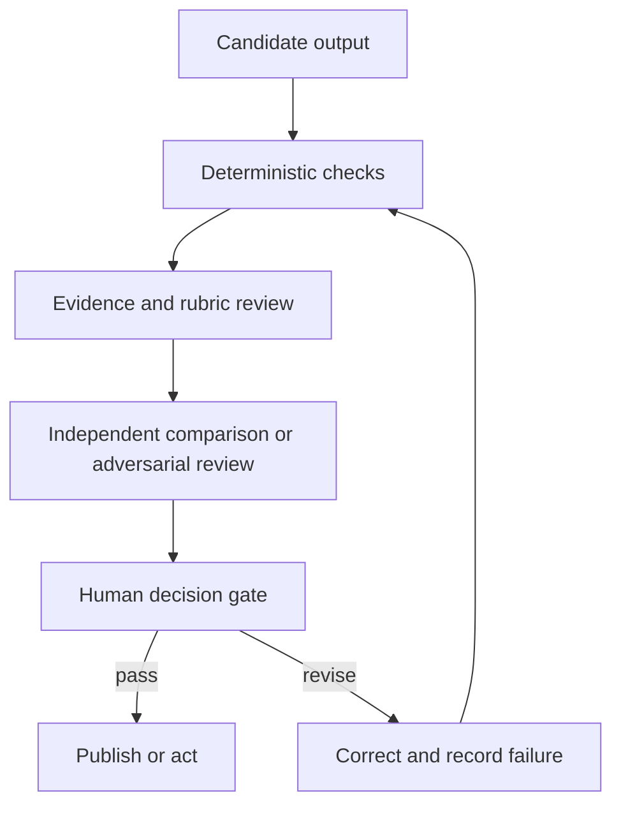

# Validate the Claim, Not the Confidence

> Fluency is presentation quality. Validation is evidence that the output can safely do its job.

**Type:** Learn
**Languages:** Python
**Prerequisites:** [Turn a Request Into a Testable Contract](../../03-prompting-and-task-decomposition/), [Put Each Fact in the Right Kind of Context](../../04-context-knowledge-memory-and-caching/), [Evaluation and Testing](../../../../../phases/11-llm-engineering/10-evaluation/)
**Time:** ~115 minutes

## Learning Objectives

- Build task-specific criteria for accuracy, completeness, consistency, audience fit, bias, and format.
- Trace consequential claims to authoritative evidence.
- Combine deterministic checks, rubric graders, independent review, and human judgment.
- Diagnose hallucination, omission, contradiction, scope, and citation failures.
- Diagnose unexpected output through model capability limits before choosing a repair.
- Turn production failures into durable evaluation cases.

## The Problem

Claude produces a weekly executive brief from customer data and internal policy. The brief has a strong opening, concise recommendations, and citations in every section. Leadership approves a policy change based on it.

Later, an analyst discovers three problems. One citation points to a document that mentions the topic but does not support the claim. A small customer segment disappeared during aggregation. A recommendation exceeds the team's authority.

The document looked validated because it had citations and a professional tone. Nobody tested coverage, entailment, or action scope.

This is why output evaluation is the largest domain in the Claude Certified Associate blueprint. A useful Claude workflow does not stop when text appears. It stops when the result passes checks proportional to its consequence.

## The Concept

### Start from the job of the output

Evaluation criteria should follow the decision the output supports. A brainstorming list and a regulatory filing need different evidence and review.

Use six dimensions as a starting point:

1. **Accuracy:** Are factual claims supported and calculations correct?
2. **Completeness:** Are required items, populations, exceptions, and caveats present?
3. **Consistency:** Do sections, numbers, labels, and recommendations agree?
4. **Audience fit:** Can the intended reader understand and act on it?
5. **Fairness and safety:** Does the output introduce unjustified bias, expose data, or exceed policy?
6. **Format compliance:** Does it satisfy structural requirements for people and systems?

These are categories, not scores. Convert them into observable tests.

Weak criterion:

```text
The report is accurate and complete.
```

Testable criteria:

```text
Every quantitative claim must reconcile with the supplied dataset.
Every recommendation must cite at least one supporting finding and one governing constraint.
All seven operating regions must appear or be marked "no data."
The summary must state the two largest uncertainties.
```

### Trace claims to evidence

Citations are pointers. Validation asks whether the pointed evidence supports the exact claim.

Create a claim-evidence matrix:

| Claim ID | Claim | Source | Support type | Authority | Reviewer result |
|---|---|---|---|---|---|
| C-01 | Returns rose in the North region | dataset rows 120-184 | direct calculation | primary data | pass |
| C-02 | Training caused the change | interview note 7 | speculative | anecdotal | fail |
| C-03 | A refund requires approval | policy 4.2 | direct quotation | approved policy | pass |

The matrix separates four common questions:

- Does the source exist?
- Is it authoritative for this claim?
- Does it entail the claim rather than merely discuss the topic?
- Is the claim stronger than the evidence?

A report can contain correct citations and still overstate causation. "Occurred after" does not prove "caused by."

### Diagnose the property before retrying

An unexpected output is not a useful diagnosis. A generic retry often reproduces the same failure because it leaves the cause unchanged.

Anthropic's introductory capabilities course organizes diagnosis around four model properties. Use them as a practical fault tree, not as four isolated labels:

| Property | Failure signal | Targeted response |
|---|---|---|
| Next-token prediction | The answer is fluent and plausible, but unsupported | Ground consequential claims in supplied evidence, require abstention, and validate entailment |
| Knowledge | The task depends on recent, rare, private, or disputed facts | Add current authoritative sources and expose uncertainty instead of relying on parametric recall |
| Working memory | Important context is buried, absent from the current session, or competing with too much material | Retrieve only relevant context, split the task, summarize state, and verify coverage |
| Steerability | Instructions are vague, conflicting, overly long, or impossible to check | Rewrite the request as a concise contract with priorities, examples, constraints, and acceptance tests |

Several properties can fail together. A long policy question can exceed useful working memory while also asking for facts outside model knowledge. Record one primary property, any contributing properties, the evidence for that diagnosis, and a repair aimed at each cause.

The optional AI Fluency 4D check adds the human side of the same decision:

- **Delegation:** Decide what work should be delegated and what judgment must remain human.
- **Description:** Supply the context, goal, constraints, and success criteria the system needs.
- **Discernment:** Evaluate whether the result is accurate, useful, and appropriate.
- **Diligence:** Apply privacy, attribution, policy, and accountability throughout the workflow.

These checks do not replace task-specific evaluation. They help you choose the right evaluator and repair instead of treating every failure as "bad prompting."

### Use layered validation

No single evaluator is sufficient. Combine layers:



**Deterministic checks** are code or exact rules. Use them for schema validity, required fields, row totals, ranges, citation ID existence, banned terms, and permission flags.

**Rubric review** handles qualities that require interpretation, such as whether a summary preserves the central exception. A model can grade with a rubric, but the grader also needs testing.

**Independent or adversarial review** asks a separate pass to find unsupported claims, missing populations, conflicts, and unsafe recommendations. Independence matters. Asking the same generation to declare itself correct creates correlated blind spots.

**Human review** owns consequences, ambiguous tradeoffs, and organizational authority. A person should not repeat every mechanical check. They should receive the evidence, uncertainties, failed checks, and decision requiring judgment.

### Match the evaluator to the property

Use the cheapest reliable evaluator for each property:

| Property | Strong first evaluator |
|---|---|
| Valid JSON | Parser or schema validator |
| Arithmetic total | Deterministic calculation |
| Exact required fields | Programmatic assertion |
| Meaning preserved | Rubric-based comparison |
| Claim supported by passage | Evidence review with quoted span |
| Appropriate executive tone | Human or tested rubric grader |
| High-impact fairness decision | Qualified human review with policy |

Do not ask an LLM to judge something code can establish exactly. Do not force code to decide a context-dependent ethical tradeoff.

### Hallucination is not one failure

Classify the defect before fixing it:

- **Fabrication:** A fact or source was invented.
- **Misattribution:** A real claim was assigned to the wrong source.
- **Overreach:** The conclusion is stronger than the evidence.
- **Omission:** A required fact, segment, or exception is absent.
- **Contradiction:** Two parts of the output cannot both be true.
- **Scope violation:** The response answers beyond the request or authority.
- **Staleness:** A once-valid fact is no longer current.
- **Format failure:** The content cannot be consumed by the next system.

Different defects require different repairs. Fabrication may need constrained sources and abstention. Omission may need a coverage checklist. Contradiction may need a reconciliation pass. Format failure may need structured output and parser validation.

### Evaluation sets represent risk

A useful evaluation set contains more than normal examples. Include:

- Common representative tasks.
- Important edge cases.
- Previously observed failures.
- Missing and conflicting evidence.
- Adversarial instructions inside source text.
- Cases involving privacy, fairness, or unauthorized action.
- Inputs near length and formatting limits.

Track performance by risk group. A 95 percent aggregate score can hide a 40 percent pass rate for the cases that matter most.

Keep a held-out set for major prompt or model changes. If you tune repeatedly on every case, the workflow can memorize the test shape without generalizing.

### Compare outputs without brand bias

When comparing prompt or model variants:

1. Use the same cases and criteria.
2. Hide which system produced each result when practical.
3. Randomize display order.
4. Score individual dimensions before an overall preference.
5. Investigate disagreements between reviewers.
6. Re-run enough times to observe instability.

One preferred output is an anecdote. A deployment decision needs a distribution of results across representative risk.

## Build It

### Step 1: Define release gates

Write gates in three levels:

```text
Blocker: unsupported high-impact claim, exposed restricted data, invalid total
Required: all regions covered, citations resolvable, recommendation within authority
Quality: concise summary, readable headings, minimal repetition
```

A blocker prevents publication. A quality issue may permit publication with a repair ticket, depending on policy. This keeps cosmetic preferences from competing with safety failures.

### Step 2: Build a validation record

For each run, capture:

```json
{
  "workflow_version": "brief-v3",
  "source_snapshot": "2026-W31",
  "checks": {
    "schema": "pass",
    "totals_reconcile": "pass",
    "claim_support": "fail",
    "privacy": "pass"
  },
  "failed_claims": ["C-08"],
  "uncertainties": ["West region sample incomplete"],
  "reviewer_decision": "revise"
}
```

The values are illustrative. In production, apply your retention and privacy policy to validation logs.

For an unexpected result, attach a short diagnostic:

```json
{
  "primaryProperty": "knowledge",
  "contributingProperties": ["next-token-prediction"],
  "evidence": "The cited policy was published after the model's supplied source snapshot.",
  "targetedFix": "Retrieve the approved current policy and rerun claim-support checks.",
  "humanCompetency": "discernment"
}
```

The label alone is not useful. Evidence and a targeted fix make the diagnosis testable.

### Step 3: Separate generation and review

Give the reviewer the draft, criteria, and source evidence. Do not give it permission to rewrite silently.

```text
Return one row per finding:
claim_id | severity | evidence | criterion | proposed correction

If no supplied source supports a claim, mark it unsupported.
Do not invent replacement evidence.
```

The generator can then revise against an explicit finding list. Keep the original finding and the correction for auditability.

### Step 4: Calibrate graders

Create examples of pass, borderline, and fail outputs. Have qualified reviewers label them. Compare automated grader decisions with the human reference.

Inspect false passes first because they release bad output. Then inspect false failures because they waste review capacity. Record where human judgment legitimately differs instead of forcing false agreement.

### Step 5: Close the loop

Every material production failure should produce at least one durable artifact:

- A new evaluation case.
- A sharper criterion.
- A deterministic check.
- A source-management repair.
- A prompt or workflow change.
- A monitoring signal or escalation rule.

Do not merely fix the individual report. Improve the system that admitted it.

## Interactive Lab

Use the document and vision pipeline to inspect each transformation from input evidence to extracted fields, claims, validation findings, and release decision. Toggle a failed visual extraction or unsupported claim and observe which gate must block release.

```figure
05-document-vision-pipeline
```

## Practice Lab

Run the release scorer on the filled claim matrix. Change the blocker decision to publish, point a claim at a missing source, assign exact totals to a model judge, or remove one capability property from the unexpected-output diagnostic and confirm that release validation fails.

## Shipped Artifact

`outputs/claim-validation-record.json` is a filled review packet with a claim-evidence matrix, a four-property capability diagnostic, release gates, evaluator assignments, uncertainties, and a final `revise` decision. It intentionally contains one failed causal claim so the blocker path is visible.

## Verify It

Run the deterministic checks:

```bash
cd certifications/claude/lessons/05-output-evaluation-and-validation/code
python3 main.py
python3 -m unittest discover tests -v
```

The validator proves claim IDs are unique, every source reference resolves, the capability diagnostic contains all four properties and a targeted repair, exact properties use deterministic evaluators, and a blocker failure cannot produce a publish decision.

## Capstone Connection

The quiz tests entailment, evaluator selection, slice failures, and regression learning. Use this packet as the validation and reviewer evidence for capstones 29 through 32.

## Use It

### Exam decision pattern

When asked how to improve output quality:

1. Define the output's purpose and consequence.
2. Select explicit, task-specific criteria.
3. Use exact checks for exact properties.
4. Trace important claims to authoritative evidence.
5. Preserve independent and human review for ambiguity or high impact.
6. Feed observed failures back into the evaluation set.

### Common traps

- **Fluency as correctness:** A polished answer can be wrong.
- **Citation presence as support:** A link may not entail the claim.
- **Single aggregate score:** Critical risk segments disappear in the average.
- **Self-review only:** Generator and reviewer share assumptions and omissions.
- **LLM for exact arithmetic:** A deterministic check is cheaper and more reliable.
- **Human review without a packet:** The reviewer receives prose but no claims, evidence, or failed checks.
- **Testing only happy paths:** Missing, conflicting, stale, and adversarial inputs remain invisible.
- **Fixing symptoms:** The report is edited but the failed case never enters the test suite.

### Exercises

1. Convert five subjective quality goals into observable criteria.
2. Build a claim-evidence matrix for a one-page report and mark overreach.
3. Assign deterministic, rubric, independent, or human evaluators to ten checks.
4. Create an evaluation set with four normal, three edge, and three high-risk cases.
5. Blind-compare two outputs and document where reviewers disagree.

## Key Terms

- **Entailment:** Whether evidence actually supports the stated claim.
- **Evaluation set:** A collection of representative and risk-focused cases used to measure behavior.
- **Deterministic check:** A repeatable programmatic test with an exact expected property.
- **Rubric grader:** A human or model evaluator applying defined qualitative criteria.
- **Independent review:** A separate assessment pass that does not rely on the generator's self-judgment.
- **Release gate:** A condition that must pass before an output can be published or acted upon.
- **False pass:** An invalid output incorrectly accepted by an evaluator.
- **Regression:** A previously passing behavior that fails after a change.

## Further Reading

- [Anthropic: Define success criteria and build evaluations](https://platform.claude.com/docs/en/test-and-evaluate/develop-tests)
- [Anthropic: Evaluation tool](https://platform.claude.com/docs/en/test-and-evaluate/eval-tool)
- [Anthropic: Reduce hallucinations](https://platform.claude.com/docs/en/test-and-evaluate/strengthen-guardrails/reduce-hallucinations)
- [Anthropic Academy: AI Capabilities and Limitations](https://anthropic.skilljar.com/ai-capabilities-and-limitations)
- [Anthropic Academy: AI Fluency Framework and Foundations](https://anthropic.skilljar.com/ai-fluency-framework-foundations)
- [AI Engineering from Scratch: Advanced RAG and Evaluation](../../../../../phases/11-llm-engineering/07-advanced-rag/)
- [AI Engineering from Scratch: Reviewer Agent](../../../../../phases/14-agent-engineering/39-reviewer-agent/)
- [AI Engineering from Scratch: Fairness Criteria](../../../../../phases/18-ethics-safety-alignment/21-fairness-criteria-group-individual-counterfactual/)

Evaluation tools, model behavior, and product interfaces can change. These official references were checked on 2026-08-08. Revalidate graders and thresholds whenever models, prompts, sources, tools, or workflow policy change.
