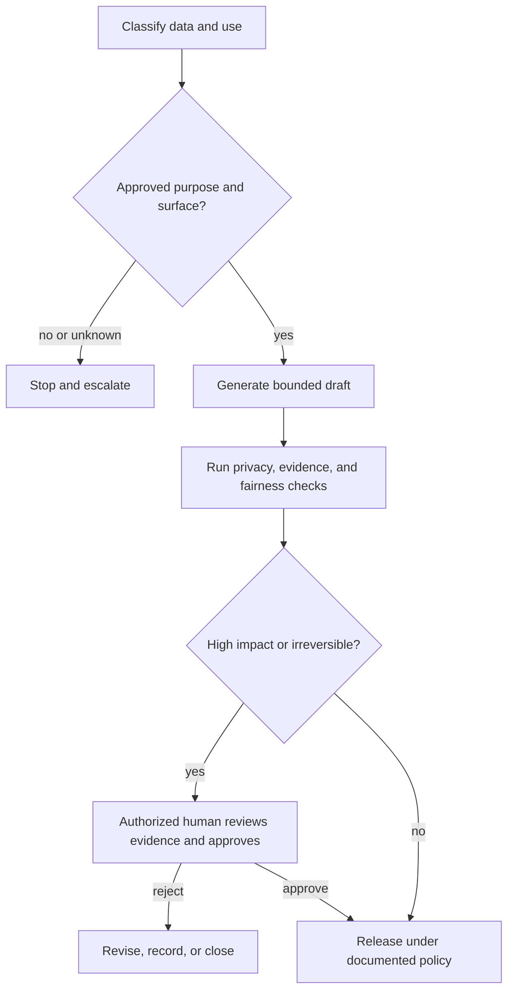

# Put Authority Around Capability

> A model can produce an answer without having permission to see the data, make the decision, or take the action.

**Type:** Learn
**Languages:** Python
**Prerequisites:** [Put Each Fact in the Right Kind of Context](../../04-context-knowledge-memory-and-caching/), [Validate the Claim, Not the Confidence](../../05-output-evaluation-and-validation/), [Guardrails](../../../../../phases/11-llm-engineering/12-guardrails/)
**Time:** ~110 minutes

## Learning Objectives

- Classify information and use cases before selecting a Claude surface or workflow.
- Separate technical capability from organizational permission and human authority.
- Design controls for privacy, security, bias, transparency, retention, and misuse.
- Place human review according to consequence, reversibility, and ambiguity.
- Build an incident and escalation path for unsafe or noncompliant behavior.

## The Problem

A customer-success manager wants faster account reviews. They paste support transcripts, contract excerpts, and renewal notes into an unapproved personal AI account. Claude produces useful summaries, so the manager asks it to rank customers by renewal risk and automatically send special offers.

The workflow has several failures before output quality is considered:

- The transcripts contain personal and commercially sensitive data.
- Nobody checked which product terms and retention controls apply.
- The ranking may create uneven treatment across customer groups.
- The manager has no authority to approve discounts automatically.
- There is no record of sources, review, or sent messages.

Adding "protect privacy" to the prompt does not repair the system. Governance defines who may use which data, for which purpose, on which surface, with which controls, and who remains accountable.

## The Concept

### Classify before processing

Start with the data and the decision, not the model.

A simple organizational classification might be:

| Class | Example | Typical control direction |
|---|---|---|
| Public | Published documentation | Verify integrity and attribution |
| Internal | Nonpublic process notes | Approved account and access control |
| Confidential | Contracts, customer details | Minimum necessary data, strict permissions, retention review |
| Restricted | Secrets, regulated records, highly sensitive identifiers | Prohibit or require a specifically approved controlled workflow |

These labels are examples, not universal law. Use your organization's actual policy and legal guidance.

Classify the use case too. Summarizing text for a human reviewer differs from deciding eligibility or sending a binding communication. A low-sensitivity input can still support a high-impact decision.

Ask five questions at intake:

1. What data enters the workflow?
2. What purpose is approved?
3. Who may access the input and output?
4. What decision or action could follow?
5. How long may records be retained?

If one answer is unknown, the correct next step may be policy clarification, not generation.

### Capability, permission, and authority are separate

Claude may be technically capable of drafting an offer. A connector may have permission to access a customer record. Neither means the workflow is authorized to approve a discount or send a message.

Use three gates:

```text
Capability: Can the system perform the operation?
Permission: May this identity access the required data or tool?
Authority: May this role make or execute the decision?
```

All three must pass. Tool permissions should follow least privilege. Give the workflow only the data and actions required for its approved purpose. Separate read, draft, approve, and execute roles where consequence is meaningful.

### Minimize data and purpose

Purpose limitation means data approved for one job is not automatically approved for another. Support transcripts collected to resolve incidents may not be approved for customer profiling.

Data minimization asks for the smallest sufficient input:

- Remove names when identity is not needed.
- Replace exact identifiers with scoped references.
- Retrieve relevant sections rather than entire records.
- Avoid putting secrets into prompts or logs.
- Limit outputs to the fields required by the next step.

Minimization reduces exposure, prompt size, and accidental secondary use. It does not remove the need for an approved surface and documented policy.

### Product terms are changeable facts

Data usage, retention, regional processing, administrative controls, and feature availability can differ across consumer products, commercial offerings, API usage, plans, and configured settings. These facts can change.

Do not transfer an assumption from one Claude surface to another. Before deployment, verify current official terms and your organization's contract for:

- Whether and how submitted data may be used.
- Default and configurable retention.
- Deletion behavior and legal exceptions.
- Administrative access and audit capabilities.
- Regional or residency options.
- Connector and third-party data handling.

Record the source and verification date in the workflow decision log.

### Human review belongs at decision boundaries

"Human in the loop" is too vague. Define what the person sees, decides, and can stop.

Place stronger review where one or more are high:

- Consequence to people, finances, rights, safety, or reputation.
- Irreversibility of the action.
- Ambiguity in policy or evidence.
- Novelty of the case.
- Difficulty detecting an error after action.



A reviewer needs the source evidence, model output, uncertainty, policy constraints, and proposed action. A bare approve button creates ceremonial oversight.

### Fairness requires a defined population and outcome

Bias is not solved by asking the model to be unbiased. Define:

- Who is affected?
- What outcome is allocated or withheld?
- Which attributes or proxies could create unjustified disparity?
- What comparison and threshold will be used?
- Who is qualified to interpret the result?
- What appeal or correction path exists?

Test by relevant segments where lawful and appropriate. Investigate both data imbalance and workflow design. Human review can reproduce the same bias if reviewers see the same misleading evidence.

For decisions involving employment, credit, housing, healthcare, education, public services, or legal rights, involve qualified policy, legal, and domain owners. This course is not legal advice.

### Transparency should serve the affected person

Useful transparency explains:

- That AI materially assisted, when policy requires disclosure.
- What information influenced the result.
- What uncertainty or limitations remain.
- Who made the final decision.
- How to request correction or appeal.

Do not expose hidden system instructions, security controls, personal data, or proprietary reasoning to satisfy a vague demand for transparency. Explain the process and evidence at the level needed for accountability.

### Guardrails need defense in depth

Prompt instructions are one layer. A robust workflow can include:

- Input classification and access control.
- Secret and personal-data detection.
- Trusted-source retrieval filters.
- Tool allowlists and scoped credentials.
- Structured outputs and deterministic validation.
- Content and policy checks.
- Approval before consequential actions.
- Rate and spend limits.
- Audit logs with appropriate retention.
- Monitoring, rollback, and incident response.

Assume source content can contain malicious instructions. Treat retrieved documents as data, not commands. Clearly delimit them and keep tool authorization outside model text.

### Incidents need a prepared path

An incident can be privacy exposure, unsafe advice, unauthorized tool use, systematic bias, prompt injection, or repeated unsupported output.

Prepare before launch:

1. **Detect:** Define signals and reporting channels.
2. **Contain:** Pause the workflow, revoke credentials, or disable an action path.
3. **Preserve:** Retain approved evidence without spreading sensitive data.
4. **Notify:** Follow organizational and legal escalation rules.
5. **Correct:** Repair data, permissions, prompt, model, or workflow controls.
6. **Learn:** Add evaluation cases and monitoring to prevent recurrence.

Do not promise deletion, notification timing, or legal conclusions without checking the actual policy and jurisdiction.

## Build It

### Step 1: Write a use-case card

```text
Purpose:
Data classes:
Affected people:
Allowed sources:
Approved Claude surface:
Allowed outputs:
Prohibited actions:
Human decision owner:
Retention rule:
Incident owner:
```

Require explicit approval for changes in purpose, data class, or action authority.

### Step 2: Create a control map

Map each risk to preventive, detective, and corrective controls:

| Risk | Prevent | Detect | Correct |
|---|---|---|---|
| Personal data exposure | Minimize and redact input | Scan prompts and outputs | Contain, notify, rotate access |
| Unsupported recommendation | Constrain sources | Claim-evidence validation | Block and revise |
| Unauthorized action | Read-only tools and approval | Audit attempted actions | Revoke credential and investigate |
| Uneven treatment | Define criteria and representative tests | Segment evaluation | Rework data, policy, or workflow |

One control rarely covers the full failure path.

### Step 3: Design the approval packet

The reviewer should receive:

- Proposed decision or action.
- Supporting and conflicting evidence.
- Data and policy classification.
- Automated check results.
- Known uncertainty.
- Reversibility and affected population.
- Explicit approve, revise, reject, and escalate options.

Track the human decision separately from the model recommendation.

### Step 4: Run a threat workshop

Test at least these cases:

- Restricted data appears unexpectedly.
- A connected document contains instructions to ignore policy.
- A user requests a purpose outside approval.
- The model proposes an action beyond role authority.
- Evaluation shows a disparity for an affected segment.
- A third-party connector becomes unavailable or changes behavior.

Record which control detects the issue and who acts next.

## Interactive Lab

Use the confidence-risk figure to vary evidence confidence, consequence, reversibility, and affected population. The interaction demonstrates why a high-confidence output can still require review when authority or impact is high.

```figure
06-data-analysis-confidence
```

## Practice Lab

Run the governance scorer. Raise analysis confidence to 1.0, remove the human gate, or allow untrusted content to authorize mutation. The result should show that confidence never replaces authority or consequence controls.

## Shipped Artifact

`outputs/responsible-use-control-map.json` is a filled governance packet for customer-renewal assistance. It includes the approved purpose, data classes, prohibited actions, preventive, detective, and corrective controls, a human approval packet, and an incident owner.

## Verify It

Validate the controls:

```bash
cd certifications/claude/lessons/06-governance-safety-and-responsible-use/code
python3 main.py
python3 -m unittest discover tests -v
```

The validator rejects missing control layers, unowned incidents, high-impact actions without an authorized human gate, and any design that lets untrusted content authorize mutation.

## Capstone Connection

The quiz checks capability versus authority, minimization, surface-specific terms, review quality, injection boundaries, and fairness response. Carry this packet into Associate capstone 29 and Professional Architect capstone 32 as the governance and approval evidence.

## Use It

### Exam decision pattern

In governance scenarios:

1. Classify data, purpose, and consequence.
2. Check the current approved product terms and organizational policy.
3. Minimize input and permissions.
4. Separate generation from authority to decide or act.
5. Put a meaningful human gate before high-impact or irreversible action.
6. Preserve evidence, auditability, appeal, and incident response.

### Common traps

- **Prompt-only governance:** A sentence cannot enforce access or retention.
- **Technical access as authority:** A connector permission is mistaken for business approval.
- **One privacy rule for every surface:** Product and contract behavior differs.
- **Collect now, find a use later:** Secondary purpose lacks approval.
- **Human rubber stamp:** The reviewer lacks evidence or power to reject.
- **Fairness by instruction:** No population, measure, or appeal path is defined.
- **Maximum logging:** Audit data creates new privacy and security risk.
- **Compliance certainty:** The workflow makes legal claims without qualified review.

### Exercises

1. Classify the data and action in three workflows from your organization.
2. Create a use-case card for one Claude-assisted process.
3. Build a control map with preventive, detective, and corrective controls.
4. Redesign a broad connector permission using least privilege.
5. Write an approval packet for a high-consequence recommendation.
6. Tabletop an incident and identify the first containment action.

## Key Terms

- **Purpose limitation:** Using data only for the approved objective.
- **Data minimization:** Processing only the information necessary for that objective.
- **Least privilege:** Granting the smallest access and action scope required.
- **Human decision gate:** A defined point where an authorized person can inspect, reject, revise, or approve.
- **Defense in depth:** Multiple controls across the failure path.
- **Prompt injection:** Untrusted content attempting to alter model or tool behavior.
- **Appeal path:** A process for an affected person to challenge or correct a result.
- **Incident response:** Prepared detection, containment, notification, correction, and learning actions.

## Further Reading

- [Anthropic: API and data retention](https://platform.claude.com/docs/en/manage-claude/api-and-data-retention)
- [Anthropic Privacy Center](https://privacy.anthropic.com/)
- [Anthropic Trust Center](https://trust.anthropic.com/)
- [Anthropic: Responsible Scaling Policy](https://www.anthropic.com/responsible-scaling-policy)
- [Anthropic: Reduce prompt leak](https://platform.claude.com/docs/en/test-and-evaluate/strengthen-guardrails/reduce-prompt-leak)
- [AI Engineering from Scratch: Security, Secrets, and Audit](../../../../../phases/17-infrastructure-and-production/25-security-secrets-audit/)
- [AI Engineering from Scratch: Compliance Frameworks](../../../../../phases/17-infrastructure-and-production/26-compliance-frameworks/)
- [AI Engineering from Scratch: Fairness Criteria](../../../../../phases/18-ethics-safety-alignment/21-fairness-criteria-group-individual-counterfactual/)

Privacy, retention, administrative controls, product terms, and regulatory obligations change and can differ by surface, plan, contract, location, and settings. These official sources were checked on 2026-08-08. Verify the current terms and obtain qualified organizational guidance before processing sensitive data or automating consequential decisions.
