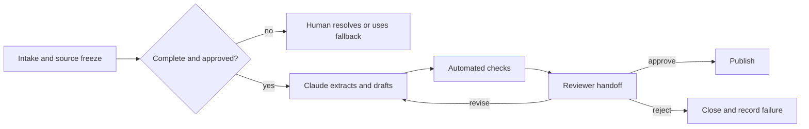

# Design the Handoff Before the Automation

> A workflow is not complete when Claude finishes. It is complete when the next person can verify, decide, act, and recover.

**Type:** Learn
**Languages:** Python
**Prerequisites:** [Validate the Claim, Not the Confidence](../../05-output-evaluation-and-validation/), [Put Authority Around Capability](../../06-governance-safety-and-responsible-use/), [Anthropic Workflow Patterns](../../../../../phases/14-agent-engineering/12-anthropic-workflow-patterns/)
**Time:** ~105 minutes

## Learning Objectives

- Map a current workflow before choosing where Claude should participate.
- Decide whether to assist, automate, redesign, or reject a workflow step.
- Specify step inputs, outputs, owners, gates, fallback, and service expectations.
- Build human handoff packets that preserve evidence, uncertainty, and authority.
- Measure workflow value without ignoring review, failure, and maintenance cost.

## The Problem

A product team automates its weekly release briefing. Claude reads issue summaries, drafts the brief, and posts it to a shared channel every Friday.

The first two briefs save time. The third includes a feature that was removed from scope. The fourth omits an unresolved security concern. The engineer who used to assemble the brief assumes the product manager now owns review. The product manager assumes the automated post was already approved.

The team automated text production but deleted the ownership model. There is no source cutoff, approval gate, escalation path, or fallback when data is incomplete.

A successful workflow is not a chain of model calls. It is a chain of responsibilities with explicit evidence and recoverable state.

## The Concept

### Map the current state first

Before adding Claude, observe how the work really moves:

- What event starts it?
- Who supplies each input?
- Which systems are sources of record?
- Where do people use judgment?
- Which exceptions consume most time?
- Who approves the result?
- What downstream action follows?
- How is failure detected and recovered?

Do not document only the ideal process. Shadow a few real cases. Informal checks often carry critical knowledge. If you remove them without encoding or assigning them, quality falls while the new workflow appears efficient.

### Choose the intervention, not just the tool

For each step, choose among four interventions:

1. **Assist:** Claude proposes, summarizes, extracts, or drafts while a person remains the operator.
2. **Automate:** The system performs a bounded, well-tested, reversible step under policy.
3. **Redesign:** The current step is waste caused by poor inputs or duplicate systems, so remove or restructure it.
4. **Reject:** The step should not use Claude because data, consequence, ambiguity, or policy makes the risk unacceptable.

Automation is not always the highest maturity. If analysts spend hours reconciling two conflicting spreadsheets, generating reconciliation prose faster does not solve the source conflict.

### Specify every step as a contract

Each step should have:

```text
Trigger:
Owner:
Allowed inputs and sources:
Transformation:
Output schema:
Pass criteria:
Timeout or service expectation:
Escalation condition:
Fallback:
Next owner:
```

The contract lets you test a step independently and prevents responsibility from dissolving between systems.

For a release brief extraction step:

```text
Trigger: Thursday 15:00 source freeze
Owner: release coordinator
Inputs: approved tracker view and signed security status
Output: structured candidate items with source IDs and status
Pass: all required teams represented; unresolved fields marked
Escalate: missing security status or conflicting launch state
Fallback: coordinator uses the manual template
Next owner: product manager validates inclusion decisions
```

### Use consequence and reversibility to place control

Two questions shape automation depth:

1. If the result is wrong, how serious is the consequence?
2. Can the action be reversed cheaply before harm occurs?

| Consequence | Reversible | Design direction |
|---|---|---|
| Low | Yes | Bounded automation with monitoring may fit |
| High | Yes | Generate or stage, then require review before release |
| Low | No | Add confirmation, audit, and narrow scope |
| High | No | Keep an authorized human decision gate and strong fallback |

A draft stored for review is different from a message sent to thousands of customers. Treat action authority as a separate capability.

### Choose a workflow pattern that matches dependencies

Claude workflows often use a small number of patterns:

- **Prompt chaining:** A fixed sequence where each stage can be checked.
- **Routing:** Classify work and send it to a specialized path.
- **Parallelization:** Run independent analysis and reconcile the results.
- **Orchestrator-workers:** A coordinator breaks variable work into subtasks and synthesizes it.
- **Evaluator-optimizer:** Generate, review against criteria, and revise until a gate or limit is reached.

Prefer the simplest pattern that represents the work. A fixed five-stage report does not need an open-ended agent. A routing workflow needs observable routing signals and a fallback for ambiguous cases.



### Handoffs are products

A handoff should minimize rediscovery. Give the next owner:

- The decision required and deadline.
- Scope and version of the workflow.
- Source IDs and freshness status.
- Candidate output.
- Passed and failed checks.
- Known uncertainty and conflicts.
- Actions already taken.
- Options: approve, revise, reject, escalate.
- Fallback and recovery instructions.

Do not bury a critical caveat at the end of a long transcript. Structure the handoff around the decision.

The receiving person must know what remains theirs. "Please review" is incomplete. "Confirm that items R-14 and R-19 are authorized for external publication; all other checks passed" is actionable.

### Preserve state across failures

Long workflows fail. APIs time out, connectors return partial data, reviewers miss deadlines, and inputs change after generation.

Checkpoint at meaningful boundaries:

- Source snapshot accepted.
- Extraction validated.
- Draft version produced.
- Review findings recorded.
- Approval recorded.
- External action completed.

Make retries idempotent where possible. Retrying a draft generation is usually safe. Retrying a send or financial action without an idempotency key can duplicate harm.

Define a manual fallback before launch. A fallback that no current employee can execute is fictional resilience.

### Measure the workflow, not the demo

Track value and risk together:

```text
net value = time saved
          - human review time
          - correction and incident cost
          - platform and model cost
          - maintenance cost
```

Useful operational measures include:

- End-to-end completion time.
- Queue and review time.
- First-pass acceptance rate.
- High-severity false-pass rate.
- Escalation and fallback rate.
- Rework per case.
- Cost per accepted outcome.
- Source freshness failures.
- User correction and appeal outcomes.

A faster generation stage may not reduce end-to-end time if review becomes harder.

### Communicate limits by stakeholder

Executives need expected value, risk boundaries, and evidence of readiness. Operators need exact inputs, failure signals, and fallback steps. Reviewers need criteria and authority. Security and policy owners need data flows, permissions, retention, and incident controls.

Do not present a capability demo as production evidence. State what was tested, on which cases, what remains human-owned, and which current product facts need revalidation.

## Build It

### Step 1: Map one real case

Draw the current process with roles and systems. Mark:

- Wait time.
- Rework loops.
- Judgment points.
- Source-of-record lookups.
- External actions.
- Known exceptions.

Ask the operator which unofficial check prevents the worst mistake.

### Step 2: Score candidate interventions

For each step, rate from 1 to 5:

| Factor | Question |
|---|---|
| Repetition | Does the same transformation recur? |
| Clarity | Can pass criteria be written? |
| Data approval | Is the input approved and controlled? |
| Reversibility | Can a wrong action be stopped or undone? |
| Detectability | Will failure be visible before harm? |

Low scores suggest assistance, redesign, or rejection rather than automation.

### Step 3: Write the future-state contract

Define each step, owner, gate, checkpoint, fallback, and service expectation. Make the manual path explicit. Then ask an operator, reviewer, and policy owner to walk through a normal case and an exception.

### Step 4: Build the handoff packet

Use a stable template:

```text
Decision required:
Deadline and owner:
Workflow and source versions:
Candidate result:
Evidence:
Checks passed:
Checks failed:
Uncertainty:
Actions available:
Fallback:
```

Reject packets that omit a required blocker or source version.

### Step 5: Pilot in shadow mode

Run Claude beside the existing process without letting it take the external action. Compare results and review effort. Include exceptions, not only easy cases. Move to a limited release only after gates pass and incident owners are ready.

## Interactive Lab

Use the review-threshold figure to change consequence, reversibility, ambiguity, and evidence completeness. The control should move from bounded automation to mandatory review before it reaches an irreversible state.

```figure
07-human-review-threshold
```

## Practice Lab

Run the handoff scorer. Remove an owner, checkpoint, fallback, or approval from the publish step and observe the failed contract. Then clear the unresolved review check and compare the recommended next action.

## Shipped Artifact

`outputs/workflow-handoff-packet.json` is a filled release-brief workflow with step owners, gates, checkpoints, fallback, service expectations, and an actionable reviewer packet.

## Verify It

Validate the workflow locally:

```bash
cd certifications/claude/lessons/07-workflow-design-and-human-handoffs/code
python3 main.py
python3 -m unittest discover tests -v
```

The validator checks that every step has an owner, gate, escalation, fallback, and next owner; that irreversible publication has human approval; and that the handoff names failed checks and available decisions.

## Capstone Connection

The quiz tests current-state mapping, redesign, handoff contents, retry safety, ownership, and shadow-mode readiness. Submit the validated packet as the operating and reviewer handoff for Associate capstone 29.

## Use It

### Exam decision pattern

For workflow scenarios:

1. Map the current decision, evidence, roles, and exception path.
2. Remove process waste before automating it.
3. Choose the simplest pattern that fits dependencies.
4. Preserve human authority at high-consequence or irreversible boundaries.
5. Send a structured handoff with evidence and failed checks.
6. Define checkpoint, fallback, monitoring, and ownership before launch.

### Common traps

- **Automate the prose, delete the owner:** Nobody knows who approves.
- **Demo as deployment proof:** Normal examples hide exceptions and operations.
- **Open-ended agent for a fixed process:** Complexity increases without value.
- **Parallelize dependent work:** Synthesis begins before evidence is verified.
- **Human in the loop as a slogan:** No review packet or reject authority exists.
- **No source cutoff:** Inputs change while the output is being approved.
- **Retry everything:** Irreversible actions can execute twice.
- **Time saved as the only metric:** Review, correction, failure, and maintenance disappear.

### Exercises

1. Map a recurring workflow and identify one unofficial quality check.
2. Classify each step as assist, automate, redesign, or reject.
3. Write a step contract for the highest-value candidate.
4. Design a handoff packet for a reviewer who has five minutes.
5. Run a tabletop failure: the source changes after approval but before publication.
6. Define five metrics that would reveal whether the workflow creates net value.

## Key Terms

- **Current-state map:** A representation of how work actually moves today.
- **Step contract:** The trigger, owner, inputs, transformation, output, gate, escalation, fallback, and next owner for a workflow step.
- **Handoff packet:** Structured state and evidence prepared for the next responsible person.
- **Checkpoint:** A durable recovery point after a verified stage.
- **Idempotency:** The property that repeating an operation does not duplicate its effect.
- **Shadow mode:** Running a new workflow without allowing it to control the live outcome.
- **Fallback:** The tested alternate path used when the automated path is unsafe or unavailable.
- **Source cutoff:** The version boundary that fixes which inputs an output represents.

## Further Reading

- [Anthropic: Building effective agents](https://www.anthropic.com/research/building-effective-agents)
- [Anthropic: Define success criteria and build evaluations](https://platform.claude.com/docs/en/test-and-evaluate/develop-tests)
- [AI Engineering from Scratch: Scope Contracts](../../../../../phases/14-agent-engineering/36-scope-contracts/)
- [AI Engineering from Scratch: Verification Gates](../../../../../phases/14-agent-engineering/38-verification-gates/)
- [AI Engineering from Scratch: Multi-Session Handoff](../../../../../phases/14-agent-engineering/40-multi-session-handoff/)
- [AI Engineering from Scratch: Propose Then Commit](../../../../../phases/15-autonomous-systems/15-propose-then-commit/)

Claude product features, connector behavior, model capabilities, limits, and costs can change. These sources were checked on 2026-08-08. Reverify current official documentation and organizational controls before moving a workflow from shadow mode to production.
