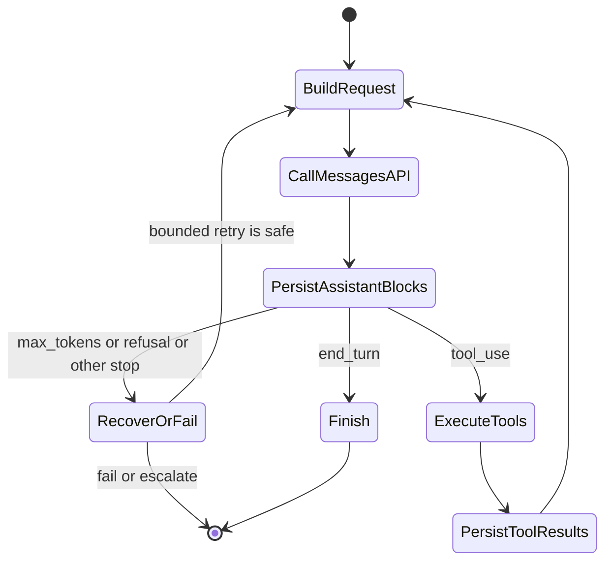

# The Messages API Is a State Machine

> The API does not remember your conversation. Your application does, and one misplaced content block can break the entire loop.

**Type:** Build
**Languages:** Python
**Prerequisites:** [Spend Capability Where Failure Is Expensive](../../02-model-selection-and-token-economics/), [Turn a Request Into a Testable Contract](../../03-prompting-and-task-decomposition/), [Put Each Fact in the Right Kind of Context](../../04-context-knowledge-memory-and-caching/)
**Time:** ~120 minutes

## Learning Objectives

- Model a Claude request as an explicit application state transition
- Choose SDK or raw REST separately from synchronous, streaming, or batch delivery
- Construct image and document content blocks with explicit asset boundaries
- Preserve typed response blocks and branch on `stop_reason`
- Enforce session, retry, timeout, retention, and context-budget hygiene
- Test a complete lifecycle without depending on a live API key

## The Failure That Teaches the Protocol

An engineer sends this sequence:

1. User asks, "Where is order A-17?"
2. Claude returns a `tool_use` block with ID `toolu_01`.
3. The application runs `lookup_order`.
4. The application sends only the tool result in a fresh request.

The second request fails, or Claude responds as though it never requested the tool.

Nothing mysterious happened. The Messages API is stateless. The client failed to resend the assistant message containing the original `tool_use` block. A `tool_result` is not a freestanding fact. It answers a specific tool request by ID, inside a conversation sequence owned by your code.

Frameworks make this easy to miss because they maintain the array for you. The certification expects you to reason below that convenience layer. Build the raw state machine once. Every SDK, agent framework, and managed runtime becomes easier to debug afterward.

## One Request, One Transition

A request supplies the model, system instructions, messages, token controls, and optional capabilities. A response supplies content blocks, usage metadata, and a reason generation stopped. Your application decides what happens next.

```json
{
  "model": "<current-model-id>",
  "max_tokens": 800,
  "system": "Answer from verified order data only.",
  "messages": [
    {
      "role": "user",
      "content": "Where is order A-17?"
    }
  ]
}
```

The exact model identifiers and optional request fields change. Treat them as configuration, pin deliberate versions where the platform permits it, and verify them in the current [Models overview](https://platform.claude.com/docs/en/about-claude/models/overview). The durable contract is that your client submits context and receives a typed response.



This diagram is more useful than memorizing an SDK method. Each arrow is an application responsibility. You can log it, test it, retry it, or deny it.

## Choose Two Independent Access Patterns

Client library and completion pattern answer different questions. Choose them independently.

| Client | Prefer it when | You still own |
|---|---|---|
| Official SDK | Your language is supported and you want typed request and response models, typed errors, header management, retry defaults, pagination, and stream accumulation helpers | Application state, `stop_reason` policy, retry safety, tool authorization, logging, and final validation |
| Raw REST | The runtime has no supported SDK, a constrained environment forbids the dependency, or you need a custom HTTP transport or protocol-level fixture | Authentication and version headers, JSON types, SSE framing, timeouts, retries, error mapping, forward compatibility, and connection cleanup |

The SDK is the safer default for a supported production language because it removes protocol plumbing, not because it owns the application lifecycle. Raw REST is appropriate when its extra control earns its extra test burden. The [Python SDK guide](https://platform.claude.com/docs/en/cli-sdks-libraries/sdks/python) documents sync and async clients, typed models, streaming helpers, retry defaults, and raw-response access. The [API overview](https://platform.claude.com/docs/en/api/overview) is the direct HTTP contract.

Then choose how one or many results arrive:

| Completion pattern | Best fit | Completion evidence | Poor fit |
|---|---|---|---|
| Synchronous Message | One interactive request whose complete response is needed before continuing | One parsed `Message` with a handled `stop_reason` | Progressive rendering or large offline queues |
| Streaming Message | One interactive or long response where partial display or time-to-first-token matters | Accumulated content plus terminal `message_stop` and final message metadata | Irreversible work based on partial deltas |
| Message Batch | Many independent requests that may complete later | Reconciled per-item result by stable `custom_id` after asynchronous processing | A conversational tool loop or per-token user feedback |

An async SDK client is not Message Batches. It lets your process await ordinary HTTP work concurrently. A Message Batch is a server-side asynchronous workload with stored inputs and results, per-item outcomes, and later reconciliation. The current [batch processing guide](https://platform.claude.com/docs/en/build-with-claude/batch-processing) also notes that results are not ordered by submission, so identity comes from `custom_id`.

## Content Is a Sequence of Typed Blocks

Do not reduce a response to `response.content[0].text`. Claude can return several blocks in one message:

- `text` contains user-facing or intermediate language.
- `tool_use` names a tool, supplies structured input, and carries a unique request ID.
- `thinking` can carry extended reasoning data when that feature is enabled.
- Provider features may introduce additional block types over time.

Defensive code switches on `type`, handles supported blocks explicitly, and records unknown blocks without silently treating them as text. This matters during version changes. A parser that assumes every block has a `text` property turns a valid tool request into an empty answer.

A tool round trip has strict ordering:

```json
[
  {
    "role": "user",
    "content": "Where is order A-17?"
  },
  {
    "role": "assistant",
    "content": [
      {
        "type": "tool_use",
        "id": "toolu_01",
        "name": "lookup_order",
        "input": {"id": "A-17"}
      }
    ]
  },
  {
    "role": "user",
    "content": [
      {
        "type": "tool_result",
        "tool_use_id": "toolu_01",
        "content": "{\"status\":\"ready\"}"
      }
    ]
  }
]
```

The assistant request comes first. The user-role result follows. `tool_use_id` matches the original ID exactly. When several tool calls arrive together, return a result for each one and preserve their correlations.

## Stop Reasons Are Control Signals

Text may say "I will check that now" while the response actually stopped for a tool. Text may look complete while generation stopped at the token limit. Branch on the protocol signal.

| Signal | Application interpretation | Safe response |
|---|---|---|
| `end_turn` | Claude completed this turn | Validate and present the answer |
| `tool_use` | One or more client tools were requested | Validate, authorize, execute, append results, continue |
| `max_tokens` | The configured output budget ended generation | Treat output as possibly incomplete; retry only with a plan |
| `stop_sequence` | A configured sequence ended generation | Confirm that the boundary is valid for your contract |
| `pause_turn` | A server-side operation may need continuation | Follow the current feature-specific continuation contract |
| `refusal` | The model declined the request | Preserve the refusal and use an approved fallback or escalation |
| `model_context_window_exceeded` | Generation filled the model context window | Treat the response as truncated and redesign the context budget |

Product note, verified 2026-08-08: supported stop reasons and continuation requirements can change. The current source of truth is [Handling stop reasons](https://platform.claude.com/docs/en/build-with-claude/handling-stop-reasons). Code should fail closed on an unknown value and capture enough metadata to diagnose it.

Never write `while stop_reason != "end_turn"`. That converts every unfamiliar state into another request and creates runaway loops. Write an exhaustive branch with a maximum turn count, a wall-clock deadline, and per-tool budgets.

## The Client Owns Conversation State

The service does not retain a hidden chat object for the Messages API. Each call receives the context you choose to send. That gives you control, but it also makes session hygiene your job.

Maintain these boundaries:

1. **User isolation.** Never reuse one tenant's message array for another tenant.
2. **System separation.** Keep trusted instructions outside untrusted document content.
3. **Canonical storage.** Persist typed blocks, not a flattened transcript that cannot reconstruct tool IDs.
4. **Context budgeting.** Measure input growth and compact before the limit, while keeping facts and outstanding obligations.
5. **Retention policy.** Store only what the product requires. Redact secrets and sensitive fields before logs.
6. **Idempotency.** A network retry must not repeat a payment, email, or deployment without a stable operation key.

If you summarize a long session, preserve active tool requests, user constraints, verified facts, unresolved questions, approval state, and source references. A fluent summary that drops "do not send" is operationally wrong.

## Multimodal Requests Are Typed Asset Transfers

Text, images, and documents belong in one ordered content array. State the task before the assets, use the block type that matches the media, and keep the source explicit.

```json
{
  "model": "<current-model-id>",
  "max_tokens": 400,
  "messages": [
    {
      "role": "user",
      "content": [
        {
          "type": "text",
          "text": "Compare the chart with the approved policy document."
        },
        {
          "type": "image",
          "source": {
            "type": "base64",
            "media_type": "image/png",
            "data": "<base64-image-bytes>"
          }
        },
        {
          "type": "document",
          "source": {
            "type": "file",
            "file_id": "<application-owned-file-id>"
          }
        }
      ]
    }
  ]
}
```

Images can use `base64`, `url`, or Files API `file` sources. PDFs can use URL, base64, or Files API sources inside `document` blocks. Block order is part of the prompt: put the instruction and trust context close to the asset it governs. Verify current media and model constraints in [Vision](https://platform.claude.com/docs/en/build-with-claude/vision) and [PDF support](https://platform.claude.com/docs/en/build-with-claude/pdf-support).

The Files API changes reuse and retention, not the meaning of the content block. Upload once, receive an opaque `file_id`, and reference it in later Messages requests instead of resending bytes. It is useful for a policy PDF or image reused across many requests.

Product note, verified 2026-08-09: the [Files API](https://platform.claude.com/docs/en/build-with-claude/files) is beta and currently uses the `files-api-2025-04-14` beta header when a Message references a file. Files are workspace-scoped, immutable after upload, and persist until deleted. Any API key in that workspace can reference them. Treat current headers, platform availability, limits, and download rules as volatile and check the guide before implementation.

| Source | Data crossing the boundary | Reuse and retention responsibility |
|---|---|---|
| Inline base64 | Encoded bytes travel in every request | Do not log the payload; keep request retention and size limits explicit |
| URL | The provider retrieves an asset from a remote origin | Authorize the origin, avoid secret-bearing URLs, and account for origin logs and availability |
| Files API `file_id` | An identifier references bytes stored in the API workspace | Allowlist application-owned IDs, record owner and purpose, enforce workspace isolation, and delete when retention ends |

A `file_id` is not proof that the current tenant may use the file. Bind it to an application record containing tenant, workspace, media type, sensitivity, content hash, upload time, and deletion deadline. Never accept an arbitrary model- or user-supplied ID and forward it directly. Keep raw image bytes, PDF text, signed URLs, and opaque file IDs out of ordinary traces; log a content hash and policy decision instead.

## Streaming Changes Delivery, Not Meaning

Streaming lets the user see output before the complete message arrives. It does not remove the need to assemble and validate the final response.

Typical event handling follows this shape:

```python
text_parts = []

for event in stream:
    if event.type == "content_block_delta" and event.delta.type == "text_delta":
        text_parts.append(event.delta.text)
    elif event.type == "message_delta":
        final_stop_reason = event.delta.stop_reason
    elif event.type == "message_stop":
        complete = True
```

Render provisional text if the experience benefits from it, but do not trigger irreversible work from a partial stream. Tool input can also arrive incrementally. Buffer it until the block is complete, parse it once, validate it, then authorize it.

A dropped connection creates ambiguity. Track whether a complete terminal event arrived. If not, mark the attempt incomplete. Retry read-only requests when safe. For mutating operations, check an idempotency record before doing anything again.

See [Streaming Messages](https://platform.claude.com/docs/en/build-with-claude/streaming) for the current event types and SDK helpers.

## Batch, Cache, and Thinking Solve Different Problems

These features are often mixed together because each changes cost or latency. Their purposes differ.

**Message Batches** process many independent requests asynchronously. They trade immediate response latency for throughput and favorable batch economics. Use them for offline classification, extraction, evaluation, or migration. Do not use them for an interactive tool loop that needs the next answer now. Track each request by your custom ID and handle partial batch failure. See [Batch processing](https://platform.claude.com/docs/en/build-with-claude/batch-processing).

**Prompt caching** reuses a stable prompt prefix. Place durable system instructions, tool definitions, and shared reference material before volatile user content. Changing one byte inside the cached prefix can invalidate downstream reuse. Cache hits improve time to first token and input economics, but they do not expand the context window or make stale facts correct. See [Prompt caching](https://platform.claude.com/docs/en/build-with-claude/prompt-caching).

**Extended thinking** allocates reasoning work for tasks that benefit from it. It consumes budget, changes response blocks, and has feature-specific rules for preserving thinking blocks across tool turns. Do not edit or fabricate signed thinking content. Do not enable it by reflex for simple extraction. Compare quality, latency, and cost on an eval set. See [Extended thinking](https://platform.claude.com/docs/en/build-with-claude/extended-thinking).

The exam reasoning is simple: choose the mechanism from the workload. Offline independent jobs suggest batches. Repeated stable prefixes suggest caching. Difficult reasoning with measured quality gains suggests thinking. Fast token delivery suggests streaming.

## Build the Lifecycle and Asset Boundary Offline

The runnable simulator in `code/main.py` takes scripted provider responses. It makes the hidden client work visible:

- Stores every assistant content block.
- Executes requested tools.
- Returns matching `tool_result` blocks.
- Resends the complete state.
- Rejects unknown stop reasons.
- Stops runaway loops.
- Collects a simulated stream only after `message_stop`.
- Chooses SDK or REST independently from sync, stream, or batch.
- Builds and validates image and reusable-file content blocks.
- Rejects file IDs outside the application-owned allowlist.
- Produces a hashed boundary ledger without asset bytes or file IDs.

Run it:

```bash
cd certifications/claude/lessons/08-messages-api-and-application-lifecycle/code
python3 main.py
python3 -m unittest discover tests -v
```

No code in this lesson imports an SDK, reads a credential, uploads a file, fetches a URL, or calls a model. `multimodal_lab_fixture()` uses a one-pixel synthetic image and an offline placeholder file ID. In a private experiment, replace `ScriptedTransport.create()` with a real SDK call and replace the placeholder only after an authenticated upload. Keep the state machine, allowlist, and ledger unchanged.

## Interactive Lab

Use the lifecycle figure to step through user input, assistant content blocks, tool execution, correlated results, and terminal stop reasons. Break the ordering to see which transition becomes invalid.

```figure
08-messages-lifecycle
```

## Practice Lab

Run the scripted lifecycle, then remove the assistant `tool_use` message, change the correlation ID, or end a stream without `message_stop`. Next, change the reusable file ID to one outside the owned allowlist, corrupt the image base64, or ask the access selector for both batch processing and progressive tokens. Each failure should map to a named protocol or data-boundary error rather than a prompt retry.

## Shipped Artifact

`outputs/messages-lifecycle-transcript.json` remains the complete provider-free tool round trip. `outputs/multimodal-request-fixture.json` adds four access decisions, one mixed image and document request, an application-owned file allowlist, and a redacted asset-boundary ledger. Running `python3 main.py` prints both fixtures. The unit suite verifies each checked-in artifact without network access.

## Verify It

```bash
cd certifications/claude/lessons/08-messages-api-and-application-lifecycle/code
python3 main.py
python3 -m unittest discover tests -v
```

## Capstone Connection

The quiz checks the same protocol decisions under unfamiliar scenarios. Use the verified transcript as lifecycle evidence in Developer capstone 30 and Architect capstones 31 and 32.

## Application Lifecycle Beyond One Turn

A production Claude application has more states than "request" and "response."

```mermaid
flowchart LR
    Intake[Validate intake] --> Authorize[Authorize capabilities]
    Authorize --> Invoke[Invoke model]
    Invoke --> Parse[Parse typed blocks]
    Parse --> Act[Execute approved tools]
    Act --> Verify[Verify result and final state]
    Verify --> Deliver[Deliver or escalate]
    Deliver --> Observe[Record trace and metrics]
    Observe --> Evaluate[Run regression evals]
    Evaluate --> Improve[Version prompt, model, tools, or code]
    Improve --> Intake
```



Model errors are only one failure class. You also have transport timeouts, rate limits, malformed application state, schema mismatches, authorization denials, tool failures, stale caches, user cancellations, and deployment regressions. Tag them separately. A retry that helps a timeout may make an authorization failure worse.

Version the system instruction, model choice, tool catalog, output schema, and application code in every trace. Without those identifiers, you cannot reproduce a regression or compare an eval run fairly.

## Exam Decision Rules

- If a scenario loses earlier messages, suspect client-owned state before model memory.
- If a tool result is rejected, inspect role ordering and the matching tool-use ID.
- If output looks cut off, inspect `stop_reason` and usage before changing the prompt.
- If the user needs immediate progressive display, choose streaming, not batch.
- If thousands of independent jobs can finish later, choose Message Batches.
- If a supported SDK meets the transport need, prefer its typed models and helpers; keep lifecycle policy in application code.
- If a constrained runtime needs raw REST, budget explicit tests for headers, errors, SSE, retries, and unknown fields.
- If an asset repeats, compare inline transfer with Files API reuse and an explicit deletion policy.
- If a `file_id` is not bound to the authenticated tenant and workspace, reject it before the request.
- If a long shared prefix repeats, evaluate prompt caching.
- If a retry could repeat a side effect, require idempotency or reconciliation first.
- If a new stop reason appears, fail closed and update against current documentation.

## Exercises

1. Add a scripted response containing two `tool_use` blocks. Assert that both results appear in one following user message with correct IDs.
2. Add explicit handling for `max_tokens`. Return a typed incomplete result instead of displaying partial text as final.
3. Simulate a stream that disconnects before `message_stop`. Record an incomplete attempt and prove that no irreversible action runs.
4. Add tenant and prompt-version metadata to a trace without storing the raw user message.
5. Extend the multimodal fixture with a URL-backed image. Record its origin, authorization, retention, and failure boundaries without making a network call.

## Further Reading

- [Messages API reference](https://platform.claude.com/docs/en/api/messages)
- [Messages examples](https://platform.claude.com/docs/en/api/messages-examples)
- [Python SDK](https://platform.claude.com/docs/en/cli-sdks-libraries/sdks/python)
- [Vision](https://platform.claude.com/docs/en/build-with-claude/vision)
- [PDF support](https://platform.claude.com/docs/en/build-with-claude/pdf-support)
- [Files API](https://platform.claude.com/docs/en/build-with-claude/files)
- [Handling stop reasons](https://platform.claude.com/docs/en/build-with-claude/handling-stop-reasons)
- [Streaming Messages](https://platform.claude.com/docs/en/build-with-claude/streaming)
- [Batch processing](https://platform.claude.com/docs/en/build-with-claude/batch-processing)
- [Prompt caching](https://platform.claude.com/docs/en/build-with-claude/prompt-caching)
- [Extended thinking](https://platform.claude.com/docs/en/build-with-claude/extended-thinking)
