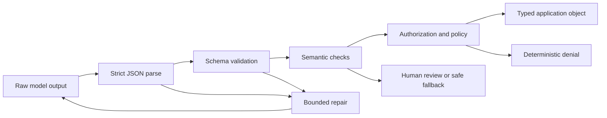

# Structured Output Is an Untrusted Contract

> Valid JSON is not a valid business decision. Parse the bytes, validate the shape, verify the meaning, then permit the action.

**Type:** Build
**Languages:** Python
**Prerequisites:** [Validate the Claim, Not the Confidence](../../05-output-evaluation-and-validation/), [The Messages API Is a State Machine](../../08-messages-api-and-application-lifecycle/)
**Time:** ~95 minutes

## Learning Objectives

- Distinguish JSON syntax, schema validity, semantic validity, and authorization
- Design narrow schemas that make invalid states difficult to express
- Parse Claude output without unsafe cleanup or optimistic coercion
- Repair invalid responses with bounded, evidence-rich retries
- Evolve output contracts without silently breaking consumers
- Test structured output at adversarial and streaming boundaries

## The JSON That Should Have Failed

Your support application requests a priority from 1 to 5. The response is:

```json
{
  "category": "billing",
  "priority": 9,
  "summary": "Customer reports a duplicate charge",
  "needs_human": false
}
```

The JSON parser succeeds. The object has every expected key. The application routes it as the highest emergency priority, skips human review, and pages an on-call engineer.

The model did not violate JSON. Your application failed to enforce the contract.

Structured output has four gates:

1. **Syntax:** Is there exactly one parseable JSON value?
2. **Shape:** Does the value match types, required fields, enums, bounds, and additional-property rules?
3. **Semantics:** Do the fields agree with domain facts and each other?
4. **Authority:** Is the requested downstream action permitted?

Passing an earlier gate never implies passing a later one.



## Prompting for JSON Is Not a Contract

"Return JSON only" is an instruction. It improves probability. It does not make invalid output impossible, protect against schema drift, or validate the business meaning.

When the current model and API support structured outputs, you can provide a JSON Schema and ask the platform to constrain generation. This reduces syntax and shape failures. It still does not prove that a cited order exists, that a refund is authorized, or that the category is correct.

Product note, verified 2026-08-09: structured-output availability, supported schema keywords, incompatibilities with other features, and model support can change. Check [Structured outputs](https://platform.claude.com/docs/en/build-with-claude/structured-outputs) before shipping. Keep application-side validation even when constrained decoding is enabled.

The application owns the schema. Version it like an API.

```json
{
  "$id": "support-triage-v1",
  "type": "object",
  "required": ["category", "priority", "summary", "needs_human"],
  "additionalProperties": false,
  "properties": {
    "category": {
      "type": "string",
      "enum": ["billing", "bug", "account", "other"]
    },
    "priority": {
      "type": "integer",
      "minimum": 1,
      "maximum": 5
    },
    "summary": {
      "type": "string",
      "minLength": 1,
      "maxLength": 240
    },
    "needs_human": {
      "type": "boolean"
    }
  }
}
```

This schema earns its strictness. The consumer expects exactly four fields. An unexpected `debug_context` field could carry private text into logs. An integer bound prevents `9`. An enum prevents category spellings from fragmenting analytics.

## Design Schemas From Consumer Decisions

Do not begin with "What can Claude generate?" Begin with "What must the next deterministic component decide?"

If the consumer chooses a queue, give it an enum. If it sorts priority, give it a bounded integer. If uncertainty changes routing, represent uncertainty explicitly instead of hoping it appears in prose.

Compare these contracts:

```json
{"answer": "Probably a billing issue. It seems urgent."}
```

```json
{
  "category": "billing",
  "priority": 4,
  "evidence_ids": ["invoice-483", "message-12"],
  "uncertainty": "medium",
  "needs_human": true
}
```

The second object makes routing and verification possible. It can still be wrong, but it is inspectable.

Use these design rules:

- Prefer enums over free-form labels.
- Use required fields only when every valid response can supply them.
- Use `null` deliberately for "known absence," not as a general escape hatch.
- Reject additional properties unless consumers intentionally support extension.
- Bound strings and arrays to control cost and storage.
- Include evidence identifiers when facts must be traceable.
- Encode actions as proposals, not proof of authorization.
- Give schemas stable names and versions.

Avoid one giant schema that represents unrelated modes through dozens of optional fields. Use a tagged union or separate endpoint contracts. Invalid states multiply when every field is optional.

## Parse Strictly

Optimistic cleanup hides failures. Consider this pattern:

```python
raw = raw.replace("```json", "").replace("```", "")
payload = json.loads(raw)
```

It appears friendly, but it changes the contract after generation. A response containing commentary, two JSON objects, or user-controlled fence text may be transformed into something the model never actually returned as a single value.

Prefer strict parsing:

```python
payload = json.loads(raw)
validate_against_schema(payload)
```

If the contract says one JSON object, reject markdown fences and trailing prose. Record the failure class. A repair attempt can then receive precise errors.

Do not silently coerce:

- `"4"` is not an integer.
- `1` is not a boolean.
- `"false"` is not false.
- A comma-separated string is not an array.
- A missing field is not equivalent to a safe default unless the schema declares that default and the application applies it deliberately.

Python makes one case especially subtle: `bool` is a subclass of `int`. A naive `isinstance(True, int)` check accepts a boolean where an integer is required. The runnable validator rejects it explicitly.

## Validate Meaning After Shape

A schema can prove that `invoice_id` is a string. It cannot prove that the invoice exists or belongs to the authenticated user.

Semantic checks use trusted application data:

```python
if payload["invoice_id"] not in invoices_for(authenticated_user):
    raise SemanticError("invoice is not visible to this user")

if payload["refund_amount"] > verified_charge_amount:
    raise SemanticError("refund exceeds verified charge")
```

Cross-field rules matter too. `needs_human: false` may be invalid when `uncertainty: high`. A proposed `action: close_account` may require an approval token. A citation ID must resolve to a source that actually supports the claim.

The model may help produce a proposal. Deterministic code verifies identity, ownership, monetary bounds, permissions, and state transitions.

## Repair With a Budget

An invalid output does not always require failure. A syntax or schema error may be repairable if the task is low risk and the correction does not invent missing evidence.

A repair loop should include:

1. The original task and unchanged trusted context.
2. The schema or a precise contract summary.
3. Machine-generated validation errors with field paths.
4. A strict maximum number of attempts.
5. A terminal fallback or escalation.

```text
Repair the previous output.
Return one JSON object and no surrounding text.
Validation errors:
- $.priority: expected integer from 1 through 5
- $.needs_human: required field is missing
Do not invent evidence that was not present in the source.
```

Do not paste raw exception dumps, secrets, database records, or arbitrary untrusted strings into a higher-trust instruction area. Validation feedback is data. Delimit it and keep trusted repair instructions separate.

Two attempts often reveal whether the failure is stochastic formatting or a deeper contract mismatch. Infinite retries burn budget and can amplify a prompt-injection payload. Count attempts, tokens, latency, and repeated error fingerprints.

If the source lacks required evidence, repairing the JSON is the wrong operation. Return an explicit incomplete state or escalate.

## Tool Inputs and Final Outputs Are Different Contracts

Claude tool use also supplies structured input, but it serves a different boundary.

- A tool input schema helps the model construct a call.
- The tool handler still validates values and authorizes the caller.
- A tool result is untrusted external data when it comes from a remote service.
- The final application output has its own consumer-facing schema.

Do not reuse a broad internal tool schema as a public response contract. Internal fields may expose implementation details or secrets. Map verified tool results into a minimal final object.

Similarly, never execute an action because the final JSON contains `"approved": true`. Approval comes from authenticated application state, not model output.

When tool use is the structured-output mechanism, know the three public
`tool_choice` decisions used by the CCAR-F guide:

| Choice | Model behavior | Use when |
|---|---|---|
| `auto` | The model may call a tool or return conversational text | Either path is valid |
| `any` | The model must call one of the supplied tools | A typed tool result is required but several schemas are valid |
| `{"type":"tool","name":"extract_metadata"}` | The named tool must be selected | One known extraction must happen before later work |

For a final machine-readable response, prefer the current native structured
output surface when it supports the required schema and feature combination.
Use a tool schema when the workflow is genuinely selecting or invoking a tool.
In both cases, semantic checks and authorization remain application work.

## Pydantic Is a Validator Implementation, Not the Contract

The public CCAR-F guide names Pydantic alongside JSON Schema validation and
validation-retry loops. In Python, a Pydantic model can generate a schema,
coerce or reject input according to its configuration, and express cross-field
validation. It does not make model claims true or grant downstream authority.

This repository stays stdlib-first, so the runnable lab implements the relevant
checks directly. If your production application already uses Pydantic, map the
same four gates explicitly:

```text
JSON parse -> Pydantic shape validation -> domain validation -> authorization
```

Inspect coercion behavior. A validator that silently turns `"4"` into `4` may
be appropriate at one external boundary and unacceptable at another. Feed
bounded, field-level validation errors into repair, and escalate when the source
lacks the required evidence.

## Streaming Produces Partial Syntax

JSON received through a stream is incomplete until the relevant content block ends. The prefix `{"category":"bill` is not invalid yet. It is unfinished.

Buffer the structured block. Do not repeatedly parse every character unless you use a parser designed for incremental JSON and understand its partial-state semantics. Do not trigger downstream actions when one required field happens to appear early.

When the block completes:

1. Confirm the stream reached a valid terminal event.
2. Parse exactly once.
3. Validate the schema.
4. Validate semantics and policy.
5. Commit the downstream state transition atomically.

If the stream disconnects, discard or quarantine the partial object. A UI may show provisional text, but the application contract is not complete.

## Schema Evolution Is an API Migration

Suppose version 1 returns `priority` as an integer. Version 2 replaces it with `severity: "low" | "medium" | "high"`. Deploying the prompt first breaks old consumers. Deploying the consumer first may reject old output.

Use one of these strategies:

- Add a contract version field and support both during migration.
- Deploy a tolerant reader for a narrowly planned compatibility window.
- Run parallel generation and compare results before switching.
- Translate new output into the old internal type at an adapter boundary.

Never change a schema silently. Record schema version, prompt version, model version, and validator version in traces. Regression evals must cover old and new examples, edge values, omitted fields, unexpected fields, hostile strings, and large inputs.

## Build the Validator and Repair Loop

`code/main.py` implements a useful subset of JSON Schema with no external dependency. It validates objects, required fields, additional properties, primitive types, enums, numeric bounds, string bounds, arrays, and nested paths. It then wraps the validator in a bounded extractor.

Run it:

```bash
cd certifications/claude/lessons/09-structured-output-and-defensive-parsing/code
python3 main.py
python3 -m unittest discover tests -v
```

The first scripted response uses `"high"` where an integer is required. The second repairs the field. Tests prove that markdown fences, missing fields, Boolean-as-integer values, unexpected fields, and exhausted retries fail explicitly.

In production, prefer a mature validator supported by your application stack. The point of the handwritten subset is to expose the checks a library performs, not to replace a complete JSON Schema implementation.

## Interactive Lab

Use the recovery figure to send candidate outputs through syntax, schema, semantic, and authorization gates. Spend the repair budget on a structural error, then compare that result with a missing-evidence failure that must escalate.

```figure
09-structured-output-recovery
```

## Practice Lab

Run the bounded extractor, then submit fenced JSON, a Boolean integer, an unexpected field, and two invalid attempts. Identify whether syntax, shape, meaning, or authorization owns each failure.

## Shipped Artifact

`outputs/validated-triage.json` is the filled contract produced by the provider-free repair demo. Run `python3 main.py` to reproduce it, then run the unit suite. A test compares the checked-in artifact with `demo()` and the remaining tests cover fences, missing fields, Boolean integers, additional properties, bounded repair, and exhausted retries.

## Verify It

```bash
cd certifications/claude/lessons/09-structured-output-and-defensive-parsing/code
python3 main.py
python3 -m unittest discover tests -v
```

## Capstone Connection

The quiz checks which gate owns each failure. Use the validated object and repair evidence in Developer capstone 30 and Architect capstones 31 and 32.

## Exam Decision Rules

- If output parses but violates a range or enum, choose schema validation, not prompt cleanup.
- If output matches the schema but conflicts with trusted records, choose semantic verification.
- If the object proposes a privileged action, authorize from application identity and policy.
- If formatting fails transiently, use a bounded repair with exact validation feedback.
- If evidence is missing, escalate or return an explicit incomplete state instead of repairing facts.
- If streaming is incomplete, do not parse or act as though the contract finished.
- If a schema changes, version and migrate it like any public API.
- If constrained generation is available, use it to reduce errors but keep downstream validation.

## Exercises

1. Add `evidence_ids` as an array of bounded strings. Write tests for a valid list, an integer item, and a list that exceeds your chosen limit.
2. Add the cross-field rule that `uncertainty: high` requires `needs_human: true`.
3. Create a semantic validator that confirms an invoice belongs to the authenticated user without exposing the complete invoice record to the model.
4. Add a `contract_version` field and implement a version 1 to version 2 adapter.
5. Feed the validator ten adversarial strings: fences, duplicate objects, unexpected fields, escaped control text, huge summaries, Boolean integers, and nested prompt-injection language.
6. Recreate the triage contract as a Pydantic model in a separate production sandbox. Compare strict and coercing behavior without adding Pydantic as a dependency to this lesson.

## Further Reading

- [Structured outputs](https://platform.claude.com/docs/en/build-with-claude/structured-outputs)
- [Messages API reference](https://platform.claude.com/docs/en/api/messages)
- [Tool use overview](https://platform.claude.com/docs/en/agents-and-tools/tool-use/overview)
- [Increase output consistency](https://platform.claude.com/docs/en/test-and-evaluate/strengthen-guardrails/increase-consistency)
- [JSON Schema specification](https://json-schema.org/specification)
- [Claude Certified Architect Foundations exam guide](https://everpath-course-content.s3-accelerate.amazonaws.com/instructor%2F6nizmqk8tpzpfjvt6qmmav7rh%2Fpublic%2F1783542750%2FClaude+Certified+Architect+%E2%80%93+Foundations+Exam+Guide.pdf)
