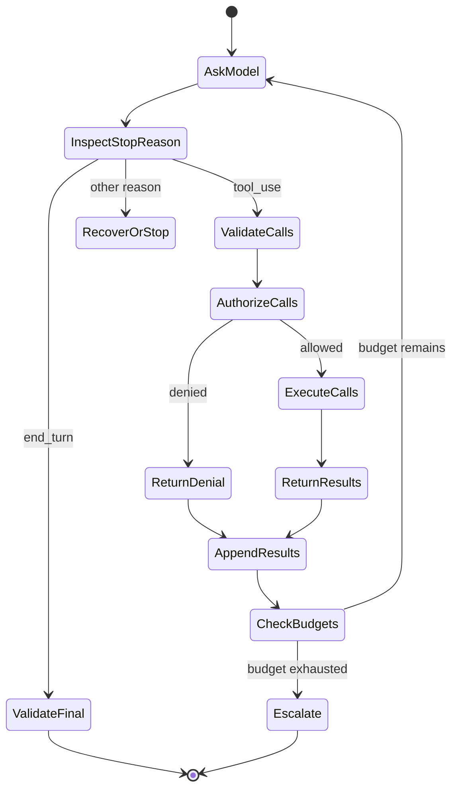

# A Tool Loop Is Controlled Delegation

> Claude may propose an action. Your application validates the request, grants the capability, observes the result, and decides whether the loop continues.

**Type:** Build
**Languages:** Python
**Prerequisites:** [The Messages API Is a State Machine](../../08-messages-api-and-application-lifecycle/), [Structured Output Is an Untrusted Contract](../../09-structured-output-and-defensive-parsing/)
**Time:** ~130 minutes

## Learning Objectives

- Implement the complete `tool_use` and `tool_result` protocol loop
- Design focused tool contracts and choose their execution boundary
- Separate model selection of a tool from deterministic authorization
- Compare a hand-written loop, SDK Tool Runner, and managed agents
- Return failures as typed results and consume actionable runtime events
- Bound autonomy and choose a fixed workflow when the path is known

## The Agent That Repeats a Payment

A billing assistant receives "Refund the duplicate charge." Claude requests `issue_refund`. The application executes it. The response connection drops before the final text arrives. The application retries the entire turn, Claude requests the tool again, and the customer receives two refunds.

The problem is not that the model used a tool. The application confused language generation with transaction control.

A reliable tool loop has two contracts:

1. The model can propose a named capability with structured arguments.
2. Deterministic application code decides whether, how, and at most how many times that capability executes.

Tool use gives Claude reach. It does not give Claude authority.

## The Wire Contract Before the Framework

Client tools are declared in the request. Each declaration gives the model a name, a description, and a JSON Schema input contract.

```json
{
  "name": "lookup_order",
  "description": "Look up one order by its exact public order ID. Returns status and last update. This tool never changes an order.",
  "input_schema": {
    "type": "object",
    "required": ["order_id"],
    "additionalProperties": false,
    "properties": {
      "order_id": {
        "type": "string",
        "description": "Order ID in the form A-12345"
      }
    }
  }
}
```

Claude may return:

```json
{
  "stop_reason": "tool_use",
  "content": [
    {
      "type": "tool_use",
      "id": "toolu_7f3",
      "name": "lookup_order",
      "input": {"order_id": "A-12345"}
    }
  ]
}
```

Your client preserves that entire assistant content, validates and runs the tool, then appends:

```json
{
  "role": "user",
  "content": [
    {
      "type": "tool_result",
      "tool_use_id": "toolu_7f3",
      "content": "{\"found\":true,\"status\":\"in_transit\"}"
    }
  ]
}
```

The matching ID is not decoration. It correlates a result with one request. The assistant message must remain immediately before the result sequence in the conversation history expected by the protocol.

See [Implement client tools](https://platform.claude.com/docs/en/agents-and-tools/tool-use/implement-tool-use) for the current SDK and API shapes.

## The Loop Has Explicit States



Every transition can fail. The response may omit a tool ID. The tool name may be unknown. Arguments may violate the schema. Authorization may deny the call. The handler may time out. A result may be too large. Claude may request another tool. The final answer may still fail its output contract.

Do not hide these states behind one broad `try/except` and a generic retry. Classify them and choose recovery by failure class.

## Tool Design Is Interface Design

Claude chooses tools from their interfaces. A human should be able to infer when to use each tool without reading its handler.

### Give Each Tool One Job

`manage_customer` is vague. It might search, edit, refund, suspend, or delete. A narrow catalog is easier to select and easier to secure:

- `get_customer_profile`
- `list_customer_invoices`
- `propose_refund`
- `issue_approved_refund`

The separation between proposal and execution matters. A low-risk tool can calculate a proposed amount. A high-risk tool requires an authenticated approval token generated outside the model.

### Write Selection Descriptions, Not Internal Documentation

A useful description says what the tool does, when to use it, when not to use it, and what the result means. It does not paste an entire API manual.

Bad:

```text
Calls GET /v3/orders/{id} in the Commerce service.
```

Better:

```text
Read the current status of one existing order from the commerce system.
Use only when the user supplies an exact order ID. This tool is read-only.
Do not use it to search by email or to modify shipment details.
```

Examples inside descriptions can clarify tricky formats, but every token repeats with the tool catalog. Measure whether an example improves selection enough to earn its context cost.

### Make Invalid Calls Hard to Express

Use enums, required fields, bounds, and `additionalProperties: false`. Split mutually exclusive modes. Avoid free-form shell commands, SQL, URLs, and filesystem paths when a narrow domain value will work.

The schema guides generation. The handler still validates it. Never assume model-produced input is safe because it was generated from a schema.

## Keep the Tool Catalog Small and Distinct

More tools do not always create more capability. Overlapping names and long catalogs create selection ambiguity and consume context.

Start with the fewest tools required by realistic tasks. Add a tool when an eval shows a capability gap. Remove or consolidate a tool when trajectories show confusion.

Use these questions:

- Do two tools appear interchangeable from their names and descriptions?
- Can a general code or CLI tool already perform this task under a sandbox?
- Does the agent need this capability on every turn?
- Can the capability live in a Skill and be loaded only when relevant?
- Should a separate subagent receive this tool instead of the main agent?
- Would a standardized MCP server let several hosts share it safely?

Tool count is not an architecture score. Correct selection and controlled execution are.

## Authorization Happens After Validation

A safe execution boundary follows this order:

1. Resolve the tool name against an allowlist.
2. Validate input types and bounds.
3. Bind authenticated identity and tenant context from the application, not arguments.
4. Check capability scope and resource ownership.
5. Require approval for consequential actions.
6. Apply idempotency, timeout, rate, and size limits.
7. Execute in the narrowest sandbox available.
8. Redact the result before returning it to Claude or logs.

If a tool argument contains `user_id`, do not trust it as identity. Compare it with the authenticated session or remove it from model control entirely.

For mutation, an approval record should bind the user, action, normalized arguments, expiry, and operation ID. "The user said yes earlier" inside conversation text is not a secure approval token.

## Return Failures as Results

A handler failure is not automatically an application crash. Claude may recover if it receives a concise, truthful tool result.

```json
{
  "type": "tool_result",
  "tool_use_id": "toolu_7f3",
  "is_error": true,
  "content": "Order service timed out. No order state was changed. Retry is allowed once."
}
```

Good error content tells the model:

- What failed.
- Whether any side effect occurred.
- Whether retry is safe.
- Which correction is possible.

Do not expose stack traces, environment values, database queries, access tokens, or internal hostnames. Preserve those in protected telemetry with redaction and access control.

Validation failures can include field paths. Policy denials should not invite the model to find a bypass. A denial such as "This agent cannot issue refunds" is safer than enumerating every security rule.

Unknown tools should become a correlated error result or a terminal protocol error according to your design. Never dynamically import and run a handler named by the model.

## Multiple and Parallel Tool Calls

Claude can request more than one tool in a response. Execute them in parallel only when they are independent, read-only, and safe to reorder.

Two searches can often run concurrently. "Create invoice" followed by "send invoice" has a dependency and must remain sequential. Two writes to the same record may conflict. A payment and an email may require a transaction or compensating workflow.

Return one `tool_result` for every requested `tool_use` ID. Preserve enough ordering to reconstruct the trajectory. If one parallel call fails, report each outcome rather than pretending the batch was uniformly successful.

Product note, verified 2026-08-08: helper APIs for automatic tool execution and parallel calls vary by SDK. They do not remove application authorization responsibilities. Check the current [Tool use overview](https://platform.claude.com/docs/en/agents-and-tools/tool-use/overview).

## Bound the Agent

An agent loop needs terminal conditions beyond `end_turn`:

- Maximum model turns.
- Maximum tool calls, globally and per tool.
- Wall-clock deadline.
- Token and monetary budget.
- Maximum consecutive errors.
- Maximum repeated identical call.
- User cancellation.
- Required human approval.
- Verified final-state predicate.

The final-state predicate is stronger than asking whether the response sounds complete. A deployment agent succeeds when the expected version is healthy, not when it says "deployed." A research agent succeeds when required claims have resolvable sources, not when it produces a long report.

Record the trajectory: prompt version, model, stop reason, tool name, normalized argument fingerprint, decision, latency, result class, and state change. Redact sensitive values.

## Workflow or Agent

Use a fixed workflow when the steps and branches are known. Use an agent when the path depends on observations and the model must choose among tools.

| Task | Better default | Reason |
|---|---|---|
| Extract fields, validate, store | Workflow | Known sequence and clear contract |
| Classify then route to one queue | Workflow | Finite branch set |
| Investigate an unfamiliar repository defect | Agent | Search path depends on findings |
| Refund after a verified duplicate charge | Workflow with approval | Consequential action and known controls |
| Gather evidence across changing internal systems | Bounded agent | Tool choice depends on missing evidence |

Autonomy is justified when the task is valuable, the environment is tool-accessible, mistakes are detectable, and recovery is possible. If errors cannot be detected, adding more agent turns only hides risk.

## Choose How Much Loop to Own

After the workflow gate, choose the smallest harness that meets the operational requirement.

| Runtime | What it handles | What your application still handles | Prefer it when |
|---|---|---|---|
| Hand-written Messages loop | Only the protocol work you implement | Full history, stop reasons, schema and policy, execution, retries, budgets, traces, and recovery | You need wire-level control, a constrained runtime, a custom state machine, or protocol education and testing |
| SDK Tool Runner | Tool declaration helpers, `tool_use` and `tool_result` sequencing, message-state updates, and optional per-turn streaming | Authorization, sandbox, idempotency, error disclosure, iteration limit, observability, and final-state proof | A supported SDK fits and client tools still run under your application's control |
| Claude Managed Agents | A remote agent/session/environment harness with configured sandbox, built-in tools, and event-driven execution | Agent configuration, data-boundary approval, custom-tool execution, confirmation decisions, event persistence, business authorization, and outcome verification | You need the managed session and sandbox boundary and accept its current beta, platform, and event contracts |

The code in this lesson is deliberately the first option. It exposes every transition. Moving it to the [Tool Runner](https://platform.claude.com/docs/en/agents-and-tools/tool-use/tool-runner) removes repetitive loop plumbing, but it does not make a refund safe. Set an iteration bound, intercept or wrap tool execution, preserve application approval, and validate the final state.

Product note, verified 2026-08-09: [Claude Managed Agents](https://platform.claude.com/docs/en/managed-agents/overview) is currently public beta and uses a versioned beta contract. It provides managed agents, environments, sessions, built-in tools, and server-sent event streaming. Treat the header, resources, event types, toolset, limits, and provider availability as volatile. Do not select it merely because the task is called an agent.

A managed-agent integration is an event consumer, not a final-text call. The application sends user events, consumes persisted session and agent events, and tracks status. A custom tool call or permission-gated tool can pause the session with `requires_action`; the application resolves the referenced event IDs with results or confirmation decisions. A closed SSE connection is not success. Reconcile persisted events and terminal status. Lesson 12 implements this boundary against an offline event fixture; the current source is [Session event stream](https://platform.claude.com/docs/en/managed-agents/events-and-streaming).

## First-Party Does Not Mean One Execution Boundary

Classify a capability by where code and data execute, who authorizes it, and how it is discovered.

| Surface | Execution and data boundary | Use it for | Do not assume |
|---|---|---|---|
| Messages server tool | Anthropic executes supported tools such as web search, web fetch, code execution, and tool search | A supported first-party capability whose provider-side execution and data policy fit | Your application receives a client `tool_use` to execute in the ordinary case |
| Anthropic-schema client tool | Anthropic defines a trained-in schema; your application executes tools such as bash, text editor, memory, or computer use | Common operations where the standard schema improves model familiarity but the client must own execution | First-party schema means provider-executed or automatically authorized |
| Managed-agent built-in | The configured managed or self-hosted agent environment executes its toolset | Repository and web work that fits that runtime's sandbox and permission policy | Enabling the toolset grants business authority or removes confirmation work |
| Custom client tool | Your application validates and executes your JSON Schema contract | Private business operations, narrow domain APIs, and exact application policy | Schema-valid input is identity, authorization, or idempotency evidence |
| Skill | A supported runtime loads reusable instructions, references, scripts, or assets | A procedure that should be disclosed only when relevant | A Skill is an execution or authorization boundary by itself |
| MCP | An MCP client or connector calls a standardized external server | Capabilities or context shared across compatible hosts with an explicit server, identity, and transport boundary | Server discovery makes every returned tool safe or relevant |

A Skill and a tool are often complementary, not alternatives. A refund-review Skill can teach the procedure while a custom client tool exposes the approved operation. MCP can carry that operation when several hosts need the same standard interface. Choose a provider-executed server tool only when its network, retention, and result semantics fit the data. Choose an Anthropic-schema client tool only when your sandbox and action validator are ready to execute it.

The current execution categories are documented in [How tool use works](https://platform.claude.com/docs/en/agents-and-tools/tool-use/how-tool-use-works), and the managed harness has a separate [tool configuration](https://platform.claude.com/docs/en/managed-agents/tools). Versions and model compatibility change, so persist the selected tool type and version in the trace.

## Build the Loop

`code/main.py` implements a tool registry and a raw loop. It supports multiple calls, schema checks, mutating-tool approval, handler errors, unknown tools, correlation IDs, and a turn budget. Its offline decision lab separately selects workflow, hand-written loop, SDK Tool Runner, or managed agents from explicit requirements. It also composes an execution surface with an optional Skill instead of pretending Skills are tools.

```bash
cd certifications/claude/lessons/10-tool-use-and-agentic-loops/code
python3 main.py
python3 -m unittest discover tests -v
```

Read the transcript printed by the demo. Find the assistant `tool_use` block and its following user `tool_result`. Then inspect the decision fixture printed after it. Change the managed-agent case so beta is not accepted and make the decision fail before any runtime is started. Protocol and architecture correctness should be visible, not assumed.

## Interactive Lab

Use the tool-loop figure to allocate turn, tool-call, time, and approval budgets. Trigger repeated calls or a denied mutation and observe which deterministic terminal condition stops the loop.

```figure
10-tool-loop-budget
```

## Practice Lab

Run the tool loop, then test an unknown tool, invalid arguments, a denied mutation, multiple calls, a handler error, and an exhausted turn budget. Confirm that every result preserves its tool-use ID. Next, classify a provider server tool, Anthropic-schema client tool, private custom tool, Skill-backed procedure, and MCP service by execution boundary and authorization owner.

## Shipped Artifact

`outputs/tool-loop-transcript.json` is a filled, correlated execution transcript from `demo()`. `outputs/runtime-and-tool-surface-decisions.json` is a dated, provider-free comparison across four runtimes and four capability compositions. Run `python3 main.py` to inspect both and execute the unit suite to verify artifacts, schema bounds, approval denial, runtime gates, execution boundaries, handler failure, and runaway prevention.

## Verify It

```bash
cd certifications/claude/lessons/10-tool-use-and-agentic-loops/code
python3 main.py
python3 -m unittest discover tests -v
```

## Capstone Connection

The quiz tests proposal versus authorization, tool descriptions, idempotency, parallelism, final-state checks, and workflow selection. Carry the verified transcript into Developer capstone 30 and Architect capstones 31 and 32 as tool-boundary evidence.

## Exam Decision Rules

- Tool selection by Claude is a proposal, never authorization.
- Validate schema before policy, and policy before execution.
- Use narrow names and descriptions that distinguish when tools apply.
- Return concise, correlated errors when recovery is safe.
- Require idempotency or reconciliation for retryable side effects.
- Parallelize only independent calls whose ordering does not matter.
- Stop on budgets, repeated calls, cancellation, or unrecognized control states.
- Prefer a deterministic workflow when the path is already known.
- Prefer SDK Tool Runner when client execution fits and custom wire control adds no value.
- Select managed agents only for a concrete managed-runtime requirement and an accepted beta and data boundary.
- Treat a managed session as an event state machine; resolve `requires_action` by event ID and never infer success from a disconnected stream.
- Distinguish server-executed tools, Anthropic-schema client tools, managed built-ins, and custom client tools by execution location.
- Treat Skills as procedure and MCP as a connection boundary; neither grants authorization.
- Evaluate tool trajectory and final state, not only the final prose.

## Exercises

1. Add `issue_refund` with a required approval token. Prove that conversation text cannot substitute for the token.
2. Add two read-only calls in one response and execute them concurrently. Preserve deterministic result correlation.
3. Make one tool time out after a side effect. Add an idempotency key and reconciliation check before retry.
4. Add a repeated-call detector that stops after the same normalized tool request appears twice.
5. Rework one private custom tool as an MCP capability shared by two hosts. Identify which authentication, consent, result filtering, and availability responsibilities move to the server boundary and which remain in each host.

## Further Reading

- [Tool use overview](https://platform.claude.com/docs/en/agents-and-tools/tool-use/overview)
- [Implement client tools](https://platform.claude.com/docs/en/agents-and-tools/tool-use/implement-tool-use)
- [Handle tool errors](https://platform.claude.com/docs/en/agents-and-tools/tool-use/implement-tool-use#handling-tool-use-and-tool-result-content-blocks)
- [Tool Runner](https://platform.claude.com/docs/en/agents-and-tools/tool-use/tool-runner)
- [How tool use works](https://platform.claude.com/docs/en/agents-and-tools/tool-use/how-tool-use-works)
- [Claude Managed Agents](https://platform.claude.com/docs/en/managed-agents/overview)
- [Session event stream](https://platform.claude.com/docs/en/managed-agents/events-and-streaming)
- [Managed-agent tools](https://platform.claude.com/docs/en/managed-agents/tools)
- [Building effective agents](https://www.anthropic.com/research/building-effective-agents)
- [Handling stop reasons](https://platform.claude.com/docs/en/build-with-claude/handling-stop-reasons)
