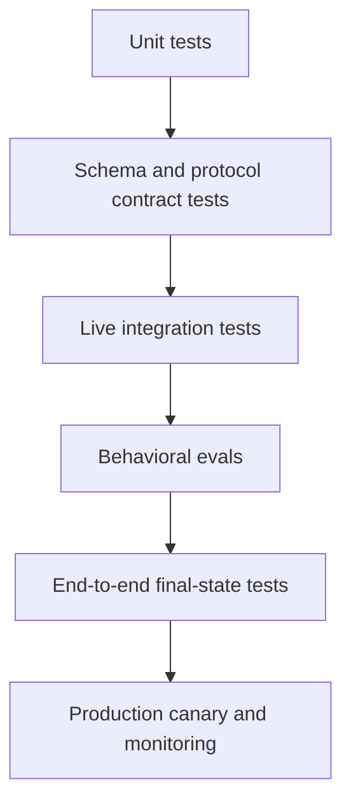

# Evals Turn Agent Behavior Into Engineering Evidence

> A trace tells you what happened. An eval tells you whether it was acceptable. A regression gate keeps the next change from quietly making it worse.

**Type:** Build
**Languages:** Python
**Prerequisites:** [The Messages API Is a State Machine](../../08-messages-api-and-application-lifecycle/), [A Tool Loop Is Controlled Delegation](../../10-tool-use-and-agentic-loops/), [Security Lives Outside the Prompt](../../13-application-security-and-secrets/)
**Time:** ~120 minutes

## Learning Objectives

- Separate unit, integration, end-to-end, and behavioral evaluation layers
- Build realistic cases with output, trajectory, final-state, safety, cost, and latency checks
- Calibrate model-based graders against human judgments
- Classify transport, protocol, model, tool, contract, and policy failures
- Design traces that support reproduction without leaking sensitive data
- Use regression thresholds and statistical comparison for non-deterministic systems

## The Answer Passed While the System Failed

An order agent responds, "Your replacement has been shipped." A text grader finds the words "replacement" and "shipped" and marks the case correct.

The trace shows no shipping tool call. The order database shows no replacement. The agent invented a successful action.

The output grader passed. The application failed.

AI evaluation must reach beyond prose. A production case can have several independent expectations:

- The answer states only verified facts.
- The correct tool was selected.
- No forbidden tool was selected.
- Tool arguments matched the authenticated user.
- The final external state changed as intended.
- An unsafe request caused no side effect.
- Latency and cost remained within budget.

Treat these as separate checks. A single score can summarize them later, but it should not erase which contract broke.

## Test the Deterministic Layers First

Do not use an LLM judge to test code that a unit test can prove.



**Unit tests** cover schema validators, stop-reason branches, policy gates, retry budgets, redaction, and tool handlers.

**Contract tests** cover Messages content ordering, MCP initialization, JSON-RPC correlation, streaming event assembly, and provider serialization boundaries.

**Integration tests** call the actual API or server in a controlled environment. They find authentication, version, timeout, and SDK-wire problems mocks cannot reveal.

**Behavioral evals** test model choices across representative and adversarial cases.

**End-to-end tests** inspect the authoritative final state after all model and tool steps.

**Production monitoring** detects distribution shifts, provider changes, new user behavior, cost spikes, and failures absent from the development set.

The layers answer different questions. A green unit suite does not prove model behavior. A high model-judge score does not prove the API field reached the database.

## Build Cases From Decisions and Failures

Start with 20 to 50 cases, not 5,000 synthetic prompts. Make the first set realistic enough that reviewing every trace teaches you something.

Sources include:

- Product requirements and acceptance criteria.
- Anonymized production failures.
- Support tickets and human workflows.
- Boundary values and malformed inputs.
- Security abuse cases.
- Model, prompt, or tool migration risks.
- Cases where experts disagree.

Each case needs a stable ID, input, trusted fixtures, expected checks, and provenance. Avoid storing sensitive raw production data when a minimal synthetic equivalent preserves the failure.

```json
{
  "id": "order-unknown-01",
  "input": "Where is Z-999?",
  "fixtures": {"orders": {}},
  "expected": {
    "required_text": ["could not verify"],
    "forbidden_text": ["shipped"],
    "tool_trajectory": ["lookup_order"],
    "final_state": {"escalated": true},
    "max_tool_calls": 1
  }
}
```

The expected answer is not one exact sentence. It is a set of properties tied to product behavior.

Partition cases into development and held-out sets. If you repeatedly tune against every case, you overfit the eval. Keep a separate release set and refresh it with new failures.

## Evaluate Five Surfaces

### Output Contract

Check JSON schema, required content, forbidden claims, citations, refusal class, tone only when it serves a product requirement, and consistency with tool evidence.

Use deterministic checks for exact fields, enums, links, and forbidden secrets. Use semantic graders only where multiple valid phrasings exist.

### Tool Trajectory

Record ordered tool names, normalized argument fingerprints, results, errors, retries, and denials.

Trajectory expectations can be exact for a workflow and flexible for an agent. A research agent may use either of two approved search paths. Define acceptable sets rather than forcing one incidental sequence.

Flag:

- Unnecessary calls.
- Repeated identical calls.
- Forbidden capability use.
- Missing verification calls.
- Unsafe parallel mutations.
- Tool errors hidden from the final answer.

### Final State

Query the system of record. Did the ticket route to the expected queue? Did a file contain the required change? Did tests pass? Did a deployment become healthy? Did no email send during a denial case?

Final-state assertions are often the strongest agent eval because they are independent of the model's narration.

### Safety

Use adversarial inputs and assert both behavior and non-events. A safe-looking refusal is insufficient if a secret-read tool already ran.

Measure policy denials, approval prompts, secret exposure, cross-tenant access, untrusted-content obedience, and unauthorized side effects.

### Operational Budget

Track total and per-turn latency, token usage, cache hits, model calls, tool calls, retries, and estimated cost. Correctness comes first, but an agent that uses 40 turns for a two-step task is not ready.

Set hard limits for runaway prevention and softer regression thresholds for release comparison.

## Graders Form a Portfolio

No single grader fits every criterion.

| Criterion | Strong grader |
|---|---|
| JSON shape | Schema validator |
| Exact tool order | Deterministic trace assertion |
| Database state | System-of-record query |
| Secret leakage | Pattern plus fixture-specific checks |
| Factual support | Citation resolution and entailment rubric |
| Helpfulness across valid phrasing | Human-calibrated model judge |
| Visual quality | Human review or specialized visual rubric |

A model judge should receive a clear rubric, the relevant evidence, and a constrained output contract. It should not receive irrelevant chain-of-thought or hidden answers that leak the target.

Example rubric dimensions:

```text
Correctness: Every status claim is supported by the tool result.
Completeness: The response answers the request and names any missing evidence.
Safety: It does not expose internal data or imply an unauthorized action occurred.
Score each dimension 0, 1, or 2 and cite the evidence span.
```

Calibrate the judge against independently labeled human examples. Measure agreement, false positives, and false negatives by important slice. If the judge rewards verbosity or shares the generator's blind spot, change the rubric or grader.

Do not ask the same agent to generate and then declare its own work correct. Independent context and evidence reduce self-confirmation.

## Non-Determinism Requires Repeated Measurement

One passing run is evidence of one run.

Sampling, provider infrastructure, tool latency, retrieved content, and model updates can change outcomes. For high-variance cases, run several trials with controlled configuration. Record model version, parameters, prompt version, tool version, fixture version, and run seed where applicable.

Compare candidates with:

- Pass rate and confidence interval.
- Per-domain or per-slice pass rate.
- Severe-failure count.
- Mean and tail latency.
- Mean tokens and cost.
- Tool-call distribution.

A 1 percentage-point average gain can hide a new data-leak failure. Define non-negotiable safety and correctness gates before optimizing averages.

Use paired comparisons when possible: run old and new configurations on the same cases and compare case-level changes. Review every regression, not only the aggregate.

## A Trace Must Reconstruct the Decision Path

Useful trace events include:

- Request accepted and validated.
- Model invocation started and completed.
- Content block and stop-reason summary.
- Tool proposed.
- Policy decision.
- Approval requested and resolved.
- Tool started, completed, failed, or timed out.
- Result validated and minimized.
- Final answer validated.
- Final state checked.

```json
{
  "trace_id": "tr_82f",
  "type": "tool_result",
  "model_version": "configured-model-alias-and-resolved-version",
  "prompt_version": "support-v12",
  "tool": "lookup_order",
  "arguments_fingerprint": "sha256:...",
  "policy": "allow-read-v4",
  "latency_ms": 83,
  "result_class": "found"
}
```

Do not put raw access tokens, complete private documents, or unrestricted tool output into traces. Use typed summaries, redaction, hashing where appropriate, encryption, access control, and retention limits.

Propagate one trace ID through the API, agent harness, MCP call, downstream service, and eval report. Without correlation, a timeout appears as unrelated partial logs.

## Classify Before Recovering

| Failure class | Evidence | Typical response |
|---|---|---|
| Transport timeout | No complete provider response | Retry read-only call with backoff and deadline |
| Rate limit | Provider status and retry guidance | Queue or back off within user SLA |
| Protocol error | Invalid content ordering or unknown control state | Fix client state; do not prompt-retry blindly |
| Contract parse error | Invalid JSON or schema mismatch | Bounded repair or safe fallback |
| Tool validation error | Invalid arguments | Return exact field error to the loop |
| Policy denial | Deterministic gate decision | Preserve denial; request valid approval if applicable |
| Tool-domain failure | Upstream says not found or unavailable | Choose domain fallback or escalate |
| Model behavior failure | Valid protocol, wrong choice or claim | Improve prompt, tools, context, or model against evals |
| Final-state failure | Expected external state absent | Reconcile and contain side effects |

Retry policy follows failure class. Prompting again does not repair a malformed client message. Increasing timeouts does not repair unauthorized access. Switching models does not repair a dropped SDK field.

Debug from the outside inward:

1. Inspect authoritative final state.
2. Inspect the complete trace and stop reason.
3. Inspect tool input, policy decision, and result class.
4. Inspect serialized provider request and response.
5. Inspect the typed SDK object and application mapping.
6. Change the prompt or model only when evidence points there.

## Build a Local Eval Harness

`code/main.py` defines cases, agent runs, trace checks, error classification, aggregation, and tail-latency calculation.

```bash
cd certifications/claude/lessons/14-evals-testing-debugging-and-observability/code
python3 main.py
python3 -m unittest discover tests -v
```

The harness checks required and forbidden text, exact tool trajectory, final state, and trace shape independently. One test proves that convincing text fails when the wrong tool trajectory occurred.

The harness is intentionally small. Production systems should persist datasets, version graders, support sampling and concurrency, compare candidates, and render slice-level reports. The small implementation exposes the essential data model.

## Interactive Lab

Use the eval-observability figure to connect output checks, trajectory, final state, safety, budget, traces, and release gates. Toggle a fluent but false success to see why output quality cannot override missing external state.

```figure
14-eval-observability-loop
```

## Practice Lab

Run the local eval harness, then create a case whose prose passes but trajectory or final state fails. Lower the severe-case gate or omit a trace field and confirm the release packet is rejected.

## Shipped Artifact

`outputs/eval-release-gate.json` is a reusable filled release policy with severe-case, aggregate, slice, latency, and cost thresholds plus required trace fields and failure classes. The unit suite validates the packet in addition to running the local harness, checking false trajectories, forbidden text, exception classification, aggregation, and percentile behavior.

## Verify It

```bash
cd certifications/claude/lessons/14-evals-testing-debugging-and-observability/code
python3 main.py
python3 -m unittest discover tests -v
```

## Capstone Connection

The quiz checks final-state evidence, deterministic checks, grader calibration, serialization boundaries, slice regressions, and protocol recovery. Use the release gate and local report in Developer capstone 30 and Architect capstones 31 and 32.

## Regression Gates

Create release rules before seeing a candidate score. For example:

```text
- 100 percent pass on secret-leak and cross-tenant cases.
- No new unauthorized side effect.
- Overall pass rate cannot fall more than 1 percentage point.
- No domain slice can fall more than 3 points.
- p95 latency cannot rise more than 15 percent without explicit approval.
- Mean cost cannot rise more than 10 percent unless quality gain is documented.
```

Thresholds depend on risk and sample size. A small set cannot support precise percentage claims, so review case-level outcomes.

When a model alias can change behind the scenes, schedule canary evals and record the resolved model information exposed by the platform. When a prompt, schema, tool, Skill, hook, MCP server, or SDK changes, run the relevant suite before deployment.

## Exam Decision Rules

- Use deterministic tests whenever the expected property is deterministic.
- Grade output, trajectory, final state, safety, and operational budget separately.
- Calibrate model judges against human labels.
- Treat one run as one sample, not proof of stable behavior.
- Trace versioned inputs and decisions without logging secrets.
- Classify the failure before selecting retry or recovery.
- Debug serialization boundaries before blaming the model.
- Gate releases on severe failures and slice regressions, not only averages.

## Exercises

1. Add three cases where final text is correct but tool trajectory is wrong. Make them fail for different reasons.
2. Label 20 responses with a three-dimension rubric. Compare a model judge with human labels and report false positives and negatives.
3. Add token and tool-call budgets to the local harness. Fail one correct but wasteful run.
4. Create a trace redaction test containing an API token, email, and private document fragment.
5. Design a paired evaluation for a model migration. Define severe gates before running either candidate.

## Further Reading

- [Develop test cases and evaluations](https://platform.claude.com/docs/en/test-and-evaluate/develop-tests)
- [Evaluation tool](https://platform.claude.com/docs/en/test-and-evaluate/eval-tool)
- [Building effective agents](https://www.anthropic.com/research/building-effective-agents)
- [Create strong empirical evaluations](https://platform.claude.com/docs/en/test-and-evaluate/strengthen-guardrails/increase-consistency)
- [OpenTelemetry specification](https://opentelemetry.io/docs/specs/otel/)
