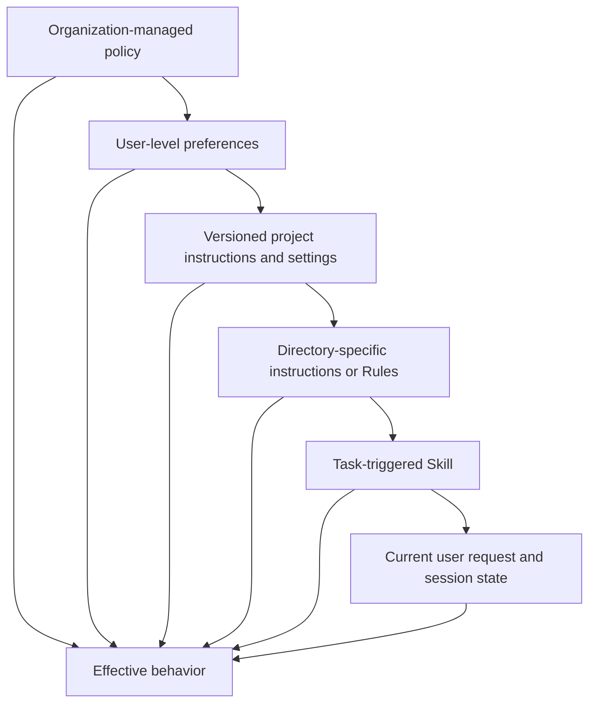
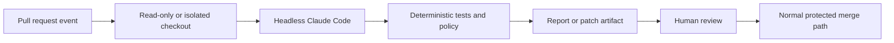

# Claude Code Scales Through Shared Constraints

> A team does not need one giant prompt. It needs a small project contract, reusable procedures, deterministic checks, and versioned configuration.

**Type:** Learn
**Languages:** Python
**Prerequisites:** [The Agent SDK Is a Harness, Not Permission](../../12-claude-agent-sdk-and-hooks/), [Evals Turn Agent Behavior Into Engineering Evidence](../../14-evals-testing-debugging-and-observability/)
**Time:** ~170 minutes

## Learning Objectives

- Design a compact `CLAUDE.md` that functions as project onboarding
- Place instructions, settings, Rules, Skills, agents, hooks, and MCP configuration at the correct scope
- Operate permission modes, context recovery, goals, loops, worktrees, and schedules without losing approval boundaries
- Version model, prompt, plugin, and team configuration changes
- Integrate Claude Code into CI as a bounded contributor rather than an unreviewed deployer
- Evaluate team workflows through artifacts, tests, traces, and recovery points

## The 900-Line Instruction File

A team adds every correction to `CLAUDE.md`. It contains architecture history, API documentation, style opinions, release steps, security rules, examples, troubleshooting, and task-specific playbooks.

Claude reads it every session. Important commands compete with obsolete prose. Developers stop reviewing changes because the file is too large. One old line says to use a retired test command, and the agent repeatedly reports success after running the wrong suite.

The team has not created memory. It has created context debt.

`CLAUDE.md` should act like a precise onboarding script: what this repository is, how to navigate it, how to build and test it, which constraints are non-obvious, and where deeper documentation lives.

## Put Information at Its Narrowest Durable Scope

Claude Code can load configuration and instructions from several scopes. The exact hierarchy and filenames are product details, but the design rule is stable: broad policy belongs at broad scope, project facts belong in the repository, and task procedure should load only when relevant.



Broad controls should not be easy for a project task to weaken. Narrow instructions should not be copied globally. Check current [Claude Code settings](https://code.claude.com/docs/en/settings) and [Memory](https://code.claude.com/docs/en/memory) documentation for the precise precedence, managed-policy locations, imports, and discovery behavior in the installed version.

When sources conflict, make precedence visible. Do not rely on two contradictory sentences and hope the model chooses the safer one.

## Write a Lean CLAUDE.md

Start with facts Claude repeatedly needs:

```markdown
# Repository guide

## Purpose
This repository is a Python service that routes support tickets.

## Commands
- Install: `python3 -m venv .venv && .venv/bin/pip install -r requirements.txt`
- Focused tests: `python3 -m unittest discover tests -v`
- Full validation: `./scripts/validate.sh`

## Layout
- `src/`: application code
- `tests/`: unit and integration tests
- `docs/architecture.md`: boundaries and decision records

## Constraints
- Never commit credentials or `.env` files.
- Preserve public API compatibility unless the task explicitly changes it.
- Require explicit approval before deployment or external messages.
```

Include:

- Purpose and stack.
- Canonical build, test, lint, and run commands.
- Important directory map.
- Repository-specific style or architecture rules.
- Safety and public-action boundaries.
- Links to authoritative deeper documents.

Exclude:

- Generic advice Claude already knows.
- Entire API references.
- Temporary task status.
- Secrets or environment values.
- Instructions used only by one specialized workflow.
- Rules that are not enforced or reviewed.

Begin small. When the same correction occurs across several sessions, decide whether it belongs in `CLAUDE.md`, a Rule, a Skill, a hook, a test, or actual code. The strongest fix for "always run the formatter" may be a post-edit hook and CI check, not another sentence.

## Rules, Skills, Commands, and Agents

These surfaces solve different problems.

### Rules

Use Rules or directory-scoped instructions for constraints that apply to a file family or area of the repository. A frontend rule should not consume context while editing database migrations.

Keep each rule coherent and testable. State the mechanism and source of truth. Avoid duplicating the same instruction across root and directory files because drift becomes inevitable.

### Skills

A Skill packages reusable procedure, references, scripts, and assets. Its short description helps Claude decide when to load the full material.

Use a Skill for work such as database migration review, release-note generation, security threat modeling, or a house documentation style. Keep the core session prompt small. Version the Skill with the repository or an approved distribution mechanism.

Progressive disclosure is the benefit. A Skill that is always loaded and contains the whole handbook is another system prompt.

### Commands

Commands provide an explicit user-invoked workflow. They work well when a developer should deliberately start an operation such as `/release-check` or `/review-migration`.

Treat command arguments as untrusted input. A command does not bypass tool authorization or approval.

### Agents

Custom agents or subagents define isolated roles, tool sets, and instructions. Use them for independent review, narrow expertise, or parallel work with separate ownership.

A read-only reviewer should not inherit edit and deployment tools. A generator and evaluator should not share hidden reasoning if independence matters.

Product note, verified 2026-08-09: exact filesystem locations, frontmatter fields, command behavior, and agent configuration evolve. Use current [Claude Code documentation](https://code.claude.com/docs/en/overview) and label repository examples with the version they target.

## Settings Are Code

Team settings control permissions, environment, hooks, model behavior, MCP servers, plugins, and other product capabilities. Review them like production code.

Separate scopes:

- Organization policy for non-negotiable restrictions.
- Project settings committed for shared safe defaults.
- Local settings for machine-specific paths or experiments that should not be committed.
- Environment variables for secret names and deployment-specific values.

Never commit tokens inside settings. Never assume a deny pattern is a sandbox. Test permission behavior with harmless fixtures.

When changing settings:

1. State the intended behavior.
2. Pin or record the relevant Claude Code version.
3. Add a focused acceptance test or manual verification script.
4. Run a denied action and an allowed action.
5. Review the effective merged configuration.
6. Provide rollback instructions.

A settings file that parses is not proof the installed version honors every key.

## Permission Modes Set a Baseline

Permission mode controls what happens when Claude proposes a tool call. It does
not change repository policy, grant a credential, or make an external action
reversible.

Product note, verified 2026-08-09: current Claude Code documents these exact
modes. Their availability and UI labels vary by product surface, plan, provider,
model, administrator policy, and installed version.

| Mode | Practical boundary | Appropriate use |
|---|---|---|
| `default` | Reads proceed; edits and commands may prompt | First use, sensitive repositories |
| `acceptEdits` | File edits and common filesystem operations proceed; other commands still prompt | Local code iteration with diff review |
| `plan` | Reads and exploration proceed; classifier-approved commands may run when auto mode is available, but source edits remain blocked | Approve scope and approach first |
| `auto` | A separate classifier evaluates actions; explicit ask controls can still prompt | Research-preview autonomy in a trusted direction |
| `dontAsk` | Anything that would prompt is denied; only pre-approved work proceeds | Locked-down CI and scripts |
| `bypassPermissions` | Built-in permission checks are bypassed; configured deny, ask, and user-interaction controls still apply | An isolated container or VM with no valuable credentials |

Use `--permission-mode <mode>` for a session or the `permissions.defaultMode`
setting where supported. Permission rules then narrow calls through `deny`,
`ask`, and `allow` patterns. Explicit deny and ask rules, organization connector
controls, and required user interaction are evaluated in every mode, including
`bypassPermissions`. A hard boundary belongs in a deny rule, sandbox, credential
scope, branch protection, or hook, not in a sentence that an auto-mode
transcript may later compact away.

`acceptEdits` means exactly that edits need less ceremony. It does not auto-accept
publishing, deployment, arbitrary shell commands, or messages. `auto` is a
research preview, not a proof of safety. `bypassPermissions` is not appropriate
on a normal laptop or merely because the session is in a Git worktree.

## Hooks Turn Advice Into Checks

Use hooks for deterministic lifecycle actions:

- Block secret-path reads before the tool executes.
- Block commits to protected branches.
- Require approval for external writes.
- Format changed files after edits.
- Run focused tests after a code change.
- Redact tool output.
- Record audit events.
- Prevent completion until required checks have evidence.

Keep hooks fast. A slow hook runs repeatedly and destroys interactive latency. Use timeouts and clear failure behavior. A security hook should fail closed when it cannot evaluate the request.

Claude Code passes hook input as JSON. A command hook has two different control
paths:

- Exit `0` and print one JSON object to stdout for structured control.
- Exit `2` and print a reason to stderr for the event-specific blocking action.

Do not combine them. Claude Code processes structured JSON only on exit `0`;
JSON printed with exit `2` is ignored. Exit `1` is a non-blocking error for most
events, so a policy hook must not rely on ordinary Unix failure semantics.

`PreToolUse` and `PermissionRequest` also use different output shapes. A
`PreToolUse` hook can allow, deny, ask, or defer with
`hookSpecificOutput.permissionDecision`:

```json
{
  "hookSpecificOutput": {
    "hookEventName": "PreToolUse",
    "permissionDecision": "deny",
    "permissionDecisionReason": "Publishing requires a human-controlled workflow"
  }
}
```

A `PermissionRequest` hook runs only when Claude Code is about to prompt, or
would have to deny because it cannot prompt. It uses a nested decision object:

```json
{
  "hookSpecificOutput": {
    "hookEventName": "PermissionRequest",
    "decision": {
      "behavior": "deny",
      "message": "External publishing requires interactive human approval",
      "interrupt": false
    }
  }
}
```

An allow decision cannot override a matching deny or ask rule. Exit `2` blocks a
`PreToolUse` call and denies a `PermissionRequest`, but event behavior differs:
for example, a `PostToolUse` hook runs after the action and cannot undo it. Read
the event table before treating any hook as enforcement.

Store shared hooks in reviewed project code when appropriate, but ensure the constrained agent cannot silently rewrite the policy and then run the prohibited action. Organization controls, repository permissions, and sandbox boundaries must protect the hook layer.

## MCP and Plugins Are Installed Capability

An MCP server or plugin can add tools, prompts, hooks, agents, Skills, commands, or language intelligence. Installation changes the attack surface and context surface.

Team review should cover:

- Publisher and source repository.
- Exact version and update policy.
- Components installed.
- Tool and filesystem permissions.
- Network destinations.
- Secrets and environment variables requested.
- Behavior in headless or CI environments.
- Uninstall and rollback steps.

Prefer a small approved catalog. Pin versions where supported. Test upgrades on a representative repository and eval set. Do not install a large plugin only to use one small procedure that could be a reviewed local Skill.

Plugins and MCP are not interchangeable. MCP standardizes external capability connections. A plugin packages Claude Code extensions. A Skill carries procedure and supporting material. Choose from the need, not the popularity of the mechanism.

## Sessions Need Recovery Discipline

Claude Code sessions help developers resume work, fork an investigation, and retain local context. Session history is not the system of record.

Before resuming consequential work:

- Inspect the current Git status and diff.
- Re-run the relevant tests.
- Reconcile external side effects.
- Confirm the branch and repository root.
- Review pending approvals.
- Check whether instructions, tools, or model configuration changed.

Clear or start a new session when accumulated context creates drift or when crossing a tenant or confidentiality boundary. Use compaction for continuity, not as proof that every constraint survived.

Commit small recovery points when repository policy allows. A session summary cannot replace source control.

Use the session commands for different jobs:

| Mechanism | Effect | Use when |
|---|---|---|
| `/context` | Shows what consumes the context window | Diagnose memory, skills, tools, and message bloat |
| `/compact [focus]` | Replaces prior conversation with a focused summary | Continue the same task with less history |
| Automatic compaction | Clears old tool output, then summarizes near the limit | Normal long-session continuity |
| `/clear` | Starts an empty conversation; the old one remains resumable | Switch to unrelated work or a new trust boundary |
| `/rewind` or double `Esc` | Restores code, conversation, or summarizes from a checkpoint | Recover a tracked edit or remove a bad conversational branch |

Compaction can lose ordinary transcript instructions. Project-root `CLAUDE.md`
and auto memory reload, while path-scoped rules reload when a matching file is
read again. Put durable constraints in versioned configuration and restate the
current acceptance boundary after compaction.

Rewind is a convenience layer, not source control. It tracks direct Claude Code
file edits, but not changes made by shell commands, external systems, or most
subagents. Foreground Skills that run with `context: fork` are an exception:
their direct edits are tracked. Inspect Git and external state before retrying
an operation.

## Autonomy Has Different Stop Conditions

Do not treat every repeated workflow as the same loop.

### Goal Sessions

`/goal <condition>` starts another turn whenever the prior turn ends until a
separate small-model evaluator decides that the condition is satisfied. The
evaluator reads conversation evidence; it does not independently run tests or
inspect files. State a measurable result, the command that proves it, and
constraints that must remain true. A time or turn clause is visible to the
evaluator, but it is not a hard runtime limit; enforce hard limits outside the
goal session.

```text
/goal tests/auth exits 0 and lint is clean, without changing fixtures, or stop after 15 turns
```

One goal can be active in a session. `/goal clear` stops it. A goal does not
change permissions, so default mode may still prompt. Pairing a goal with auto
mode reduces ordinary prompts, but explicit ask controls can still prompt. It
also increases the need for an isolated environment, deny rules, budgets, and
observable evidence.

### In-Session Loops and Scheduled Prompts

`/loop 5m check whether CI finished` schedules a prompt while the current CLI
session stays open. With no fixed interval, Claude may choose the next delay.
These tasks inherit the session's tools and permissions, run between turns, and
are not durable job infrastructure.

Use the right persistent scheduler:

- A cloud Routine for a saved prompt, selected repositories, connectors, and
  schedule, API, or GitHub trigger. Routines are a research preview and run
  autonomously without approval prompts, so remove every unused connector and
  keep branch authority narrow.
- A Desktop scheduled task when the machine and local uncommitted files are part
  of the intended boundary.
- GitHub Actions when the trigger and permissions should live in reviewed
  repository workflow configuration.

`/schedule` creates or manages cloud Routines where available. Product flags,
limits, account eligibility, and exact scheduling behavior are version-sensitive;
the durable design is a self-contained prompt, explicit success condition,
minimum identity, and an auditable result.

## Parallel Work Needs Isolated Files

Two agents editing one checkout can overwrite each other even when their prompts
name different tasks. Start independent Claude Code sessions in worktrees:

```bash
claude --worktree auth-hardening
claude --worktree docs-refresh
```

Current Claude Code creates `.claude/worktrees/<name>/` on a separate
`worktree-<name>` branch by default. Give each session an owner, file boundary,
acceptance test, and integration contract. A custom subagent can declare
`isolation: worktree` when it must edit in parallel.

Worktrees isolate working files and branches. They share repository Git metadata,
project plugins, and saved permission approvals, and they do not isolate network,
credentials, databases, or other side effects. Review those shared surfaces
before calling the run isolated. Integrate through normal Git review rather than
copying files between active checkouts.

## Managed Review and the GitHub Action Are Different

Product note, verified 2026-08-09: Anthropic's managed Code Review GitHub
integration is a research preview for Team and Enterprise plans. It runs a fleet
of specialized agents against pull requests and can place severity-tagged inline
findings. It can read `CLAUDE.md` and `REVIEW.md` for review guidance. Its
findings do not approve or block a pull request; branch protection and
deterministic checks still decide the merge gate.

The official `anthropics/claude-code-action@v1` runs Claude Code inside your own
GitHub Actions workflow. It can respond to an authorized `@claude` mention or run
a fixed prompt on repository events and cron schedules. The workflow controls
checkout depth, GitHub token permissions, secret source, tools, settings, model,
and turn limits.

```yaml
name: bounded-claude-review
on:
  pull_request:
    types: [opened, synchronize]
permissions:
  contents: read
  pull-requests: read
  id-token: write
jobs:
  review:
    runs-on: ubuntu-latest
    steps:
      - uses: actions/checkout@v6
      - uses: anthropics/claude-code-action@v1
        with:
          anthropic_api_key: ${{ secrets.ANTHROPIC_API_KEY }}
          prompt: "Review this pull request and emit evidence-backed findings only."
          claude_args: "--max-turns 6 --allowedTools Read,Grep,Glob"
```

Keep credentials in GitHub Secrets or workload identity, grant only required
workflow permissions, and review all changes before merge. Organizations that
need stronger supply-chain pinning can pin actions to reviewed commit SHAs while
tracking the documented major release.

## Headless Claude Code in CI

Headless execution can analyze code, generate structured output, or propose patches in automation. It also removes the interactive human who normally catches a dangerous request.

Design CI use as a bounded job:



Controls include:

- Minimal repository and token permissions.
- No access to unrelated secrets.
- Pinned dependencies and configuration.
- Network allowlist.
- Turn, time, and cost limits.
- Structured output schema.
- Artifact and trace retention.
- No direct protected-branch push.
- Human review before merge, deployment, messages, or issue comments.

Use short-lived automation credentials. Treat pull request text and repository files as untrusted. Do not expose a privileged token to a job that evaluates untrusted contributions.

Current headless flags, structured streaming modes, and permission options change. Verify the installed CLI's official [Headless mode](https://code.claude.com/docs/en/headless) documentation. Keep command examples version-labeled in your own repository.

## Team Workflow From Plan to Proof

A strong development loop looks like this:

1. Claude reads the lean project contract.
2. It inspects relevant code and writes a plan before broad edits.
3. A developer confirms scope when choices have external impact.
4. Claude makes a small coherent change.
5. Hooks format and run focused checks.
6. Claude inspects failures and fixes causes.
7. The built artifact runs end to end.
8. An independent review checks the diff and evidence.
9. Normal source-control protections govern merge and deployment.

For visual changes, serve the real build and inspect screenshots. For APIs, inspect the live wire and serialization. For CLIs, run the built artifact. Team instructions should state these evidence requirements when they are repository-specific.

## Version Everything That Changes Behavior

Record:

- Claude Code version.
- Model configuration or alias.
- Root and directory instructions.
- Settings and hooks.
- Skills, commands, agents, plugins, and MCP servers.
- Prompt and output-schema versions used by automation.

Run a representative workflow eval when any of them changes. Compare correctness, safety, turns, latency, and cost. A model upgrade can improve general reasoning while changing tool selection in one critical workflow.

Pinning forever is not the answer. Controlled upgrades are. Use a compatibility window, canary repositories, regression suite, and rollback path.

## A Team Configuration Review

Review the following hypothetical change:

```json
{
  "permissions": {
    "allow": ["Bash(*)", "Read(**)"]
  },
  "mcpServers": {
    "company": {
      "command": "npx",
      "args": ["latest-company-server"]
    }
  }
}
```

Problems include broad shell and filesystem access, an unpinned package, unclear server provenance, no network boundary, no secret plan, and no approval policy. A more capable configuration is not automatically a better team configuration.

The reviewer should request a capability inventory and narrow each permission to the actual workflow. Then test one allowed and one denied operation using the real installed version.

## Interactive Lab

```figure
15-team-agent-loop
```

Use the interactive loop to move one proposed team change through instruction,
execution, deterministic verification, review, and recovery. Change the scope
and enforcement controls and observe where a prompt-only rule stops being a
reliable team boundary.

## Practice Lab

Audit the hypothetical change above, narrow the shell and filesystem surface,
and define one allowed and one denied fixture plus a rollback condition.

## Shipped Artifact

The filled [`outputs/team-configuration-review.md`](../outputs/team-configuration-review.md)
turns the review into a reusable capability, permission, context, autonomy,
isolation, scheduling, enforcement, and recovery record.
[`outputs/permission-request-decision.json`](../outputs/permission-request-decision.json)
is a validated `PermissionRequest` hook decision that denies external publishing.

## Verify It

Edit a copy for your repository, then run the deterministic verifier:

```bash
cd certifications/claude/lessons/15-claude-code-for-development-teams
python3 code/main.py
python3 -m unittest discover -s code/tests -v
```

The verifier checks required ownership, allowed and denied fixtures, versioned
configuration, and rollback evidence. The six-question lesson quiz checks the
decision rules after you have produced evidence.

## Capstone Connection

Carry the completed review into the Developer capstone as the team-configuration
and CI control appendix.

## Exam Decision Rules

- Keep `CLAUDE.md` compact and project-specific.
- Put information at the narrowest durable scope.
- Use Skills for reusable task procedure and hooks for deterministic lifecycle checks.
- Treat settings, plugins, and MCP servers as reviewed code and capability.
- Use `acceptEdits` for edit speed, `dontAsk` for pre-approved automation, and bypass only in a disposable isolated runtime.
- Use `/context`, focused `/compact`, `/clear`, and `/rewind` for their distinct recovery jobs.
- Bound `/goal`, `/loop`, Routines, and scheduled jobs by evidence, authority, time, and cost.
- Give parallel writers separate worktrees and explicit ownership.
- Keep secrets in protected environment or secret-manager boundaries.
- Reconcile Git and external state before resuming a session.
- Give headless CI minimal tokens, tools, network, time, and authority.
- Require normal review and protected merge paths after agent automation.
- Version and evaluate configuration changes.

## Exercises

1. Run the same harmless edit under `default`, `acceptEdits`, `plan`, and `dontAsk`; record which boundary changes.
2. Compact a fixture session, then verify which project, path, and Skill instructions reload.
3. Write a bounded `/goal` condition and a separate `/loop` prompt for the same CI task. Explain their different stop conditions.
4. Start two disposable worktree sessions with non-overlapping owners, then integrate through a reviewed diff.
5. Implement both a `PreToolUse` JSON denial and a `PermissionRequest` denial. Prove exit `0` and exit `2` behavior separately.
6. Compare managed Code Review with a read-only `anthropics/claude-code-action@v1` workflow for the same pull request.

## Further Reading

- [Claude Code overview](https://code.claude.com/docs/en/overview)
- [Claude Code memory](https://code.claude.com/docs/en/memory)
- [Claude Code settings](https://code.claude.com/docs/en/settings)
- [Claude Code hooks guide](https://code.claude.com/docs/en/hooks-guide)
- [Claude Code permission modes](https://code.claude.com/docs/en/permission-modes)
- [Claude Code commands](https://code.claude.com/docs/en/commands)
- [Claude Code checkpointing](https://code.claude.com/docs/en/checkpointing)
- [Claude Code goals](https://code.claude.com/docs/en/goal)
- [Claude Code scheduled tasks](https://code.claude.com/docs/en/scheduled-tasks)
- [Claude Code Routines](https://code.claude.com/docs/en/routines)
- [Claude Code worktrees](https://code.claude.com/docs/en/worktrees)
- [Claude Code managed Code Review](https://code.claude.com/docs/en/code-review)
- [Claude Code GitHub Actions](https://code.claude.com/docs/en/github-actions)
- [Claude Code headless mode](https://code.claude.com/docs/en/headless)
- [Claude Code security](https://code.claude.com/docs/en/security)
- [Agent Skills](https://platform.claude.com/docs/en/agents-and-tools/agent-skills/overview)
