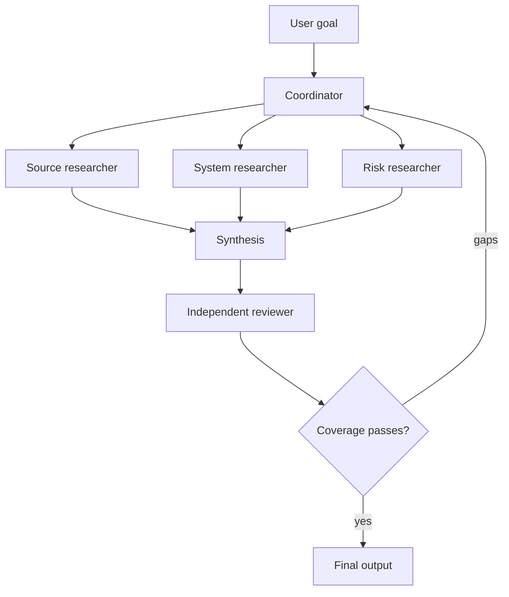

# Multi-Agent Orchestration and Delegation

> Delegate a bounded question, not your entire uncertainty.

**Type:** Reference
**Languages:** Python
**Prerequisites:** [A Tool Loop Is Controlled Delegation](../../10-tool-use-and-agentic-loops/); Phase 14, Lessons 12 and 28
**Time:** ~135 minutes

## Learning Objectives

- Choose single-agent, coordinator, pipeline, parallel, and reviewer patterns
- Write delegated tasks with scope, tools, outputs, and completion criteria
- Use context isolation to reduce bloat and protect independent judgment
- Distinguish deterministic prerequisites from adaptive model decisions
- Merge partial results without losing provenance, errors, or unresolved gaps

## The Problem

A research agent has one enormous prompt. It searches six sources, compares
claims, calculates confidence, writes a report, reviews citations, and decides
whether more research is needed. As the task grows, it forgets early constraints
and repeats searches. The team splits it into five agents with broad tools and
the instruction "collaborate until the report is excellent."

The new system costs more and is harder to debug. Two agents research the same
claim. One returns prose where the coordinator expects JSON. The reviewer sees
the generator's reasoning and repeats its assumptions. An agent silently fails,
but the final synthesis treats the missing result as negative evidence.

Multi-agent architecture did not solve decomposition. It made the missing
contracts more expensive.

## The Concept

### Decide Why Another Context Exists

Create a subagent only when it provides a concrete benefit:

- context isolation for a bounded concern
- parallel execution of independent work
- specialized tools or instructions
- independent review without generator context
- protection of the coordinator's context budget

If the subtask is one deterministic function, use a tool. If it is reusable
guidance loaded on demand, use a Skill. If it needs its own reasoning loop,
evidence, and stop condition, a subagent may fit.

### Start With Five Patterns



#### Single Agent

Best when one context can hold the required evidence and the tool trajectory is
short. It is the easiest system to evaluate.

#### Sequential Pipeline

Each stage has a fixed predecessor. Use it when order and prerequisites are
known, such as extract, validate, review, then render.

#### Parallel Fan-Out and Reduce

Independent tasks run at the same time, then a reducer combines structured
results. Use it for per-file review or independent source research. Do not
parallelize steps that depend on each other's discoveries.

#### Coordinator and Specialists

A coordinator selects and delegates work based on the current gap. Use it when
the decomposition cannot be fully known at the start.

#### Generator and Independent Reviewer

One context creates; another receives the artifact, evidence, and rubric without
the generator's persuasive internal narrative. Independence is the requirement,
not a second opinion from the same conversation.

### Write a Delegation Contract

A useful delegated task contains:

```text
Goal: one outcome the subagent owns
Scope: files, sources, claims, or systems included and excluded
Inputs: authoritative evidence and current state
Allowed tools: minimum necessary capabilities
Constraints: time, turns, cost, safety, and format
Output: machine-checkable schema with provenance and errors
Completion: observable conditions for done, partial, or blocked
Handoff: what the coordinator should do with each state
```

"Research the topic thoroughly" does not define done. "Return up to five
supported claims, each with source ID, date, quoted span reference, confidence
class, conflict list, and unresolved questions" does.

### Keep Deterministic Sequence Outside the Model

If review must happen after tests, code enforces that order. If every file must
receive a local review before cross-file consistency review, orchestration tracks
the manifest and blocks the second pass until the first is complete.

Do not rely on a coordinator prompt to remember hard prerequisites under context
pressure.

Claude decides semantic questions such as which missing claim requires more
research. Code decides invariants such as maximum concurrency, required outputs,
approval state, and stage order.

### Use the Task Boundary Deliberately

In Claude Code and agent harnesses, a task or subagent boundary can provide an
isolated context and restricted tool set. Exact configuration changes over time,
so verify current documentation. The durable design principles are:

- pass only the evidence the subagent needs
- restrict tools with explicit allowlists
- request structured metadata with the result
- run independent calls in parallel only when they do not depend on each other
- keep the coordinator responsible for global constraints and final state
- fork a session when exploring an alternative must not mutate the original

Isolation prevents context bloat. It does not guarantee factual independence if
all agents receive the same flawed evidence or rubric.

### Preserve Three Result States

Every subtask should return:

- complete: requested contract satisfied
- partial: valid work plus named gaps or failed sources
- blocked: no safe progress without new authority or state

Never convert partial into complete because some fields are present. The
coordinator must propagate missing evidence and structured errors to synthesis.

### Merge by Identity and Provenance

A reducer needs stable keys. For code review, use file and finding identifiers.
For research, use claim and source identifiers. For support, use ticket and
action identifiers.

Merge rules should specify:

- duplicate handling
- conflict preservation
- source precedence if any
- freshness comparison
- incomplete inputs
- confidence aggregation
- escalation when agents disagree

Do not let the synthesizer hide conflicts to produce smoother prose.

### Evaluate the Trajectory

Final output can look correct while orchestration wastes work or crosses a
boundary. Test:

- correct subagent selection
- allowed tool use
- no duplicated task ownership
- prerequisite order
- result schema and error propagation
- turn and cost budget
- reviewer independence
- final-state completeness

Use synthetic tool failures and partial results. The happy path is the least
interesting proof.

## Build It

## Interactive Lab

```figure
16-multi-agent-topology
```

Use the topology explorer before adding agents. Compare a single context,
sequential pipeline, parallel fan-out, coordinator, and independent reviewer;
the figure exposes coordination cost, prerequisites, and partial-result risk.

## Practice Lab

Design the bounded research pipeline below, then remove one unnecessary context
and justify whether the measurable outcome changes.

## Shipped Artifact

The filled [`outputs/orchestration-contract.md`](../outputs/orchestration-contract.md)
is a concrete research-pipeline handoff, not a blank worksheet.

## Verify It

Validate its task identities, dependency order, budgets, partial state, and
reviewer isolation locally:

```bash
cd certifications/claude/lessons/16-multi-agent-orchestration-and-delegation
python3 code/main.py
python3 -m unittest discover -s code/tests -v
```

Modify one dependency or remove the partial-state rule and confirm the verifier
blocks the packet. The lesson quiz tests topology decisions after the build.

## Capstone Connection

Reuse the verified contract as the orchestration section of the Architect
Foundations scenario capstone.

Design a multi-agent research pipeline for a technical decision.

### Step 1: Define the Final Contract

Specify the decision brief, claim schema, source requirements, and unresolved-gap
representation before defining agents.

### Step 2: Try a Single-Agent Baseline

Measure quality, cost, latency, repeated work, and context growth. Do not add
agents without a baseline failure.

### Step 3: Identify Context Boundaries

Split only concerns that benefit from isolation, parallelism, specialization, or
independent review. Record the expected improvement for each new context.

### Step 4: Write Task Contracts

Create a table:

| Task | Scope | Allowed tools | Output | Done | Partial | Budget |
|------|-------|---------------|--------|------|---------|--------|

### Step 5: Encode Prerequisites

Use a dependency graph or state machine. The reviewer cannot run until all
required research states are complete or explicitly partial.

### Step 6: Red-Team the Merge

Inject duplicate claims, conflicting dates, one failed agent, stale evidence,
and a result with the wrong schema. Verify that synthesis does not silently
erase the failure.

## Use It

For codebase review, a reliable shape is:

1. Build a manifest of files and cross-file concerns.
2. Run bounded per-file reviews in parallel with read-only tools.
3. Normalize findings to a shared schema.
4. Run one cross-file pass over the manifest and normalized findings.
5. Use an independent reviewer to reject weak evidence and duplicates.
6. Apply accepted changes only after deterministic tests and scope gates.

Do not ask every agent to inspect the whole repository. That duplicates context
and makes ownership ambiguous.

For customer support, assign roles by authority as well as expertise. A policy
researcher may read documents. A refund recommender may analyze a case. Only a
separate approved executor should receive write authority.

## Exam Decision Patterns

Choose structural enforcement for prerequisites and authority. Choose subagents
for isolated reasoning, not for deterministic utility calls.

Strong options often:

- use a coordinator with bounded specialists
- restrict tools per role
- return structured results and partial states
- parallelize independent tasks
- keep independent review in a fresh context
- preserve source and error provenance
- re-delegate only identified gaps

Weak options ask more agents to share the same broad prompt and tool set.

## Common Traps

### Agent Per Step

A fixed step does not need an autonomous context. Use code or a tool when the
operation is deterministic.

### Parallel by Default

Dependent tasks in parallel use stale assumptions and require expensive merge
repair.

### Coordinator as Data Warehouse

Raw subagent transcripts bloat global context. Return compact structured results
and retain detailed evidence outside the prompt.

### Reviewer With Generator Context

The reviewer inherits the same framing and becomes a style editor. Provide the
artifact, evidence, and rubric in a clean context.

## Exercises

1. Convert an overgrown single-agent prompt into tool, Skill, and subagent
   responsibilities. Justify each boundary.
2. Design partial-result behavior when one of three source researchers times out.
3. Add deterministic prerequisites to a per-file and cross-file review pipeline.
4. Compare sequential and adaptive decomposition on the same evaluation set.
5. Create a trajectory test that fails when two agents duplicate task ownership.

## Key Terms

| Term | What people say | What it actually means |
|------|-----------------|------------------------|
| Coordinator | The smartest agent | The context responsible for decomposition, global constraints, merge, and completion |
| Subagent | A function call | An isolated reasoning loop with a bounded task and tools |
| Fan-out | Use many agents | Run independent bounded tasks concurrently |
| Reduce | Summarize everything | Merge structured results with explicit conflict and partial-state rules |
| Handoff | Send prose | Transfer typed state, evidence, errors, and next responsibility |
| Independent reviewer | Ask again | Evaluate artifact and evidence in a context isolated from generator persuasion |

## Further Reading

- [Claude Agent SDK documentation](https://platform.claude.com/docs/en/agent-sdk/overview) for current subagent and session capabilities
- [Building effective agents](https://www.anthropic.com/research/building-effective-agents) for orchestration patterns
- Phase 14, Lesson 28 for a broader orchestration comparison
- Phase 14, Lesson 39 for independent reviewer design
