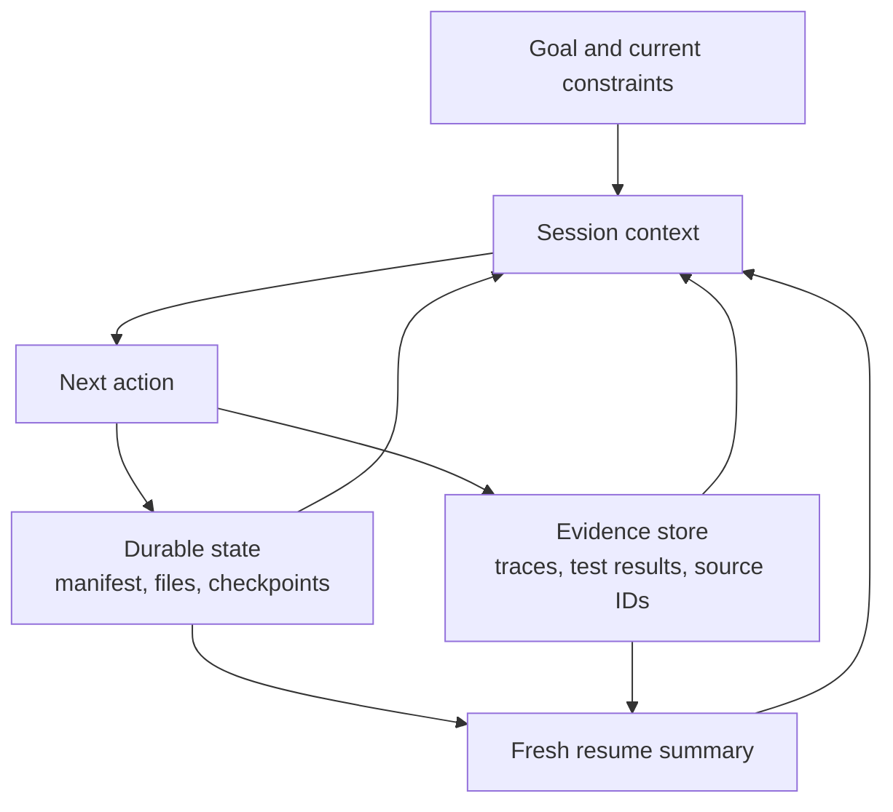

# Agent SDK Sessions, Subagents, and Context

> Resume state when continuity helps. Fork context when inherited assumptions become risk.

**Type:** Reference
**Languages:** Python
**Prerequisites:** [The Agent SDK Is a Harness, Not Permission](../../12-claude-agent-sdk-and-hooks/), [Multi-Agent Orchestration and Delegation](../../16-multi-agent-orchestration-and-delegation/); Phase 14, Lesson 17
**Time:** ~120 minutes

## Learning Objectives

- Separate durable task state from conversational context
- Choose new, resumed, forked, and compacted sessions from failure risk
- Use subagents to isolate context and tools
- Place hooks around deterministic lifecycle events
- Design recovery that does not replay stale assumptions or duplicate side effects

## The Problem

A repository migration agent runs for several hours. Its context contains the
original plan, tool outputs, failed experiments, partial patches, test logs, and
several summaries. After a dependency changes, the team resumes the same session
and says, "Continue from where you stopped."

The agent follows an obsolete plan. It repeats a write action that had already
succeeded before a timeout. Compaction preserved the broad story but dropped a
critical test failure. A reviewer subagent receives the entire parent history
and assumes the old dependency behavior is still true.

The system confused three things:

- durable external state
- current conversational context
- execution history

They are related, but they should not be treated as one store.

## The Concept

### Context Is a Working Set

The model context should contain the information needed for the next decisions.
It is not the authoritative database for completed work, approvals, files,
checkpoints, or tool side effects.



Store durable facts outside context:

- current task manifest and statuses
- completed artifacts and versions
- idempotency keys and external action IDs
- approvals and expiration
- last verified test and deployment results
- unresolved blockers
- source and trace references

When a session starts or resumes, reconstruct a compact current working set from
that state.

### Choose Among Four Session Moves

#### New Session

Use a clean session when the goal or trust boundary changes, inherited context is
unreliable, or the prior task is complete. Supply a structured brief from
authoritative state.

#### Resume Session

Resume when the task, constraints, and evidence remain valid and conversational
continuity provides value. Revalidate external state first. A session ID does
not prove the world is unchanged.

#### Fork Session

Fork when exploring an alternative should preserve the original branch. Useful
cases include competing architecture plans, independent debugging hypotheses,
or a risky migration option. The fork inherits a starting point but should not
mutate shared state without explicit coordination.

#### Compact Session

Compact when context grows but current work still benefits from continuity. A
good compact summary keeps decisions, constraints, artifact IDs, test state,
open gaps, and next action. Store large evidence externally and retain references.

Compaction saves context. It does not create durable execution, guarantee that
critical facts survive, or validate freshness.

### Use a Structured Resume Packet

```json
{
  "goal": "Migrate the request client without changing public behavior",
  "scope": ["src/client.py", "tests/test_client.py"],
  "completed": [
    {"task": "inventory", "artifact": "work/inventory.json", "verified": true}
  ],
  "current_state": {
    "branch": "migration/client-v2",
    "dependency_version": "verified-at-resume",
    "tests": "12 passed, 1 blocked"
  },
  "open_gaps": ["timeout retry semantics need decision"],
  "constraints": ["no public API change", "no production writes"],
  "next_action": "compare retry behavior against the contract tests"
}
```

The packet reports current truth. Do not summarize every conversation turn.

### Isolate Subagent Context by Responsibility

A subagent should receive:

- one goal and scope
- minimum relevant evidence
- restricted tools
- explicit output and error schema
- turn, time, and cost budget
- completion and escalation rules

It should not receive unrelated parent history. Isolation protects attention and
can preserve reviewer independence.

The coordinator retains global state and checks the returned contract before
merging it.

### Use Hooks for Deterministic Lifecycle Work

Hooks run at defined events around sessions or tools. Exact event names and
configuration vary, so consult current Agent SDK and Claude Code documentation.
The durable placement rule is:

- pre-action hooks validate or block
- post-action hooks normalize, record, or verify
- stop hooks check completion and cleanup
- session hooks load or persist controlled state

Examples:

- block writes outside declared scope
- require fresh approval before a destructive tool
- truncate or externalize oversized tool output
- normalize tool errors to a common schema
- run a formatter or targeted test after an edit
- write an immutable trace reference

Do not put semantic judgment that needs model reasoning into brittle shell logic.
Do not put hard authorization into a prompt.

### Make Side Effects Idempotent

Resume after timeout can repeat an action when the result was lost. Every
external write needs an idempotency or reconciliation strategy.

For example:

- create refund with a unique request key
- record expected file hash before patch
- check deployment version before retry
- persist tool call ID and result status
- reconcile unknown outcomes before another write

"Try again" is safe only after error classification.

### Revalidate at the Boundary

Before continuing:

1. Resolve current files, dependency versions, branch, and service state.
2. Compare against the checkpoint.
3. Mark stale assumptions.
4. Re-run the smallest verification that establishes a safe next step.
5. Create a fresh current-state summary.

If the environment diverged materially, start or fork with a new plan rather
than forcing the old session to reinterpret itself.

### Plan Context Budgets

Allocate context to:

- goal and hard constraints
- current plan and manifest
- recent evidence needed for the next choice
- compact relevant tool output
- final output contract

Large raw logs, entire repositories, and repeated tool schemas belong outside
the active working set or behind progressive discovery.

Use subagents for bounded searches and return summaries with references. Context
is a scarce reasoning surface even when the nominal window is large.

## Build It

## Interactive Lab

```figure
17-session-context-budget
```

Use the context-budget simulator to allocate the working set across goals,
constraints, evidence, tool results, and output contract. It makes visible why
compaction can reduce size without proving that state is current.

## Practice Lab

Invalidate one checkpoint in the migration exercise and repair the resume packet
without trusting conversation history.

## Shipped Artifact

The filled [`outputs/session-recovery-packet.md`](../outputs/session-recovery-packet.md)
captures one interrupted migration with hashes, an unknown side effect, and a
safe next action.

## Verify It

Verify that it includes durable state, revalidation, an idempotency key, and
isolated review:

```bash
cd certifications/claude/lessons/17-agent-sdk-sessions-subagents-and-context
python3 code/main.py
python3 -m unittest discover -s code/tests -v
```

The quiz checks session selection and recovery rules.

## Capstone Connection

Attach the verified packet to the Architect Foundations capstone as its resume
and context-management evidence.

Create a durable three-session migration exercise.

### Session 1: Inventory and Plan

Produce a manifest of files, tests, public contracts, dependencies, and risks.
Persist it outside the conversation. No implementation yet.

### Session 2: Implement and Verify

Start from the manifest and current repository state. Use restricted file tools.
Persist completed task IDs, file hashes, test output references, and unresolved
gaps.

Midway, simulate a timeout after a file write. Resume by reconciling the file
hash before any retry.

### Session 3: Independent Review

Fork a fresh review context. Supply the diff, requirements, tests, and rubric,
not the implementation transcript. The reviewer returns structured findings
with evidence.

### Hook Requirements

- pre-write scope gate
- post-write targeted verification
- tool-output size limit with external evidence reference
- structured trace record
- stop check requiring manifest completion or explicit partial state

## Use It

For a customer-support agent, store ticket state, retrieved evidence IDs,
approval, and tool outcome in a durable case record. Session context contains the
current question and relevant evidence. If a human returns hours later, rebuild
the working set from the case record and revalidate policy freshness.

For CI, each run should start clean from a commit and declared inputs. Reusing an
interactive session can introduce unstated state. Use persisted findings or a
structured summary as explicit input instead.

## Exam Decision Patterns

Choose resume for valid continuity, fork for isolated alternatives, and a fresh
session when stale context is the risk. Compaction addresses size, not truth.

Prefer answers that:

- persist durable state outside the prompt
- revalidate current environment on resume
- isolate subagent context and tools
- use hooks for deterministic gates and normalization
- reconcile unknown side effects before retry
- pass structured summaries with artifact references

Avoid answers that feed an entire old transcript into every new agent.

## Common Traps

### Session Equals State

Conversation history does not provide transactions, idempotency, versioning, or
authoritative external truth.

### Compaction Equals Recovery

A summary can omit the one failure that matters. Recovery uses durable state and
verification.

### Fork Equals Independence

A fork can inherit flawed evidence. Reviewer independence also requires a clean
rubric and controlled inputs.

### Hooks Everywhere

Too many opaque hooks make behavior hard to debug. Keep them small, observable,
versioned, and tied to a named invariant.

## Exercises

1. Design a resume packet for an agent that was interrupted during a deployment.
2. Add idempotency and reconciliation to a high-impact tool call.
3. Decide whether five scenarios need resume, fork, compact, or a new session.
4. Create a hook map that separates semantic model work from deterministic gates.
5. Test a reviewer with and without generator transcript context and compare
   repeated assumptions.

## Key Terms

| Term | What people say | What it actually means |
|------|-----------------|------------------------|
| Session | Durable memory | A conversational working context, not the authoritative system state |
| Resume | Continue blindly | Reuse valid context after reconciling current external state |
| Fork | Copy everything | Branch an existing context for isolated alternative work |
| Compaction | Save all details | Compress current context while external state retains authoritative evidence |
| Hook | A prompt | Deterministic code attached to a lifecycle event |
| Idempotency | Retry once | Repeating an operation produces no additional effect for the same request identity |

## Further Reading

- [Claude Agent SDK sessions documentation](https://platform.claude.com/docs/en/agent-sdk/sessions) for current session behavior
- [Claude Agent SDK hooks documentation](https://platform.claude.com/docs/en/agent-sdk/hooks) for current lifecycle events
- Phase 14, Lesson 40 for multi-session handoff
- Phase 15, Lesson 12 for durable execution
