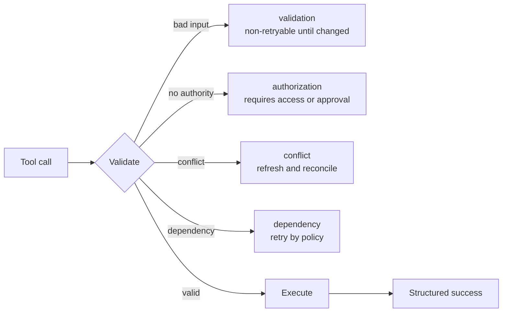

# Tool Contracts, Errors, and Progressive Discovery

> The model chooses from the interface you describe. Ambiguous tools create ambiguous behavior.

**Type:** Reference
**Languages:** Python
**Prerequisites:** [A Tool Loop Is Controlled Delegation](../../10-tool-use-and-agentic-loops/), [MCP Separates Capability From Host](../../11-mcp-server-design-and-integration/); Phase 13, Lesson 05
**Time:** ~120 minutes

## Learning Objectives

- Write tool names, descriptions, and schemas with non-overlapping boundaries
- Design structured tool and MCP errors that guide safe recovery
- Use tool choice and narrow tool distribution deliberately
- Scope MCP configuration and secrets for user and project use
- Apply progressive discovery to large tool catalogs without losing authorization

## The Problem

An agent sees three tools:

- `search`
- `find`
- `lookup`

Their descriptions all say "find information." One searches public web pages,
one queries internal customer records, and one retrieves approved policy. The
schemas accept a single string. Errors return arbitrary text.

The model chooses inconsistently. A public research task queries private data.
A policy question searches the web. When a tool returns "failed," the agent
retries until its budget expires.

The model is not confused by tool use. The interface erased the distinctions it
needed to choose safely.

## The Concept

### A Tool Description Is Part of the Decision Surface

A strong tool contract states:

- one action and object
- when to use it
- when not to use it
- authoritative data boundary
- required identity or approval
- argument meaning and constraints
- result and error shape
- side effects and reversibility

Compare:

```json
{
  "name": "search",
  "description": "Search for information",
  "input_schema": {
    "type": "object",
    "properties": {"q": {"type": "string"}}
  }
}
```

with:

```json
{
  "name": "search_active_support_policy",
  "description": "Search approved active support-policy text for the caller's region. Use for policy questions. Do not use for customer-account facts or public web research. Returns versioned policy passages with source IDs.",
  "input_schema": {
    "type": "object",
    "properties": {
      "query": {"type": "string", "minLength": 3},
      "region": {"type": "string", "enum": ["uk", "eu", "us"]},
      "top_k": {"type": "integer", "minimum": 1, "maximum": 8}
    },
    "required": ["query", "region", "top_k"],
    "additionalProperties": false
  }
}
```

The second interface supplies the selection boundary and a result promise. The
service must still validate identity and region at execution.

### Avoid Overlapping Tools

Two tools overlap when the model cannot infer which one owns a request. Repair
the interface by:

- combining identical actions behind one tool
- splitting by a visible object or authority boundary
- naming the source or side effect
- adding positive and negative use criteria
- providing input examples where current APIs support them
- testing selection on confusing pairs

Do not add prompt rules to compensate for an incoherent catalog.

### Make Schemas Carry Invariants

Use types, enums, required fields, bounds, patterns, and closed objects. A string
called `options` pushes validation into natural language. Typed fields make
invalid states harder to express.

Schema validity is not semantic validity. The service must still check that the
account exists, the amount fits policy, the user has authority, and referenced
resources belong to the tenant.

### Return Errors as Data



An error contract should include:

- category
- retryable flag
- safe message
- field errors where relevant
- partial result and provenance
- suggested safe next action
- trace or incident reference

Do not expose stack traces, secrets, raw credentials, or internal paths. Do not
mark every error retryable.

For MCP tools, use the protocol's structured error signal and a content body the
client can interpret. Transport success and tool success are distinct. Verify
the current specification for exact fields.

### Use Tool Choice Deliberately

Tool-choice controls can require a tool, allow automatic selection, select a
specific tool, or prevent tool use depending on the current API surface.

Use forced structured tool output when the application requires a typed result.
Allow automatic choice when deciding whether or which tool is the model's job.
Do not force a real-world action merely to obtain JSON. Separate extraction from
execution.

If parallel tool use is allowed, ensure calls are independent and the harness
can associate every result with the correct call identifier.

### Distribute Fewer Tools

The tool list consumes context and creates choices. Give each role the minimum
catalog it needs.

- Research agent: read-only web and source tools.
- Policy agent: active policy resources and search.
- Refund recommender: read case and calculate recommendation.
- Approved executor: one bounded write tool with fresh approval.

Do not give one agent all four catalogs for convenience.

### Discover Large Catalogs Progressively

Start with common tools plus a capability-search mechanism. Load specialized
definitions only after the task establishes need.

Progressive discovery can improve:

- context use
- tool selection
- prompt-cache stability
- security review surface

Discovery must apply identity and scope. It must not leak restricted capability
names or descriptions.

### Scope MCP Configuration

Project configuration is versioned for the team. User configuration applies
across projects on one account or machine. Keep shared server declarations and
safe defaults in project scope. Keep personal paths, local choices, and
user-specific credentials outside committed files.

Use environment-variable references for secrets. Never commit values. Review
server command, arguments, environment, transport, origin, and tool surface.

MCP servers can expose tools, resources, and prompts. Choose the primitive from
control direction:

- tool: model requests an action
- resource: host or model reads contextual data
- prompt: user or host invokes a reusable template

Do not wrap every static document in an action tool.

### Choose Claude Code Built-In Tools by Intent

Durable boundaries:

- Read for known file content
- Glob for path discovery
- Grep for text and symbol search
- Edit for bounded changes to existing files
- Write for creating or replacing a full file
- Bash for commands, tests, and operations without a safer specialized tool

Restrict Bash and write tools by task. Use the most specific interface that
expresses the intended operation and produces inspectable evidence.

## Build It

## Interactive Lab

```figure
18-tool-discovery-contract
```

Use the discovery-contract figure to compare overlapping tools, progressively
loaded tools, and execution authorization. Change error categories to see when
retry, changed input, approval, or escalation is the only safe continuation.

## Practice Lab

Introduce one overlapping description and one retryable authorization error,
observe both failures, and repair the interface and recovery contract.

## Shipped Artifact

The filled [`outputs/tool-catalog-review.md`](../outputs/tool-catalog-review.md)
contains distinct policy, account, and public-search boundaries plus a failure
matrix.

## Verify It

Run the deterministic contract review:

```bash
cd certifications/claude/lessons/18-tool-contracts-errors-and-progressive-discovery
python3 code/main.py
python3 -m unittest discover -s code/tests -v
```

The quiz tests the same selection rules.

## Capstone Connection

Carry the artifact into the Architect Foundations capstone as the tool and MCP
contract index.

Audit a tool catalog with this checklist.

| Question | Evidence |
|----------|----------|
| Does each name identify one action and object? | Selection test |
| Are positive and negative use cases distinct? | Confusion-pair eval |
| Does schema reject invalid shapes? | Validator tests |
| Does service enforce semantic and auth rules? | Integration tests |
| Are errors categorized and retry-aware? | Failure fixtures |
| Is every side effect named and bounded? | Threat model |
| Are tools minimal for each role? | Capability matrix |
| Can large catalogs load progressively? | Context and cache measurement |
| Are project and user configs separated? | Configuration review |
| Are secrets referenced, never stored? | Repository scan |

Create at least twelve selection cases, including queries that could plausibly
match two tools. The eval passes only when the model selects the correct tool or
correctly chooses no tool.

Inject validation, authorization, conflict, rate-limit, timeout, and partial
result failures. Assert the harness changes behavior according to category.

## Use It

For structured extraction, define one no-side-effect tool whose schema represents
the desired record. Force that tool when a structured record is required. Then
validate semantic constraints and provenance. Do not reuse a production write
tool as an output schema.

For a large enterprise catalog, use a registry to find capabilities by task and
scope. Load only the selected definitions. Monitor catalog size, discovery
precision, tool selection, cache hits, and unauthorized discovery attempts.

## Exam Decision Patterns

Tool problems are often interface problems. Repair descriptions, boundaries,
schemas, distribution, and error contracts before adding prompt complexity.

Prefer answers that:

- give tools distinct names and negative-use guidance
- return structured `isError`-style results with retry semantics
- use tool choice to enforce typed output where appropriate
- separate project configuration from user secrets
- use resources for contextual data and tools for actions
- apply progressive discovery to large catalogs

## Common Traps

### Tool Description as Authorization

"Admins only" is text. The service needs authenticated scope and policy.

### Error Text as Recovery Policy

The model guesses whether "failed" means retry, change input, escalate, or stop.
Return explicit category and retry state.

### One Tool for Every Operation

Huge schemas and conditional behavior become difficult to select, validate, and
authorize. Split along meaningful boundaries.

### Secrets in Shared Configuration

Project files are designed for collaboration. Reference environment names and
provision values outside version control.

## Exercises

1. Rewrite five ambiguous tool definitions with distinct boundaries.
2. Build a confusion-pair evaluation for internal, public, and policy search.
3. Design structured partial results for a multi-source search timeout.
4. Split a monolithic MCP server into tools, resources, and prompts.
5. Create project and user configuration examples with no secret values.

## Key Terms

| Term | What people say | What it actually means |
|------|-----------------|------------------------|
| Tool contract | Function name | Selection guidance, schema, result, error, authority, and side-effect boundary |
| Negative-use guidance | Extra prompt text | Explicit situations where another interface owns the request |
| Tool choice | Tool permission | Request-level control over whether or which tool Claude must call |
| Progressive discovery | Dynamic authorization | Loading relevant capabilities on demand after scoped discovery |
| MCP resource | A read tool | Contextual data identified and read through the resource primitive |
| Project scope | Global config | Versioned configuration intended for one repository or team |

## Further Reading

- [Claude tool use documentation](https://platform.claude.com/docs/en/agents-and-tools/tool-use/overview)
- [MCP specification](https://modelcontextprotocol.io/specification/latest)
- [Claude Code MCP documentation](https://docs.anthropic.com/en/docs/claude-code/mcp)
- Phase 13, Lesson 05 for tool schema design
- Phase 13, Lesson 15 for tool-poisoning threats
