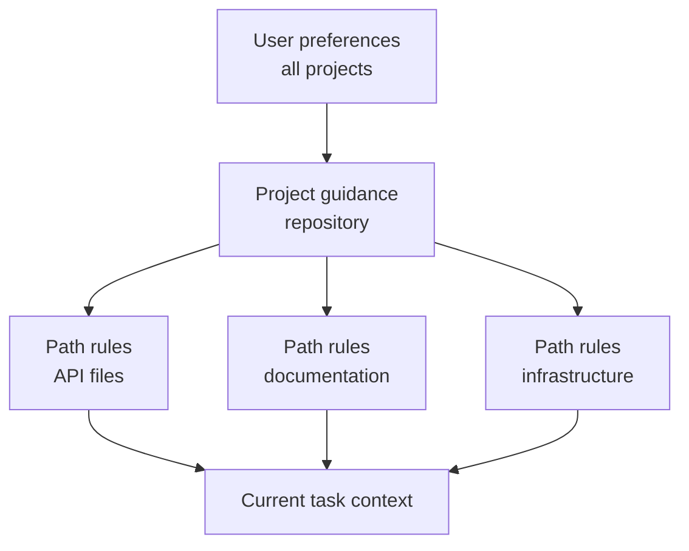

# Claude Code Memory, Rules, Skills, and CI

> Put stable guidance where its scope is true, and executable constraints where failure is unacceptable.

**Type:** Reference
**Languages:** Python
**Prerequisites:** [Claude Code Scales Through Shared Constraints](../../15-claude-code-for-development-teams/), [Agent SDK Sessions, Subagents, and Context](../../17-agent-sdk-sessions-subagents-and-context/)
**Time:** ~210 minutes

## Learning Objectives

- Design project and user instruction hierarchy without context bloat
- Choose CLAUDE.md, path rules, Skills, commands, agents, hooks, and settings by purpose
- Author and distribute a real multi-file `SKILL.md` package with narrow tool grants
- Use plan, direct execution, and bounded subagents with explicit obstacle reports
- Configure headless Claude Code for reproducible CI evidence
- Prevent stale memory, broad permissions, and hidden local configuration from controlling team work

## The Problem

A team keeps every instruction in one root `CLAUDE.md`: architecture history,
formatting, database rules, deployment steps, personal preferences, commands, and
examples for six languages. It is copied into every task.

Developers add private overrides. CI has a different configuration. One command
assumes write access. A broad hook reformats unrelated files. The instructions
say "always run every test," so a small docs edit triggers a 40-minute suite.
When the agent ignores a safety rule, the team adds more bold text.

The problem is not insufficient instruction. The problem is scope, precedence,
progressive disclosure, and confusing guidance with enforcement.

## The Concept

### Match the Mechanism to the Job

| Mechanism | Best use | Avoid |
|-----------|----------|-------|
| `CLAUDE.md` | Concise stable repository guidance and pointers | Full manuals, transient state, secrets |
| Imported files | Shared supporting instructions kept near their owners | Circular or invisible instruction graphs |
| Path rules | Guidance true only for matching files | Global rules copied into every task |
| Skill | Reusable process or domain playbook loaded when relevant | One-off facts or hard authorization |
| Command | Compatibility name for an explicit user-invoked workflow | New multi-step packages without Skill structure |
| Agent | Bounded role with isolated context and tools | Deterministic utility functions |
| Hook | Deterministic validation, blocking, normalization, or automation | Open-ended semantic judgment |
| Settings | Permission, model, plugin, and runtime configuration | Secret values committed to the repository |

Product note, verified 2026-08-09: custom commands have been merged into Skills.
Files under `.claude/commands/` remain compatible, while
`.claude/skills/<name>/SKILL.md` is the preferred package for new workflows.
Exact fields, precedence, and product availability can change. Verify the
current Claude Code documentation before implementation. The July 2026 CCAR-F
blueprint expects you to understand the hierarchy, rules, commands, Skills,
agents, memory, planning, and headless workflows.

### Keep the Root Instruction File Small

The root file should help a capable new contributor start correctly.

Include:

- project purpose and non-obvious architecture boundaries
- canonical build, test, and formatting commands
- source-of-truth files
- security and scope constraints
- links or imports to deeper guidance
- verification and contribution expectations

Exclude:

- temporary task status
- generated inventories
- long API references
- personal editor settings
- secret values
- instructions that apply only to one directory

Treat it as an onboarding router, not a knowledge dump.

### Place Instructions at the Narrowest True Scope



User scope holds personal defaults that should not define team behavior. Project
scope holds versioned shared decisions. Path-specific rules load only where
their file patterns apply. Task instructions contain the current request.

When two rules conflict, investigate the documented precedence and make the
project source of truth explicit. Do not depend on a hidden local override for a
critical workflow.

### Import Stable Supporting Guidance

Use imports to keep the root file concise while preserving modular ownership.
For example, database migration policy belongs near database documentation. A
root pointer keeps it discoverable.

Audit the import graph:

- every target exists
- no cycles
- no broad file import leaks secrets or irrelevant text
- ownership and update trigger are clear
- deleted or renamed guidance fails visibly

Memory inspection commands can help reveal which instructions are active. Use
them to debug configuration, not to store unrecoverable project state.

### Use Skills for Progressive Disclosure

A Skill packages a repeatable method, references, scripts, and artifacts. Its
description helps the agent decide when it applies. The full body loads only
when selected, protecting context for unrelated work.

Good Skills:

- database migration review
- incident triage
- release-note generation
- threat-model checklist
- architecture decision interview

The Skill should define inputs, sequence, evidence, output, and stop conditions.
It should not embed secrets or grant permissions.

An actual project Skill lives at `.claude/skills/<skill-name>/SKILL.md`. The
entry file has YAML frontmatter and Markdown instructions:

```yaml
---
name: migration-review
description: Review database migration files when a change adds or modifies paths under migrations/. Use it before merge to collect forward, rollback, locking, and data-safety evidence.
allowed-tools: Read Grep Glob Bash(python3 ${CLAUDE_SKILL_DIR}/scripts/check_scope.py *)
---
```

The description is a trigger contract. State what the Skill does and when it
applies using language a developer will actually use. Test requests that should
trigger and near-miss requests that should not. Use
`disable-model-invocation: true` when only an explicit `/skill-name` invocation
should load it.

`allowed-tools` pre-approves matching tools for the invocation turn. It does not
restrict the available tool set, override deny rules, or persist as a session
grant. Keep the pattern as narrow as the packaged procedure and review project
Skills before accepting folder trust.

Move detail out of `SKILL.md` and route to it deliberately:

| Skill file | Purpose | Load condition |
|---|---|---|
| `SKILL.md` | Trigger, core sequence, stop condition, output contract | When the Skill is invoked |
| `references/review-checklist.md` | Detailed domain evidence | When the core sequence reaches review |
| `scripts/check_scope.py` | Deterministic path validation | Before reading requested migration files |
| `examples/accepted.md` | One representative output shape | When format is ambiguous |

Reference every supporting file from `SKILL.md` so Claude knows why and when to
open it. Resolve bundled paths through `${CLAUDE_SKILL_DIR}` rather than assuming
the current working directory. The shipped package under
[`outputs/migration-review-skill/`](../outputs/migration-review-skill/) is a
runnable example.

### Use Commands for Explicit User Intent

Commands are useful when the user deliberately invokes a repeatable workflow.
Define argument hints, allowed tools, and execution context. If a command needs
isolation, use a forked context when supported and appropriate.

Examples:

- review one migration file
- generate an ADR from an interview
- run a targeted test plan
- inspect a failed CI trace

Avoid commands that silently write, deploy, or use broad Bash access. The name
and argument contract should make the consequence clear.

For new work, implement that explicit workflow as a user-invocable Skill.
Existing `.claude/commands/<name>.md` files still create `/<name>` and can migrate
without breaking users. Prefer the Skill directory when the procedure needs
scripts, references, templates, invocation controls, or distribution through a
plugin.

### Use Subagents as Bounded Evidence Gatherers

Run `/agents` to create and manage reusable subagent definitions. Store a
project agent under `.claude/agents/` so its role is reviewed with the codebase.
The `description` tells Claude when to delegate; `tools` restricts its tool pool;
`maxTurns` supplies a hard turn budget; `isolation: worktree` gives an editing
agent a separate checkout.

```markdown
---
name: migration-auditor
description: Audit migration safety when a change touches migrations/. Return evidence and blockers; do not edit.
tools: Read, Grep, Glob, Bash
maxTurns: 10
isolation: worktree
---

Inspect only the assigned migration and adjacent schema code.
Stop after ten turns or twenty minutes, whichever comes first.
Return JSON with status, evidence, blockers, and next_step.
Never replace missing evidence with an assumption.
```

A turn or time box is a stop condition, not evidence of completion. The parent
session validates the result and owns integration. Require structured obstacle
reporting so a subagent that cannot access a file returns `status: blocked`, the
exact obstacle, attempted evidence, and a narrow `next_step` instead of silently
widening tools or scope.

Use worktree isolation only when the subagent edits. A read-only researcher often
needs only a separate context. Worktrees isolate files and branches, not network,
credentials, shared Git metadata, or external systems.

### Distribute Through the Smallest Shared Surface

Choose distribution from the audience:

- Commit `.claude/skills/` and `.claude/agents/` for one repository.
- Put skills, agents, hooks, and MCP definitions in a plugin when several
  repositories need the same versioned bundle.
- Publish plugins through a reviewed marketplace and pin a release or commit.
- Use managed settings for organization policy and marketplace restrictions,
  not as a dumping ground for every team's procedure.

A project can announce a marketplace and enable reviewed plugins in
`.claude/settings.json`:

```json
{
  "extraKnownMarketplaces": {
    "company-tools": {
      "source": {"source": "github", "repo": "company/claude-plugins"},
      "autoUpdate": false
    }
  },
  "enabledPlugins": {
    "migration-review@company-tools": true
  }
}
```

Folder trust still matters, and managed `strictKnownMarketplaces` can restrict
which sources users may add before any network or filesystem operation. Review
publisher, version, components, scripts, hooks, MCP servers, permissions,
updates, and rollback. Project defaults are team configuration; managed settings
are non-overridable organization policy.

### Use Path Rules as Local Policy

Path globs can express rules such as:

- API changes require contract tests
- migration files are append-only
- docs use a specific style
- production configuration cannot contain literal secrets

Test glob behavior. A rule that never matches creates false confidence. A glob
that matches the whole repository recreates root-file bloat.

### Separate Planning, Exploration, and Execution

Use plan mode when scope or strategy needs approval before mutation. Use an
exploration subagent for read-only codebase questions that would otherwise bloat
the main task. Execute directly when the change is already bounded and the next
safe action is obvious.

An interview pattern is useful when requirements are missing. Ask questions
that materially change the implementation, record decisions, then build.

Examples and tests improve consistency when they demonstrate the actual
acceptance boundary. Do not add examples that only repeat instructions.

### Make Tests Part of the Conversation Contract

For a code task:

1. Identify the behavior and smallest relevant verification.
2. Establish or write a failing test where practical.
3. Make the bounded change.
4. Run focused tests.
5. Run broader gates proportional to risk.
6. Inspect the actual artifact or behavior.
7. Report exact evidence and remaining uncertainty.

Claude can propose and execute this loop, but deterministic CI decides whether
the gate passed.

### Hook Decisions Need Exact Contracts

Claude Code sends JSON to hooks. A command hook either exits `0` and prints one
structured JSON object to stdout, or exits `2` and writes a blocking reason to
stderr. Do not mix the two because JSON is parsed only on exit `0`. Exit `1` is
non-blocking for most events.

Event schemas are not interchangeable. `PreToolUse` uses
`hookSpecificOutput.permissionDecision` with `allow`, `deny`, `ask`, or `defer`.
`PermissionRequest` uses `hookSpecificOutput.decision.behavior` with `allow` or
`deny`. Configured deny and ask rules are still evaluated; an allow result does
not override a matching deny rule.

```json
{
  "hookSpecificOutput": {
    "hookEventName": "PermissionRequest",
    "decision": {
      "behavior": "deny",
      "message": "Production access requires interactive approval"
    }
  }
}
```

Confirm whether exit `2` can block the chosen event. It blocks `PreToolUse` and
denies `PermissionRequest`; it cannot undo an action observed by `PostToolUse`.

### Design Headless CI as a Fresh Reviewer

Headless Claude Code can run non-interactively with print mode and structured
output. Verify current flags and schemas before use. Durable principles:

- start from a clean commit and declared inputs
- use least-privilege tools and settings
- pin or record the model and configuration
- set time, turn, and cost bounds
- request JSON or schema-constrained output
- separate findings generation from change application
- run independent review where required
- include prior findings explicitly when checking remediation
- make deterministic tests and policy gates authoritative

CI should not inherit an interactive developer session. Reproducibility requires
fresh state.

Product note, verified 2026-08-09: Anthropic's managed Code Review product is a
research preview for Team and Enterprise plans. It and the official GitHub
Action are separate operational choices. Managed Code Review reports
pull-request findings but does not approve or block.
`anthropics/claude-code-action@v1` runs inside a repository workflow with
explicit event, GitHub permissions, secret source, settings, tools, model, and
turn bounds. Neither replaces deterministic gates or the protected merge path.

### Preserve Findings Across Runs

If one run finds issues and another verifies fixes, store findings as structured
artifacts with stable IDs, files, evidence, severity, and status. Passing only a
natural-language summary can lose the exact claim being verified.

The remediation review receives the original finding, current diff, relevant
tests, and acceptance rule. It does not need the entire original conversation.

## Build It

## Interactive Lab

```figure
19-memory-rule-precedence
```

Use the precedence explorer to route stable project facts, path-specific
guidance, reusable Skills, commands, and deterministic hooks to their narrowest
true scope. Conflicting layers show why hidden local policy cannot govern CI.

## Practice Lab

Break one documented path glob, inspect which fixture paths load the rule, and
repair scope without moving narrow guidance back to the root file. Then run the
shipped Skill checker with one migration path and one traversal attempt:

```bash
python3 outputs/migration-review-skill/scripts/check_scope.py migrations/2026_add_index.sql
python3 outputs/migration-review-skill/scripts/check_scope.py ../secrets.sql
```

## Shipped Artifact

The filled [`outputs/configuration-scope-audit.md`](../outputs/configuration-scope-audit.md)
records tested glob fixtures, one allow and deny boundary, a bounded subagent,
plugin distribution, exact hook output, and the fresh CI contract. The
[`outputs/migration-review-skill/`](../outputs/migration-review-skill/) directory
ships an actual `SKILL.md`, deterministic script, and on-demand reference.

## Verify It

Verify it without Claude, network access, or credentials:

```bash
cd certifications/claude/lessons/19-claude-code-memory-rules-skills-and-ci
python3 code/main.py
python3 -m unittest discover -s code/tests -v
```

The quiz checks mechanism selection and CI remediation.

## Capstone Connection

Reuse the result in the Architect Foundations capstone's Claude Code
configuration section.

Design a team configuration for a repository with Python API code, database
migrations, and documentation.

### Root Guidance

Keep it under one readable page. Include project map, canonical commands,
security constraints, and links to path rules.

### Path Rules

Create separate rules for:

- `src/api/**`: contract and authorization tests
- `migrations/**`: append-only and rollback requirements
- `docs/**`: style and link checks

### Skills and Commands

Install the shipped migration-review package as
`.claude/skills/migration-review/`, test one trigger and near miss, and preserve
its narrow `allowed-tools` grant. Migrate the explicit `/adr` command to a Skill
when it needs templates or scripts.

Define one read-only migration-auditor through `/agents`. Give it `maxTurns`, a
structured `status` / `evidence` / `blockers` / `next_step` result, and a rule to
stop rather than assume when evidence is missing.

### Hooks

- pre-write: block files outside declared scope
- post-edit: run the formatter only on edited files
- pre-Bash: deny destructive or secret-printing commands
- stop: require exact verification evidence

### CI Review

Run a fresh read-only review that emits JSON findings. A separate job applies
deterministic tests and policy checks. Store both artifacts.

Then test configuration debugging: introduce a path glob that fails to match and
prove your audit catches it.

## Use It

Configuration should be reviewed like code. Changes can alter permissions,
context, tools, and automated behavior.

Require review for:

- new MCP servers or plugins
- broader tool permissions
- hooks with write or command effects
- model or provider changes
- new imports and path patterns
- Skills that reach external systems
- agents with broader tools, higher turn bounds, or worktree isolation
- plugin marketplaces, enabled plugins, and automatic update policy
- CI workflows that can apply changes

Record current behavior with small fixture tasks. A configuration test might
assert that migration guidance loads only for migration paths, a dangerous
command is blocked, and a review command returns the expected schema.

## Exam Decision Patterns

When instructions are too large or apply only to some files, move them to scoped
rules or Skills. When a condition must never be violated, use deterministic
settings, permissions, hooks, or CI rather than stronger prompt wording.

Prefer answers that:

- keep `CLAUDE.md` concise and versioned
- use imports and path-specific rules for narrow guidance
- package reusable workflows as Skills or explicit commands
- author Skill trigger descriptions, supporting files, and narrow invocation grants
- bound subagents by tool set, turns, ownership, and structured obstacle reports
- distribute one-project configuration directly and cross-project bundles as reviewed plugins
- fork context for isolated command work where needed
- use plan or exploration before broad edits
- run headless CI from clean state with structured output
- verify remediation against prior finding IDs

## Common Traps

### Root File as Encyclopedia

Everything loads everywhere. Important constraints compete with irrelevant
detail and decay without ownership.

### Private Configuration as Team Policy

Local behavior cannot be reviewed or reproduced in CI. Put shared decisions in
project scope.

### Hook as Hidden Build System

Opaque automation makes commands surprising and failures hard to localize. Keep
hooks small and observable.

### AI Review as the Only Gate

Model findings support judgment. Deterministic tests, schemas, security policy,
and approvals enforce invariants.

## Exercises

1. Reduce an overgrown root instruction file to a one-page router.
2. Design path rules and write fixture paths that prove each glob matches.
3. Turn a 200-line workflow prompt into a multi-file Skill with a trigger test, reference file, and deterministic script.
4. Create a read-only subagent through `/agents`; cap turns and test its blocked obstacle report.
5. Validate a `PreToolUse` denial and a `PermissionRequest` denial using their distinct JSON shapes.
6. Package the Skill and agent as a plugin, pin it in a test marketplace, and document rollback.
7. Create a read-only headless review schema with stable finding IDs.

## Key Terms

| Term | What people say | What it actually means |
|------|-----------------|------------------------|
| CLAUDE.md | Permanent model memory | Versioned project guidance loaded according to documented scope |
| Path rule | Extra prompt | Guidance activated only for matching file paths |
| Skill | A command alias | A reusable process with instructions, references, tools, and outputs loaded on demand |
| Command | Automation magic | An explicit user-invoked workflow with arguments, tools, and context behavior |
| `allowed-tools` | A sandbox | A temporary pre-approval for matching tools during the Skill invocation turn |
| Subagent | Unlimited parallel worker | A separate context with a declared role, tools, turn budget, and result contract |
| Plugin | A prompt file | A versioned bundle of Skills, agents, hooks, MCP servers, and related configuration |
| Hook | Model instruction | Deterministic code around a lifecycle event |
| Headless mode | Interactive chat without UI | Non-interactive execution from declared inputs with machine-readable output |

## Further Reading

- [Claude Code memory documentation](https://code.claude.com/docs/en/memory)
- [Claude Code Skills](https://code.claude.com/docs/en/skills)
- [Claude Code subagents](https://code.claude.com/docs/en/sub-agents)
- [Claude Code worktrees](https://code.claude.com/docs/en/worktrees)
- [Claude Code settings](https://code.claude.com/docs/en/settings)
- [Claude Code plugin marketplaces](https://code.claude.com/docs/en/plugin-marketplaces)
- [Claude Code hooks](https://code.claude.com/docs/en/hooks)
- [Claude Code managed Code Review](https://code.claude.com/docs/en/code-review)
- [Claude Code GitHub Actions](https://code.claude.com/docs/en/github-actions)
- [Claude Code headless mode](https://code.claude.com/docs/en/headless)
- Phase 14, Lessons 33 through 38 for executable instructions, state, scope, and verification
