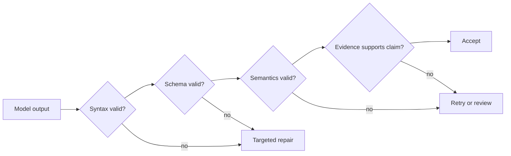

# Reliable Extraction, Batch, and Independent Reviewers

> Valid JSON proves the shape survived. It does not prove the facts did.

**Type:** Reference
**Languages:** Python
**Prerequisites:** [Validate the Claim, Not the Confidence](../../05-output-evaluation-and-validation/), [Structured Output Is an Untrusted Contract](../../09-structured-output-and-defensive-parsing/); Phase 14, Lesson 39
**Time:** ~135 minutes

## Learning Objectives

- Define extraction criteria that reduce false positives and ambiguous labels
- Use schemas, examples, nullable fields, enums, and evidence spans deliberately
- Separate syntax, schema, semantic, and provenance validation
- Design bounded retry and independent reviewer passes
- Choose real-time or batch processing from workflow requirements

## The Problem

A pipeline extracts contract obligations into valid JSON. Every record matches
the schema. Legal reviewers still reject 18 percent.

The model fills missing dates with plausible values, labels background statements
as obligations, and maps unfamiliar categories to the nearest enum. A retry loop
feeds the same prompt back until validation passes. Since validation checks only
types, the invented values become more confidently formatted.

The team solved serialization and mistook it for correctness.

## The Concept

### Define the Judgment Before the Schema

A schema says what fields exist. Criteria say what qualifies.

For an obligation extractor, define:

- obligated party must be explicit or unambiguously linked
- required action must be stated, not merely discussed
- trigger and deadline are extracted only when supported
- evidence span must contain the claim
- unknown values remain `null`
- unsupported category uses `other` with a note or triggers review
- exceptions and negations change the result

Without these rules, annotators, model, and evaluator apply different tasks.

### Use Few-Shot Examples for Boundaries

Examples are most useful where reasonable people make different judgments.

Include:

- a clear positive
- a near miss
- a negated obligation
- missing date represented as `null`
- a category outside the enum
- two obligations in one paragraph
- conflicting clauses

Each example should demonstrate the reason, not only the answer. Do not flood
context with redundant easy cases.

### Make Absence Representable

If a field may be unknown, the schema needs an explicit state. Forcing a string
encourages invention.

```json
{
  "type": "object",
  "properties": {
    "party": {"type": ["string", "null"]},
    "action": {"type": "string"},
    "deadline": {"type": ["string", "null"]},
    "category": {
      "type": "string",
      "enum": ["payment", "delivery", "reporting", "other"]
    },
    "evidence_span": {"type": "string"},
    "needs_review": {"type": "boolean"}
  },
  "required": ["party", "action", "deadline", "category", "evidence_span", "needs_review"],
  "additionalProperties": false
}
```

Required plus nullable forces an explicit decision: supported value or known
absence. It prevents silent field omission.

### Use Tool Use for Typed Output

A no-side-effect extraction tool can carry the schema. Tool choice can require
that typed record when the application needs it. Strict schema features can
guarantee valid structure where current APIs support them.

Do not call a real action tool just to obtain structured output. Extraction and
execution have different authority.

### Validate in Four Layers



#### Syntax

Can the payload be parsed?

#### Schema

Are fields, types, enums, and bounds valid?

#### Semantics

Do cross-field relationships hold? A deadline cannot precede an effective date
when the domain forbids it. A `needs_review` false result cannot accompany an
unsupported category.

#### Provenance

Does the evidence span actually support the extracted claim, and does it come
from the correct source version?

Only the last two detect many confident hallucinations.

### Feed Back the Smallest Useful Error

On repair, return structured validation feedback:

```json
{
  "category": "semantic_validation",
  "field": "deadline",
  "message": "The extracted date does not appear in the evidence span.",
  "allowed_action": "Set deadline to null or select a supported span."
}
```

Do not say only "try again." Keep the original source and prior result. Limit
retries. Repeated semantic failure should escalate instead of converting
uncertainty into latency and cost.

### Separate Generator and Reviewer

The generator extracts. The reviewer receives source, candidate record, and a
rubric. It checks:

- required evidence exists
- span supports every non-null claim
- negation and exceptions were handled
- category fits the definition
- unknowns were not invented
- conflicts and ambiguity are flagged

Use a fresh context for stronger independence. The reviewer returns finding IDs,
fields, evidence, and disposition. It does not silently rewrite the record.

Measure reviewer precision and recall against human labels. A model judge is an
instrument, not ground truth.

### Choose Batch for the Workflow

The July 2026 CCAR-F public guide specifies a 50 percent Message Batches cost
reduction, an up-to-24-hour processing window with no guaranteed latency SLA,
and no multi-turn tool calling inside one batch request. Those are dated exam
reference facts, not a promise that pricing or service limits will remain
unchanged. Confirm current pricing, limits, retention, and feature compatibility
in the [Message Batches documentation](https://platform.claude.com/docs/en/build-with-claude/batch-processing)
before deployment.

Batch fits:

- large offline extraction
- evaluation datasets
- nightly classification
- backfills and reprocessing
- independent review after generation

Real-time fits:

- interactive user response
- tasks with a strict short latency bound
- adaptive tool use during the same request
- workflows requiring immediate approval or feedback

Do not use batch when the next step depends on an external action the model must
observe mid-request. Precompute inputs or split the workflow into jobs.

### Make Batch Jobs Reconciliable

Give every item a stable `custom_id`. Persist source version, schema version,
prompt version, and expected output location. Results may return out of order.

Handle:

- success
- validation failure
- provider failure
- expiration
- duplicate submission
- partial job completion
- retry after source change

Never join results to inputs by array position.

### Evaluate the Error You Care About

For extraction:

- field precision and recall
- exact or normalized match where appropriate
- evidence-support rate
- false-positive rate for high-risk fields
- null calibration
- category confusion matrix
- reviewer disagreement
- cost and latency per accepted record

Averages can hide a dangerous false-positive class. Stratify by document type,
language, length, and risk.

## Build It

## Interactive Lab

```figure
20-batch-review-confidence
```

Use the confidence and review simulator to move records through syntax, schema,
semantic, and provenance gates. Adjust false-positive cost and reviewer
coverage to see why valid JSON and model confidence are insufficient release
criteria.

## Practice Lab

Change one supported date to an invented value, run the four validation layers,
and route the failed record to adjudication rather than another blind retry.

## Shipped Artifact

The filled [`outputs/extraction-review-report.md`](../outputs/extraction-review-report.md)
contains a batch job with stable `custom_id` values, nullable unknowns, shuffled results,
review findings, and an adjudication state.

## Verify It

Run its deterministic verifier:

```bash
cd certifications/claude/lessons/20-reliable-extraction-batch-and-reviewers
python3 code/main.py
python3 -m unittest discover -s code/tests -v
```

The quiz checks repair, batch, and reviewer decisions.

## Capstone Connection

Carry the verified report into the Architect Foundations extraction scenario as
evidence for all four validation layers.

Create an extraction pipeline for support-policy changes.

### Output Contract

Extract policy ID, effective date, affected region, action type, threshold,
evidence span, source version, and review state. Every uncertain field is
nullable or has an explicit `other` state.

### Dataset

Build at least 40 examples:

- 15 clear changes
- 10 background statements with no change
- 5 negations or exceptions
- 5 missing dates or thresholds
- 5 conflicting versions

### Passes

1. generator with strict schema
2. deterministic syntax and schema validation
3. semantic relationship validation
4. independent evidence reviewer
5. human adjudication for disagreements

### Experiment

Compare zero-shot criteria, few-shot boundary examples, and generator plus
reviewer. Report false positives, evidence support, cost, and latency.

### Batch Design

Submit records with stable IDs. Randomize result order in a test. Inject partial
failure and prove reconciliation keeps completed records and retries only safe
items.

## Use It

In production, store the raw source separately from normalized extraction. Keep
the source version and evidence offsets. When criteria or schema change, create a
new output version rather than overwriting historical decisions.

If a human corrects a record, store a reason code. Use disagreements to improve
criteria and the evaluation set before modifying the prompt.

For high-risk extraction, review can be stratified: every high-impact field,
low-evidence record, or new document type plus a random sample of ordinary cases.

## Exam Decision Patterns

When JSON is valid but content is wrong, add semantic and evidence validation.
When consistency is weak at a judgment boundary, use explicit criteria and
few-shot examples.

Prefer answers that:

- use `null` or `other` rather than invention
- force a typed output without triggering a real action
- feed specific validation errors back with a retry limit
- separate generator and reviewer
- use batch for asynchronous, tool-independent workloads
- reconcile results with stable IDs

## Common Traps

### Schema Equals Truth

Types cannot prove that a value appears in or follows from the source.

### Required Non-Nullable Fields

The model invents a plausible value because the contract has no representation
for absence.

### Infinite Repair

The same ambiguous source produces repeated guesses. Escalate after a bounded
attempt.

### Reviewer Rewrites Silently

The system loses which claim failed and why. Return structured findings before
any controlled correction.

## Exercises

1. Add a semantic rule linking threshold and currency.
2. Design negative examples that reduce false obligations.
3. Calibrate a reviewer against human labels and report disagreement.
4. Build stable-ID reconciliation for shuffled batch results.
5. Compare cost per accepted record for one-pass and reviewer pipelines.

## Key Terms

| Term | What people say | What it actually means |
|------|-----------------|------------------------|
| Structured output | Correct data | Data that matches a machine-readable shape |
| Semantic validation | Schema validation | Checks that values and relationships make sense for the domain |
| Provenance validation | Valid citation | Proof that source evidence supports the exact extracted claim |
| Nullable | Optional field | An explicit supported state for unknown or absent value |
| Batch | Faster API | Asynchronous processing optimized for offline volume and different cost or latency constraints |
| Adjudication | Retry | A qualified decision that resolves evaluator or label disagreement |

## Further Reading

- [Claude structured outputs documentation](https://platform.claude.com/docs/en/build-with-claude/structured-outputs)
- [Claude Message Batches documentation](https://platform.claude.com/docs/en/build-with-claude/message-batches)
- Phase 11, Lesson 03 for structured outputs from first principles
- Phase 14, Lesson 39 for reviewer agents
- Phase 17, Lesson 15 for batch architecture
