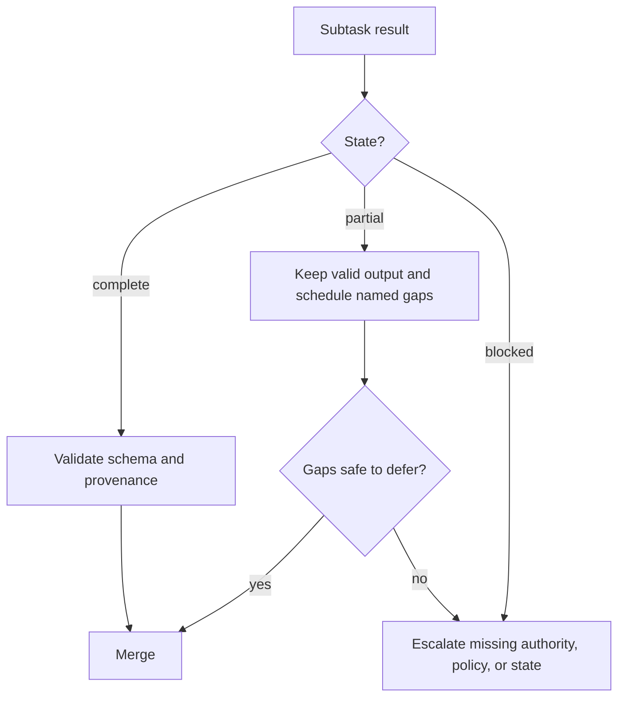

# Make Large Context Observable

> A large context window can hold more evidence. It cannot tell you which evidence was noticed, current, authoritative, or safe to act on.

**Type:** Reference
**Languages:** Python
**Prerequisites:** [Agent SDK Sessions, Subagents, and Context](../../17-agent-sdk-sessions-subagents-and-context/), [Tool Contracts, Errors, and Progressive Discovery](../../18-tool-contracts-errors-and-progressive-discovery/), [Reliable Extraction, Batch, and Independent Reviewers](../../20-reliable-extraction-batch-and-reviewers/)
**Time:** ~150 minutes

## Learning Objectives

- Place and retrieve critical facts to reduce lost-in-the-middle failures.
- Trim tool output without losing provenance, errors, conflicts, or decision-relevant detail.
- Propagate complete, partial, and blocked results through agentic workflows.
- Use manifests, scratchpads, subagents, and compaction for different large-codebase jobs.
- Calibrate confidence and stratify human review from evidence and consequence.
- Preserve source identity, dates, conflicts, and content type through ingestion and rendering.

## The Problem

A migration coordinator receives 140 files, three architecture documents, a dependency report, test logs, and results from four subagents. The prompt fits inside the advertised context window.

The final plan still violates a security rule. The rule appears once near the middle of a long architecture document. A tool result containing the failed integration test was shortened to "tests mostly passed." One subagent timed out after reviewing 18 of 24 files, but its prose summary looks complete. A Markdown table lost its column relationships during extraction, so a deprecated dependency appears supported.

Nothing exceeded the nominal token limit. The system failed because important facts had weak placement, metadata disappeared, partial work looked complete, and nobody defined an escalation rule.

Context reliability is not the ability to fit more text. It is the ability to preserve the right state, expose uncertainty, and route decisions when evidence is insufficient.

## The Concept

### Context has an attention topology

Models do not treat every token as equally useful in every task. Long inputs can make evidence harder to locate, especially when the relevant fact is surrounded by similar or conflicting material. This is often called lost in the middle.

Use placement deliberately:

1. Put the task, decision, hard constraints, and output contract before the evidence.
2. Group evidence by a stable identity such as file, claim, source, or subsystem.
3. Put the current question immediately before the model must answer it.
4. Repeat only the few critical constraints near the final request.
5. Retrieve narrow evidence for the current decision instead of carrying the entire archive.

Do not repeat every rule at both ends. Repetition consumes context and can amplify stale instructions. Promote only invariants whose omission would cause material failure.

```text
goal and hard constraints
current manifest and unresolved gaps
relevant evidence blocks with metadata
decision-specific question
required result and escalation schema
```

If evidence can be selected reliably, retrieval is usually stronger than one enormous prompt. A large context window is capacity for the remaining hard case, not permission to skip information architecture.

### Evidence needs an envelope

Raw text is not enough. Wrap every important unit with structured metadata:

```json
{
  "evidence_id": "policy-auth-017",
  "source_uri": "repo://docs/security/authentication.md",
  "source_version": "git:3a91c7e",
  "content_type": "text/markdown",
  "effective_date": "2026-07-15",
  "observed_at": "2026-08-08T10:30:00Z",
  "authority": "approved-architecture-policy",
  "scope": ["services/auth/**"],
  "extractor": "markdown-section-v2",
  "location": {"heading": "Token rotation", "lines": [88, 112]},
  "status": "active"
}
```

The values are illustrative. The envelope answers questions prose cannot:

- Which version did the agent see?
- Was it policy, a draft, or a generated summary?
- Which files or claims does it govern?
- Can the original span be inspected?
- Is another source newer or more authoritative?

Keep the source body and metadata associated through every handoff. A clean summary without identity is difficult to verify.

### Trim tool output by decision value

Tool output can dominate context. Trimming should remove repetition, not state.

Preserve:

- tool call and trace IDs
- command or query and scoped target
- exit or completion status
- structured errors and retryability
- affected files, records, or claims
- failing assertions and the smallest supporting excerpt
- counts, totals, and omitted-item count
- source versions and timestamps
- conflicts and unresolved gaps
- a pointer to the full external artifact

Remove or externalize:

- repeated progress lines
- duplicate stack frames
- successful rows that add no distinct evidence
- decorative formatting
- large bodies already stored under a stable reference

Use a deterministic adapter where possible:

```json
{
  "status": "partial",
  "summary": "18 of 24 files reviewed; 2 findings; 6 files not processed",
  "findings": ["finding-014", "finding-015"],
  "errors": [
    {
      "category": "dependency_timeout",
      "retryable": true,
      "scope": ["services/payments/**"],
      "trace_id": "trace-8801"
    }
  ],
  "full_artifact": "artifact://review/run-224"
}
```

"Mostly passed" deletes the most important distinction: which part did not pass.

### Complete, partial, and blocked are first-class states

Every task contract should define three outcomes:

- **Complete:** Every required part satisfies the output contract.
- **Partial:** Valid work exists, but named scope or evidence is missing.
- **Blocked:** Safe progress requires new authority, policy, data, or external state.

Partial is not failure, and it is not complete. The coordinator can retain valid findings, retry only eligible gaps, and prevent synthesis from interpreting missing work as no issue.



Errors need category, retryability, safe message, affected scope, partial result reference, and suggested next action. A timeout may be retryable. An authorization denial is not fixed by retrying. An ambiguous policy needs an owner, not more tokens.

### Escalate the reason, not the anxiety

Escalation should name the missing decision:

| Condition | Safe response |
|---|---|
| Missing evidence | Identify source needed and affected conclusion |
| Conflicting authoritative sources | Preserve both, apply documented precedence, or route to owner |
| Policy gap | Stop the governed action and ask the policy owner for a rule |
| Permission gap | Request scoped access or choose an approved alternate path |
| Repeated semantic failure | Stop bounded retries and request adjudication |
| Unknown external side effect | Reconcile state before retry |

Do not escalate with "the model is unsure." Provide source IDs, attempted checks, the exact ambiguity, consequence, deadline, and available safe options.

### Large codebases need four different memory tools

These mechanisms are related but not interchangeable.

#### Manifest

A manifest is the durable map: file IDs, ownership, purpose, dependencies, review state, hashes, findings, and unresolved work. It supports coverage and recovery. The manifest remains authoritative outside the conversation.

#### Scratchpad

A scratchpad supports temporary reasoning for the current bounded task: search hypotheses, candidate files, and next checks. It can be discarded. Never store the only copy of a decision, approval, or completed action there.

#### Subagent

A subagent gets isolated context for a bounded concern. It returns a structured result with file and evidence references. Isolation reduces context competition, but the coordinator must still enforce coverage and merge rules.

#### Compaction

Compaction compresses a growing session into current goal, constraints, verified work, open gaps, evidence references, and next action. It controls context size. It does not guarantee truth or durable state.

Use them together:

```text
manifest says what exists and what is done
scratchpad helps decide the next bounded search
subagent isolates one reasoning responsibility
compaction rebuilds a smaller current working set
```

For a large repository, start with structure and dependency maps, then retrieve the smallest connected slice. Ask bounded subagents to inspect specific subsystems. Return normalized findings to the manifest. Run a final cross-file pass over the manifest and accepted evidence, not raw transcripts.

### Confidence should be evidence-calibrated

A model-generated percentage is not calibrated merely because it has two decimal places. Express confidence through observable evidence:

- support class: direct, calculated, indirect, conflicting, or absent
- source authority and freshness
- coverage: reviewed items divided by required items
- evaluator agreement and known disagreement
- novelty relative to tested cases
- consequence if wrong

A decision record can say:

```text
Evidence class: direct in two approved sources
Coverage: 24 of 24 required files
Conflicts: one resolved by architecture owner on 2026-08-07
Automated checks: 18 passed, 0 failed
Residual uncertainty: runtime behavior not observed under network partition
Disposition: human review required before production rollout
```

This is more useful than "92 percent confident."

### Human review should be stratified

Review every case when consequence or policy requires it. Otherwise allocate human attention by risk:

- every high-impact decision
- every conflict or policy gap
- every low-evidence or partial result
- every new content type, language, or subsystem
- cases near a decision threshold
- a random sample of ordinary passing cases

The random sample detects unknown failure classes. If you review only flagged cases, a broken flagger can remain invisible.

Track reviewer disagreement and corrections. Use them to update evaluation cases and routing thresholds, not merely to calculate a vanity acceptance rate.

### Content type changes meaning

Ingestion and rendering must respect content type:

- Markdown uses headings, lists, links, and fenced code as structure.
- HTML may contain hidden navigation, scripts, or accessibility labels distinct from visible text.
- PDF pages can carry tables, footnotes, columns, diagrams, and scanned images.
- CSV and spreadsheets express relationships through rows, columns, formulas, and sheets.
- Source code depends on symbols, imports, comments, generated files, and repository paths.
- Images and diagrams need visual interpretation plus a reference to the original asset.

Flattening every format into undifferentiated text can invert a table, detach a footnote, or merge navigation with evidence. Store the original content type, extraction method, location, and rendering warnings. Test the actual rendered artifact when layout carries meaning.

Treat document text as untrusted data. A hidden HTML element or code comment can contain instructions that should not override the task or tool policy.

## Build It

## Interactive Lab

```figure
21-provenance-escalation
```

Use the provenance and escalation simulator to bury, trim, conflict, or remove
evidence while watching coverage and task state change. The interaction makes
`partial` and `blocked` observable instead of allowing a smooth summary to hide
missing work.

## Practice Lab

Remove the omitted-item count or conflict owner from a copy of the packet,
observe the false-completion risk, and repair the evidence envelope.

## Shipped Artifact

The filled [`outputs/reliability-packet.md`](../outputs/reliability-packet.md)
records a 24-file review with one conflict, explicit coverage, source metadata,
and an owner-bound escalation.

## Verify It

Verify the evidence envelope and review strata:

```bash
cd certifications/claude/lessons/21-long-context-reliability-provenance-and-escalation
python3 code/main.py
python3 -m unittest discover -s code/tests -v
```

The quiz checks placement, manifests, and recovery.

## Capstone Connection

Use the packet as the context-reliability appendix of the Architect Foundations
capstone.

Build a reliability packet for a large-codebase security review.

### Step 1: Create the manifest

List every in-scope file with subsystem, owner, hash, content type, review state, assigned subagent, finding IDs, and unresolved gaps. Add deterministic coverage checks.

### Step 2: Define the context budget

Reserve space for goal, hard constraints, current manifest slice, relevant evidence, structured errors, and output contract. Store full logs externally with stable references.

### Step 3: Normalize tool results

Write adapters for search, tests, and file inspection. Inject a timeout, truncated log, permission denial, and partial search result. Verify that each preserves affected scope and correct retry behavior.

### Step 4: Add escalation rules

Create fixtures for conflicting policies, an uncovered file, missing authorization, and an unknown side effect. Each should name an owner and safe next action.

### Step 5: Calibrate review

Review every severe finding and partial result, plus a random sample of passes. Compare reported evidence class with reviewer disposition. Adjust routing from measured false-pass risk.

### Step 6: Test rendering

Use one Markdown policy, one table-heavy PDF, one CSV, and one source file. Confirm that citations resolve to the right section, page, cell range, or lines and that layout-dependent facts survive.

## Use It

### Exam decision patterns

For long-context reliability scenarios:

1. Put the current goal and critical constraints at clear boundaries.
2. Select relevant evidence and carry a structured provenance envelope.
3. Trim verbosity while preserving failures, counts, conflicts, and references.
4. Propagate complete, partial, and blocked states explicitly.
5. Escalate policy, authority, and ambiguity gaps to the named owner.
6. Calibrate confidence from evidence and coverage.
7. Stratify human review by consequence, uncertainty, novelty, and random sampling.

### Common traps

- **Fits in context, therefore noticed:** Capacity is mistaken for reliable attention.
- **Summary as evidence:** Source identity, date, and supporting span disappear.
- **Trim every error:** The one failed assertion is removed with repetitive logs.
- **Partial means no findings:** Unreviewed scope is converted into negative evidence.
- **Retry every failure:** Authorization and policy gaps consume budget without changing state.
- **Scratchpad as database:** Durable decisions vanish when context changes.
- **Compaction as verification:** A smaller summary can preserve stale assumptions.
- **Confidence as a percentage:** Precision of wording is mistaken for calibration.
- **Plain-text ingestion for every format:** Tables, footnotes, code structure, and rendered meaning are lost.

### Exercises

1. Reorder a 50-page context packet so the task and critical policy remain visible without duplicating every rule.
2. Convert a 5,000-line test log into a structured partial result with a pointer to the full artifact.
3. Design a manifest and three subagent contracts for a repository with 300 files.
4. Write escalation packets for missing evidence, policy conflict, and unknown side effect.
5. Create a stratified review plan for 10,000 extraction records.
6. Compare extraction from a Markdown table and its rendered view. Record lost relationships.

## Key Terms

- **Lost in the middle:** Reduced reliable use of relevant information buried inside long context.
- **Provenance envelope:** Metadata preserving source identity, version, dates, authority, location, and extraction method.
- **Partial result:** Valid completed work accompanied by explicit missing scope or errors.
- **Manifest:** Durable structured inventory of scope, state, ownership, evidence, and gaps.
- **Scratchpad:** Temporary working notes that are not authoritative state.
- **Compaction:** Compression of conversational context into a smaller working set.
- **Confidence calibration:** Aligning expressed certainty or routing with measured evidence and error behavior.
- **Stratified review:** Allocating human review by risk categories plus representative sampling.
- **Content-type rendering:** Preserving the structural and visual semantics of the original format.

## Further Reading

- [Claude Certified Architect Foundations Exam Guide](https://everpath-course-content.s3-accelerate.amazonaws.com/instructor%2F6nizmqk8tpzpfjvt6qmmav7rh%2Fpublic%2F1783542750%2FClaude+Certified+Architect+%E2%80%93+Foundations+Exam+Guide.pdf)
- [Anthropic: Long context prompting tips](https://platform.claude.com/docs/en/build-with-claude/prompt-engineering/long-context-tips)
- [Anthropic: Context windows](https://platform.claude.com/docs/en/build-with-claude/context-windows)
- [Anthropic: Citations](https://platform.claude.com/docs/en/build-with-claude/citations)
- [Anthropic: Agent SDK context management](https://platform.claude.com/docs/en/agent-sdk/context-management)
- [AI Engineering from Scratch: Context Engineering](../../../../../phases/11-llm-engineering/05-context-engineering/)
- [AI Engineering from Scratch: Repository Memory and State](../../../../../phases/14-agent-engineering/34-repo-memory-and-state/)
- [AI Engineering from Scratch: Multi-Session Handoff](../../../../../phases/14-agent-engineering/40-multi-session-handoff/)

Context limits, compaction behavior, citations, SDK features, model support, and content-processing capabilities can change. These references were checked on 2026-08-08. Verify current official documentation and test the exact platform behavior before deployment.
