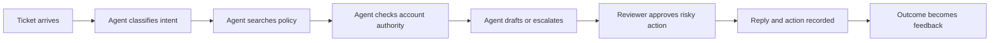

# Business Discovery, Requirements, and SLAs

> The first architecture decision is deciding what problem you are actually responsible for solving.

**Type:** Reference
**Languages:** Python
**Prerequisites:** Phase 11, Lesson 13; Phase 14, Lesson 12; Phase 17, Lesson 08
**Time:** ~120 minutes

## Learning Objectives

- Convert a broad AI request into a measurable problem statement
- Separate functional, quality, infrastructure, safety, and lifecycle requirements
- Define success metrics, service-level objectives, and escalation boundaries
- Identify assumptions that need evidence before architecture begins
- Produce a discovery brief that technical and business stakeholders can approve

## The Problem

A support director asks for an agent that resolves every ticket automatically.
The request sounds specific. It is not.

You do not know which ticket classes are in scope, what resolution means, which
systems the agent can change, how much financial authority it has, what latency
users tolerate, or which actions require a person. You also do not know whether
the real problem is response time, inconsistent policy application, backlog,
cost, or customer satisfaction.

If you begin with a model and tool list, you will optimize an assumption. A
technically impressive system can still fail because it improved the wrong
measure, automated a forbidden step, or moved work from agents to reviewers
without reducing total effort.

Professional architecture begins with discovery. The exam tests whether you can
translate business intent into a solution and defend the tradeoffs. In practice,
this skill prevents months of rework.

## The Concept

### Start With the Decision, Not the Feature

Rewrite the request as a decision with an owner, evidence, and consequence.

Weak problem statement:

```text
Build a Claude support agent.
```

Decision-shaped statement:

```text
Reduce median time to a policy-correct first response for billing questions
from 11 minutes to under 3 minutes, while keeping unsupported-refund actions at
zero and preserving human approval for refunds above the team threshold.
```

The second statement tells you what to measure. It also tells you what not to
automate.

Use five questions in the first discovery session:

1. What observable outcome should change?
2. Who owns that outcome?
3. What action follows from the output?
4. What is the cost of a wrong, late, or missing answer?
5. Which constraints cannot be traded away?

### Classify Requirements Before Prioritizing Them

Architects lose information when every request becomes a generic bullet under
"requirements." Use explicit classes.

| Class | Question | Support example |
|-------|----------|-----------------|
| Functional | What must the system do? | Read a ticket, find policy, draft a reply |
| Quality | How good must it be? | Cite the active policy version in 98 percent of evaluated drafts |
| Performance | How quickly and at what scale? | P95 draft latency below 8 seconds at 40 requests per second |
| Security | Who may see or change what? | Only assigned agents can view account context |
| Safety | Which outcomes need prevention or approval? | Never issue a refund without a validated authority decision |
| Operability | How will failure be detected and recovered? | Alert on retrieval freshness and tool-error rate |
| Lifecycle | Who updates, approves, and retires it? | Policy team owns source freshness; platform owns runtime |

This classification exposes contradictions. "Answer instantly" conflicts with
"perform a three-source compliance review." "Automate all refunds" conflicts
with a human approval requirement. Discovery makes those conflicts visible
before code turns them into incidents.

### Map the Current Workflow

Do not design from the idealized process described in a slide. Observe the real
work.



For each step, record:

- input and output
- system of record
- responsible role
- decision rule
- common exception
- delay and rework
- data classification
- evidence retained

The highest-value intervention may be retrieval for the policy step, a narrow
classifier at intake, or a better approval interface. An autonomous agent is
only one possible pattern.

### Separate Value From Capability

Claude may be capable of drafting a response. The business value depends on
whether the draft reduces total handling time after review, improves consistency,
or enables a new service level.

Use a simple value hypothesis:

```text
For [user or team], changing [workflow step] with [bounded capability] will
improve [business measure] from [baseline] to [target], without violating
[guardrail]. We will know after [evaluation window].
```

Every field must be filled with evidence or labeled as an assumption. Do not
hide uncertainty inside a confident architecture diagram.

### Turn Risk Into a Review Boundary

Human review is not a universal safety answer. It must have a trigger, reviewer,
evidence packet, time budget, and fallback.

For each action, estimate:

- impact if wrong
- reversibility
- confidence available from evidence
- regulatory or policy obligation
- abuse potential
- review cost

Low-impact, reversible drafts can proceed automatically. High-impact or
irreversible actions need deterministic checks and explicit authority. Medium
risk often needs sampling, threshold-based review, or post-action audit.

### Define SLI, SLO, and SLA Correctly

A service-level indicator is the measured signal. A service-level objective is
the internal target. A service-level agreement is a commitment with business or
contractual consequences.

| Layer | Example |
|-------|---------|
| SLI | Percentage of drafts with a valid citation to the active policy |
| SLO | At least 98 percent over a rolling seven-day window |
| SLA | Customer-facing first response within the contracted support window |

Do not promise a model accuracy SLA without defining the population, label,
measurement method, and response when the objective is missed. "The model is 95
percent accurate" is not operationally meaningful.

For an AI system, include several classes of indicator:

- task quality: factuality, completeness, policy adherence
- system performance: latency, availability, throughput
- economics: cost per successful task, cache hit rate, review effort
- safety: blocked unsafe actions, false blocks, escalation precision
- operations: retrieval freshness, tool failures, rollback time

### Make Non-Goals Explicit

Non-goals protect the system from silent scope expansion.

Examples:

- The first release drafts replies but does not send them.
- It handles billing FAQs but not account closure.
- It recommends a refund amount but cannot execute a refund.
- It supports English tickets only during the pilot.

If a stakeholder disagrees, discovery has found a decision that needs ownership.
That is progress.

## Build It

## Interactive Lab

```figure
22-sla-value-tradeoff
```

Use the value and SLA explorer to change baseline, target, review effort,
quality, latency, and hard authority constraints. It shows when a capable
system still produces negative workflow value or violates a non-tradeable gate.

## Practice Lab

Change one baseline into an unsupported claim, classify it correctly, and add
an owner, evidence source, and decision date before architecture selection.

## Shipped Artifact

The filled [`outputs/discovery-brief.md`](../outputs/discovery-brief.md) is an
approved, decision-shaped support pilot with measurable SLIs, SLOs, assumptions,
non-goals, and owners.

## Verify It

Verify that facts, estimates, preferences, and constraints are not collapsed
together:

```bash
cd certifications/claude/lessons/22-business-discovery-requirements-and-slas
python3 code/main.py
python3 -m unittest discover -s code/tests -v
```

The quiz checks discovery and service-level decisions.

## Capstone Connection

Use the brief as the first artifact in the Architect Professional capstone.

Create a one-page discovery brief before drawing the architecture.

```markdown
# Discovery Brief

## Outcome
- Owner:
- Current baseline:
- Target:
- Evaluation window:

## Users and Workflow
- Primary user:
- Current workflow step:
- Downstream action:
- Exceptions:

## Requirements
- Functional:
- Quality:
- Performance:
- Security:
- Safety:
- Operability:
- Lifecycle:

## Data and Authority
- Data classes:
- Systems of record:
- Read permissions:
- Write permissions:
- Human approval triggers:

## Measures
- SLIs:
- SLOs:
- Business measures:
- Guardrail measures:

## Assumptions to Test
- Assumption:
- Evidence needed:
- Owner:
- Decision date:

## Non-Goals
- Not in the first release:
```

Now run an assumption audit. Mark each statement as fact, estimate, preference,
or constraint. Facts need sources. Estimates need a confidence range. Preferences
need an owner. Constraints need an authority.

### Prioritize With Cost of Error

Use this decision table for each candidate use case:

| Dimension | Low | Medium | High |
|-----------|-----|--------|------|
| Wrong-output impact | Minor edit | Customer friction | Financial, legal, or safety harm |
| Reversibility | One-click undo | Manual correction | Irreversible or difficult |
| Data sensitivity | Public | Internal | Regulated or secret |
| Action authority | Draft only | Bounded write | Destructive or financial write |
| Evidence quality | Direct source | Partial source | Ambiguous or missing |

A high score does not automatically ban AI. It changes the architecture toward
narrower scope, deterministic gates, stronger evidence, human approval, and
more conservative rollout.

## Use It

Apply the brief to three architecture candidates:

1. Retrieval-assisted draft generation with human approval.
2. A deterministic workflow that calls Claude only for classification and
   drafting.
3. An adaptive agent with ticket, policy, account, and refund tools.

Score each against the requirements. The most capable option is not automatically
best. If the workflow is stable and known, deterministic orchestration often
reduces latency, cost, and failure surface. Use an agent when the path depends on
evidence discovered during execution and the additional flexibility is worth the
control burden.

Record the choice in an architecture decision record:

```markdown
# ADR: Support Resolution Pattern

## Status
Proposed

## Context
Decision, constraints, evidence, and unresolved assumptions.

## Options
1. Retrieval-assisted draft workflow
2. Deterministic multi-step workflow
3. Adaptive tool-using agent

## Decision
Chosen option and the requirement it best satisfies.

## Rejected Alternatives
Why each alternative loses under current constraints.

## Consequences
New operational work, residual risk, and reversal plan.

## Verification
Offline evaluation, pilot guardrails, SLOs, and review date.
```

## Exam Decision Patterns

When a scenario begins with a broad business request, the strongest first step
usually reduces ambiguity before selecting technology.

Prefer an answer that:

- establishes the business outcome and current baseline
- identifies users, systems of record, and downstream action
- separates hard constraints from preferences
- defines quality and operational measures
- assigns review and lifecycle ownership
- tests the riskiest assumption with a bounded pilot

Be suspicious of answers that immediately choose the largest model, add an
agent, or promise automation without clarifying authority and error cost.

## Common Traps

### Turning Every Request Into an Agent

Agentic flexibility has a cost: more tool calls, larger attack surface, harder
testing, and less predictable latency. Choose it only when adaptive planning is
a requirement.

### Treating Human Review as Free

A review queue can become the new bottleneck. Measure review time, agreement,
and escalation quality.

### Using Accuracy Without a Denominator

State the dataset, population, label, evaluator, and time window. Otherwise the
number cannot guide an operational decision.

### Ignoring Ownership After Launch

Every prompt, source, tool, control, metric, and escalation path needs an owner.
An unowned control decays silently.

## Exercises

1. Rewrite "build an AI analyst" into a decision-shaped problem statement with
   a baseline, target, guardrail, and owner.
2. Map a real workflow and identify one step where a deterministic rule is
   better than a model call.
3. Define five SLIs for a retrieval-assisted compliance workflow. Include at
   least one quality, safety, economic, and operability signal.
4. Write an ADR that rejects an agent architecture even though the model is
   capable of doing the work.
5. Design a pilot that tests the highest-risk assumption without giving the
   system production write access.

## Key Terms

| Term | What people say | What it actually means |
|------|-----------------|------------------------|
| Requirement | A requested feature | A testable condition the solution must satisfy |
| Constraint | Something inconvenient | A boundary the architecture may not trade away |
| SLI | An SLA target | The measured signal used to judge service behavior |
| SLO | A vendor promise | An internal objective for an indicator |
| SLA | Any performance goal | A service commitment with defined consequences |
| Non-goal | Work postponed quietly | An explicit boundary that prevents scope drift |
| ADR | A diagram | A durable record of context, options, decision, and consequences |

## Further Reading

- [Claude Certified Architect Professional exam guide](https://everpath-course-content.s3-accelerate.amazonaws.com/instructor%2F6nizmqk8tpzpfjvt6qmmav7rh%2Fpublic%2F1783542810%2FClaude+Certified+Architect+%E2%80%93+Professional+Exam+Guide.pdf) for the public lifecycle and architecture objectives
- [Anthropic guidance on building effective agents](https://www.anthropic.com/research/building-effective-agents) for workflow and agent tradeoffs
- [Claude Platform documentation](https://platform.claude.com/docs/en/home) for current product and API behavior
- Phase 11, Lesson 13 for the production application boundary
- Phase 17, Lesson 08 for latency, throughput, and goodput measures
