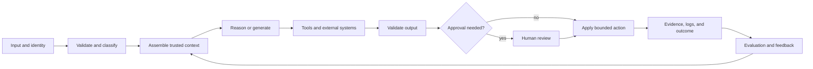

# End-to-End Architecture and Value Tradeoffs

> Architecture is the art of spending complexity only where it changes the outcome.

**Type:** Reference
**Languages:** Python
**Prerequisites:** [Business Discovery, Requirements, and SLAs](../../22-business-discovery-requirements-and-slas/); Phase 14, Lessons 01, 12, and 28
**Time:** ~135 minutes

## Learning Objectives

- Draw a complete Claude system from input through feedback and operations
- Choose among augmented calls, workflows, agents, and multi-agent systems
- Decompose complex work around evidence, authority, and verification boundaries
- Defend cost, latency, quality, safety, and maintainability tradeoffs
- Identify when additional model capability cannot repair a structural design flaw

## The Problem

A team launches a contract-review assistant. One prompt contains the contract,
policy library, extraction schema, negotiation rules, and a request for a final
redline. The demo works. Production does not.

Large contracts exceed the practical context budget. Policy versions conflict.
The model returns valid JSON with an unsupported legal conclusion. Reviewers
cannot see which source supported which change. Retrying increases cost without
changing the failure. A larger model improves prose while leaving provenance,
authority, and lifecycle ownership unresolved.

The system is not failing because the prompt needs another sentence. It is
failing because several different responsibilities have been compressed into a
single probabilistic step.

## The Concept

### Draw the Whole Loop

An end-to-end architecture includes more than the model call.



For every edge, ask:

- What data crosses the boundary?
- Which identity and permission apply?
- What schema or contract is enforced?
- What happens on timeout, ambiguity, or partial failure?
- What evidence is retained?
- Who owns the next decision?

An architecture diagram without failure paths is a marketing picture.

### Choose the Smallest Pattern That Fits

There are four useful starting patterns.

#### Augmented Model Call

One request uses selected context, retrieval, or a tool and returns a bounded
output. Use it for classification, extraction, drafting, or scoring when the
steps are known and a single turn can contain the necessary evidence.

Benefits:

- lowest orchestration overhead
- easiest to evaluate
- predictable latency and cost

Limits:

- weak fit for branching work
- limited recovery across several external actions

#### Deterministic Workflow

Code controls the sequence and calls Claude at selected steps. Use it when the
business process is stable, auditability matters, or each transition needs a
clear contract.

Benefits:

- explicit states and retries
- narrow permissions per step
- reproducible tests

Limits:

- brittle when the path cannot be known in advance
- new exception classes require workflow changes

#### Adaptive Agent

Claude selects the next action based on observations until a stop condition is
met. Use it when evidence discovery determines the path and enumerating every
branch would be impractical.

Benefits:

- flexible planning
- useful for open-ended research and repair

Limits:

- variable latency and cost
- larger permission and evaluation surface
- loop, drift, and tool-error risks

#### Multi-Agent System

A coordinator delegates isolated concerns to specialists or independent
reviewers. Use it when work can be partitioned, context isolation improves
quality, or independence is required for verification.

Benefits:

- parallel execution
- smaller context per role
- independent review

Limits:

- handoff loss and duplicated work
- more calls and harder trace analysis
- coordination can cost more than it saves

Do not choose multi-agent because the diagram looks mature. Choose it when a
specific context, independence, parallelism, or specialization requirement pays
for the coordination.

### Decompose Around Contracts

Bad decomposition follows document sections or team boundaries without asking
how correctness will be checked. Good decomposition creates a contract at each
handoff.

For the contract-review system:

1. Intake validates file type, identity, and jurisdiction metadata.
2. Clause segmentation returns stable identifiers and source spans.
3. Policy retrieval returns versioned evidence with provenance.
4. Clause analysis returns findings against a schema.
5. An independent reviewer checks evidence coverage and contradictions.
6. Redline generation uses only accepted findings.
7. Human counsel approves material changes.
8. The system records decision evidence and later outcome.

Each step has a narrower job than "review this contract." A failure can be
localized. The system can retry retrieval without regenerating accepted clause
analysis, and a reviewer can reject one finding without discarding all work.

### Separate Semantic and Deterministic Controls

Claude is useful for ambiguous judgments such as whether a clause materially
changes liability. Code is better for invariants such as required fields,
permission checks, maximum refund, allowed jurisdiction, and document version.

Use this rule:

```text
If a condition can be expressed as a stable predicate over trusted data,
enforce it outside the model.
```

Prompt instructions guide behavior. They do not create a security boundary.

### Budget Across the Whole Trajectory

Cost is not only input plus output tokens for one call. A system trajectory may
include retrieval, several model calls, tool execution, retries, review, and
human labor.

Estimate:

```text
expected task cost =
  model calls
  + retrieval and tool cost
  + retry probability times retry cost
  + human review minutes times labor rate
  + expected incident and correction cost
```

A smaller model that produces more retries can cost more per successful task.
A larger model may be cheaper if it eliminates an expensive review step, but
only an evaluation can establish that.

### Treat Latency as a Distribution

Average latency hides the long tail that users experience. Model time, tool
time, queueing, retries, and human approval combine.

Use at least P50, P95, and timeout rate. For interactive work, track time to
first useful output as well as total completion. For background work, throughput
and completion deadline may matter more than first-token latency.

Parallel execution only helps independent work. Parallel calls that compete for
the same rate limit or produce results requiring serial reconciliation may add
cost without reducing end-to-end time.

### Design Feedback as a Product Surface

Feedback is not a pile of thumbs-up events. It must connect an outcome to the
inputs, versions, trajectory, and decision.

Store:

- input class and risk tier
- prompt, model, tool, and knowledge versions
- retrieved evidence identifiers
- tool calls and structured errors
- output and validator results
- human edits and reason codes
- downstream outcome

The feedback loop then supports a decision: change a prompt, repair retrieval,
adjust routing, improve a tool, or narrow scope.

## Build It

## Interactive Lab

```figure
23-architecture-tradeoff
```

Use the architecture tradeoff explorer to compare an augmented call, workflow,
agent, and multi-agent design against weighted quality, latency, cost, safety,
auditability, and change-cost evidence. Hard constraints cannot be averaged
away by a high total score.

## Practice Lab

Remove one rejected alternative or hard safety gate from a copy of the decision,
observe the readiness failure, and repair the architectural rationale.

## Shipped Artifact

The filled [`outputs/architecture-decision.md`](../outputs/architecture-decision.md)
selects a deterministic contract-review workflow and records failure paths and
a reversal condition.

## Verify It

Run the deterministic decision-packet verifier:

```bash
cd certifications/claude/lessons/23-end-to-end-architecture-and-value-tradeoffs
python3 code/main.py
python3 -m unittest discover -s code/tests -v
```

The quiz tests the same pattern and control decisions.

## Capstone Connection

Carry the ADR into the Architect Professional capstone's architecture options
section.

Create an architecture packet for one business workflow.

### Step 1: Draw Three Candidates

Draw an augmented-call, deterministic-workflow, and adaptive-agent design. Keep
the same inputs, outputs, and constraints so the comparison is fair.

### Step 2: Score Explicit Tradeoffs

Use a one-to-five scale with written evidence.

| Criterion | Weight | Augmented call | Workflow | Agent |
|-----------|-------:|---------------:|---------:|------:|
| Task quality | 25 | | | |
| P95 latency | 15 | | | |
| Cost per success | 15 | | | |
| Safety and authority | 20 | | | |
| Auditability | 15 | | | |
| Change cost | 10 | | | |

Weights come from discovery, not habit. If a regulated action makes safety a
hard constraint, do not average it away with convenience.

### Step 3: Write Failure Paths

For each external dependency, specify timeout, retry, circuit-break behavior,
partial result, user message, and operator evidence. Include a total turn and
cost budget for agents.

### Step 4: Define the Evaluation

Build a representative set covering normal, ambiguous, adversarial, and
dependency-failure cases. Measure final quality, trajectory quality, cost,
latency, and safety.

### Step 5: Record Reversal Conditions

State what evidence would cause the team to switch patterns. Architecture is a
current decision, not a permanent identity.

## Use It

Consider a research system that must answer questions across company filings.

A single augmented call fits when one retrieval query reliably returns enough
evidence. A workflow fits when every task follows query, retrieve, rank, answer,
and cite. An agent fits when it must discover missing entities, reformulate
queries, and decide whether evidence is sufficient. A multi-agent design fits
only if parallel source research or independent verification improves the target
metric enough to justify coordination.

Now add a one-hour answer deadline and a strict cost budget. The optimal design
may change. Architecture is always architecture under constraints.

## Exam Decision Patterns

When options differ by complexity, choose the simplest architecture that meets
the stated requirement. Look for structural fixes before prompt patches.

Strong answers often:

- enforce deterministic rules in code
- isolate high-risk tools and permissions
- use a workflow for known paths and an agent for genuinely adaptive paths
- add an independent reviewer when independence is a requirement
- keep provenance through every transformation
- define stop, retry, partial-result, and escalation behavior
- optimize cost per successful outcome, not cost per call

Weak answers often add a larger model, longer prompt, more agents, or more tools
without addressing the actual failure boundary.

## Common Traps

### Capability Bloat

Every unnecessary tool expands prompt size, choice ambiguity, attack surface,
and authorization risk. Expose the minimum set required for the current role.

### Prompting Around a Missing Contract

If two steps disagree about identifiers, schemas, or error behavior, clearer
natural-language instructions cannot create a reliable interface. Define the
contract.

### Self-Review as Independence

Asking the same context to "double-check" can repeat the same assumption. Use a
separate reviewer with an explicit rubric and isolated evidence when independence
matters.

### Optimizing the Demo Path

Production quality lives in ambiguity, stale data, permission errors, timeouts,
and partial failure. Include them before architecture approval.

## Exercises

1. Design augmented-call, workflow, and agent candidates for an invoice-dispute
   process. Choose one and state the reversal condition.
2. Find three invariants in an AI workflow that should be deterministic code.
3. Calculate cost per successful task for two models with different retry and
   review rates.
4. Add a tool outage to a multi-agent research design and specify partial-result
   behavior.
5. Write an evaluation that detects a system with good final prose but wasteful
   or unsafe trajectories.

## Key Terms

| Term | What people say | What it actually means |
|------|-----------------|------------------------|
| Augmented call | A weak agent | A bounded model call supplied with selected context or tools |
| Workflow | An agent with fixed steps | Code-owned orchestration with explicit transitions |
| Agent | Any LLM application | A model-directed loop that chooses actions from observations |
| Multi-agent | More intelligence | Several model contexts coordinated for isolation, parallelism, or independent review |
| Contract | A prompt instruction | A machine-checkable boundary for data, errors, and responsibility |
| Cost per success | Token price | Total expected model, tool, retry, review, and correction cost per accepted outcome |

## Further Reading

- [Building effective agents](https://www.anthropic.com/research/building-effective-agents) for workflow and agent patterns
- [Claude Agent SDK documentation](https://platform.claude.com/docs/en/agent-sdk/overview) for current agent harness capabilities
- Phase 14, Lesson 01 for the agent loop from first principles
- Phase 14, Lesson 28 for orchestration tradeoffs
- Phase 17, Lesson 08 for goodput and latency measurement
