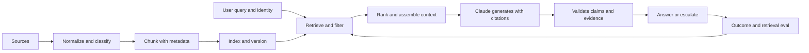

# RAG, Retrieval, and Data Pipelines

> A grounded answer is only as trustworthy as the evidence that reached the model.

**Type:** Build
**Languages:** Python
**Prerequisites:** [End-to-End Architecture and Value Tradeoffs](../../23-end-to-end-architecture-and-value-tradeoffs/); Phase 11, Lessons 06 and 07; Phase 5, Lesson 23
**Time:** ~150 minutes

## Learning Objectives

- Design ingestion, chunking, indexing, retrieval, generation, and citation boundaries
- Match sparse, dense, hybrid, filtered, and iterative retrieval to the data shape
- Diagnose retrieval failures before changing the model or prompt
- Measure retrieval quality separately from answer quality
- Preserve freshness, access control, and provenance through the pipeline

## The Problem

A policy assistant works for months. After a document refresh, it begins giving
confident answers based on an old refund threshold. Model version, prompt, and
latency have not changed.

The team adds "use the latest policy" to the prompt. Nothing improves. The
model cannot follow evidence it never received. The index contains both policy
versions, metadata filters are missing, and the retriever ranks the obsolete
chunk first because its wording matches the query more closely.

This is a retrieval incident. Treating it as a model incident wastes time and
can hide the real control failure.

## The Concept

### RAG Is a Data System

Retrieval-augmented generation has two connected systems with different failure
modes.



The model can be excellent while the system fails because:

- the source was never ingested
- parsing dropped the relevant table
- chunking split a condition from its exception
- the index used stale or incompatible representations
- filters ignored tenant, jurisdiction, date, or permission
- ranking favored a keyword match over the authoritative source
- context assembly truncated the best evidence
- generation cited one chunk while claiming more than it supports

Diagnose the earliest failing boundary.

### Design Chunks Around Meaning and Retrieval

Fixed token chunks are a baseline, not a universal answer. Chunk shape should
preserve the unit a person would cite.

For prose policies, headings and paragraphs often provide useful boundaries.
For API documentation, keep a method signature with parameters and errors. For
tables, preserve headers with each row group. For tickets, one message may need
conversation context. For source code, functions and classes are better than
arbitrary character windows.

Overlap helps when a fact crosses a boundary, but it also duplicates evidence,
increases index size, and can crowd the final context with near-identical text.
Measure it.

Every chunk needs metadata:

- stable document and chunk identifiers
- source URI or system-of-record identifier
- version and effective date
- tenant, jurisdiction, product, or content type
- access-control attributes
- ingestion and parser version
- parent heading and position

Metadata is how retrieval becomes governed rather than merely similar.

### Match Retrieval to Query and Data Shape

#### Sparse Retrieval

BM25-style retrieval matches explicit terms. It is strong for identifiers,
product names, error codes, and policy phrases. It is cheap and explainable.

#### Dense Retrieval

Embeddings match semantic similarity. They help when users paraphrase a concept
or vocabulary differs between query and source. They can miss exact identifiers
and can retrieve semantically related but non-authoritative text.

#### Hybrid Retrieval

Combine sparse and dense candidates, then fuse or rerank. Hybrid retrieval often
handles mixed natural-language and identifier queries better than either alone.

#### Filtered Retrieval

Apply trusted metadata and authorization before evidence reaches the model. Do
not ask Claude to ignore chunks the user is not allowed to see. The forbidden
data should not enter context.

#### Iterative Retrieval

An agent can reformulate queries, follow references, or identify missing
evidence. Use this when discovery is genuinely adaptive. Set query, turn, time,
and cost budgets. Stable question-answering pipelines should not pay agentic
complexity by default.

### Separate Retrieval Evaluation From Answer Evaluation

If the correct evidence is absent from the top candidates, answer quality has a
ceiling. Measure retrieval first.

Useful measures include:

- recall at K: did the candidate set contain the required source?
- precision at K: how much of the candidate set was relevant?
- mean reciprocal rank: how early did the first relevant source appear?
- nDCG: did the ranking place highly relevant sources first?
- freshness coverage: did results use the active version?
- authorization leakage: did any result violate the caller's access?

Then evaluate generation:

- claim support by cited evidence
- citation correctness and completeness
- answer completeness
- abstention when evidence is insufficient
- conflict detection across sources

A single end-to-end score cannot tell you which layer to repair.

### Preserve Provenance as Data

Do not let provenance exist only as prose generated after the answer. Carry
source identifiers through retrieval, context assembly, output schema, and logs.

For each claim, retain:

- source document and chunk identifier
- source version and effective date
- exact supporting span
- retrieval score and rank
- transformation or summarization steps

If sources conflict, report the conflict. Do not silently choose the most recent
date unless the domain has an explicit precedence rule.

### Make Refresh Atomic and Observable

A document refresh can create a mixed index where old and new chunks coexist.
Safer patterns build a new version, validate it, then switch an alias or pointer
atomically. Keep rollback until the new index passes retrieval and freshness
checks.

Monitor:

- ingestion success and lag
- parsed content count and size
- active version by source
- embedding or index version
- empty-result and low-score rates
- retrieval distribution shifts
- top failed evaluation queries

## Build It

## Interactive Lab

```figure
24-rag-ranking
```

Use the ranking lab to compare lexical matches, metadata filters, stale-source
exclusion, and top-K behavior before editing code. The visible ranks connect a
retrieval decision to recall, reciprocal rank, freshness, and provenance.

## Practice Lab

Add a stale or unauthorized document to a copy of the fixture and prove that it
cannot enter the candidate set before generation.

## Shipped Artifact

[`outputs/retrieval-evidence-report.json`](../outputs/retrieval-evidence-report.json)
is a filled baseline containing ranked chunk identities, active source versions,
and retrieval metrics.

## Verify It

Reproduce and verify it with:

```bash
cd certifications/claude/lessons/24-rag-retrieval-and-data-pipelines/code
python3 main.py
python3 -m unittest discover tests -v
```

The six-question quiz checks diagnosis and retrieval selection.

## Capstone Connection

Carry the evidence report into the Architect Professional capstone's RAG
evaluation and freshness gates.

The lab implements a small BM25-style index in the Python standard library. It
is intentionally transparent. Production search systems are faster and more
capable, but the scoring and metadata boundaries should stop feeling magical.

Run it:

```bash
cd certifications/claude/lessons/24-rag-retrieval-and-data-pipelines/code
python3 main.py
python3 -m unittest discover tests -v
```

### Step 1: Normalize Tokens

`tokenize` lowercases text and extracts alphanumeric terms. Production pipelines
need language-aware tokenization, field handling, and parser tests. The lesson
keeps only the ranking concept.

### Step 2: Chunk With Stable Identity

`chunk_document` creates overlapping word windows while retaining document ID,
position, update time, and a stable chunk ID. Invalid overlap fails early rather
than creating an infinite loop.

### Step 3: Exclude Inactive Sources Before Indexing

`RetrievalIndex.build` ignores inactive document versions. This is a simplified
freshness gate. In production, activation should be tied to a validated index
version and atomic switch.

### Step 4: Score Transparently

The index computes term frequency, document frequency, length normalization,
and an inverse-document-frequency score. Exact query terms can raise the source
that actually contains the active policy language.

### Step 5: Return Provenance

Every `RetrievalHit` carries document ID, chunk ID, update date, text, and score.
The generation layer should consume this structured evidence and return claim
links to it.

### Step 6: Evaluate the Retriever

`evaluate_retrieval` calculates recall at K and mean reciprocal rank against
labeled cases. Add normal, ambiguous, stale-version, permission, and adversarial
queries before changing ranking.

## Use It

Production systems usually combine a document parser, object storage, sparse or
vector index, metadata filters, reranker, and an evaluation pipeline. Keep the
same contracts even when managed services hide the implementation.

For the policy incident:

1. Reproduce the query and inspect the retrieved chunk IDs.
2. Confirm which source versions are active in the index.
3. Check parsing and chunk boundaries around the threshold and exception.
4. Verify identity and metadata filters.
5. Compare sparse, dense, and hybrid candidate sets.
6. Run the frozen retrieval evaluation before and after the repair.
7. Switch the validated index atomically and retain rollback.
8. Re-run claim-support evaluation at the generation layer.

Do not start by changing temperature or model size. Neither can recover missing
or forbidden evidence.

## Exam Decision Patterns

When answers became wrong immediately after a document refresh while model and
latency stayed stable, investigate ingestion, indexing, filtering, and retrieval
first.

Strong architecture choices:

- match retrieval to exact identifiers and semantic paraphrases
- filter by identity and metadata before generation
- version sources and indexes
- evaluate retrieval separately from final answers
- carry provenance through the output contract
- represent insufficient or conflicting evidence explicitly

Weak choices:

- tell the model to remember the latest document
- increase context with every source
- replace the model before inspecting candidates
- rely on generated citations without source identifiers

## Common Traps

### More Context Means More Grounding

Irrelevant context competes for attention and can hide the best evidence. Better
retrieval and ordering often beat a larger context payload.

### Similar Means Authoritative

Semantic similarity does not encode policy precedence, permissions, or effective
date. Those need metadata and rules.

### Valid Citation Means Supported Claim

A citation can point to a real source that does not support the whole claim.
Evaluate entailment and coverage, not only link validity.

### Refresh Means Append

Appending new chunks without deactivating old versions creates contradictory
evidence. Treat refresh as a versioned deployment.

## Exercises

1. Add field-aware boosting so title matches score more than body matches.
2. Add a jurisdiction filter and a test proving unauthorized chunks never
   appear in candidates.
3. Build a hybrid rank-fusion function over two ranked lists.
4. Create ten retrieval cases where exact identifiers and paraphrases require
   different strategies.
5. Design an atomic index-refresh checklist with validation and rollback.

## Key Terms

| Term | What people say | What it actually means |
|------|-----------------|------------------------|
| Chunk | A fixed number of tokens | A retrievable, citable unit with identity and metadata |
| Sparse retrieval | Old keyword search | Term-based ranking that excels at exact vocabulary and identifiers |
| Dense retrieval | Semantic truth | Similarity in embedding space, not authority or factual support |
| Hybrid retrieval | Two databases | Candidate fusion that combines exact and semantic signals |
| Recall at K | Answer accuracy | Whether required evidence appears among the top K retrieved items |
| Provenance | A generated footnote | Structured lineage carried from source through claim |

## Further Reading

- [Claude citations documentation](https://platform.claude.com/docs/en/build-with-claude/citations) for current citation support
- [Claude token counting documentation](https://platform.claude.com/docs/en/build-with-claude/token-counting) for context budgeting
- Phase 11, Lesson 06 for a RAG pipeline from first principles
- Phase 11, Lesson 07 for advanced retrieval and reranking
- Phase 19, Lesson 65 for hybrid sparse and dense retrieval
