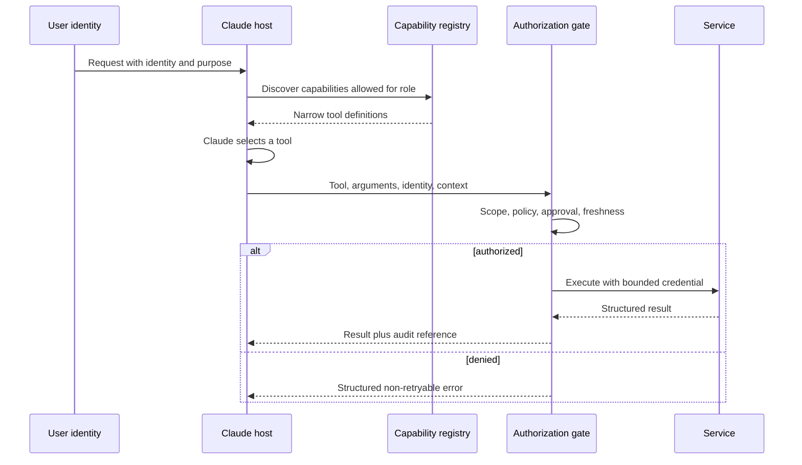

# Integration Protocols, Identity, and Least Privilege

> A tool is not safe because Claude uses it carefully. It is safe when the system refuses unauthorized use.

**Type:** Build
**Languages:** Python
**Prerequisites:** [End-to-End Architecture and Value Tradeoffs](../../23-end-to-end-architecture-and-value-tradeoffs/); Phase 13, Lessons 01, 05, 06, 16, and 18
**Time:** ~150 minutes

## Learning Objectives

- Choose direct API, CLI, MCP, or agent-to-agent integration from requirements
- Separate capability discovery from execution authorization
- Design least-privilege tool sets and identity propagation
- Return structured, actionable errors without leaking secrets
- Place approval, audit, and revocation controls at the execution boundary

## The Problem

A support agent can read tickets, draft replies, issue refunds, and delete user
accounts. Most support staff only need the first two capabilities. The team keeps
all four tools enabled and adds a prompt: "Never issue refunds or delete accounts
unless absolutely necessary."

This is not least privilege. The dangerous capability still exists, the model
still sees it, and prompt injection can still target it. Confirmation text can
reduce accidental use, but it cannot replace authorization.

The structural fix is smaller: do not expose capabilities the role does not
need, propagate the caller's identity, and enforce scope plus approval when a
tool executes.

## The Concept

### Choose an Integration Shape From the Boundary

The protocols overlap, but they solve different primary problems.

| Shape | Best fit | Main tradeoff |
|-------|----------|---------------|
| Direct API | Your application knows one service contract and needs low overhead | Tight service coupling and custom discovery |
| CLI | Local or CI automation around an executable | Process, environment, and output-management burden |
| MCP | A host needs standard discovery of tools, resources, or prompts across servers | Another protocol boundary and authorization model to operate |
| Agent-to-agent | One agent delegates a task to another autonomous service | Harder trust, identity, progress, and failure semantics |

MCP does not replace every API. A stable internal service call may be clearer and
faster as a direct API. MCP earns its place when several hosts need a common way
to discover and call capabilities, or when tool ownership should remain behind
a server boundary.

A CLI is useful for local developer workflows and CI, but long-running work
needs durable state, cancellation, and result retrieval beyond a fragile child
process. Agent-to-agent integration makes sense when the remote party owns an
autonomous task, not when it is simply a function endpoint.

### Separate Discovery, Selection, and Execution



Discovery controls what the model sees. Authorization controls what actually
happens. Both are necessary.

If discovery returns every tool, the model pays extra context and choice cost.
It also sees descriptions for dangerous operations. If authorization is missing,
hiding a tool is only obscurity. A caller may still reach the endpoint directly.

### Propagate Identity, Do Not Replace It

An application API key identifies the application. It does not automatically
represent the human user or service making the request.

Carry:

- principal ID
- tenant or organization
- authenticated session
- roles and scopes
- purpose or case identifier where policy requires it
- approval reference for elevated action
- request and trace IDs

Downstream systems should make their own authorization decision using trusted
identity claims. Do not grant a broad service credential and ask Claude to
simulate user permissions.

### Use Least Privilege at Four Levels

1. Tool set: expose only capabilities needed for the task and role.
2. Tool schema: accept only necessary arguments and constrain values.
3. Credential: grant only required service scopes and resources.
4. Action: re-check current policy, object ownership, and approval at execution.

Permissions change. Approval expires. A tool definition may have been loaded
minutes earlier. Execution-time authorization is the final control.

### Design Approval as a Capability

"Ask the user first" is ambiguous. A reliable approval contains:

- exact proposed action and parameters
- expected effect and reversibility
- requester identity
- approving identity and authority
- expiration time
- single-use or bounded-use semantics
- audit reference

After approval, execute the exact reviewed action. If arguments change, request
new approval.

### Return Structured Errors

Tools fail in ways that require different recovery.

```json
{
  "ok": false,
  "error": {
    "category": "authorization",
    "retryable": false,
    "message": "refunds:write scope is required",
    "safe_details": {
      "required_action": "request authorized human review"
    }
  }
}
```

Categories might include validation, authorization, not-found, conflict,
rate-limit, dependency, timeout, and internal. Tell the agent whether retry is
safe and what can change the outcome. Do not return raw stack traces, tokens, or
secret-bearing upstream messages.

### Progressive Discovery Reduces Capability Bloat

Large tool catalogs consume context and increase selection errors. Start with a
small stable set plus a search or registry mechanism. Load specialized tools
when the task establishes a need.

Progressive discovery should still enforce the principal's scope. Search must
not reveal the existence or description of capabilities the caller cannot know
about.

### MCP Scopes Do Not Define Business Authorization

MCP standardizes capability exchange. Your application still owns identity,
tenant isolation, consent, approval, policy, audit, and credential management.
Transport security is not authorization, and a successful protocol handshake
does not grant permission to every tool.

## Build It

## Interactive Lab

```figure
25-identity-permission-path
```

Use the permission-path explorer to follow identity from authenticated request
through capability discovery, model selection, execution-time authorization,
approval, service call, and audit. Changing scopes demonstrates why discovery
and authorization are separate controls.

## Practice Lab

Grant only discovery scope, attempt execution, then add a bound approval and
observe which decision changes and which boundary remains enforced.

## Shipped Artifact

[`outputs/least-privilege-review.json`](../outputs/least-privilege-review.json)
is a filled capability review showing visible tools and a structured denied
refund attempt.

## Verify It

Reproduce the behavior and run all authorization tests:

```bash
cd certifications/claude/lessons/25-integration-protocols-identity-and-least-privilege/code
python3 main.py
python3 -m unittest discover tests -v
```

The quiz checks protocol, identity, approval, and retry rules.

## Capstone Connection

Use the report as the Architect Professional capstone's identity and
least-privilege evidence.

The lab makes the boundary visible with standard-library Python.

```bash
cd certifications/claude/lessons/25-integration-protocols-identity-and-least-privilege/code
python3 main.py
python3 -m unittest discover tests -v
```

### Step 1: Select a Primary Shape

`select_protocol` requires one primary integration need. Dynamic discovery maps
to MCP, local automation to CLI, autonomous remote delegation to agent-to-agent,
and a known service call to direct API. Ambiguous requirements fail so an
architect must clarify the boundary.

### Step 2: Define Principal and Tool Contracts

`Principal` carries scopes and fresh approvals. `ToolContract` declares required
scopes, risk, and whether approval is required. The description explains the
behavior but does not authorize it.

### Step 3: Filter Discovery

`discover_tools` removes capabilities beyond the principal's scopes. A support
drafter never sees account deletion.

### Step 4: Authorize at Execution

`authorize` checks current scopes and approval. `execute_tool` refuses the call
with a structured non-retryable error when the check fails.

This toy system does not implement cryptographic identity, token verification,
or a policy engine. Those belong in production infrastructure. It does preserve
the placement of the decision.

## Use It

For the support system, create role-specific tool bundles:

- triage: read assigned ticket, classify, route
- responder: read ticket and policy, write draft
- refund reviewer: read case and recommendation, approve or reject
- refund executor: execute only a specific approved action
- administrator: account maintenance outside the support agent path

The model should not receive administrator tools just because one service can
provide them. A high-risk operation should use a short-lived credential tied to
the approved action and produce an immutable audit record.

When choosing MCP versus a direct API, write an ADR that compares:

- number and diversity of hosts
- need for dynamic discovery
- latency budget
- existing auth and SDK maturity
- deployment and ownership boundary
- streaming or long-running behavior
- observability and support burden

Protocol fashion is not a requirement.

## Exam Decision Patterns

If a role never needs a capability, remove it from the configuration. Logging
and confirmation are compensating controls, not least privilege.

Prefer answers that:

- propagate authenticated user or service identity
- scope tools and credentials narrowly
- authorize again at execution
- use fresh approval for high-impact actions
- return categorized, retry-aware errors
- choose a protocol from the integration boundary
- discover capabilities progressively when the catalog is large

Reject answers that assume a better prompt, larger model, or successful MCP
connection solves authorization.

## Common Traps

### One Service Account for Every User

The downstream service sees only broad application authority. Per-user limits
become prompt policy instead of enforceable policy.

### Confirmation Without Binding

The user approves a refund of 50 dollars, then the arguments change to 500.
Approval must bind to action, parameters, identity, and time.

### Tool Descriptions as Controls

Descriptions help selection. They are untrusted text from a security perspective
and can themselves carry prompt injection.

### Retrying Authorization Errors

Retries will not create permission. Mark the error non-retryable and route to
the proper approval or access process.

## Exercises

1. Add resource-level authorization so a principal can read only assigned
   tickets.
2. Create a signed, single-use approval record and reject changed arguments.
3. Define a progressive discovery interface that hides unauthorized tool names.
4. Compare MCP and direct API for three internal services with a 200 ms latency
   budget.
5. Red-team tool descriptions and results for indirect prompt injection.

## Key Terms

| Term | What people say | What it actually means |
|------|-----------------|------------------------|
| Authentication | Permission to act | Evidence of an identity |
| Authorization | A login | A decision about whether this identity may perform this action |
| Scope | A prompt rule | A bounded permission carried by a trusted credential or policy decision |
| Discovery | Authorization | Finding a capability, separate from permission to execute it |
| Least privilege | Add confirmation | Remove unnecessary capabilities and minimize every remaining authority boundary |
| Approval | User said yes | A time-bound, identity-bound authorization for exact action parameters |

## Further Reading

- [MCP specification](https://modelcontextprotocol.io/specification/latest) for current protocol behavior
- [MCP authorization specification](https://modelcontextprotocol.io/specification/latest/basic/authorization) for protocol-level authorization requirements
- [Claude tool use documentation](https://platform.claude.com/docs/en/agents-and-tools/tool-use/overview) for current tool contracts
- Phase 13, Lesson 05 for schema design
- Phase 13, Lesson 18 for production MCP authentication
- Phase 17, Lesson 25 for secrets and audit controls
