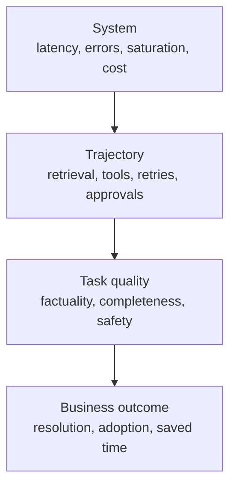

# Production Observability, Latency, and Cost

> A green API call can still be a failed task.

**Type:** Build
**Languages:** Python
**Prerequisites:** [RAG, Retrieval, and Data Pipelines](../../24-rag-retrieval-and-data-pipelines/); Phase 11, Lesson 10; Phase 17, Lessons 08, 13, and 27
**Time:** ~150 minutes

## Learning Objectives

- Separate system reliability from task quality and business outcome
- Design logs, metrics, and traces for Claude requests and agent trajectories
- Diagnose latency across model, retrieval, tools, queues, and retries
- Measure total cost and cost per successful outcome
- Define alerts and rollout gates from service objectives

## The Problem

A production dashboard reports 99.9 percent successful API calls. Customers are
still complaining.

The model returns HTTP 200, but some answers use stale sources. A tool times out
and the agent silently continues. Long prompts miss the cache because a timestamp
was placed near the beginning. P95 latency has doubled while the average looks
acceptable. A cheaper model lowered call price but increased retries and human
review.

The dashboard measures transport success. The product depends on task success.
Observability must connect the two.

## The Concept

### Observe Four Layers



System signals tell you whether components ran. Trajectory signals tell you what
the application did. Quality signals tell you whether the result met the task.
Business signals tell you whether the workflow created value.

Do not collapse them into one "success" field.

### Logs, Metrics, and Traces Have Different Jobs

Logs record discrete events: request accepted, retrieval returned no candidates,
tool rejected authorization, output failed schema validation, reviewer escalated.
Use structured fields so operators can group and filter them.

Metrics aggregate behavior over time: request rate, error rate, P95 latency,
token use, cache hits, retrieval recall, task pass rate, and cost per success.
They drive dashboards and alerts.

Traces connect the full trajectory. One trace should show model calls, retrieval,
tool execution, validation, retries, and human approval with parent-child timing.
Without the trace, a slow request looks like one opaque block.

### Trace the Semantic Contract

Capture enough information to reproduce and classify the outcome:

- trace, request, session, and user-safe identifiers
- application, prompt, model, tool, knowledge, and eval versions
- input class and risk tier
- token counts and cache reads or writes
- stop reasons and tool names
- tool duration and structured error category
- validation and policy decisions
- evaluator results and human edits
- final state and downstream outcome

Do not log secrets, raw credentials, or unnecessary personal data. For sensitive
inputs, store hashes, classes, counts, or access-controlled references instead
of plaintext.

### Separate System Success From Task Success

System success asks whether the request completed according to protocol. Task
success asks whether the output met the defined rubric. A valid JSON response can
be factually wrong. An agent can end normally without completing the requested
state change.

For agent systems, evaluate both:

- final state: did the intended artifact or system state exist?
- trajectory: were tools, permissions, evidence, and budgets used correctly?

Text matching alone misses both.

### Decompose Latency

End-to-end latency includes:

```text
queue + context assembly + model + retrieval + tools + validation + retries + approval
```

Track P50 and P95 at every major span. P50 describes the ordinary path. P95
exposes slow tools, long contexts, rate limits, and retries.

For streaming experiences, include time to first useful output. Time to first
token can look good while the user waits for citations, tool results, or a final
validated answer.

For background and batch systems, measure deadline completion and throughput.
A 30-second batch item can be acceptable if the entire job finishes within its
business window.

### Optimize From Evidence

Common latency interventions:

- route simple work to a faster suitable model
- reduce irrelevant context
- place stable prompt prefixes for caching
- retrieve fewer, better candidates
- run independent tool calls concurrently
- move non-interactive workloads to batch
- enforce time, turn, and retry budgets
- cache deterministic tool results where freshness permits

Each can change quality or safety. Measure the tradeoff on a representative
evaluation set.

### Measure Cost Per Successful Outcome

Token price is one component.

```text
total cost = model + cache writes and reads + tools + infrastructure + review + correction
cost per success = total cost / accepted task outcomes
```

Failed requests still cost money. So do safe rejections, retries, reviewer time,
and incident correction. Report input, output, cache, and tool costs separately
so the team can act on them.

Cost per successful outcome is the comparison that matters when selecting a
model or architecture variant.

### Understand Prompt Cache Shape

Prompt caching reuses a stable prefix. Changes near the front can invalidate
everything after them. Place stable tool definitions, system instructions, and
large reference material before dynamic user content when current documentation
supports that cache layout.

Track cache-read and cache-write tokens. A cache feature flag without a hit-rate
metric is not an optimization.

Tool definitions, model settings, thinking configuration, and other request
changes can affect cache behavior. Verify against current official documentation
because details evolve.

### Build Actionable Alerts

Alert on user and operator decisions, not every metric movement.

Good alerts include:

- task pass rate below SLO for a meaningful window
- safety control failure or unauthorized action attempt
- P95 latency exceeding user tolerance
- retrieval freshness lag
- tool error-category spike
- cache hit collapse after a deployment
- cost per success above budget
- evaluator disagreement or label drift

Every alert needs an owner, runbook, evidence link, and escalation path. If nobody
knows what action follows, it is dashboard decoration.

### Use Rollouts to Limit Evidence Risk

Offline evaluation is necessary, not sufficient. Production traffic contains new
queries, data, load, and integrations.

Use:

1. shadow evaluation with no user impact
2. small canary by tenant or traffic percentage
3. guarded expansion with automatic rollback
4. full rollout after quality, latency, cost, and safety gates pass

Compare against a stable baseline and stratify by task class. An aggregate gain
can hide a serious regression for a high-risk segment.

## Build It

## Interactive Lab

```figure
26-latency-cost-slo
```

Use the SLO explorer to change task success, cache rate, retry cost, P50, and
P95 independently. It exposes variants where cheaper calls or healthy transport
still fail the user, quality, or cost-per-success gate.

## Practice Lab

Add a cheap failed trace and observe cost per success increase even though unit
price falls. Then identify the first gate that should block rollout.

## Shipped Artifact

[`outputs/release-scorecard.json`](../outputs/release-scorecard.json) is a filled
baseline and candidate comparison with independent quality, latency, cache, and
economic gates.

## Verify It

Reproduce and test the aggregation:

```bash
cd certifications/claude/lessons/26-production-observability-latency-and-cost/code
python3 main.py
python3 -m unittest discover tests -v
```

The quiz checks diagnosis and rollout decisions.

## Capstone Connection

Carry the scorecard into the Architect Professional capstone's evaluation,
observability, and canary gates.

The lab aggregates synthetic trace records using only Python.

```bash
cd certifications/claude/lessons/26-production-observability-latency-and-cost/code
python3 main.py
python3 -m unittest discover tests -v
```

### Step 1: Represent One Task Trajectory

`Trace` stores a compact end-to-end record: variant, latency, token counts,
cost, system result, task result, cache state, and error category. A production
trace would contain child spans and access-controlled references rather than one
flat object.

### Step 2: Aggregate Without Hiding Failure

`summarize` reports system and task success separately. It calculates nearest-rank
P50 and P95, cache-read rate, error categories, total cost, and cost per task
success. Failed attempts remain in the cost numerator.

### Step 3: Compare Variants

`by_variant` prevents a cached or routed design from being averaged into the
baseline. Compare quality, latency, and cost together.

### Step 4: Evaluate Service Objectives

`evaluate_objectives` applies minimum task success and maximum latency and cost
thresholds. A variant must pass every required gate. Do not average a safety or
quality failure away with lower cost.

## Use It

Start with one production question: "Why did task success drop after release?"

Filter traces by application and release version. Stratify by input class. Check
system errors, then retrieval and tool spans, then validator and evaluator
results. Compare prompt, model, knowledge, and tool versions. Identify the
earliest divergence from the baseline trajectory.

If P95 latency rises while P50 stays stable, inspect slow-path behavior: retries,
rate limits, large inputs, tool timeouts, and approval waits. If cost rises with
stable token price, inspect call count, context length, cache hits, and review.

Keep a release scorecard:

| Gate | Baseline | Candidate | Required |
|------|----------|-----------|----------|
| Task pass rate | | | no regression in high-risk strata |
| Safety pass rate | | | 100 percent on hard controls |
| P95 latency | | | within SLO |
| Cost per success | | | within budget |
| Retrieval recall | | | within tolerance |
| Human review minutes | | | no hidden workflow burden |

## Exam Decision Patterns

If API success is high but users report bad results, add or inspect semantic
quality and trajectory evidence. If a document refresh precedes wrong answers,
trace retrieval before changing models.

Prefer answers that:

- use logs, metrics, and traces together
- separate transport, task, and business success
- monitor P95 rather than only averages
- compare cost per successful outcome
- version prompts, models, tools, and knowledge
- gate rollouts on quality, latency, cost, and safety
- give every alert an owner and runbook

## Common Traps

### Logging Full Prompts by Default

This can leak personal data, secrets, or regulated content. Record the minimum
safe evidence and keep sensitive references under access control.

### One Aggregate Quality Score

It can hide regressions by language, risk tier, task, or customer. Stratify.

### Average Latency

A small slow cohort can damage experience while the mean remains stable. Track
tail latency and timeout rate.

### Cost per Call

It rewards cheap failures. Use cost per accepted outcome and include review and
correction.

## Exercises

1. Extend the lab with child spans for retrieval and two tools.
2. Add input-risk strata and prove an aggregate improvement can hide a critical
   regression.
3. Create a cache-invalidation experiment and measure hit rate, P95, and cost.
4. Design an alert for tool authorization failures with an owner and runbook.
5. Write a canary policy that rolls back on any hard-control failure.

## Key Terms

| Term | What people say | What it actually means |
|------|-----------------|------------------------|
| Log | Debug text | A structured event with safe evidence and identifiers |
| Metric | Any number | An aggregation over time used to understand or control behavior |
| Trace | A request ID | The connected timing and outcome of a full trajectory |
| Task success | HTTP 200 | The requested outcome met its rubric and constraints |
| P95 latency | Slowest request | The value at or below which 95 percent of measured requests complete |
| Cost per success | Model price | Total expected cost divided by accepted task outcomes |

## Further Reading

- [Claude usage and cost API documentation](https://platform.claude.com/docs/en/build-with-claude/usage-cost-api) for current usage reporting
- [Prompt caching documentation](https://platform.claude.com/docs/en/build-with-claude/prompt-caching) for current cache behavior
- Phase 17, Lesson 13 for LLM observability
- Phase 17, Lesson 27 for LLM financial operations
- Phase 17, Lessons 20 and 21 for progressive delivery and A/B testing
