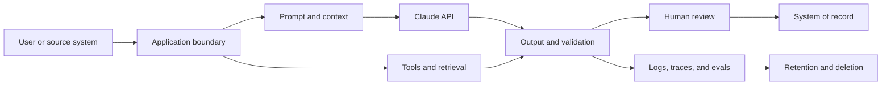

# Enterprise Governance, Compliance, and Human Review

> Governance is the system that decides who may take which risk with whose data.

**Type:** Reference
**Languages:** Python
**Prerequisites:** [Put Authority Around Capability](../../06-governance-safety-and-responsible-use/), [Integration Protocols, Identity, and Least Privilege](../../25-integration-protocols-identity-and-least-privilege/); Phase 17, Lesson 26
**Time:** ~150 minutes

## Learning Objectives

- Convert policy and regulatory obligations into owned technical controls
- Classify data and map it across prompts, tools, storage, logs, and review
- Design human review from risk, authority, and reversibility
- Evaluate bias, fairness, transparency, and contestability in context
- Build evidence for approval, monitoring, incident response, and audit

## The Problem

A healthcare team proposes a Claude workflow that summarizes patient messages,
recommends a routing category, and drafts a response. The design document says:
"The model does not retain data, all outputs are reviewed by a human, and the
system complies with HIPAA."

None of those statements is an architecture.

Data may appear in API payloads, files, caches, batch storage, logs, traces,
support systems, and reviewer tools. "Human review" says nothing about reviewer
qualification, evidence, workload, or authority. Compliance depends on the
specific use, contracts, configuration, region, controls, and legal analysis.
An architect cannot declare it with one sentence.

The right response is not automatic rejection. It is a governed design with a
data map, risk decisions, control owners, evidence, and escalation to security,
privacy, legal, clinical, or compliance experts where required.

This lesson teaches architecture judgment. It is not legal advice.

## The Concept

### Start With a Risk Decision

Governance begins by identifying:

- decision or action the system influences
- people who can benefit or be harmed
- data classes involved
- error and abuse modes
- reversibility
- required authority
- applicable organizational and external obligations
- owner who accepts residual risk

Do not start with a generic list of guardrails. A content filter, approval queue,
or encryption control is valuable only when it addresses a named risk at a
specific boundary.

### Map Data Through the Whole System



For each edge and store, record:

- data category and purpose
- source and data subject where relevant
- fields required versus optional
- identity and access
- encryption and key ownership
- provider and subprocessor boundary
- region or residency requirement
- retention and deletion behavior
- use in model improvement or evaluation
- incident and access-audit evidence

Product features can have different retention and eligibility behavior. Files,
batch processing, code execution, MCP connectors, hosted sessions, and standard
Messages requests may not share the same boundary. Check current official
documentation and your agreement for the exact feature combination.

### Minimize Before Protecting

Security controls are stronger when unnecessary data never enters the system.

Apply this order:

1. Remove fields the task does not need.
2. Pseudonymize or aggregate where identity is not required.
3. Restrict the feature or provider boundary from explicit requirements.
4. Limit identity, scope, retention, and logs.
5. Protect remaining data with encryption, monitoring, and incident controls.

"Tell Claude not to remember" is not a retention control. Configuration and
contractual behavior define retention.

### Build a Control Matrix

Controls fall into several types.

| Type | Purpose | Example |
|------|---------|---------|
| Preventive | Stop an unsafe event | Scope gate blocks an unauthorized write |
| Detective | Reveal a problem | Alert on sensitive-field leakage in sampled outputs |
| Corrective | Limit or repair harm | Revoke access, roll back model route, correct affected record |
| Governance | Assign and review authority | Named owner re-approves the use case after material change |

For each control, record owner, implementation, evidence, test, failure response,
and review frequency. A control without an owner and test is a hope.

### Layer Model and System Guardrails

Use several boundaries:

- input validation and classification
- trusted-source separation from untrusted content
- prompt instructions and examples
- minimal tool exposure
- authentication and authorization
- schema and semantic output validation
- action limits and approvals
- post-deployment monitoring and red-team tests

Prompt guardrails influence generation. System guardrails enforce invariants.
Neither replaces the other.

### Design Human Review as a Control

Human-in-the-loop is useful when the reviewer can improve the decision and has
the information, time, competence, and authority to do it.

Define:

- trigger: risk class, low evidence, conflict, uncertainty, or sampled case
- reviewer: role and qualification
- packet: source evidence, model output, tool trajectory, flags, and proposed action
- decision: approve, edit, reject, escalate, or request evidence
- service level: time budget and queue capacity
- fallback: safe behavior if review is unavailable
- audit: identity, rationale, timestamp, and final action

Avoid automation bias. Reviewers need a reason to inspect the evidence, not a
polished answer that encourages rubber-stamping. Consider showing source excerpts
before generated conclusions, or requiring structured reason codes.

### Match Review to Risk

| Risk | Example | Review pattern |
|------|---------|----------------|
| Low | Internal draft with easy undo | Automated checks plus sampled review |
| Medium | Customer-facing recommendation | Threshold or exception review |
| High | Financial, legal, clinical, or destructive action | Qualified approval before action |
| Unknown | New use case or weak evidence | Hold, escalate, and gather evidence |

Confidence emitted by the same model is not a reliable safety boundary. Use
observable evidence, calibrated evaluators, deterministic conditions, and
qualified review.

### Treat Fairness as a Contextual Requirement

Bias means systematic error or representation that can disadvantage people.
Fairness is not one universal metric.

Ask:

- What decision is being made?
- Which groups may experience different error rates or access?
- Which protected or sensitive attributes are present, inferred, or proxied?
- Which fairness definition fits the legal and ethical context?
- What tradeoffs exist with accuracy, privacy, and individual treatment?
- Who has authority to choose and review the criterion?

Test representative slices and intersectional groups where appropriate. Small
sample sizes create uncertainty, which should be reported rather than hidden.

### Provide Transparency and Contestability

People need different explanations.

- End users need to know when AI materially influences an interaction and how
  to challenge a harmful outcome.
- Reviewers need evidence, uncertainty, and control context.
- Operators need versions, traces, and failure categories.
- Auditors need policy mapping, tests, ownership, and retained evidence.
- Executives need residual risk, business impact, and decision status.

Do not expose chain-of-thought or sensitive system instructions as an
explanation. Provide source-based reasons, applied rules, relevant factors, and
the human appeal path.

### Plan for Change

Reassess when any material element changes:

- use case or affected population
- model or provider
- prompt or tool authority
- data source, retention, or region
- evaluation result or incident pattern
- law, policy, or contract
- deployment scale

Version the risk assessment and control evidence. A launch approval does not
cover an unrelated future system.

## Build It

## Interactive Lab

```figure
27-governance-approval-flow
```

Use the approval-flow explorer to vary consequence, reversibility, evidence,
reviewer qualification, queue capacity, and fallback. It makes visible when a
human review label is a real control and when it is only a bottleneck.

## Practice Lab

Remove the review fallback or one control owner from a copy of the packet,
observe the blocked state, and repair the governance design.

## Shipped Artifact

The filled [`outputs/governance-control-packet.md`](../outputs/governance-control-packet.md)
contains a risk register, data boundary, preventive, detective, corrective, and
governance controls, plus a staffed approval path.

## Verify It

Verify its ownership and failure response deterministically:

```bash
cd certifications/claude/lessons/27-enterprise-governance-compliance-and-hitl
python3 code/main.py
python3 -m unittest discover -s code/tests -v
```

The quiz checks governance and reassessment decisions.

## Capstone Connection

Carry this packet into the Architect Professional capstone's governance and
human-review section.

Create a governance packet for a high-impact Claude workflow.

### Step 1: Risk Register

```markdown
| Risk | Cause | Affected party | Impact | Likelihood | Control | Owner | Residual risk |
|------|-------|----------------|--------|------------|---------|-------|---------------|
```

Include accidental failure, misuse, prompt injection, insider access, dependency
failure, stale knowledge, unfair performance, and reviewer overload.

### Step 2: Data Map

List every payload, store, log, cache, evaluation set, human interface, and
external service. Mark data purpose, minimum fields, retention, deletion,
identity, region, and contractual boundary.

### Step 3: Control Matrix

```markdown
| Control | Risk addressed | Boundary | Owner | Evidence | Test | On failure |
|---------|----------------|----------|-------|----------|------|------------|
```

Include at least one preventive, detective, corrective, and governance control.

### Step 4: Human Review Design

Specify triggers, reviewer qualifications, evidence packet, actions, queue SLO,
fallback, and audit record. Calculate expected review volume. If the queue cannot
meet the SLO, the design is incomplete.

### Step 5: Approval and Reassessment

Name the technical, security, privacy, domain, and business decisions that need
separate owners. Define material-change triggers and the next review date.

## Use It

For the patient-message workflow, a safer first release might draft a routing
recommendation for a qualified reviewer without sending a response or changing
the medical record. It uses minimum necessary fields, trusted clinical sources,
strict tenant and role authorization, source-linked output, high-risk keyword
and evidence checks, and a safe fallback when the reviewer queue is unavailable.

The team then validates:

- task accuracy by message class
- false-negative behavior for urgent cases
- demographic and language slices where permitted and appropriate
- source support and stale-data handling
- reviewer agreement, time, and overrides
- privacy, access, retention, and deletion controls
- incident, rollback, and audit behavior

Legal, privacy, security, and clinical owners decide whether the resulting
evidence satisfies the applicable obligations. The architect supplies the map,
controls, tests, and residual-risk statement.

## Exam Decision Patterns

When a scenario includes regulated or sensitive data, do not infer that an
internal use is automatically allowed. Minimize, classify, verify policy and
contract, and involve the proper authority.

Prefer answers that:

- remove or anonymize unnecessary identifiers
- map feature-specific data boundaries and retention
- layer model and deterministic controls
- bind high-impact actions to qualified approval
- test representative slices and adverse cases
- provide evidence and an appeal or escalation path
- name control owners and reassessment triggers

Avoid answers that treat a prompt, model confidence, generic review, or vendor
claim as complete governance.

## Common Traps

### Compliance by Product Name

Eligibility can depend on feature, configuration, agreement, region, and data
flow. Verify the exact architecture.

### Human Review as a Checkbox

An unqualified or overloaded reviewer without evidence cannot reliably reduce
risk.

### Logging for Audit Without Minimization

Verbose logs can create a new sensitive data store. Retain the minimum evidence
under appropriate access and deletion controls.

### One Fairness Metric

Different fairness definitions can conflict. Choose from context, law, harm, and
stakeholder decision, then report tradeoffs.

## Exercises

1. Build a data map for a support workflow using files, an MCP connector, batch
   evaluation, and human review.
2. Design a review queue for 10,000 daily tasks with a 5 percent trigger rate and
   calculate staffing assumptions.
3. Write a control test that proves unauthorized tenant data never reaches model
   context.
4. Define a contestability path for a user harmed by an AI-assisted decision.
5. Create material-change criteria that force governance reassessment.

## Key Terms

| Term | What people say | What it actually means |
|------|-----------------|------------------------|
| Governance | A policy document | Decisions, ownership, controls, evidence, and review over a system lifecycle |
| Data minimization | Encrypt everything | Do not collect or send fields the purpose does not require |
| Human-in-the-loop | A person sees output | A defined control with trigger, qualified owner, evidence, authority, and fallback |
| Residual risk | A hidden problem | Risk remaining after controls, explicitly accepted by an authorized owner |
| Fairness | Equal accuracy | A context-specific criterion with tradeoffs and affected stakeholders |
| Contestability | Customer support | A meaningful path to challenge, review, and correct an outcome |

## Further Reading

- [Claude API data retention documentation](https://platform.claude.com/docs/en/manage-claude/api-and-data-retention) for current feature-specific boundaries
- [Anthropic Trust Center](https://trust.anthropic.com/) for current security and compliance materials
- [Claude's Constitution](https://www.anthropic.com/constitution) for Anthropic's public model-behavior framework
- Phase 17, Lesson 26 for compliance architecture
- Phase 18, Lessons 20 and 21 for bias and fairness
