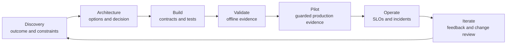

# Stakeholder Communication, ADRs, and Lifecycle Ownership

> An architecture is not delivered when the diagram is finished. It is delivered when the next owner can operate the decision.

**Type:** Reference
**Languages:** Python
**Prerequisites:** [Business Discovery, Requirements, and SLAs](../../22-business-discovery-requirements-and-slas/), [Enterprise Governance, Compliance, and Human Review](../../27-enterprise-governance-compliance-and-hitl/); Phase 17, Lesson 23
**Time:** ~135 minutes

## Learning Objectives

- Communicate one architecture at executive, product, engineering, and control levels
- Write decision records that preserve tradeoffs and reversal conditions
- Turn a design into implementation guidance, rollout gates, and named ownership
- Define handoff acceptance and operational readiness
- Run feedback and change management across the system lifecycle

## The Problem

An architect presents a detailed multi-agent diagram to an executive steering
group. The diagram contains model routes, MCP servers, vector indexes, event
queues, evaluators, and tracing. Nobody can answer three basic questions:

- What business decision is being approved?
- Which risk remains after the proposed controls?
- Who owns the system after launch?

The same design is later handed to engineering as a slide. Critical choices
live only in meeting memory. Operations receives no SLO or rollback rule. The
policy team does not know it owns knowledge freshness. Reviewers discover their
queue only during the pilot.

The design can be technically correct and still be undeliverable. Communication
and lifecycle ownership are architecture responsibilities.

## The Concept

### One System Needs Several Views

Different stakeholders need different decisions, not different truths.

| Audience | Primary question | Minimum evidence |
|----------|------------------|------------------|
| Executive | Is the value worth the residual risk and investment? | outcome, baseline, target, options, cost range, risk decision |
| Product and operations | How does the workflow and user experience change? | journey, exceptions, review, SLOs, adoption plan |
| Engineering | What must be built and how do boundaries behave? | components, contracts, identity, errors, versions, tests |
| Security and privacy | Where do data and authority cross boundaries? | data map, threat model, controls, retention, evidence |
| Domain owner | Is the output valid for the real task? | evaluation cases, sources, policy, escalation, change ownership |
| SRE and support | How is failure detected, limited, and recovered? | telemetry, alerts, runbooks, rollback, dependencies |

Do not simplify by removing the decision. Translate the same decision into the
evidence each audience uses.

### Build an Architecture Narrative

A useful review follows a decision sequence:

1. Current workflow and measurable problem.
2. Constraints and risks that shape the solution.
3. Options considered.
4. Recommended architecture and why it wins.
5. Consequences and rejected alternatives.
6. Verification and rollout plan.
7. Residual risk and approvals required.
8. Ownership through operation and change.

Leading with a component diagram forces the audience to reconstruct this logic.
Give them the logic first.

### Use Diagrams to Answer One Question



A context diagram answers who and what crosses the system boundary. A data-flow
diagram answers where sensitive data moves. A sequence diagram answers how one
trajectory works. A deployment diagram answers runtime ownership. A control
map answers where risk is prevented, detected, and corrected.

One overloaded diagram answers none of them well.

### Record Decisions, Not Meeting Transcripts

An ADR should be short enough to read and complete enough to revisit.

Required fields:

- status and decision owner
- context and constraints
- options and evidence
- decision and rationale
- consequences and residual risk
- rejected alternatives
- verification plan
- reversal conditions and review date

The rejected alternatives matter. Without them, a future team repeats the same
analysis or changes the design without understanding which constraint it breaks.

Use explicit confidence. "We estimate" is more honest and useful than presenting
an untested latency or cost number as fact.

### Turn Architecture Into Contracts

Implementation guidance needs machine-checkable boundaries:

- request and response schemas
- identity and authorization requirements
- versioning and compatibility rules
- timeout, retry, cancellation, and idempotency behavior
- structured error categories
- data classification and retention
- prompt, model, tool, and knowledge ownership
- evaluation fixtures and release gates
- observability fields and redaction

An architecture packet should point to these contracts. It should not duplicate
every line of implementation.

### Define Ownership by Decision

"The AI team owns it" is too broad.

Name owners for:

- business outcome
- product workflow and user communication
- prompt and output contract
- model selection and routing
- tool and integration service
- knowledge-source freshness
- identity and permissions
- evaluation labels and acceptance thresholds
- safety and compliance controls
- runtime SLO and incident response
- vendor and cost management
- deprecation and retirement

Separate the person who recommends a change from the person authorized to accept
its risk.

### Design Handoff Acceptance

Handoff is complete when the receiving team can operate and change the system
safely, not when a document link is sent.

Acceptance criteria:

- owners and escalation contacts confirmed
- architecture and ADRs current
- dependencies and access provisioned
- dashboards and alerts live
- runbooks rehearsed through failure drills
- evaluation suite runnable and baselines stored
- rollback tested
- data retention and deletion verified
- reviewer queue staffed
- known limitations communicated
- change and incident processes agreed

Use a joint acceptance review. The receiving owner should demonstrate recovery
from a simulated failure.

### Plan Adoption as Part of the Workflow

AI systems change how people work. Training only on the interface is insufficient.
Users need to know:

- which tasks are in scope
- what evidence to inspect
- when to edit, reject, or escalate
- which data may be entered
- what the system records
- how to report harmful or incorrect behavior
- what happens when the service is unavailable

Measure adoption with outcome and quality, not logins alone. A high usage number
can reflect forced process or repeated rework.

### Communicate Incidents by Impact and Decision

During an incident, separate confirmed fact, current impact, mitigation, and
unknowns.

```text
Impact: Which users, tasks, or records may be affected?
Evidence: What telemetry or evaluation confirms it?
Containment: What capability is disabled or routed safely?
Recovery: What must pass before restoration?
Follow-up: Which control, owner, or assumption changes?
```

Do not speculate about model intent. Describe observable system behavior and
the control response.

### Keep Lifecycle Evidence Connected

Each production outcome should be traceable to:

- requirement and decision
- system and configuration version
- test and approval evidence
- deployment and runtime trace
- human review or override
- downstream outcome
- change request if the evidence reveals a problem

This chain supports debugging, governance, and rational iteration.

## Build It

## Interactive Lab

```figure
28-adr-lifecycle
```

Use the ADR lifecycle explorer to move one decision from discovery through
build, validation, pilot, operation, incident, and reconsideration. Change the
evidence or reversal condition and observe which owner must act next.

## Practice Lab

Fail the stale-retrieval tabletop drill, trace the changed evidence to its
decision owner, and update the ADR instead of editing only the diagram.

## Shipped Artifact

The filled [`outputs/delivery-handoff-packet.md`](../outputs/delivery-handoff-packet.md)
connects an executive decision, ADR, engineering contracts, operations drill,
and ownership map.

## Verify It

Verify its decisions, owners, recovery proof, and measurable reversal trigger:

```bash
cd certifications/claude/lessons/28-stakeholder-communication-adrs-and-lifecycle
python3 code/main.py
python3 -m unittest discover -s code/tests -v
```

The quiz checks communication and lifecycle decisions.

## Capstone Connection

Use the verified delivery packet as the final handoff section of the Architect
Professional capstone.

Create a delivery packet with five artifacts.

### 1. Executive Decision Brief

One page: problem, baseline, target, options, recommendation, investment range,
top risks, verification, and decision requested.

### 2. Architecture Decision Record

Capture the selected pattern and at least two rejected alternatives. Include
reversal conditions.

### 3. Engineering Contract Index

```markdown
| Boundary | Contract | Owner | Version rule | Failure rule | Test |
|----------|----------|-------|--------------|--------------|------|
```

### 4. Operational Readiness Checklist

Include dashboards, alerts, runbooks, access, evaluation, rollback, dependencies,
review capacity, and incident communication.

### 5. Ownership and Change Map

```markdown
| Decision or asset | Operating owner | Change approver | Evidence | Review trigger |
|-------------------|-----------------|-----------------|----------|----------------|
```

Run a tabletop exercise. Simulate stale retrieval causing unsafe recommendations,
a failed authorization service, and evaluator drift. The receiving team should
identify impact, contain the capability, recover from a known-safe version, and
record follow-up ownership.

## Use It

For an enterprise research assistant, provide these views:

- Executive: reduced analyst cycle time, evidence quality target, budget, and
  residual confidentiality risk.
- Product: query journey, insufficient-evidence state, citation experience, and
  feedback path.
- Engineering: retrieval, model, tool, identity, and evaluation contracts.
- Security: tenant boundary, source permissions, logs, retention, and incident
  controls.
- Operations: freshness, latency, cost, error, and quality dashboards with
  rollback rules.

The facts remain consistent. The detail follows the decision each audience owns.

At the end of the pilot, review more than accuracy. Compare analyst time, citation
inspection, reviewer workload, adoption by task class, cost per accepted report,
and incidents. Decide to expand, revise, constrain, or stop.

## Exam Decision Patterns

When a scenario asks how to communicate tradeoffs, state business consequence,
technical evidence, rejected alternatives, and residual risk in language suited
to the audience.

Prefer answers that:

- run structured discovery before commitment
- document context, options, and consequences
- assign owners to prompts, data, tools, controls, metrics, and operations
- define implementation and failure contracts
- require operational readiness and handoff acceptance
- connect feedback to versioned change decisions

Avoid answers that hand over a diagram without SLOs, runbooks, evaluators,
ownership, or rollback.

## Common Traps

### One Deck for Every Audience

Either executives drown in implementation or engineers receive vague claims.
Use consistent views tuned to decisions.

### Architecture as a Launch Artifact

Architecture changes with evidence, scale, dependencies, and risk. Keep decisions
and diagrams versioned through operation.

### Ownership by Team Name

A team label does not identify who updates a stale source, accepts an eval change,
or responds to an alert. Assign concrete decisions.

### Adoption Equals Value

Usage can rise while quality, review burden, or total handling time worsens.
Measure the outcome.

## Exercises

1. Turn a technical architecture into a one-page executive decision brief.
2. Write an ADR with a measurable reversal condition.
3. Create a handoff drill for a tool that begins returning partial results.
4. Assign owners for every changeable artifact in a RAG application.
5. Design an adoption scorecard that includes quality, rework, and user trust.

## Key Terms

| Term | What people say | What it actually means |
|------|-----------------|------------------------|
| Stakeholder | Anyone invited to a meeting | A person or group who owns, affects, or bears a decision or outcome |
| ADR | Architecture documentation | A focused record of one decision, its context, alternatives, and consequences |
| Handoff | Send the documents | Transfer operational ability and accepted responsibility with evidence |
| Operational readiness | Deployment succeeded | Owners, controls, observability, recovery, evaluation, and support are proven |
| Adoption | Number of users | Sustained workflow use that produces the intended outcome without hidden burden |
| Reversal condition | Lack of confidence | Evidence that triggers a planned architecture or scope change |

## Further Reading

- [Claude Platform documentation](https://platform.claude.com/docs/en/home) for current implementation boundaries
- [Building effective agents](https://www.anthropic.com/research/building-effective-agents) for explaining workflow and agent choices
- Phase 17, Lesson 23 for SRE practices
- Phase 14, Lesson 40 for structured technical handoffs
- Phase 17, Lesson 24 for incident response and operational recovery
