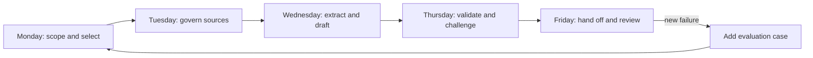

# Ship a Week of Work, Not a Perfect Prompt

> Your capstone is a governed decision workflow: sources in, claims checked, human authority preserved, and state handed off.

**Type:** Build
**Languages:** Python
**Prerequisites:** [Choose the Smallest Surface That Can Carry the Work](../../01-claude-product-and-model-landscape/), [Turn a Request Into a Testable Contract](../../03-prompting-and-task-decomposition/), [Put Each Fact in the Right Kind of Context](../../04-context-knowledge-memory-and-caching/), [Validate the Claim, Not the Confidence](../../05-output-evaluation-and-validation/), [Put Authority Around Capability](../../06-governance-safety-and-responsible-use/), [Design the Handoff Before the Automation](../../07-workflow-design-and-human-handoffs/)
**Time:** ~4 hours across one simulated workweek

## Learning Objectives

- Combine product selection, prompting, knowledge management, validation, governance, troubleshooting, and handoff design.
- Build a source-backed weekly briefing workflow with explicit checkpoints.
- Implement a deterministic Python validator for sources, claims, governance, and handoff readiness.
- Run normal and failure cases before recommending release.
- Produce evidence of readiness instead of claiming that a workflow is safe.

## The Problem

You are the operations lead at Northstar Field Services, a fictional company with seven regional teams. Every Friday, the leadership group needs a brief covering service delays, customer-impacting incidents, policy exceptions, and two decisions for the next week.

The current process is fragile. Regional leads send updates in different formats. An analyst copies facts into a document, reconciles conflicting dates, and asks three people for approval. The final brief sometimes misses a region or carries a corrected number from an old message.

Leadership asks you to "automate the weekly report with Claude." That request is not a solution. The brief affects staffing and customer communications. Some inputs contain customer details. Policy exceptions need an authorized owner. A confident draft without evidence could accelerate the wrong decision.

Your job is to design a bounded Claude-assisted workflow. Claude may extract, compare, and draft. Deterministic checks verify exact properties. An authorized person owns publication and consequential decisions.

## The Concept

### The deliverable is a chain of proof

You will produce five connected artifacts:

1. A use-case and product-selection record.
2. A maintained source registry and fixed weekly snapshot.
3. A staged prompt contract.
4. A claim-evidence and governance validation result.
5. A human handoff packet with fallback.



Each day ends at a gate. If the gate fails, do not push uncertainty downstream.

### The Python validator is intentionally limited

The capstone code does not call Claude. It demonstrates a crucial architecture boundary: exact workflow properties belong in deterministic code.

The validator checks whether:

- Required packet sections exist.
- Every active source has an owner, authority, date, sensitivity, and stable ID.
- Claims reference known sources.
- Consequential claims use direct or calculated support.
- Stale and conflicting evidence is visible.
- The chosen surface is approved for the data class.
- High-consequence or irreversible work has an authorized human owner.
- The handoff names a decision, deadline, fallback, and next owner.

It cannot decide whether a policy is ethically sufficient, whether the human reviewer is competent, or whether a source statement is true. Those remain organizational and human responsibilities.

## Build It

## Interactive Lab

```figure
29-associate-capstone-readiness
```

Use the readiness board throughout the five-day build. It connects purpose,
sources, prompt stages, claim support, authority, handoff, and fallback so a
polished brief cannot hide a failed gate.

## Practice Lab

Complete the five-day workflow below, then deliberately break the surface,
source, claim-support, authority, and handoff gates one at a time.

## Shipped Artifact

The shipped checklist and filled
[`outputs/demo-readiness-report.json`](../outputs/demo-readiness-report.json)
are the practical outputs.

## Verify It

Reproduce the passing packet and all failure-first tests with the commands below;
no network access or credentials are required. The lesson quiz is the final
individual check.

## Capstone Connection

The completed packet is the Associate route capstone evidence reviewed by
another person.

### Monday: scope the decision and product surface

Write one sentence for the decision:

```text
By Friday at 15:00, the operations director will choose no more than two
staffing or process changes for the following week using the approved regional snapshot.
```

Define what is out of scope:

- No automatic customer messages.
- No employee performance ranking.
- No changes to staffing schedules.
- No legal or regulatory conclusion.
- No use of restricted data.

Compare candidate surfaces. A one-off chat is easy, but weak for maintained instructions and a recurring source set. A Project may fit collaborative, repeated work if its current terms, plan controls, and data handling are approved. The API may fit when programmatic ingestion, validation, and audit integration are required. Research is useful for current external facts, not for replacing internal approved policy.

Record the decision, not just the product name:

```text
Surface:
Why it fits:
Data class allowed:
Current terms checked on:
Unsupported requirements:
Fallback surface or manual path:
```

Gate: the owner approves the purpose, surface, data class, and prohibited actions.

### Tuesday: freeze and govern the evidence

Create a source registry for:

- Seven regional status files.
- The incident system export.
- The approved service policy.
- The staffing-capacity table.
- The prior week's decision record.

Every source needs a stable ID, owner, authority class, effective date, review date, and sensitivity. Mark discussion notes as reference, not policy. Remove customer names if the decision does not require them.

Freeze the weekly source snapshot at a documented time. A fact that changes afterward belongs in a revision or exception process. Otherwise the draft, reviewer, and leader may each see a different world.

Define authority order:

```text
1. Approved service policy and signed incident status
2. Current regional status submitted before the cutoff
3. Prior decision record
4. Discussion notes, for leads only and never as sole support
```

Gate: all seven regions are present or explicitly marked missing; sources pass freshness and permission checks; conflicts have an owner.

### Wednesday: decompose the work

Do not ask for the final brief in one step. Use four bounded stages.

**Stage 1, extraction:** Return structured rows for region, delay, affected service, incident ID, policy exception, source ID, and uncertainty. Do not recommend action.

**Stage 2, reconciliation:** Check region coverage, totals, duplicate incidents, date conflicts, and unsupported fields. Stop if a blocker remains.

**Stage 3, analysis:** Identify patterns and propose no more than three candidate actions. Each action needs supporting findings, policy constraints, likely benefit, downside, and an owner who could authorize it.

**Stage 4, drafting:** Produce the executive brief only from validated rows and approved analysis. Include decisions required, evidence, exceptions, and known uncertainty.

Use a prompt contract for every stage. Include source hierarchy, abstention behavior, output shape, and acceptance criteria. Save versions so a failed result can be reproduced.

Gate: structured extraction reconciles with the snapshot before analysis begins.

### Thursday: validate and challenge

Run the included validator:

```bash
cd certifications/claude/lessons/29-associate-workflow-capstone
python3 code/main.py
```

The demonstration packet should return a `ready_for_human_review` status. Now break it deliberately:

- Set `approved_surface` to false.
- Remove a source owner.
- Reference a source ID that does not exist.
- Mark a consequential claim as speculative.
- Remove the decision owner.
- Make the action irreversible.

Run the unit tests:

```bash
python3 -m unittest discover -s code/tests -v
```

Then create a claim-evidence matrix for the actual draft. A citation must support the exact claim. Verify totals with code or a spreadsheet, not a model grader. Give a separate reviewer the rubric and evidence. Ask it to report findings, not silently rewrite the draft.

Use release levels:

- **Block:** unapproved data or surface, unknown source, invalid total, unsupported consequential claim, missing decision authority.
- **Revise:** incomplete coverage, unresolved conflict, stale source, unclear uncertainty.
- **Quality improvement:** repetition, weak heading, or noncritical tone issue.

Gate: every blocker is resolved. Remaining uncertainty is visible in the human packet.

### Friday: hand off and close the loop

Complete [`outputs/checklist.md`](../outputs/checklist.md). Build the review packet:

```text
Decision: Choose up to two next-week interventions.
Owner: Operations director.
Deadline: Friday 15:00.
Snapshot: Weekly source registry version and cutoff.
Candidate: Brief version and prompt version.
Evidence: Claim IDs, source IDs, calculations.
Checks: Passed, failed, and manually reviewed.
Uncertainty: Missing region, conflicting date, or weak support.
Options: Approve, revise, reject, escalate.
Fallback: Publish the manual template or delay with notice.
```

The director approves the decision, not "the AI." Record who approved what, based on which snapshot. If the source changes after approval, invalidate the publication gate and review the delta.

After the simulated release, run a short retrospective:

- Which stage consumed the most human time?
- Which check caught the most serious defect?
- Did any important judgment become harder?
- Which source needs better ownership?
- Which failure should enter the evaluation set?
- Should the workflow remain assisted, move to limited automation, or return to manual?

## Use It

### A complete evidence package

Your submission should contain:

- A surface-selection record with verification date.
- A ten-source registry or a smaller equivalent with every required source class represented.
- Four prompt-stage contracts.
- At least ten evaluation cases: four normal, three edge, three governance or adversarial.
- A claim-evidence matrix for every consequential claim.
- Validator output for one passing and three failing packets.
- Passing unit-test output.
- A completed human handoff checklist.
- A one-page retrospective with one concrete workflow change.

### Capstone decision patterns

Use these when reviewing your work or answering exam scenarios:

1. **No approved purpose, stop.** Capability does not create permission.
2. **No authoritative evidence, abstain or escalate.** More prompting does not create a source.
3. **Exact property, deterministic check.** Totals and schemas do not need subjective grading.
4. **High consequence, human authority.** Give the person evidence and power to reject.
5. **Repeated failure, repair the system.** Add a case, control, or source rule.
6. **Changeable product fact, verify live.** Record surface, date, and source.

### Common traps

- **Starting with the final prompt:** Scope and source failures become prose problems.
- **Uploading the archive:** Superseded evidence competes with active policy.
- **Trusting citation syntax:** The cited source may not entail the claim.
- **Letting the reviewer rediscover state:** Handoff time consumes the promised savings.
- **Automating publication first:** Reversibility and authority are ignored.
- **Treating tests as proof of safety:** Unit tests cover implemented rules, not organizational truth.
- **Freezing current product details in the design:** Terms, features, models, costs, and limits drift.

### Exercises

1. Replace the fictional scenario with one real recurring task, preserving the five-day gates.
2. Add a validator rule for a policy unique to your workflow.
3. Write a failing test before implementing that rule.
4. Compare one giant prompt with the four-stage flow across the same ten cases.
5. Ask a reviewer to complete the handoff using only your packet. Record every fact they had to request.
6. Calculate cost per accepted brief, including review and rework time.

## Key Terms

- **Decision workflow:** A sequence that turns governed evidence into a reviewed action or recommendation.
- **Source snapshot:** The fixed, versioned evidence set used for one run.
- **Consequential claim:** A claim that materially affects a decision or action.
- **Validation packet:** Structured sources, claims, governance, and handoff state checked before release.
- **Release level:** Block, revise, or quality status based on consequence.
- **Decision owner:** The person with authority and accountability for the final choice.
- **Delta review:** Revalidating changes introduced after an earlier approval.
- **Evidence of readiness:** Test results, failure cases, approvals, and fallback proof, not a general assurance.

## Further Reading

- [Claude Certified Associate Foundations Exam Guide](https://everpath-course-content.s3-accelerate.amazonaws.com/instructor%2F6nizmqk8tpzpfjvt6qmmav7rh%2Fpublic%2F1783542847%2FClaude+Certified+Associate+%E2%80%93+Foundations+Exam+Guide.pdf)
- [Anthropic: Building effective agents](https://www.anthropic.com/research/building-effective-agents)
- [Anthropic: Define success criteria and build evaluations](https://platform.claude.com/docs/en/test-and-evaluate/develop-tests)
- [Anthropic: API and data retention](https://platform.claude.com/docs/en/manage-claude/api-and-data-retention)
- [AI Engineering from Scratch: Scope Contracts](../../../../../phases/14-agent-engineering/36-scope-contracts/)
- [AI Engineering from Scratch: Verification Gates](../../../../../phases/14-agent-engineering/38-verification-gates/)
- [AI Engineering from Scratch: Multi-Session Handoff](../../../../../phases/14-agent-engineering/40-multi-session-handoff/)

The official exam blueprint and Claude product behavior can change. This capstone is aligned to the guide effective July 2026 and sources checked on 2026-08-08. Confirm the current guide, product terms, models, limits, and controls before relying on release-specific facts.
