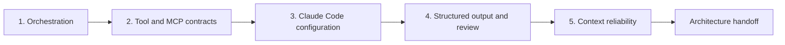

# Defend One Architecture Across Six Contexts

> Architecture is the set of boundaries that still hold when the scenario changes, a tool fails, and the evidence is incomplete.

**Type:** Build
**Languages:** Python
**Prerequisites:** [Multi-Agent Orchestration and Delegation](../../16-multi-agent-orchestration-and-delegation/), [Tool Contracts, Errors, and Progressive Discovery](../../18-tool-contracts-errors-and-progressive-discovery/), [Claude Code Memory, Rules, Skills, and CI](../../19-claude-code-memory-rules-skills-and-ci/), [Reliable Extraction, Batch, and Independent Reviewers](../../20-reliable-extraction-batch-and-reviewers/), [Make Large Context Observable](../../21-long-context-reliability-provenance-and-escalation/)
**Time:** ~6 hours across two focused sessions

## Learning Objectives

- Defend architecture choices across all five CCAR-F domains.
- Adapt one decision method to the six public scenario contexts without memorizing one topology.
- Implement deterministic checks for orchestration, tools, Claude Code, structured output, and context reliability.
- Build failure packets that test partial results, stale state, unsafe tools, and invalid output.
- Produce a reviewer-ready architecture packet with explicit tradeoffs and escalation.

## The Problem

An architect prepares six diagrams for six expected use cases. The support diagram uses an agent loop. The code diagram uses Claude Code. The research diagram has subagents. The extraction diagram uses JSON.

During review, the architect cannot explain why one step is a tool and another is a subagent. The diagrams omit retry semantics, configuration scope, partial results, source versions, and human authority. Each design works only on its happy path.

Scenario-based architecture questions test transfer. The names and business details change, but the same decisions recur:

- What sequence is deterministic, and what choice requires model reasoning?
- Which context should own each concern?
- Which tools are visible, authorized, and retryable?
- Where does shared Claude Code guidance live?
- How does a typed result become semantically and evidentially valid?
- What state survives failure, compaction, resume, and human handoff?

This capstone builds one architecture method and applies it to all six public contexts.

## The Concept

### The six contexts are lenses, not templates

The July 2026 public CCAR-F guide names these scenario contexts:

1. Customer support resolution agent.
2. Code generation with Claude Code.
3. Multi-agent research.
4. Developer productivity with Claude.
5. Claude Code for CI/CD.
6. Structured data extraction.

This course does not reproduce exam scenarios. You will create an original system called Cedar Bridge, a fictional software and service company. Each lens stresses a different part of the same architecture.

| Lens | Original Cedar Bridge task | Primary failure to design |
|---|---|---|
| Support | Draft a resolution from active policy and case evidence | Unauthorized action or stale policy |
| Code generation | Patch a request parser in a monorepo | Broad scope or missing cross-file contract |
| Research | Compare three migration approaches | Duplicate work, conflicts, or partial sources |
| Developer productivity | Turn an approved decision into an ADR and task plan | Stale conversational state or hidden local config |
| CI/CD | Review a pull request from a clean checkout | Unbounded permissions or non-reproducible findings |
| Extraction | Normalize change notices into records | Valid schema with invented or unsupported values |

You do not need six unrelated platforms. You need a core architecture plus explicit variation points.

### Use a five-gate decision stack



#### Gate 1: Agentic architecture and orchestration

Define tasks, prerequisites, context boundaries, allowed tools, complete or partial states, and merge rules. Use code for fixed ordering and model reasoning for semantic choices. A subagent needs a reason: isolation, specialization, independent review, or safe parallelism.

For support, a policy researcher and case analyst can work independently after intake. The resolution draft depends on both. The approved executor is a separate authority boundary and is not part of a read-only recommendation loop.

For research, fan out by non-overlapping question and reduce by claim ID. For code, use a manifest and bounded explorers rather than assigning every agent the whole repository.

#### Gate 2: Tool design and MCP integration

Every tool needs one action and object, positive and negative selection guidance, a closed schema, permission scope, side-effect declaration, and structured error contract. A write tool needs fresh authorization, idempotency, and reconciliation.

Use MCP resources for contextual data, tools for model-requested actions, and prompts for reusable user-invoked templates. Progressive discovery reduces catalog size but must preserve access scope.

In CI, read, search, and test interfaces should be sufficient for review. Do not grant production deployment merely because the workflow runs in a pipeline.

#### Gate 3: Claude Code configuration and workflows

Keep project guidance concise, versioned, and shared. Put file-specific requirements in path rules. Package reusable methods as Skills and explicit user workflows as commands. Use hooks for deterministic scope and command controls.

Plan before broad mutation. Explore in isolated read-only contexts. CI starts from a clean commit with declared settings, bounded tools, structured findings, and deterministic tests. It does not resume an interactive developer session.

#### Gate 4: Prompt engineering and structured output

Define evaluation criteria before prompt wording. Use boundary examples for ambiguous judgments. Make unknown values representable. Enforce schemas where supported, then validate syntax, schema, semantics, and provenance.

Limit retries and feed back the smallest useful validation error. Separate generator and reviewer contexts. Batch fits asynchronous independent items, not an adaptive tool loop that must observe intermediate results.

#### Gate 5: Context management and reliability

Place hard constraints and the current question clearly. Retrieve the smallest relevant evidence slice with source metadata. Trim logs without deleting failures or coverage. Persist manifests and side effects outside conversation. Propagate complete, partial, and blocked states.

Confidence comes from evidence class, coverage, conflict, novelty, and measured errors. Human review is stratified by consequence and uncertainty plus a random sample of ordinary passes.

### Architecture quality appears in failure behavior

A diagram shows components. A scenario packet shows behavior under pressure:

- One source times out after returning valid partial results.
- A tool returns a conflict that should not be retried blindly.
- A subagent violates its result schema.
- CI receives a hidden local instruction that is absent from the repository.
- An extraction record is valid JSON but cites the wrong version.
- A resumed session contains an obsolete plan after the branch changed.
- Two approved policies conflict with no precedence rule.

For each failure, name detection, containment, retry or escalation, durable state, and the human owner.

## Build It

## Interactive Lab

```figure
31-architect-foundation-readiness
```

Use the readiness matrix to test all five architecture gates across the six
scenario lenses. Change a tool, configuration, validation, or context invariant
and observe which scenarios become blocked rather than relying on one topology.

## Practice Lab

Run one failure fixture per architecture domain and write the cross-scenario
delta that repairs it without weakening the shared invariant.

## Shipped Artifact

The architecture packet and filled
[`outputs/demo-readiness-report.json`](../outputs/demo-readiness-report.json)
are the practical outputs.

## Verify It

Reproduce the report and run failure-first tests with the commands below. The
lesson quiz checks individual transfer decisions.

## Capstone Connection

The completed packet, cross-scenario deltas, ADRs, and independent review form
the Architect Foundations capstone submission.

### Step 1: Choose one primary lens

Select one Cedar Bridge lens or replace it with your own original scenario. Write:

```text
Decision supported:
Users and affected people:
Input sources and sensitivity:
Allowed actions:
Prohibited actions:
Latency and volume:
Failure consequence:
Human authority:
```

Do not begin with "use a multi-agent system." Begin with the decision and boundaries.

### Step 2: Complete the architecture packet

Copy [`outputs/architecture-packet.md`](../outputs/architecture-packet.md). Fill every domain section. The packet should contain:

- Context and non-goals.
- Task dependency graph and result states.
- Role and tool capability matrix.
- Tool and MCP contracts with structured errors.
- Claude Code instruction, rule, Skill, command, hook, and CI decisions.
- Prompt contract, schema, validators, retry limit, and independent review.
- Context budget, manifest, provenance, escalation, and human review.
- Threats, alternatives, rollout, and recovery.

### Step 3: Encode the packet as JSON

Use the shape demonstrated by the included Python validator. The validator intentionally checks architecture invariants, not prose quality.

Run the passing example:

```bash
cd certifications/claude/lessons/31-architect-foundations-scenario-capstone
python3 code/main.py
```

Then save your packet and run:

```bash
python3 code/main.py --input outputs/my-scenario.json
```

The program checks:

- Required sections and recognized scenario context.
- Unique tasks, known prerequisites, acyclic dependencies, and distributed tools.
- Tool selection boundaries, structured errors, authorization, and idempotency.
- Shared Claude Code guidance, scoped rules, and fresh structured CI review.
- Four validation layers, bounded retry, unknown states, and reviewer separation.
- Provenance fields, result states, escalation reasons, and stratified review.
- A complete architecture handoff.

It cannot prove the model will always select correctly, the policy is valid, or a human owner is qualified. Add scenario evaluations and organizational review.

### Step 4: Run failure-first tests

Run:

```bash
python3 -m unittest discover -s code/tests -v
```

Create at least one additional fixture for each domain:

| Domain | Injected failure | Expected disposition |
|---|---|---|
| Orchestration | Dependency cycle or missing partial state | Block |
| Tools and MCP | Write tool lacks idempotency | Block |
| Claude Code | CI inherits interactive state | Block |
| Structured output | Schema passes but provenance layer is absent | Block |
| Reliability | Policy conflict has no escalation path | Block |

Do not weaken the validator to make a broken packet pass. Repair the design or explain why the invariant does not apply and replace it with an equivalent control.

### Step 5: Transfer across all six lenses

For each remaining context, write a one-page delta:

```text
What remains unchanged:
New source or authority boundary:
New tool or MCP requirement:
New Claude Code configuration requirement:
New validation or output requirement:
New context or escalation risk:
Control removed and why:
Control added and why:
```

Examples of valid changes:

- Support adds policy freshness and approval before refund execution.
- Code generation adds repository scope, path rules, and tests.
- Research adds claim-level merge and source-conflict preservation.
- Developer productivity adds a concise project memory hierarchy and explicit commands.
- CI/CD adds clean-state headless review and read-only permissions.
- Extraction adds nullable unknowns, evidence spans, and batch reconciliation.

The core requirements for provenance, errors, bounded authority, and verification should survive every lens.

### Step 6: Defend tradeoffs

Write three architecture decision records:

1. Single agent versus coordinator and subagents.
2. Direct tool catalog versus MCP and progressive discovery.
3. Interactive processing versus asynchronous batch.

For each, include context, chosen option, rejected alternatives, consequence, evidence, change trigger, and owner. An ADR is not a product preference. It explains why the choice fits this scenario.

### Step 7: Conduct independent review

Give a fresh reviewer the packet, validator output, threat fixtures, and rubric. Do not give it the persuasive design transcript. Require findings with stable IDs, affected domain, evidence, severity, and required correction.

The architect then resolves or rejects each finding with evidence. Run deterministic validation again and preserve the final handoff.

## Use It

### Exam scenario method

When reading a scenario:

1. Write the consequence, evidence, and authority boundary.
2. Draw deterministic prerequisites before choosing agents.
3. Give each role the smallest tool surface.
4. Separate shared configuration from user-local context.
5. Distinguish structural validity from semantic and provenance validity.
6. Propagate partial work and escalate non-retryable gaps.
7. Prefer the smallest architecture that preserves every required invariant.

Do not select an option because it mentions more Claude features. Select the control that repairs the named failure without creating a larger one.

### Submission evidence

A complete capstone contains:

- One completed primary architecture packet.
- One valid JSON packet and validator output.
- Five cross-scenario delta pages.
- At least five added failure fixtures, one per domain.
- Three ADRs with rejected alternatives.
- Independent reviewer findings and dispositions.
- Passing test output.
- One residual-risk and human-ownership statement.

### Common traps

- **Topology first:** Agents are selected before requirements and dependencies.
- **Subagent as function:** Deterministic utilities receive unnecessary reasoning contexts.
- **Tool description as authorization:** Natural language replaces service enforcement.
- **Personal config as team policy:** CI and collaborators cannot reproduce behavior.
- **Schema as truth:** Unsupported values pass type checks.
- **Resume as recovery:** Stale conversation replaces external state reconciliation.
- **One design per scenario name:** Shared architecture principles never transfer.
- **Feature density as sophistication:** Extra components add cost without closing a failure path.

### Exercises

1. Remove one subagent from your design and determine whether quality changes.
2. Replace an action tool with an MCP resource where the model only needs context.
3. Move one global instruction into a tested path rule.
4. Add a semantic validator that catches a schema-valid false claim.
5. Compact a long session into a resume packet and prove external state is still authoritative.
6. Exchange architecture packets with another learner and run each other's failure fixtures.

## Key Terms

- **Scenario lens:** A business context used to stress shared architecture decisions.
- **Variation point:** A component or policy expected to change by scenario while core invariants remain.
- **Capability matrix:** A mapping of roles to allowed tools, data, and actions.
- **Architecture invariant:** A condition that must hold across components and failures.
- **Failure fixture:** A controlled scenario that proves detection and recovery behavior.
- **Cross-scenario delta:** The explicit change required to adapt one architecture to another context.
- **Residual risk:** Known risk that remains after controls, with owner and disposition.
- **Architecture handoff:** The packet of decisions, evidence, controls, gaps, and next ownership required to implement safely.

## Further Reading

- [Claude Certified Architect Foundations Exam Guide](https://everpath-course-content.s3-accelerate.amazonaws.com/instructor%2F6nizmqk8tpzpfjvt6qmmav7rh%2Fpublic%2F1783542750%2FClaude+Certified+Architect+%E2%80%93+Foundations+Exam+Guide.pdf)
- [Anthropic: Building effective agents](https://www.anthropic.com/research/building-effective-agents)
- [Anthropic: Claude Agent SDK](https://platform.claude.com/docs/en/agent-sdk/overview)
- [Anthropic: Tool use](https://platform.claude.com/docs/en/agents-and-tools/tool-use/overview)
- [Model Context Protocol specification](https://modelcontextprotocol.io/specification/latest)
- [Anthropic: Structured outputs](https://platform.claude.com/docs/en/build-with-claude/structured-outputs)
- [AI Engineering from Scratch: Orchestration Patterns](../../../../../phases/14-agent-engineering/28-orchestration-patterns/)
- [AI Engineering from Scratch: Durable Execution](../../../../../phases/15-autonomous-systems/12-durable-execution/)
- [AI Engineering from Scratch: Reviewer Agent](../../../../../phases/14-agent-engineering/39-reviewer-agent/)

Agent SDK, Claude Code, API, MCP, context, model, and batch behavior can change. The public blueprint and references were checked on 2026-08-08. Verify current official documentation and the exact runtime before freezing implementation details.
