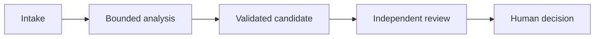

# Architect Foundations Scenario Packet

Complete this packet for one original scenario, then write a delta for each of the other five public context categories. Replace bracketed prompts with evidence.

## 1. Scenario Boundary

```text
Scenario ID:
Public context category:
Decision supported:
Users and affected people:
Allowed actions:
Prohibited actions:
Input sources and sensitivity:
Latency and volume:
Failure consequence:
Human decision authority:
```

## 2. Agentic Architecture and Orchestration

### Dependency graph



| Task ID | Reason for separate context | Prerequisites | Allowed tools | Complete | Partial | Blocked |
|---|---|---|---|---|---|---|
| [task] | [isolation, specialization, parallelism, or review] | [IDs] | [names] | [gate] | [named gaps] | [required state] |

```text
Deterministic prerequisites:
Adaptive decisions:
Parallelism limit:
Merge identity and conflict rules:
Resume, fork, and compaction policy:
```

## 3. Tool and MCP Contracts

| Tool or primitive | Use | Do not use | Closed input schema | Result and error | Auth scope | Side effect |
|---|---|---|---|---|---|---|
| [name] | [positive rule] | [negative rule] | [object schema] | [complete, partial, blocked] | [scope] | [none or bounded write] |

Transcribe each input boundary into the validator packet as `input_schema`. It must name every property type, require only declared properties, and set `additionalProperties` to `false`. A no-argument tool still uses a closed object schema with empty `properties` and `required` arrays.

```json
{
  "type": "object",
  "properties": {
    "case_id": {"type": "string"}
  },
  "required": ["case_id"],
  "additionalProperties": false
}
```

```text
MCP server scope:
Resources:
Tools:
Prompts:
Progressive discovery policy:
Write authorization:
Idempotency and reconciliation:
Secret provisioning:
```

## 4. Claude Code Configuration and Workflow

```text
Root project guidance:
Imported guidance:
Path-specific rules and tested globs:
Skills:
Commands:
Agents and allowed tools:
Hooks and enforced invariants:
Plan or interview boundary:
User-local configuration excluded from team policy:
```

### Headless CI

- [ ] Starts from a clean commit and declared inputs.
- [ ] Uses versioned project configuration.
- [ ] Has bounded read-only review tools.
- [ ] Emits structured findings with stable IDs.
- [ ] Runs deterministic tests and policy gates separately.
- [ ] Receives prior finding IDs for remediation review.
- [ ] Records current model and runtime configuration.

## 5. Prompt and Structured Output

```text
Evaluation criteria:
Boundary examples:
Prompt contract version:
Schema version:
Representation for unknown or unsupported values:
Tool-choice policy:
Syntax validator:
Schema validator:
Semantic validator:
Provenance validator:
Retry limit and feedback contract:
Independent reviewer inputs and output:
Batch or real-time decision:
```

## 6. Context Management and Reliability

```text
Critical fact placement:
Context budget:
Manifest location and schema:
Scratchpad lifecycle:
Subagent context boundaries:
Compaction and resume packet:
Tool-output trimming rules:
Complete, partial, and blocked propagation:
Provenance fields:
Source conflict and date rules:
Content-type extraction and rendering checks:
Confidence evidence classes:
Human review strata and random sample:
Escalation owners:
```

## 7. Failure Fixtures

| ID | Injected failure | Detection | Containment | Retry or escalation | Durable evidence | Owner |
|---|---|---|---|---|---|---|
| [failure] | [condition] | [signal] | [safe stop] | [rule] | [artifact] | [role] |

Required coverage:

- [ ] Orchestration prerequisite, partial result, or stale resume.
- [ ] Tool validation, authorization, conflict, timeout, or unknown side effect.
- [ ] Claude Code rule scope, permission, hook, or clean-CI failure.
- [ ] Schema-valid semantic or provenance failure.
- [ ] Lost fact, conflicting source, content-type, or escalation failure.

## 8. Architecture Decisions

Complete one record for each major choice.

```text
Decision ID:
Context and forces:
Chosen option:
Alternatives rejected:
Tradeoff accepted:
Evidence:
Change trigger:
Owner:
```

## 9. Cross-Scenario Deltas

Repeat for all six contexts, including the primary scenario.

```text
Context category:
Core invariants retained:
New source or authority boundary:
New tool or MCP requirement:
New Claude Code configuration requirement:
New output and validation requirement:
New context and escalation risk:
Control removed or added, with reason:
```

## 10. Review and Handoff

```text
Decision owner:
Implementation owner:
Independent reviewer:
Validator result:
Finding IDs and dispositions:
Evidence artifacts:
Residual risks and owners:
Fallback:
Rollout boundary:
Model, API, SDK, Claude Code, or MCP change triggers:
Next verification date:
```

Release recommendation:

- [ ] Blocked pending authority, policy, evidence, or architecture correction.
- [ ] Ready for a shadow or read-only pilot.
- [ ] Ready for bounded human-reviewed use.
- [ ] Ready for specifically named low-consequence automation.

Rationale:

```text
[State which scenarios and failures were tested, which invariants passed, what remains uncertain, and who owns the decision.]
```
