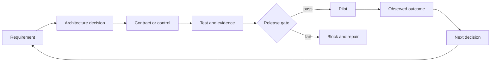

# Architect Professional System Capstone

> Build the evidence packet that makes a production architecture defensible.

**Type:** Build
**Languages:** Python
**Prerequisites:** [Choose the Smallest Surface That Can Carry the Work](../../01-claude-product-and-model-landscape/), [Spend Capability Where Failure Is Expensive](../../02-model-selection-and-token-economics/), [Turn a Request Into a Testable Contract](../../03-prompting-and-task-decomposition/), [Put Each Fact in the Right Kind of Context](../../04-context-knowledge-memory-and-caching/), [Validate the Claim, Not the Confidence](../../05-output-evaluation-and-validation/), [Put Authority Around Capability](../../06-governance-safety-and-responsible-use/), [The Messages API Is a State Machine](../../08-messages-api-and-application-lifecycle/), [Structured Output Is an Untrusted Contract](../../09-structured-output-and-defensive-parsing/), [A Tool Loop Is Controlled Delegation](../../10-tool-use-and-agentic-loops/), [MCP Separates Capability From Host](../../11-mcp-server-design-and-integration/), [The Agent SDK Is a Harness, Not Permission](../../12-claude-agent-sdk-and-hooks/), [Security Lives Outside the Prompt](../../13-application-security-and-secrets/), [Evals Turn Agent Behavior Into Engineering Evidence](../../14-evals-testing-debugging-and-observability/), [Claude Code Scales Through Shared Constraints](../../15-claude-code-for-development-teams/), [Multi-Agent Orchestration and Delegation](../../16-multi-agent-orchestration-and-delegation/), [Tool Contracts, Errors, and Progressive Discovery](../../18-tool-contracts-errors-and-progressive-discovery/), [Business Discovery, Requirements, and SLAs](../../22-business-discovery-requirements-and-slas/), [End-to-End Architecture and Value Tradeoffs](../../23-end-to-end-architecture-and-value-tradeoffs/), [RAG, Retrieval, and Data Pipelines](../../24-rag-retrieval-and-data-pipelines/), [Integration Protocols, Identity, and Least Privilege](../../25-integration-protocols-identity-and-least-privilege/), [Production Observability, Latency, and Cost](../../26-production-observability-latency-and-cost/), [Enterprise Governance, Compliance, and Human Review](../../27-enterprise-governance-compliance-and-hitl/), [Stakeholder Communication, ADRs, and Lifecycle Ownership](../../28-stakeholder-communication-adrs-and-lifecycle/)
**Time:** ~8 to 12 hours

## Learning Objectives

- Deliver a discovery-to-operations architecture for a production Claude system
- Defend pattern, model, context, RAG, integration, and control decisions
- Prove quality, latency, cost, safety, and security with explicit gates
- Package governance, rollout, runbooks, and lifecycle ownership
- Present the same decision to executive, engineering, control, and operations audiences

## The Mission

Design a governed enterprise support-resolution system for a company operating
in several regions.

The current team handles 40,000 tickets per week. Billing and shipping questions
account for most volume. Median first-response time is 11 minutes. Policy changes
arrive weekly across documents and internal systems. Review finds inconsistent
citations, and a prior automation issued refunds beyond staff authority.

The proposed system may classify tickets, retrieve current policy, read bounded
account context, draft replies, and recommend actions. It must not delete
accounts. Refund execution requires explicit authority and fresh human approval.
The company expects a staged rollout, measurable quality, region-aware data
handling, and an operational handoff to the support platform team.

You are not asked to maximize autonomy. You are asked to design the best system
under the constraints and prove why it is ready.

## Required Deliverables

Use the template in `outputs/architecture-packet-template.md`. Your packet must
contain ten connected artifacts.

### 1. Discovery Brief

Define outcome, baseline, target, guardrails, users, current workflow, data,
authority, assumptions, and non-goals.

At minimum, distinguish:

- first-response time from total resolution time
- system completion from policy-correct task success
- recommendation from execution authority
- internal target from contractual commitment
- known facts from estimates

### 2. Architecture Options and ADRs

Compare at least:

1. retrieval-assisted drafting with full human review
2. deterministic workflow with bounded model steps
3. adaptive tool-using agent

Select one. Record the evidence, consequences, rejected alternatives, and
reversal condition. If you use multiple agents, justify each context boundary or
independent reviewer. More components do not earn more credit.

### 3. End-to-End System Views

Create Mermaid diagrams for:

- system context
- data and identity flow
- one normal ticket sequence
- one high-risk refund sequence
- deployment and ownership
- failure and partial-result path

Every external edge must state schema, identity, timeout, retry, evidence, and
owner.

### 4. Model, Prompt, and Context Plan

Define task classes and the model-selection criteria for each. Include quality,
latency, cost, context, and thinking requirements. Do not freeze product facts
without a verification date.

Design:

- system and user instruction boundaries
- few-shot examples where judgment consistency needs them
- stable prefix and prompt-caching plan
- context pruning and compaction
- structured output and semantic validation
- prompt and model versioning

### 5. Knowledge and RAG Design

Specify source ownership, parsing, chunk shape, metadata, sparse or dense
retrieval, filters, reranking, context assembly, provenance, source conflicts,
freshness, version activation, and rollback.

Create a retrieval evaluation with normal, ambiguous, stale, unauthorized, and
adversarial cases. Measure retrieval separately from answer quality.

### 6. Integration and Identity Design

Choose direct API, CLI, MCP, or agent-to-agent boundaries from requirements.
Use least privilege across tool discovery, schema, credential, and action.

Design fresh approval for refunds. Bind approval to principal, amount, account,
reason, expiration, and single use. Define structured errors for validation,
authorization, conflicts, rate limits, dependencies, and timeouts.

### 7. Evaluation and Production Evidence

Create a representative golden set and a mixed-method evaluation plan.

Include:

- retrieval recall and freshness
- claim support and citation coverage
- policy adherence and completeness
- tool and authorization trajectory
- unsafe-action prevention
- P50 and P95 latency
- cost per accepted task
- reviewer agreement and time
- high-risk and region or language strata

Compare a baseline with the proposed system. Define hard gates that cannot be
averaged away.

### 8. Governance and Human Review

Produce a risk register, data map, control matrix, review design, fairness plan,
contestability path, incident evidence plan, and material-change triggers.

State which questions require security, privacy, legal, compliance, finance, or
domain approval. Do not claim legal compliance on behalf of those owners.

### 9. Rollout and Operations

Plan shadow, canary, guarded expansion, rollback, dashboards, alerts, runbooks,
capacity, dependency failure, and reviewer queue behavior.

Each alert needs an owner and action. Each production version needs a known-safe
rollback. Run a tabletop exercise for stale policy, authorization outage, prompt
injection through a ticket, and evaluator drift.

### 10. Stakeholder and Handoff Package

Prepare:

- one-page executive decision brief
- product workflow and adoption plan
- engineering contract index
- security and privacy control summary
- operations readiness and handoff checklist

The receiving team must demonstrate monitoring, safe shutdown, rollback,
evaluation, and incident escalation before acceptance.

## Architecture Method

Use one evidence chain throughout the packet.



If a component cannot trace back to a requirement, ask whether it is necessary.
If a requirement has no control or test, the architecture is incomplete. If a
test has no release consequence, it is only a report.

## Build It

## Interactive Lab

```figure
32-architect-professional-readiness
```

Use the professional readiness board to connect requirements to decisions,
controls, evidence, release gates, pilot outcomes, and lifecycle owners. Hard
authorization, safety, and rollback failures remain visible regardless of the
weighted readiness score.

## Practice Lab

Run the support architecture through one failed requirement, unverified hard
control, failed evaluation gate, and rollback drill, repairing each at its owner
boundary.

## Shipped Artifact

The packet template, completed
[`outputs/reference-architecture-packet.md`](../outputs/reference-architecture-packet.md),
filled [`outputs/demo-readiness-report.json`](../outputs/demo-readiness-report.json),
and [`outputs/scored-rubric.md`](../outputs/scored-rubric.md) are the practical
outputs. The scored reference remains blocked for production until its named
live hard-gate and handoff evidence passes.

## Verify It

The Python lab validates the structure of an architecture packet. It does not
judge whether your business decision is correct. It catches a more basic class
of failure: missing owners, unmeasurable requirements, unverified hard controls,
failed evaluation gates, absent rollback, and decisions with no reversal rule.

```bash
cd certifications/claude/lessons/32-architect-professional-system-capstone/code
python3 main.py
python3 -m unittest discover tests -v
```

### Step 1: Encode Requirements

Each `Requirement` has a category, testable statement, measurability flag, and
owner. Replace the flag with an explicit measurement contract in your packet.

### Step 2: Encode Decisions

Each `Decision` records context, selection, rejected options, consequence,
reversal condition, and owner. A recommendation without alternatives cannot
demonstrate tradeoff judgment.

### Step 3: Encode Controls

Each `Control` names the risk, kind, owner, evidence, verification state, and
whether it is a hard release gate. A failed hard gate blocks release regardless
of average readiness.

### Step 4: Evaluate Gates

`EvaluationGate` supports minimum, maximum, and equality thresholds. Use it for
quality, latency, cost, and zero-tolerance control results. Real gates also need
confidence intervals, sample requirements, and segment coverage.

### Step 5: Make the Release Decision

`release_decision` returns all findings and a blocking count. Non-goal omission
is reported but not blocked in the toy implementation. Your review board may
make it a gate.

Reproduce the report and run all deterministic gates with the commands above.
The six-question quiz checks individual architecture judgment.

## Capstone Connection

The completed ten-artifact packet, defense, drills, and accepted handoff form
the Architect Professional capstone submission.

## Architecture Defense

Present the packet in 20 minutes, then answer these questions:

1. Why is this pattern simpler than the strongest rejected alternative?
2. Which requirement justifies every model and agent call?
3. What happens when retrieval returns insufficient or conflicting evidence?
4. Which identity reaches each tool and how is authority checked?
5. What evidence blocks a release?
6. How do you know the cheaper variant is cheaper per successful outcome?
7. What can a reviewer see, decide, and escalate?
8. Which product details need re-verification before deployment?
9. Who owns every source, control, metric, alert, and incident?
10. What evidence would make you reverse the architecture decision?

Answers must reference artifacts and evidence. "The model is capable" is not a
defense.

## Scoring Rubric

| Area | Weight | Evidence of mastery |
|------|-------:|---------------------|
| Solution design | 17 | Options fit requirements; decomposition and feedback are explicit |
| Models, prompts, context | 13 | Selection and reuse follow measured tradeoffs |
| Integration | 19 | RAG, protocols, identity, and least privilege are coherent |
| Evaluation and optimization | 16 | Representative tests and operational signals drive release |
| Governance and risk | 14 | Data, controls, review, fairness, and approvals have owners |
| Stakeholder lifecycle | 14 | Decisions translate into delivery, adoption, handoff, and change |
| Developer operations | 7 | Team configuration, debugging, runbooks, and ownership are usable |

Use the rubric for self-review and independent review. It is a curriculum tool,
not the official exam scoring model.

## Exam Decision Patterns

The Professional exam rewards lifecycle judgment. When several options sound
reasonable, choose the one that addresses the stated constraint at the correct
system boundary and produces evidence another owner can verify.

Structural priorities:

- clarify before automating
- minimize before guarding
- retrieve and filter before generating
- authorize at execution
- validate semantic claims, not only syntax
- evaluate the full trajectory and final state
- block on hard controls
- roll out progressively
- assign owners through change and retirement

## Common Capstone Failures

### A Polished Diagram Without Decisions

Add requirements, alternatives, consequence, and reversal conditions.

### A Long Control List Without Evidence

Give every control an owner, test, result, failure response, and review trigger.

### An Evaluation With Only Happy Paths

Add ambiguity, stale data, conflicting sources, prompt injection, authorization
failure, tool timeout, high-risk slices, and reviewer overload.

### A Human Review Queue Without Capacity

Estimate volume, time, qualifications, SLO, fallback, and escalation.

### A Handoff Without Recovery Proof

Run the drill. The operating team should restore a known-safe state without the
architect narrating every step.

## Exercises

1. Replace the support scenario with a regulated document-analysis workflow and
   identify which controls and owners change.
2. Add statistical confidence and minimum sample sizes to `EvaluationGate`.
3. Make authorization and stale-source controls hard gates in a machine-readable
   packet.
4. Have an independent reviewer find five requirements with no test or owner.
5. Record a real reversal decision after a simulated canary regression.

## Key Terms

| Term | What people say | What it actually means |
|------|-----------------|------------------------|
| Architecture packet | A long design document | Connected decisions, contracts, evidence, controls, ownership, and recovery |
| Hard gate | A high-weight metric | A condition that blocks release regardless of averages |
| Readiness | Code complete | Demonstrated ability to meet requirements and operate failures safely |
| Architecture defense | Presentation skill | Evidence-backed explanation of choices, consequences, and rejected alternatives |
| Operating owner | Deployment team | The role accountable for SLOs, incidents, changes, and retirement |

## Further Reading

- [Claude Certified Architect Professional exam guide](https://everpath-course-content.s3-accelerate.amazonaws.com/instructor%2F6nizmqk8tpzpfjvt6qmmav7rh%2Fpublic%2F1783542810%2FClaude+Certified+Architect+%E2%80%93+Professional+Exam+Guide.pdf)
- [Claude Platform documentation](https://platform.claude.com/docs/en/home)
- [Building effective agents](https://www.anthropic.com/research/building-effective-agents)
- Every lesson in the Architect Professional route
