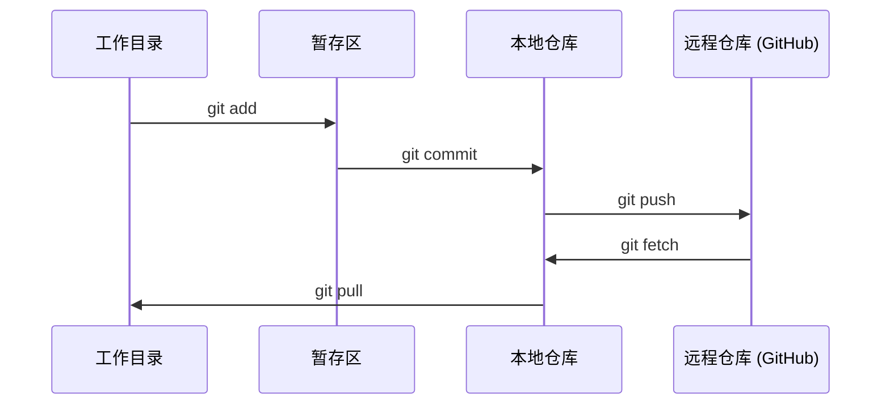

# Git 与协作

> 版本控制不是可选项。你在这里构建的每一个实验、每一个模型、每一课代码都会被追踪记录。

**类型：** 学习
**语言：** --
**前置条件：** 阶段 0，课程 01
**时间：** 约 30 分钟

## 学习目标

- 配置 git 身份信息，并熟练使用 add、commit、push 的日常工作流程
- 创建和合并分支，在隔离环境中进行实验而不破坏 main 分支
- 编写 `.gitignore` 文件，排除模型检查点和大型二进制文件
- 使用 `git log` 浏览提交历史，理解项目的演进过程

## 问题背景

在整个 20 个阶段的学习过程中，你需要编写数百个代码文件。没有版本控制，你会丢失工作成果、破坏无法恢复的代码，也无法与他人协作。

Git 是工具，GitHub 是代码托管平台。这节课只涵盖本课程所需的内容，不多不少。

## 核心概念



记住三件事：
1. 经常保存（`git commit`）
2. 推送到远程（`git push`）
3. 用分支做实验（`git checkout -b experiment`）

## 动手构建

### 步骤 1：配置 git

```bash
git config --global user.name "你的名字"
git config --global user.email "you@example.com"
```

### 步骤 2：日常工作流程

```bash
git status
git add file.py
git commit -m "添加感知机实现"
git push origin main
```

### 步骤 3：使用分支进行实验

```bash
git checkout -b experiment/new-optimizer

# ... 进行修改，提交 ...

git checkout main
git merge experiment/new-optimizer
```

### 步骤 4：使用本课程仓库

```bash
git clone https://github.com/rohitg00/ai-engineering-from-scratch.git
cd ai-engineering-from-scratch

git checkout -b my-progress
# 完成课程学习，提交你的代码
git push origin my-progress
```

## 实际应用

本课程你只需要掌握以下命令：

| 命令 | 何时使用 |
|------|----------|
| `git clone` | 获取课程仓库 |
| `git add` + `git commit` | 保存你的工作 |
| `git push` | 备份到 GitHub |
| `git checkout -b` | 在不影响 main 的情况下尝试新功能 |
| `git log --oneline` | 查看你完成的工作 |

就这些。本课程不需要 rebase、cherry-pick 或子模块。

## 练习

1. 克隆本仓库，创建一个名为 `my-progress` 的分支，新建一个文件，提交并推送
2. 创建一个 `.gitignore` 文件，排除模型检查点文件（`.pt`、`.pth`、`.safetensors`）
3. 使用 `git log --oneline` 查看本仓库的提交历史，阅读课程是如何逐步添加的

## 关键术语

| 术语 | 常见说法 | 实际含义 |
|------|----------|----------|
| Commit | "保存" | 项目在某个时间点的完整快照 |
| Branch | "一个副本" | 指向一个提交的可移动指针，随你的工作向前推进 |
| Merge | "合并代码" | 将一个分支的更改应用到另一个分支 |
| Remote | "云端" | 仓库的副本，托管在其他地方（GitHub、GitLab） |