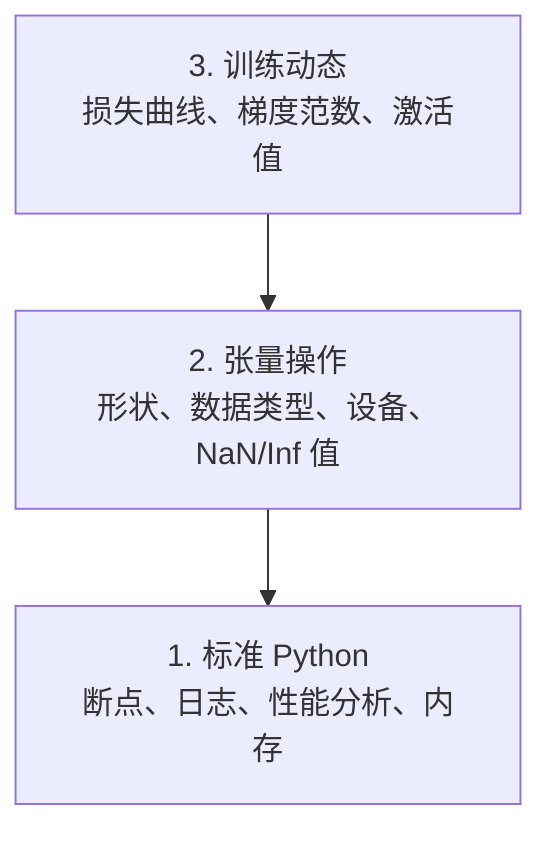

# 调试与性能分析

> 最糟糕的 AI bug 不会让程序崩溃。它们在垃圾数据上默默训练，然后报告一条漂亮的损失曲线。

**类型:** 构建工具
**语言:** Python
**前置条件:** 第 1 课（开发环境），基本的 PyTorch 熟悉程度
**时间:** 约 60 分钟

## 学习目标

- 使用条件 `breakpoint()` 和 `debug_print` 在训练过程中检查张量的形状、数据类型和 NaN 值
- 使用 `cProfile`、`line_profiler` 和 `tracemalloc` 对训练循环进行性能分析，找到瓶颈
- 检测常见的 AI bug：形状不匹配、NaN 损失、数据泄漏和错误设备上的张量
- 设置 TensorBoard 可视化损失曲线、权重直方图和梯度分布

## 问题所在

AI 代码的失败方式与普通代码不同。Web 应用崩溃时会给出堆栈跟踪。而一个配置错误的训练循环会运行 8 小时，烧掉 200 美元的 GPU 时间，最终产出一个对每个输入都预测均值的模型。代码从未报错。bug 可能是张量放错了设备、忘记了 `.detach()`，或者标签泄漏到了特征中。

你需要能在这些静默故障浪费你的时间和算力之前就捕获它们的调试工具。

## 核心概念

AI 调试在三个层面上运作：



大多数人直接跳到第 3 层（盯着 TensorBoard 看）。但 80% 的 AI bug 存在于第 1 层和第 2 层。

## 动手构建

### 第 1 部分：打印调试（没错，它确实有效）

打印调试常被轻视。但对张量代码来说，一条有针对性的 print 语句比单步调试器更有效，因为你需要同时看到形状、数据类型和值范围。

```python
def debug_print(name, tensor):
    print(f"{name}: shape={tensor.shape}, dtype={tensor.dtype}, "
          f"device={tensor.device}, "
          f"min={tensor.min().item():.4f}, max={tensor.max().item():.4f}, "
          f"mean={tensor.mean().item():.4f}, "
          f"has_nan={tensor.isnan().any().item()}")
```

在每个可疑操作后调用它。找到 bug 后删除这些打印语句。简单直接。

### 第 2 部分：Python 调试器（pdb 和 breakpoint）

内置调试器在 AI 工作中被低估了。在训练循环中插入 `breakpoint()`，就可以交互式地检查张量。

```python
def training_step(model, batch, criterion, optimizer):
    inputs, labels = batch
    outputs = model(inputs)
    loss = criterion(outputs, labels)

    if loss.item() > 100 or torch.isnan(loss):
        breakpoint()

    loss.backward()
    optimizer.step()
```

当调试器启动后，以下命令很有用：

- `p outputs.shape` 检查形状
- `p loss.item()` 查看损失值
- `p torch.isnan(outputs).sum()` 统计 NaN 数量
- `p model.fc1.weight.grad` 检查梯度
- `c` 继续执行，`q` 退出

这就是条件调试。你只在出现问题时才停下来。对于一个 10,000 步的训练运行来说，这很重要。

### 第 3 部分：Python 日志

当调试超出快速检查的范围时，用 logging 替换 print 语句。

```python
import logging

logging.basicConfig(
    level=logging.INFO,
    format="%(asctime)s [%(levelname)s] %(message)s",
    handlers=[
        logging.FileHandler("training.log"),
        logging.StreamHandler()
    ]
)
logger = logging.getLogger(__name__)

logger.info("开始训练: lr=%.4f, batch_size=%d", lr, batch_size)
logger.warning("检测到损失尖峰: %.4f 在第 %d 步", loss.item(), step)
logger.error("第 %d 步出现 NaN 损失，停止训练", step)
```

日志记录为你提供时间戳、严重级别和文件输出。当训练在凌晨 3 点失败时，你需要一个日志文件，而不是已经滚出屏幕的终端输出。

### 第 4 部分：代码段计时

了解时间花在哪里是优化的第一步。

```python
import time

class Timer:
    def __init__(self, name=""):
        self.name = name

    def __enter__(self):
        self.start = time.perf_counter()
        return self

    def __exit__(self, *args):
        elapsed = time.perf_counter() - self.start
        print(f"[{self.name}] {elapsed:.4f}s")

with Timer("数据加载"):
    batch = next(dataloader_iter)

with Timer("前向传播"):
    outputs = model(batch)

with Timer("反向传播"):
    loss.backward()
```

常见发现：数据加载占了训练时间的 60%。解决方法是在 DataLoader 中设置 `num_workers > 0`，而不是换更快的 GPU。

### 第 5 部分：cProfile 和 line_profiler

当手动计时器不够用时：

```bash
python -m cProfile -s cumtime train.py
```

这会显示每个函数调用及其累计时间排序。逐行性能分析：

```bash
pip install line_profiler
```

```python
@profile
def train_step(model, data, target):
    output = model(data)
    loss = F.cross_entropy(output, target)
    loss.backward()
    return loss

# 运行方式: kernprof -l -v train.py
```

### 第 6 部分：内存分析

#### CPU 内存分析 — tracemalloc

```python
import tracemalloc

tracemalloc.start()

# 你的代码
model = build_model()
data = load_dataset()

snapshot = tracemalloc.take_snapshot()
top_stats = snapshot.statistics("lineno")
for stat in top_stats[:10]:
    print(stat)
```

#### CPU 内存分析 — memory_profiler

```bash
pip install memory_profiler
```

```python
from memory_profiler import profile

@profile
def load_data():
    raw = read_csv("data.csv")       # 注意这里的内存跳增
    processed = preprocess(raw)       # 以及这里
    return processed
```

运行 `python -m memory_profiler your_script.py` 查看逐行内存使用情况。

#### GPU 内存分析 — PyTorch

```python
import torch

if torch.cuda.is_available():
    print(torch.cuda.memory_summary())

    print(f"已分配: {torch.cuda.memory_allocated() / 1e9:.2f} GB")
    print(f"已缓存: {torch.cuda.memory_reserved() / 1e9:.2f} GB")
```

当你遇到 OOM（内存不足）时：

1. 减小 batch size（永远是第一个要尝试的）
2. 使用 `torch.cuda.empty_cache()` 释放缓存内存
3. 对大型中间变量使用 `del tensor` 后跟 `torch.cuda.empty_cache()`
4. 使用混合精度（`torch.cuda.amp`）将内存使用减半
5. 对非常深的模型使用梯度检查点

### 第 7 部分：常见 AI Bug 及其捕获方法

#### 形状不匹配

最常见的 bug。张量形状为 `[batch, features]`，但模型期望的是 `[batch, channels, height, width]`。

```python
def check_shapes(model, sample_input):
    print(f"输入: {sample_input.shape}")
    hooks = []

    def make_hook(name):
        def hook(module, inp, out):
            in_shape = inp[0].shape if isinstance(inp, tuple) else inp.shape
            out_shape = out.shape if hasattr(out, "shape") else type(out)
            print(f"  {name}: {in_shape} -> {out_shape}")
        return hook

    for name, module in model.named_modules():
        hooks.append(module.register_forward_hook(make_hook(name)))

    with torch.no_grad():
        model(sample_input)

    for h in hooks:
        h.remove()
```

用一个示例 batch 运行一次。它会映射出模型中每个层的形状变换。

#### NaN 损失

NaN 损失意味着某个地方爆炸了。常见原因：

- 学习率过高
- 自定义损失中的除零操作
- 对零或负数取对数
- RNN 中的梯度爆炸

```python
def detect_nan(model, loss, step):
    if torch.isnan(loss):
        print(f"第 {step} 步出现 NaN 损失")
        for name, param in model.named_parameters():
            if param.grad is not None:
                if torch.isnan(param.grad).any():
                    print(f"  {name} 中存在 NaN 梯度")
                if torch.isinf(param.grad).any():
                    print(f"  {name} 中存在 Inf 梯度")
        return True
    return False
```

#### 数据泄漏

你的模型在测试集上达到了 99% 的准确率。听起来不错。但这是个 bug。

```python
def check_data_leakage(train_set, test_set, id_column="id"):
    train_ids = set(train_set[id_column].tolist())
    test_ids = set(test_set[id_column].tolist())
    overlap = train_ids & test_ids
    if overlap:
        print(f"数据泄漏: {len(overlap)} 个样本同时出现在训练集和测试集中")
        return True
    return False
```

还要检查时间泄漏：用未来的数据预测过去。在划分数据集前按时间戳排序。

#### 错误设备

不同设备上（CPU vs GPU）的张量会导致运行时错误。但有时一个张量静默地留在 CPU 上，而其他所有数据都在 GPU 上，训练只是变得很慢。

```python
def check_devices(model, *tensors):
    model_device = next(model.parameters()).device
    print(f"模型设备: {model_device}")
    for i, t in enumerate(tensors):
        if t.device != model_device:
            print(f"  警告: 张量 {i} 在 {t.device} 上，模型在 {model_device} 上")
```

### 第 8 部分：TensorBoard 基础

TensorBoard 展示训练过程中内部发生了什么。

```bash
pip install tensorboard
```

```python
from torch.utils.tensorboard import SummaryWriter

writer = SummaryWriter("runs/experiment_1")

for step in range(num_steps):
    loss = train_step(model, batch)

    writer.add_scalar("loss/train", loss.item(), step)
    writer.add_scalar("lr", optimizer.param_groups[0]["lr"], step)

    if step % 100 == 0:
        for name, param in model.named_parameters():
            writer.add_histogram(f"weights/{name}", param, step)
            if param.grad is not None:
                writer.add_histogram(f"grads/{name}", param.grad, step)

writer.close()
```

启动 TensorBoard：

```bash
tensorboard --logdir=runs
```

需要关注的指标：

- **损失不下降**: 学习率太低，或模型架构有问题
- **损失剧烈震荡**: 学习率太高
- **损失变为 NaN**: 数值不稳定（参见上面的 NaN 部分）
- **训练损失下降，验证损失上升**: 过拟合
- **权重直方图坍缩为零**: 梯度消失
- **梯度直方图爆炸**: 需要梯度裁剪

### 第 9 部分：VS Code 调试器

对于交互式调试，配置 VS Code 的 `launch.json`：

```json
{
    "version": "0.2.0",
    "configurations": [
        {
            "name": "调试训练",
            "type": "debugpy",
            "request": "launch",
            "program": "${file}",
            "console": "integratedTerminal",
            "justMyCode": false
        }
    ]
}
```

点击编辑器行号旁的空白处设置断点。使用变量面板检查张量属性。调试控制台允许你在执行过程中运行任意 Python 表达式。

在逐步调试数据预处理管道时特别有用，可以查看每一步变换的结果。

## 实际应用

以下是能捕获大多数 AI bug 的调试工作流：

1. **训练前**: 用示例 batch 运行 `check_shapes`。验证输入和输出维度是否符合预期。
2. **前 10 步**: 对损失、输出和梯度使用 `debug_print`。确认没有 NaN 且数值在合理范围内。
3. **训练过程中**: 记录损失、学习率和梯度范数。使用 TensorBoard 进行可视化。
4. **出问题时**: 在故障点插入 `breakpoint()`。交互式检查张量。
5. **性能优化**: 计时数据加载 vs 前向传播 vs 反向传播。如果接近 OOM 则分析内存。

## 运行代码

运行调试工具脚本：

```bash
python phases/00-setup-and-tooling/12-debugging-and-profiling/code/debug_tools.py
```

查看 `outputs/prompt-debug-ai-code.md` 获取一个帮助诊断 AI 特定 bug 的提示词。

## 练习

1. 运行 `debug_tools.py` 并阅读每个部分的输出。修改示例模型以引入 NaN（提示：在前向传播中除以零）并观察检测器捕获它。
2. 使用 `cProfile` 对训练循环进行性能分析，找出最慢的函数。
3. 使用 `tracemalloc` 找出数据加载管道中哪一行分配了最多的内存。
4. 为一个简单的训练运行设置 TensorBoard，判断模型是否过拟合。
5. 在训练循环中使用 `breakpoint()`。练习从调试器提示符检查张量形状、设备和梯度值。
