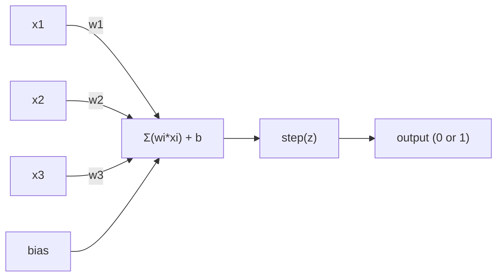
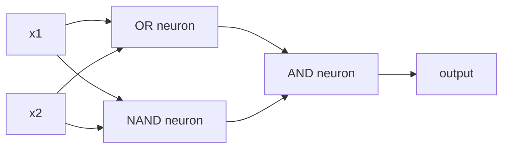

# 感知机 (The Perceptron)

> 感知机是神经网络的原子。将其剖开，你会发现权重、偏置和一个决策。

**类型：** 构建 (Build)
**语言：** Python
**先修知识：** 第一阶段（线性代数直觉）
**预计耗时：** 约 60 分钟

## 学习目标

- 从零开始在 Python 中实现一个感知机，包括权重更新规则和阶跃激活函数
- 解释为什么单个感知机只能解决线性可分问题，并演示异或 (XOR) 失败的案例
- 通过组合或门 (OR)、与非门 (NAND) 和与门 (AND) 构建多层感知机来解决异或问题
- 训练一个带有 Sigmoid 激活函数和反向传播的双层网络，自动学习异或问题

## 问题引入

你已经了解了向量和点积。你也知道矩阵可以将输入转换为输出。但是，机器是如何*学习*该使用哪种转换的呢？

感知机回答了这个问题。它是最简单的学习机器：接收一些输入，乘以权重，加上偏置，然后做出二元决策。接着进行调整。仅此而已。曾经构建的每一个神经网络，都是这种思想层层叠加的结果。

理解感知机意味着理解代码中"学习"的真正含义：不断调整数字，直到输出与现实相符。

## 核心概念

### 一个神经元，一个决策

一个感知机接收 n 个输入，将每个输入乘以一个权重，求和，加上偏置，然后将结果传递给一个激活函数。



阶跃函数是非常简单粗暴的：如果加权和加上偏置 >= 0，则输出 1。否则，输出 0。

```
step(z) = 1  if z >= 0
           0  if z < 0
```

这是一个线性分类器。权重和偏置定义了一条直线（或更高维度中的超平面），将输入空间分割成两个区域。

### 决策边界

对于两个输入，感知机在二维空间中画出一条直线：

```
  x2
  ┤
  │  类别 1        /
  │    (0)          /
  │                /
  │               / w1·x1 + w2·x2 + b = 0
  │              /
  │             /     类别 2
  │            /        (1)
  ┼───────────/──────────── x1
```

直线一侧的所有内容输出均为 0。另一侧的所有内容输出均为 1。训练的过程就是移动这条直线，直到它能正确地将类别分开。

### 学习规则

感知机的学习规则很简单：

```
For each training example (x, y_true):
    y_pred = predict(x)
    error = y_true - y_pred

    For each weight:
        w_i = w_i + learning_rate * error * x_i
    bias = bias + learning_rate * error
```

如果预测正确，误差（error）为 0，不发生任何改变。如果预测为 0 但实际应为 1，则权重增加。如果预测为 1 但实际应为 0，则权重减小。学习率（learning_rate）控制着每次调整的幅度。

### 异或 (XOR) 问题

这里就是感知机失效的地方。看看这些逻辑门：

```
AND gate:           OR gate:            XOR gate:
x1  x2  out         x1  x2  out         x1  x2  out
0   0   0           0   0   0           0   0   0
0   1   0           0   1   1           0   1   1
1   0   0           1   0   1           1   0   1
1   1   1           1   1   1           1   1   0
```

与门 (AND) 和或门 (OR) 是线性可分的：你可以画一条直线把 0 和 1 分开。但异或门 (XOR) 不是。没有任何一条单一直线能将 [0,1] 和 [1,0] 从 [0,0] 和 [1,1] 中分离出来。

```
AND (separable):        XOR (not separable):

  x2                      x2
  1 ┤  0     1            1 ┤  1     0
    │     /                 │
  0 ┤  0 / 0              0 ┤  0     1
    ┼──/──────── x1         ┼──────────── x1
       直线有效!             没有单一直线有效!
```

这是一个根本性的限制。单个感知机只能解决线性可分的问题。Minsky 和 Papert 在 1969 年证明了这一点，这几乎让神经网络的研究停滞了整整十年。

解决办法：将感知机堆叠成层。多层感知机可以通过将两个线性决策组合成一个非线性决策来解决异或问题。

```figure
perceptron-boundary
```

## 动手构建

### 步骤 1：感知机类 (The Perceptron class)

```python
class Perceptron:
    def __init__(self, n_inputs, learning_rate=0.1):
        self.weights = [0.0] * n_inputs
        self.bias = 0.0
        self.lr = learning_rate

    def predict(self, inputs):
        total = sum(w * x for w, x in zip(self.weights, inputs))
        total += self.bias
        return 1 if total >= 0 else 0

    def train(self, training_data, epochs=100):
        for epoch in range(epochs):
            errors = 0
            for inputs, target in training_data:
                prediction = self.predict(inputs)
                error = target - prediction
                if error != 0:
                    errors += 1
                    for i in range(len(self.weights)):
                        self.weights[i] += self.lr * error * inputs[i]
                    self.bias += self.lr * error
            if errors == 0:
                print(f"Converged at epoch {epoch + 1}")
                return
        print(f"Did not converge after {epochs} epochs")
```

### 步骤 2：在逻辑门上进行训练

```python
and_data = [
    ([0, 0], 0),
    ([0, 1], 0),
    ([1, 0], 0),
    ([1, 1], 1),
]

or_data = [
    ([0, 0], 0),
    ([0, 1], 1),
    ([1, 0], 1),
    ([1, 1], 1),
]

not_data = [
    ([0], 1),
    ([1], 0),
]

print("=== AND Gate ===")
p_and = Perceptron(2)
p_and.train(and_data)
for inputs, _ in and_data:
    print(f"  {inputs} -> {p_and.predict(inputs)}")

print("\n=== OR Gate ===")
p_or = Perceptron(2)
p_or.train(or_data)
for inputs, _ in or_data:
    print(f"  {inputs} -> {p_or.predict(inputs)}")

print("\n=== NOT Gate ===")
p_not = Perceptron(1)
p_not.train(not_data)
for inputs, _ in not_data:
    print(f"  {inputs} -> {p_not.predict(inputs)}")
```

### 步骤 3：观察异或问题的失败

```python
xor_data = [
    ([0, 0], 0),
    ([0, 1], 1),
    ([1, 0], 1),
    ([1, 1], 0),
]

print("\n=== XOR Gate (single perceptron) ===")
p_xor = Perceptron(2)
p_xor.train(xor_data, epochs=1000)
for inputs, expected in xor_data:
    result = p_xor.predict(inputs)
    status = "OK" if result == expected else "WRONG"
    print(f"  {inputs} -> {result} (expected {expected}) {status}")
```

它永远不会收敛。这是单个感知机无法学习异或的铁证。

### 步骤 4：用双层网络解决异或问题

这里的诀窍是：XOR = (x1 OR x2) AND NOT (x1 AND x2)。将三个感知机组合在一起：



```python
def xor_network(x1, x2):
    or_neuron = Perceptron(2)
    or_neuron.weights = [1.0, 1.0]
    or_neuron.bias = -0.5

    nand_neuron = Perceptron(2)
    nand_neuron.weights = [-1.0, -1.0]
    nand_neuron.bias = 1.5

    and_neuron = Perceptron(2)
    and_neuron.weights = [1.0, 1.0]
    and_neuron.bias = -1.5

    hidden1 = or_neuron.predict([x1, x2])
    hidden2 = nand_neuron.predict([x1, x2])
    output = and_neuron.predict([hidden1, hidden2])
    return output


print("\n=== XOR Gate (multi-layer network) ===")
for inputs, expected in xor_data:
    result = xor_network(inputs[0], inputs[1])
    print(f"  {inputs} -> {result} (expected {expected})")
```

所有的四种情况都正确。将感知机堆叠成层，创造出了任何单个感知机都无法产生的决策边界。

### 步骤 5：训练一个双层网络

步骤 4 中我们手动设置了权重。这对于异或问题有效，但在你无法预知正确权重的实际问题中就行不通了。解决办法：将阶跃函数替换为 Sigmoid 函数，并通过反向传播自动学习权重。

```python
class TwoLayerNetwork:
    def __init__(self, learning_rate=0.5):
        import random
        random.seed(0)
        self.w_hidden = [[random.uniform(-1, 1), random.uniform(-1, 1)] for _ in range(2)]
        self.b_hidden = [random.uniform(-1, 1), random.uniform(-1, 1)]
        self.w_output = [random.uniform(-1, 1), random.uniform(-1, 1)]
        self.b_output = random.uniform(-1, 1)
        self.lr = learning_rate

    def sigmoid(self, x):
        import math
        x = max(-500, min(500, x))
        return 1.0 / (1.0 + math.exp(-x))

    def forward(self, inputs):
        self.inputs = inputs
        self.hidden_outputs = []
        for i in range(2):
            z = sum(w * x for w, x in zip(self.w_hidden[i], inputs)) + self.b_hidden[i]
            self.hidden_outputs.append(self.sigmoid(z))
        z_out = sum(w * h for w, h in zip(self.w_output, self.hidden_outputs)) + self.b_output
        self.output = self.sigmoid(z_out)
        return self.output

    def train(self, training_data, epochs=10000):
        for epoch in range(epochs):
            total_error = 0
            for inputs, target in training_data:
                output = self.forward(inputs)
                error = target - output
                total_error += error ** 2

                d_output = error * output * (1 - output)

                saved_w_output = self.w_output[:]
                hidden_deltas = []
                for i in range(2):
                    h = self.hidden_outputs[i]
                    hd = d_output * saved_w_output[i] * h * (1 - h)
                    hidden_deltas.append(hd)

                for i in range(2):
                    self.w_output[i] += self.lr * d_output * self.hidden_outputs[i]
                self.b_output += self.lr * d_output

                for i in range(2):
                    for j in range(len(inputs)):
                        self.w_hidden[i][j] += self.lr * hidden_deltas[i] * inputs[j]
                    self.b_hidden[i] += self.lr * hidden_deltas[i]
```

```python
net = TwoLayerNetwork(learning_rate=2.0)
net.train(xor_data, epochs=10000)
for inputs, expected in xor_data:
    result = net.forward(inputs)
    predicted = 1 if result >= 0.5 else 0
    print(f"  {inputs} -> {result:.4f} (rounded: {predicted}, expected {expected})")
```

这里与步骤 4 有两个关键的区别。首先，Sigmoid 取代了阶跃函数——它是平滑的，因此存在梯度。其次，`train` 方法将误差从输出层反向传播到隐藏层，并根据每个权重对误差的贡献比例进行调整。这就是仅仅用 20 行代码实现的反向传播。

这是通往第 03 课的桥梁。`d_output` 和 `hidden_deltas` 背后的数学原理是应用于网络图的链式法则。我们将在那节课中进行正式的推导。

## 实际应用

你刚才从零开始构建的一切，其实只需要一行导入代码就可以实现：

```python
from sklearn.linear_model import Perceptron as SkPerceptron
import numpy as np

X = np.array([[0,0],[0,1],[1,0],[1,1]])
y = np.array([0, 0, 0, 1])

clf = SkPerceptron(max_iter=100, tol=1e-3)
clf.fit(X, y)
print([clf.predict([x])[0] for x in X])
```

仅仅五行代码。你之前写的 30 行 `Perceptron` 类所做的事情完全一样。sklearn 版本增加了收敛检查、多种损失函数和稀疏输入支持——但其核心循环是相同的：加权求和、阶跃函数、基于误差的权重更新。

真正的差距体现在规模上。生产环境中的网络会有以下变化：

- 阶跃函数变成了 Sigmoid、ReLU 或其他平滑的激活函数
- 通过反向传播自动学习权重（第 03 课）
- 网络层数变得更深：3 层、10 层、100 层以上
- 相同的原理依然适用：每一层都根据前一层的输出创建新的特征

单个感知机只能画直线。把它们堆叠起来，你就可以画出任何形状。

## 交付内容

本课程产出：

- `outputs/skill-perceptron.md` - 一项涵盖何时需要单层架构与多层架构的技能总结

## 练习

1. 在与非门 (NAND，通用逻辑门——任何逻辑电路都可以由 NAND 构建) 上训练一个感知机。验证它的权重和偏置是否构成了一个有效的决策边界。
2. 修改 Perceptron 类，使其在每个 epoch (迭代周期) 跟踪决策边界 (w1*x1 + w2*x2 + b = 0)。打印出在与门 (AND) 训练期间直线是如何移动的。
3. 构建一个拥有 3 个输入的感知机，只有当 3 个输入中至少有 2 个为 1 时才输出 1（多数表决函数）。它是线性可分的吗？为什么？

## 核心术语

| 术语 | 人们通常怎么说 | 它实际的含义 |
|------|----------------|----------------------|
| 感知机 (Perceptron) | "一个假神经元" | 线性分类器：输入和权重的点积加上偏置，并通过阶跃函数 |
| 权重 (Weight) | "一个输入有多重要" | 衡量每个输入对最终决策贡献大小的乘数 |
| 偏置 (Bias) | "阈值" | 移动决策边界的常数，允许感知机在零输入的情况下依然能够被激活 |
| 激活函数 (Activation function) | "压缩数值的函数" | 在加权求和之后应用的功能函数 —— 早期感知机使用阶跃函数，现代网络则使用 Sigmoid / ReLU 等 |
| 线性可分 (Linearly separable) | "你可以在它们之间画一条直线" | 指存在一个超平面能将不同类别完美分离的数据集 |
| 异或问题 (XOR problem) | "感知机做不到的事情" | 证明单层网络无法学习非线性可分函数的难题 |
| 决策边界 (Decision boundary) | "分类器发生切换的地方" | 将输入空间划分为两类的超平面 w*x + b = 0 |
| 多层感知机 (Multi-layer perceptron) | "真正的神经网络" | 逐层堆叠的感知机，每一层的输出作为下一层的输入 |

## 扩展阅读

- Frank Rosenblatt, "The Perceptron: A Probabilistic Model for Information Storage and Organization in the Brain" (1958) —— 开启了这一切的原始论文
- Minsky & Papert, "Perceptrons" (1969) —— 证明单层网络无法解决异或问题，并导致感知机研究停滞十年的著作
- Michael Nielsen, "Neural Networks and Deep Learning", 第 1 章 (http://neuralnetworksanddeeplearning.com/) —— 免费的在线资源，关于感知机如何组成网络的最佳可视化解释
