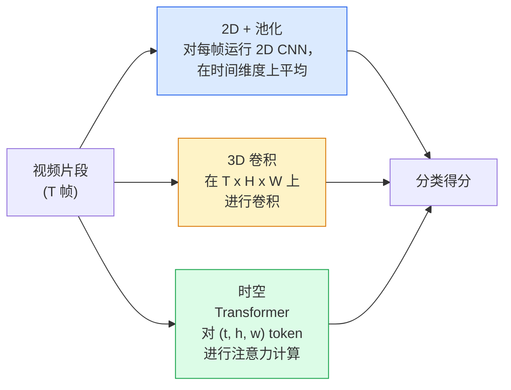

# 视频理解——时序建模

> 视频是一系列图像加上连接它们的物理规律。每个视频模型要么把时间当作额外轴（3D 卷积），当作需要注意力的序列（Transformer），要么当作只提取一次再池化的特征（2D+池化）。

**类型：** 学习 + 构建
**语言：** Python
**前置课程：** 第四阶段第 03 课（CNN）、第四阶段第 04 课（图像分类）
**时间：** 约 45 分钟

## 学习目标

- 区分三种主要的视频建模方法（2D+池化、3D 卷积、时空 Transformer），并预测其计算成本与精度的权衡关系
- 在 PyTorch 中实现帧采样、时序池化以及 2D+池化基线分类器
- 解释 I3D "膨胀"3D 卷积核为何能从 ImageNet 权重中良好迁移，以及分解式（2+1）D 卷积的不同之处
- 了解标准的动作识别数据集和评估指标：Kinetics-400/600、UCF101、Something-Something V2；片段级和视频级的 top-1 准确率

## 问题背景

一段 30 秒、30fps 的视频包含 900 张图像。朴素地看，视频分类就是在 900 张图像上分别运行图像分类，然后进行某种聚合。当动作在几乎所有帧中都可见时（运动、烹饪、健身视频），这种方法有效；但当动作由运动本身定义时——例如"将物体从左推到右"在每一帧中看起来都像是两个静止物体——这种方法就会彻底失败。

每个视频架构的核心问题是：时序结构在何时被建模？如何建模？答案决定了其他一切——计算成本、预训练策略、是否能复用 ImageNet 权重、模型在哪些数据集上训练。

本课有意比静态图像课程更短。核心图像机制已经到位，视频理解主要涉及的是时序方面的内容：采样、建模和聚合。

## 概念

### 三大架构家族



### 2D + 池化

取一个 2D CNN（ResNet、EfficientNet、ViT），对每个采样帧独立运行。对每帧的嵌入向量进行平均（或最大池化、注意力池化），然后将池化后的向量送入分类器。

优点：
- ImageNet 预训练可直接迁移。
- 实现最简单。
- 计算廉价：T 帧 × 单帧推理成本。

缺点：
- 无法建模运动。动作 = 外观的聚合。
- 时序池化对顺序不变；"开门"和"关门"看起来是一样的。

适用场景：以外观为主的任务、在小型视频数据集上进行迁移学习、初始基线。

### 3D 卷积

用 3D（T, H, W）卷积核替换 2D（H, W）卷积核。网络在空间和时间上同时进行卷积。早期代表：C3D、I3D、SlowFast。

I3D 技巧：取一个预训练的 2D ImageNet 模型，沿着新的时间轴复制每个 2D 卷积核，将其"膨胀"为 3D。3×3 的 2D 卷积变为 3×3×3 的 3D 卷积。这使 3D 模型拥有强大的预训练权重，而不是从头训练。

优点：
- 直接建模运动。
- I3D 膨胀提供免费的迁移学习。

缺点：
- 比 2D 对应物多 T/8 倍的浮点运算（对于时间卷积核大小为 3 的情况，堆叠 3 次）。
- 时间卷积核较小；长距离运动需要金字塔或多流方法。

适用场景：运动是关键信号的动作识别（Something-Something V2、Kinetics 中运动相关的类别）。

### 时空 Transformer

将视频标记化为时空 patch 网格，并对所有 patch 进行注意力计算。TimeSformer、ViViT、Video Swin、VideoMAE。

重要的注意力模式：
- **联合注意力**——对（t, h, w）进行统一的注意力计算。复杂度为 `T*H*W` 的二次方；计算量大。
- **分离注意力**——每个块中两次注意力计算：一次在时间维度，一次在空间维度。近似线性扩展。
- **分解注意力**——时间注意力与空间注意力在块之间交替进行。

优点：
- 在所有主要基准测试中达到 SOTA 精度。
- 可从图像 Transformer（ViT）通过 patch 膨胀迁移。
- 通过稀疏注意力支持长视频上下文。

缺点：
- 计算量大。
- 需要仔细选择注意力模式，否则运行时间会急剧增长。

适用场景：大规模数据集、高保真视频理解、多模态视频+文本任务。

### 帧采样

一段 10 秒、30fps 的视频有 300 帧；将全部 300 帧输入任何模型都是浪费。标准策略：

- **均匀采样**——在片段中均匀选取 T 帧。2D+池化的默认选择。
- **密集采样**——随机选取连续的 T 帧窗口。常用于 3D 卷积，因为运动需要相邻帧。
- **多片段采样**——从同一视频中采样多个 T 帧窗口，分别分类，测试时平均预测。

T 通常为 8、16、32 或 64。T 越大 = 时序信号越强但计算量越大。

### 评估

两个层次：
- **片段级准确率**——模型看到一个 T 帧片段，报告 top-k 准确率。
- **视频级准确率**——对每个视频的多个片段预测取平均；更高且更稳定。

始终同时报告两者。一个在片段级 78%、视频级 82% 的模型严重依赖测试时平均；而片段级 80%、视频级 81% 的模型在每个片段上更鲁棒。

### 常见数据集

- **Kinetics-400 / 600 / 700**——通用动作数据集。40 万片段；YouTube URL（许多已失效）。
- **Something-Something V2**——由运动定义的动作（"将 X 从左移到右"）。2D+池化无法解决。
- **UCF-101**、**HMDB-51**——较旧、较小，仍有报告。
- **AVA**——动作在空间和时间上的*定位*；比分类更难。

## 构建它

### 第 1 步：帧采样器

对帧列表（或视频张量）进行均匀采样和密集采样。

```python
import numpy as np

def sample_uniform(num_frames_total, T):
    if num_frames_total <= T:
        return list(range(num_frames_total)) + [num_frames_total - 1] * (T - num_frames_total)
    step = num_frames_total / T
    return [int(i * step) for i in range(T)]


def sample_dense(num_frames_total, T, rng=None):
    rng = rng or np.random.default_rng()
    if num_frames_total <= T:
        return list(range(num_frames_total)) + [num_frames_total - 1] * (T - num_frames_total)
    start = int(rng.integers(0, num_frames_total - T + 1))
    return list(range(start, start + T))
```

两者都返回 `T` 个索引，用于切片视频张量。

### 第 2 步：2D+池化基线

对每帧运行 2D ResNet-18，平均池化特征，进行分类。

```python
import torch
import torch.nn as nn
from torchvision.models import resnet18, ResNet18_Weights

class FramePool(nn.Module):
    def __init__(self, num_classes=400, pretrained=True):
        super().__init__()
        weights = ResNet18_Weights.IMAGENET1K_V1 if pretrained else None
        backbone = resnet18(weights=weights)
        self.features = nn.Sequential(*(list(backbone.children())[:-1]))  # 保留全局平均池化
        self.head = nn.Linear(512, num_classes)

    def forward(self, x):
        # x: (N, T, 3, H, W)
        N, T = x.shape[:2]
        x = x.view(N * T, *x.shape[2:])
        feats = self.features(x).view(N, T, -1)
        pooled = feats.mean(dim=1)
        return self.head(pooled)

model = FramePool(num_classes=10)
x = torch.randn(2, 8, 3, 224, 224)
print(f"输出形状: {model(x).shape}")
print(f"参数量: {sum(p.numel() for p in model.parameters()):,}")
```

一千一百万参数，ImageNet 预训练，逐帧运行，平均后分类。这个基线在以外观为主的任务上通常与真正的 3D 模型相差 5-10 个点——有时甚至更好，因为它复用了更强的 ImageNet 骨干网络。

### 第 3 步：I3D 风格的膨胀 3D 卷积

通过沿新时间轴重复权重，将单个 2D 卷积转换为 3D 卷积。

```python
def inflate_2d_to_3d(conv2d, time_kernel=3):
    out_c, in_c, kh, kw = conv2d.weight.shape
    weight_3d = conv2d.weight.data.unsqueeze(2)  # (out, in, 1, kh, kw)
    weight_3d = weight_3d.repeat(1, 1, time_kernel, 1, 1) / time_kernel
    conv3d = nn.Conv3d(in_c, out_c, kernel_size=(time_kernel, kh, kw),
                        padding=(time_kernel // 2, conv2d.padding[0], conv2d.padding[1]),
                        stride=(1, conv2d.stride[0], conv2d.stride[1]),
                        bias=False)
    conv3d.weight.data = weight_3d
    return conv3d

conv2d = nn.Conv2d(3, 64, kernel_size=3, padding=1, bias=False)
conv3d = inflate_2d_to_3d(conv2d, time_kernel=3)
print(f"2D 权重形状:  {tuple(conv2d.weight.shape)}")
print(f"3D 权重形状:  {tuple(conv3d.weight.shape)}")
x = torch.randn(1, 3, 8, 56, 56)
print(f"3D 输出形状:  {tuple(conv3d(x).shape)}")
```

除以 `time_kernel` 使激活值幅度大致保持不变——这对首次运行时不破坏批归一化统计量很重要。

### 第 4 步：分解式（2+1）D 卷积

将 3D 卷积分解为 2D（空间）卷积和 1D（时间）卷积。感受野相同，参数更少，在某些基准测试上精度更高。

```python
class Conv2Plus1D(nn.Module):
    def __init__(self, in_c, out_c, kernel_size=3):
        super().__init__()
        mid_c = (in_c * out_c * kernel_size * kernel_size * kernel_size) \
                // (in_c * kernel_size * kernel_size + out_c * kernel_size)
        self.spatial = nn.Conv3d(in_c, mid_c, kernel_size=(1, kernel_size, kernel_size),
                                 padding=(0, kernel_size // 2, kernel_size // 2), bias=False)
        self.bn = nn.BatchNorm3d(mid_c)
        self.act = nn.ReLU(inplace=True)
        self.temporal = nn.Conv3d(mid_c, out_c, kernel_size=(kernel_size, 1, 1),
                                   padding=(kernel_size // 2, 0, 0), bias=False)

    def forward(self, x):
        return self.temporal(self.act(self.bn(self.spatial(x))))

c = Conv2Plus1D(3, 64)
x = torch.randn(1, 3, 8, 56, 56)
print(f"(2+1)D 输出: {tuple(c(x).shape)}")
```

完整的 R(2+1)D 网络就是将 ResNet-18 中的每个 3×3 卷积替换为 `Conv2Plus1D`。

## 使用它

两个库覆盖生产级视频工作：

- `torchvision.models.video` — R(2+1)D、MViT、Swin3D，带有预训练的 Kinetics 权重。与图像模型相同的 API。
- `pytorchvideo`（Meta）——模型库、Kinetics / SSv2 / AVA 的数据加载器、标准数据增强。

对于视觉-语言视频模型（视频描述、视频问答），使用 `transformers`（`VideoMAE`、`VideoLLaMA`、`InternVideo`）。

## 交付物

本课产出：

- `outputs/prompt-video-architecture-picker.md`——一个根据外观与运动、数据集大小和计算预算选择 2D+池化 / I3D / (2+1)D / Transformer 的提示词。
- `outputs/skill-frame-sampler-auditor.md`——一个检查视频管道采样器并标记常见 bug 的技能：索引差一错误、`num_frames < T` 时采样不均匀、缺少保持宽高比的裁剪等。

## 练习

1. **（简单）** 计算 FramePool（T=8）与 I3D 风格的 3D ResNet（T=8）的近似浮点运算量。说明为什么 2D+池化便宜 3-5 倍。
2. **（中等）** 生成一个合成视频数据集：随机方向移动的随机球体，按运动方向标记（"从左到右"、"从右到左"、"对角向上"）。在上面训练 FramePool，展示其达到接近随机的精度，证明仅靠外观不足以完成运动任务。
3. **（困难）** 通过将 ResNet-18 中的每个 Conv2d 替换为 `Conv2Plus1D` 来构建 R(2+1)D-18。从 ImageNet 预训练的 ResNet-18 中膨胀第一个卷积的权重。在练习 2 的运动数据集上训练并超越 FramePool。

## 关键术语

| 术语 | 通俗说法 | 实际含义 |
|------|---------|---------|
| 2D + 池化 | "逐帧分类器" | 对每个采样帧运行 2D CNN，在时间维度上平均池化特征，然后分类 |
| 3D 卷积 | "时空卷积核" | 在（T, H, W）上进行卷积的卷积核；可以原生建模运动 |
| 膨胀 | "将 2D 权重提升到 3D" | 通过沿新时间轴重复 2D 卷积权重来初始化 3D 卷积权重，然后除以 kernel_T 以保持激活值幅度 |
| (2+1)D | "分解卷积" | 将 3D 分解为 2D 空间 + 1D 时间卷积；参数更少，中间多一层非线性 |
| 分离注意力 | "先时间后空间" | Transformer 块中每层两次注意力计算：一次在同一帧的 token 间，一次在同一位置的 token 间 |
| 片段 | "T 帧窗口" | 采样的 T 帧子序列；视频模型消费的基本单位 |
| 片段级 vs 视频级准确率 | "两种评估设置" | 片段级 = 每个视频一个样本；视频级 = 多个采样片段的平均 |
| Kinetics | "视频领域的 ImageNet" | 400-700 个动作类别，30 万+ YouTube 片段，标准的视频预训练语料库 |

## 扩展阅读

- [I3D: Quo Vadis, Action Recognition (Carreira & Zisserman, 2017)](https://arxiv.org/abs/1705.07750)——介绍膨胀方法和 Kinetics 数据集
- [R(2+1)D: A Closer Look at Spatiotemporal Convolutions (Tran et al., 2018)](https://arxiv.org/abs/1711.11248)——分解卷积，至今仍是强力基线
- [TimeSformer: Is Space-Time Attention All You Need? (Bertasius et al., 2021)](https://arxiv.org/abs/2102.05095)——第一个强大的视频 Transformer
- [VideoMAE (Tong et al., 2022)](https://arxiv.org/abs/2203.12602)——视频的掩码自编码器预训练；当前主流预训练方案
