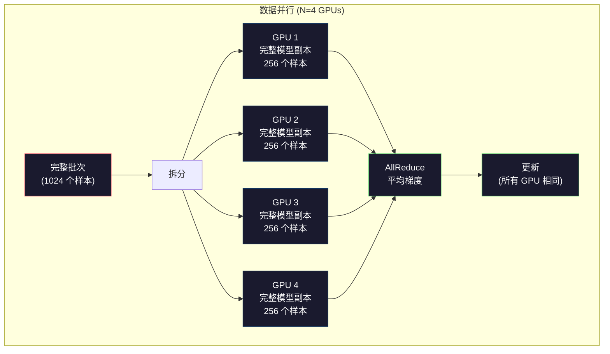
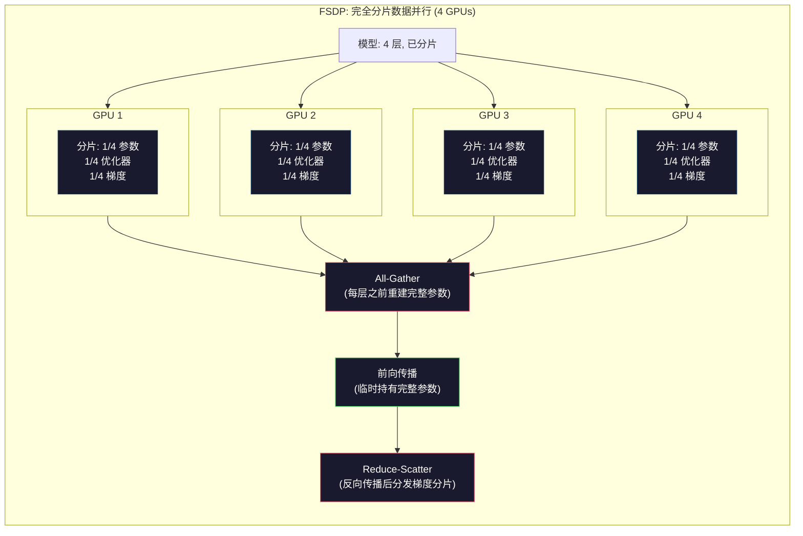
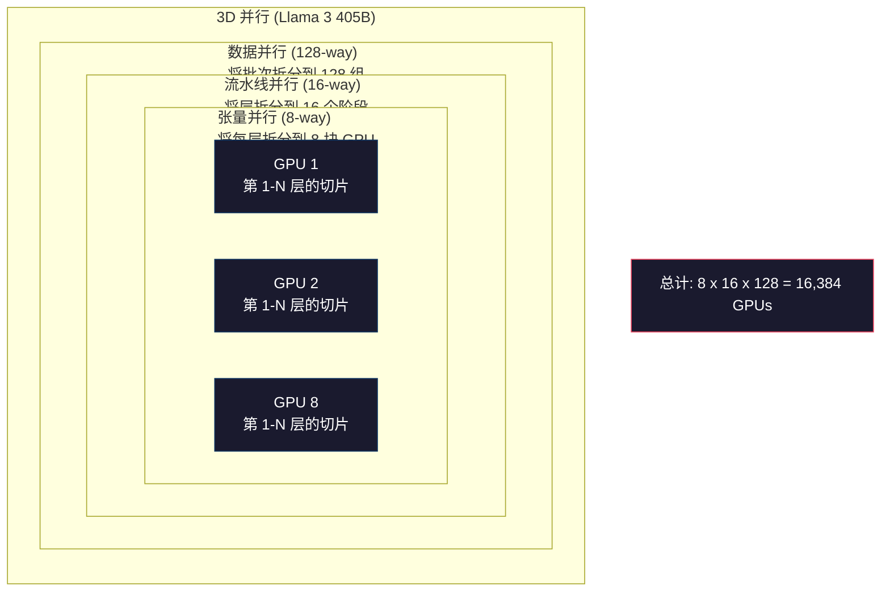

# 扩展：分布式训练、FSDP、DeepSpeed

> 你的 1.24 亿参数模型在一张 GPU 上训练完毕。现在试试 70 亿参数。模型放不进显存。数据在单机上要跑数周。在大规模场景下，分布式训练不是可选项，而是唯一的前进道路。

**类型：** 构建
**语言：** Python
**前置条件：** 第 10 阶段，第 04 课（预训练一个迷你 GPT）
**时间：** 约 120 分钟

## 学习目标

- 解释三种并行方式（数据并行、张量并行、流水线并行），并根据模型规模和集群大小判断何时需要哪种
- 使用 PyTorch DDP 实现数据并行训练，在多个 GPU 之间同步梯度
- 计算给定模型规模的显存预算（权重 + 优化器状态 + 梯度 + 激活值），以确定最低硬件需求
- 配置 FSDP 或 DeepSpeed ZeRO 阶段，将模型状态分片到多个 GPU 上，从而容纳超过单卡显存的模型

## 问题所在

一个 70 亿参数的 FP16 模型仅权重就需要 14GB。Adam 优化器为每个参数额外存储两份副本（一阶矩和二阶矩估计）。这又是 28GB。反向传播期间的梯度再增加 14GB。在还没存储任何一个激活值之前，你已经用了 56GB。

一块 NVIDIA A100 有 80GB 显存。

56GB 占了 80GB 的七成。留给激活值——前向传播中计算出的、必须在反向传播期间保持存活的中间值——只有 24GB。对于 2048 个词元（token）的序列和 4096 维的模型，单层激活值约为 64MB。32 层的话，每个样本需要 2GB。批次大小（batch size）为 8 需要 16GB。你还有 24GB。批次大小为 12 就会爆显存。

现在试试 700 亿参数。仅权重：FP16 下 140GB。一张 GPU 放不下。你至少需要 2 块 A100（2 x 80GB = 160GB）才能装下权重。加上优化器状态和梯度，需要更多：最少 3 块 GPU，实际根据分片策略需要 8-16 块。

Llama 3 405B 在 16,384 块 NVIDIA H100 GPU 上训练。训练运行的计算成本估计为 1 亿美元。DeepSeek V3 通过巧妙的架构设计（混合专家 MoE，意味着每个词元只激活一小部分参数）和训练效率，以大约 560 万美元训练了一个同等规模的模型。

本课涵盖使大规模训练成为可能的四种策略：数据并行、张量并行、流水线并行和完全分片数据并行。你将在纯 Python 中模拟每一种，以理解其机制，然后再接触分布式训练框架。

## 核心概念

### 为什么需要分布式

以下是真实模型的显存计算。每个数字都是精确计算，而非估算。

| 模型 | 参数量 | 权重 (FP16) | Adam 状态 | 梯度 (FP16) | 总计（不含激活值） |
|-------|--------|----------------|-------------|------------------|----------------------|
| GPT-2 Small | 1.24 亿 | 248 MB | 992 MB | 248 MB | 1.5 GB |
| Llama 3 8B | 80 亿 | 16 GB | 64 GB | 16 GB | 96 GB |
| Llama 3 70B | 700 亿 | 140 GB | 560 GB | 140 GB | 840 GB |
| Llama 3 405B | 4050 亿 | 810 GB | 3,240 GB | 810 GB | 4,860 GB |

"Adam 状态"这一列是致命的。Adam 为每个参数存储一个滑动平均（m）和一个滑动方差（v），都是 FP32。对于 700 亿参数的模型，就是 700 亿 x 4 字节 x 2 = 560GB。仅优化器就需要七块 A100。

一块 H100 有 80GB。Llama 3 405B 至少需要 61 块 H100 才能装下权重、优化器和梯度。加上激活值，数量还会增加。Meta 使用 16,384 块 GPU 不是因为他们想——而是因为他们不得不。

### 数据并行

最简单的分布式策略。将整个模型复制到 N 块 GPU。将每个训练批次分成 N 等份。每块 GPU 在其数据分片上运行前向和反向传播。反向传播后，对所有 GPU 的梯度取平均。每块 GPU 用相同的平均梯度更新自己的权重副本，保持所有副本同步。

**优点：** 吞吐量线性扩展。N 块 GPU 每步处理 N 倍的数据。通信仅限于梯度平均，可与计算重叠。

**缺点：** 每块 GPU 持有完整的模型、优化器状态和梯度副本。对于 700 亿参数的模型，每块 GPU 需要 840GB。数据并行不会减少单卡显存，它只减少训练时间。

**数学：** 有效批次大小 = 每卡批次大小 x N。N=64 块 GPU，每卡批次为 16，有效批次就是 1,024。Llama 3 每步的有效批次大小为 1600 万词元。



### 张量并行

将单个层拆分到多个 GPU 上。一个矩阵乘法被分到多个 GPU 上，每块计算结果的一部分。

考虑前馈层中一个形状为 (8192, 8192) 的权重矩阵。使用 4 路张量并行，每块 GPU 持有一个 (8192, 2048) 的分片。每块 GPU 将输入乘以其分片，产生部分结果。部分结果通过 all-reduce 或 all-gather 组合，产生完整输出。

**优点：** 减少单卡模型权重的显存。700 亿参数模型分到 8 块 GPU 上，每块 GPU 持有约 87.5 亿参数的权重。

**缺点：** 每层之后需要快速的 GPU 间通信。每次矩阵乘法后的 all-reduce 增加了延迟。这在 NVLink（同一节点内 GPU 之间 900 GB/s）下表现良好，但在通过 InfiniBand（400 Gb/s，约 50 GB/s）连接的跨节点环境下表现很差。张量并行几乎总是限制在单个节点内（8 块 GPU）。

**实际应用：** Megatron-LM 开创了张量并行。Llama 3 405B 在每个节点内使用 8 路张量并行。

### 流水线并行

按层拆分模型。GPU 1 运行第 1-8 层。GPU 2 运行第 9-16 层。GPU 3 运行第 17-24 层。GPU 4 运行第 25-32 层。数据流经流水线：GPU 1 计算其层并将激活值发送给 GPU 2，GPU 2 计算其层并发送给 GPU 3，依此类推。

**优点：** GPU 之间通信最少——只需要层边界的激活值，与梯度或权重相比很小。跨节点工作良好，因为带宽需求低。

**缺点：** 流水线气泡（bubble）。当 GPU 4 在微批次 1 上计算前向传播时，GPU 1、2、3 处于空闲状态（它们已经完成了各自部分的前向传播）。在反向传播期间，模式反转。对于朴素的流水线，N 个流水线阶段的 GPU 利用率只有 1/N。

**GPipe 和 PipeDream** 通过将批次拆分为微批次来解决气泡问题。GPU 1 在完成微批次 1 的前向传播后立即开始微批次 2。这重叠了不同流水线阶段的计算。M 个微批次和 N 个阶段，气泡比例降至 (N-1)/M。使用 M=16 个微批次和 N=4 个阶段，气泡为 3/16 = 18.75% 的空闲时间。

### FSDP：完全分片数据并行

FSDP 将数据并行的可扩展性与分片的显存效率结合起来。每块 GPU 不是持有完整的模型副本，而是只持有 1/N 的参数、梯度和优化器状态。

在层的前向传播之前，FSDP 运行一次 **all-gather**，从所有 GPU 收集完整参数到每块 GPU 的显存中。前向传播后，每块 GPU 丢弃非本地参数。反向传播期间，all-gather 再次运行以重建参数用于梯度计算。反向传播后，**reduce-scatter** 分发梯度分片，使每块 GPU 只存储 1/N 的梯度。

**700 亿参数模型在 8 块 GPU 上的数学：**

| 组件 | 不使用 FSDP | 使用 FSDP |
|-----------|-------------|-----------|
| 权重 (FP16) | 每卡 140 GB | 每卡 17.5 GB |
| Adam 状态 (FP32) | 每卡 560 GB | 每卡 70 GB |
| 梯度 (FP16) | 每卡 140 GB | 每卡 17.5 GB |
| **总计** | **每卡 840 GB** | **每卡 105 GB** |

不使用 FSDP，你无法将 700 亿参数模型装进一块 80GB GPU。使用 8 块 GPU 的 FSDP，每卡使用 105GB——等等，还是装不下。你至少需要 16 块 GPU 才能让每卡降到 80GB 以下，或者将 FSDP 与激活值检查点（反向传播时重新计算激活值而不是存储它们）结合使用。

通信成本高于普通数据并行，因为每层之前都有 all-gather。但显存节省使之前不可能的训练运行成为可能。



### DeepSpeed ZeRO

DeepSpeed 的 ZeRO（零冗余优化器）在概念上与 FSDP 完全相同，但由微软独立开发。它定义了三个阶段，每个阶段分片更激进：

| 阶段 | 分片内容 | 显存节省 | 通信量 |
|-------|--------|---------------|---------------|
| ZeRO-1 | 仅优化器状态 | 约 4 倍减少 | 与数据并行相同 |
| ZeRO-2 | + 梯度 | 约 8 倍减少 | 略多 |
| ZeRO-3 | + 参数 | 约 N 倍减少 (N 块 GPU) | 每层 all-gather |

ZeRO-3 等同于 FSDP。名称不同，机制相同。PyTorch 在 DeepSpeed 证明概念后，将 FSDP 作为原生实现加入。

DeepSpeed 还引入了 ZeRO-Offload（将优化器状态卸载到 CPU 内存，更便宜且更大）和 ZeRO-Infinity（卸载到 NVMe 固态硬盘）。这些用计算速度换取显存容量——卸载操作更慢，但释放了 GPU 显存。

### 混合精度训练

现代训练同时使用多种浮点格式：

- **前向传播**：FP16 或 BF16（16 位）。显存是 FP32 的一半。张量核心上的矩阵乘法快 2 倍。
- **主权重**：FP32（32 位）。优化器维护以保证权重更新时的数值精度。
- **损失缩放**：反向传播前将损失乘以一个大的常数，防止 FP16 梯度下溢为零。优化器步之前除以相同的常数。

BF16（Brain Float 16）与 FP32 有相同的指数范围（8 位指数），但精度降低（7 位尾数 vs FP32 的 23 位）。它很少需要损失缩放，因为它能表示相同的数值范围。FP16 有 5 位指数和 10 位尾数——它能表示精细的值，但在极端量级时会上溢/下溢。

Google 的 TPU 原生使用 BF16。NVIDIA 的 A100 和 H100 支持 FP16 和 BF16。业界已基本转向 BF16，因为它消除了损失缩放的麻烦。

**70 亿参数模型的显存对比：**

| 精度 | 权重 | 优化器 | 梯度 | 总计 |
|-----------|---------|-----------|-----------|-------|
| 全 FP32 | 28 GB | 56 GB | 28 GB | 112 GB |
| 混合 (BF16 + FP32 主权重) | 14 GB | 56 GB | 14 GB | 84 GB |

混合精度在此模型上节省 28GB。优化器状态保持 FP32 不变——这才是显存占用最大的地方。

### Megatron-LM 和 3D 并行

真实的大规模训练结合了三种并行方式：

- **数据并行** 跨节点组（扩展批次大小）
- **张量并行** 在节点内（将层拆分到 8 块 GPU）
- **流水线并行** 跨节点（将层组拆分到不同机器）

Llama 3 405B 在 16,384 块 H100 上：
- 每个节点内 8 路张量并行（每节点 8 块 GPU）
- 跨节点 16 路流水线并行（16 个流水线阶段）
- 剩余维度上 128 路数据并行（16,384 / 8 / 16 = 128）

这种 3D 分解（8 x 16 x 128 = 16,384）就是你扩展到数千块 GPU 的方式。每块 GPU 看到不同的数据分片（数据并行），持有每层的切片（张量并行），并计算不同的层组（流水线并行）。

DeepSeek V3 采用了不同的方法。他们的混合专家架构每个词元只激活 370 亿参数中的 6710 亿参数。这意味着每块 GPU 只需要计算（并存储激活值）活跃参数。他们在 2,048 块 H800 GPU 上训练——不到 Meta GPU 数量的 1/8——成本为 560 万美元，而 Meta 估计为 1 亿美元。



```figure
paged-kv-cache
```

## 动手构建

### 步骤 1：模拟数据并行

将一个批次拆分到模拟的 GPU 上。每块 GPU 在其分片上计算前向传播。平均"梯度"（我们用损失值来模拟）。

```python
import numpy as np

def simulate_data_parallelism(data, num_gpus, model_fn):
    batch_size = len(data)
    shard_size = batch_size // num_gpus
    remainder = batch_size % num_gpus

    gpu_losses = []
    gpu_gradients = []

    offset = 0
    for gpu_id in range(num_gpus):
        extra = 1 if gpu_id < remainder else 0
        shard = data[offset:offset + shard_size + extra]
        offset += shard_size + extra

        loss, grad = model_fn(shard)
        gpu_losses.append(loss)
        gpu_gradients.append(grad)

    avg_loss = np.mean(gpu_losses)
    avg_gradient = np.mean(gpu_gradients, axis=0)

    return avg_loss, avg_gradient
```

all-reduce 操作（平均梯度）是数据并行中唯一的通信。在实践中，NVIDIA GPU 使用 NCCL 库实现环形 all-reduce：每块 GPU 将其梯度的 1/N 发送给邻居，从另一邻居接收 1/N，经过 N-1 步后每块 GPU 都拥有完整的平均值。总通信量：2 x gradient_size x (N-1)/N，对于大的 N 接近 2 倍梯度大小。

### 步骤 2：模拟张量并行

将权重矩阵拆分到多个 GPU 上。每块 GPU 计算部分矩阵乘法。组合结果。

```python
def simulate_tensor_parallelism(input_data, weight_matrix, num_gpus):
    d_in, d_out = weight_matrix.shape
    assert d_out % num_gpus == 0, f"d_out {d_out} not divisible by num_gpus {num_gpus}"
    shard_size = d_out // num_gpus

    partial_results = []
    for gpu_id in range(num_gpus):
        start = gpu_id * shard_size
        end = start + shard_size
        weight_shard = weight_matrix[:, start:end]

        partial = input_data @ weight_shard
        partial_results.append(partial)

    full_output = np.concatenate(partial_results, axis=-1)

    direct_output = input_data @ weight_matrix
    error = np.abs(full_output - direct_output).max()

    return full_output, error
```

误差应该恰好为零（或机器精度）。张量并行在数学上是精确的——它产生与在单块 GPU 上计算完整矩阵乘法相同的结果。拆分沿输出维度进行，所以每块 GPU 产生不同的列块，拼接后重建完整结果。

对于列并行线性层（拆分输出维度），你拼接。对于行并行（拆分输入维度），你求和。在 Transformer 的前馈网络（FFN）中，第一个线性层（扩展）使用列并行，第二个线性层（收缩）使用行并行。这避免了两层之间的 all-reduce。

### 步骤 3：模拟流水线并行

将模型的层拆分到虚拟 GPU 上。展示气泡问题：早期阶段在后续阶段计算时空闲。

```python
def simulate_pipeline_parallelism(num_layers, num_stages, num_microbatches):
    layers_per_stage = num_layers // num_stages

    timeline = {}
    clock = 0

    for mb in range(num_microbatches):
        for stage in range(num_stages):
            start_time = max(
                timeline.get((stage, mb - 1, "fwd"), (0, 0))[1] if mb > 0 else 0,
                timeline.get((stage - 1, mb, "fwd"), (0, 0))[1] if stage > 0 else 0,
            )
            end_time = start_time + layers_per_stage
            timeline[(stage, mb, "fwd")] = (start_time, end_time)

    last_fwd_end = max(v[1] for v in timeline.values())

    for mb in range(num_microbatches - 1, -1, -1):
        for stage in range(num_stages - 1, -1, -1):
            deps = [last_fwd_end]
            if mb < num_microbatches - 1 and (stage, mb + 1, "bwd") in timeline:
                deps.append(timeline[(stage, mb + 1, "bwd")][1])
            if stage < num_stages - 1 and (stage + 1, mb, "bwd") in timeline:
                deps.append(timeline[(stage + 1, mb, "bwd")][1])
            start_time = max(deps)
            end_time = start_time + layers_per_stage
            timeline[(stage, mb, "bwd")] = (start_time, end_time)

    total_time = max(v[1] for v in timeline.values())
    compute_time = num_microbatches * num_stages * layers_per_stage * 2
    bubble_fraction = 1.0 - compute_time / (total_time * num_stages)

    return timeline, total_time, bubble_fraction
```

4 个阶段和 1 个微批次，气泡比例为 75%——任意时刻有四分之三的 GPU 空闲。16 个微批次时，降至约 19%。消除气泡的代价是显存：你必须同时存储所有在途微批次的激活值。

### 步骤 4：显存计算器

计算训练任何模型规模的精确显存需求。

```python
def memory_calculator(
    params_billions,
    precision_bytes=2,
    optimizer="adam",
    num_gpus=1,
    sharding="none",
    sequence_length=2048,
    batch_size_per_gpu=1,
    hidden_dim=None,
    num_layers=None,
):
    params = params_billions * 1e9

    weight_memory = params * precision_bytes

    if optimizer == "adam":
        optimizer_memory = params * 4 * 2
    elif optimizer == "sgd":
        optimizer_memory = params * 4
    else:
        optimizer_memory = 0

    gradient_memory = params * precision_bytes

    total_no_activation = weight_memory + optimizer_memory + gradient_memory

    if hidden_dim and num_layers:
        activation_per_layer = (
            sequence_length * batch_size_per_gpu * hidden_dim * precision_bytes * 4
        )
        activation_memory = activation_per_layer * num_layers
    else:
        activation_memory = params * precision_bytes * 0.5

    if sharding == "fsdp" or sharding == "zero3":
        weight_memory /= num_gpus
        optimizer_memory /= num_gpus
        gradient_memory /= num_gpus
    elif sharding == "zero2":
        optimizer_memory /= num_gpus
        gradient_memory /= num_gpus
    elif sharding == "zero1":
        optimizer_memory /= num_gpus

    per_gpu_total = weight_memory + optimizer_memory + gradient_memory + activation_memory

    return {
        "params_billions": params_billions,
        "weights_gb": weight_memory / 1e9,
        "optimizer_gb": optimizer_memory / 1e9,
        "gradients_gb": gradient_memory / 1e9,
        "activations_gb": activation_memory / 1e9,
        "per_gpu_total_gb": per_gpu_total / 1e9,
        "total_across_gpus_gb": per_gpu_total * num_gpus / 1e9,
        "fits_on_80gb": per_gpu_total / 1e9 <= 80,
        "num_gpus": num_gpus,
        "sharding": sharding,
    }
```

这个计算器回答了每个 ML 工程师都会问的问题："我需要多少块 GPU？"输入模型规模，看看是否装得下。调整分片策略，直到每卡总计降到 80GB 以下。

### 步骤 5：混合精度模拟

比较 FP32、FP16 和混合精度训练的显存使用。

```python
def mixed_precision_comparison(params_billions):
    params = params_billions * 1e9

    fp32_weights = params * 4
    fp32_optimizer = params * 4 * 2
    fp32_gradients = params * 4
    fp32_total = fp32_weights + fp32_optimizer + fp32_gradients

    fp16_weights = params * 2
    fp16_master = params * 4
    fp16_optimizer = params * 4 * 2
    fp16_gradients = params * 2
    fp16_total = fp16_weights + fp16_master + fp16_optimizer + fp16_gradients

    mixed_weights = params * 2
    mixed_optimizer = params * 4 * 2
    mixed_gradients = params * 2
    mixed_total = mixed_weights + mixed_optimizer + mixed_gradients

    return {
        "fp32_total_gb": fp32_total / 1e9,
        "fp16_with_master_gb": fp16_total / 1e9,
        "mixed_bf16_gb": mixed_total / 1e9,
        "savings_vs_fp32": 1 - mixed_total / fp32_total,
    }
```

对大多数人来说最大的意外：混合精度不会将显存减半。优化器状态（Adam 的 m 和 v）无论精度如何都保持 FP32。对于 70 亿参数模型，FP32 训练使用 112GB。混合精度使用 84GB。这是 25% 的减少，不是 50%。优化器占了大头。

## 应用实践

### 运行所有模拟

```python
def run_all_demos():
    print("=" * 70)
    print("数据并行模拟")
    print("=" * 70)

    np.random.seed(42)
    data = np.random.randn(64, 32)
    weight = np.random.randn(32, 16)

    def model_fn(batch):
        output = batch @ weight
        loss = np.mean(output ** 2)
        grad = 2 * batch.T @ (batch @ weight) / len(batch)
        return loss, grad

    for n_gpus in [1, 2, 4, 8]:
        loss, grad = simulate_data_parallelism(data, n_gpus, model_fn)
        print(f"  {n_gpus} GPUs: loss={loss:.4f}, grad_norm={np.linalg.norm(grad):.4f}")

    print()
    print("=" * 70)
    print("张量并行模拟")
    print("=" * 70)

    x = np.random.randn(4, 8192)
    W = np.random.randn(8192, 8192)

    for n_gpus in [1, 2, 4, 8]:
        output, error = simulate_tensor_parallelism(x, W, n_gpus)
        print(f"  {n_gpus} GPUs: output_shape={output.shape}, max_error={error:.2e}")

    print()
    print("=" * 70)
    print("流水线并行模拟")
    print("=" * 70)

    for n_mb in [1, 4, 8, 16, 32]:
        _, total_t, bubble = simulate_pipeline_parallelism(32, 4, n_mb)
        print(f"  {n_mb:2d} micro-batches: total_time={total_t:4d}, bubble={bubble:.1%}")

    print()
    print("=" * 70)
    print("显存计算器")
    print("=" * 70)

    configs = [
        (7, "none", 1),
        (7, "fsdp", 8),
        (70, "none", 1),
        (70, "fsdp", 8),
        (70, "fsdp", 16),
        (405, "fsdp", 64),
        (405, "fsdp", 128),
    ]

    print(f"  {'Model':>8} {'Sharding':>8} {'GPUs':>5} {'Per-GPU':>10} {'Fits 80GB':>10}")
    print("  " + "-" * 50)
    for params, shard, gpus in configs:
        result = memory_calculator(params, num_gpus=gpus, sharding=shard)
        fits = "Yes" if result["fits_on_80gb"] else "No"
        print(f"  {params:>6}B {shard:>8} {gpus:>5} {result['per_gpu_total_gb']:>8.1f}GB {fits:>10}")

    print()
    print("=" * 70)
    print("混合精度对比")
    print("=" * 70)

    for params_b in [7, 13, 70, 405]:
        result = mixed_precision_comparison(params_b)
        print(f"  {params_b}B: FP32={result['fp32_total_gb']:.0f}GB, "
              f"Mixed BF16={result['mixed_bf16_gb']:.0f}GB, "
              f"Savings={result['savings_vs_fp32']:.0%}")
```

## 交付成果

本课产出 `outputs/prompt-distributed-training-planner.md` —— 一个提示词，输入模型规模和可用硬件，输出完整的分布式训练计划：并行策略、显存预算、通信开销和预期吞吐量。

## 练习题

1. 修改显存计算器以包含激活值检查点。使用检查点时，只存储每 K 层的激活值（典型 K=1，意味着全部重新计算）。展示显存-计算的权衡：检查点节省多少显存，训练慢多少（完整检查点约增加 33% 的计算量）？

2. 扩展流水线并行模拟以实现 PipeDream 使用的 1F1B（一次前向，一次反向）调度。比较 4 个阶段和 8 个微批次下与朴素调度的气泡比例。1F1B 调度的峰值显存应该更小，因为它更早开始反向传播。

3. 实现一个梯度累积模拟器。不是在每个微批次后都 all-reduce，而是在本地累积 K 步梯度，然后再 all-reduce。展示这如何将通信减少 K 倍，但产生相同的最终梯度（因此产生相同的训练效果）。

4. 构建一个成本估算器。给定模型规模、目标词元数、GPU 类型（A100 每小时 2 美元，H100 每小时 3.50 美元）和并行策略，估算总训练成本（美元）。与已知成本验证：Llama 3 405B  reportedly 花费约 1 亿美元，DeepSeek V3 花费约 560 万美元。

5. 将 ZeRO-Offload 加入显存计算器。假设每节点 CPU 内存为 512GB，NVMe 为 2TB。展示将优化器状态卸载到 CPU 如何让 700 亿参数模型在 4 块 GPU 而不是 16 块上训练，代价是优化器步骤慢 30-50%。

## 关键术语

| 术语 | 人们怎么说 | 实际含义 |
|------|----------------|----------------------|
| 数据并行 | "把模型复制到每块 GPU" | 每块 GPU 处理不同的数据分片；每步后通过 all-reduce 平均梯度 |
| 张量并行 | "把层拆分到 GPU 上" | 划分权重矩阵，每块 GPU 计算部分矩阵乘法；需要快速的 NVLink 互联 |
| 流水线并行 | "把层拆分到 GPU 上" | 每块 GPU 运行不同的层组；数据流经流水线，微批次减少气泡 |
| FSDP | "全分片" | 完全分片数据并行 —— 每块 GPU 持有 1/N 的权重、梯度和优化器状态；计算前 all-gather |
| ZeRO | "DeepSpeed 版的 FSDP" | 零冗余优化器，分 3 个阶段：分片优化器（阶段 1）、+ 梯度（阶段 2）、+ 参数（阶段 3） |
| All-reduce | "跨 GPU 平均" | 集合通信操作，每块 GPU 最终得到所有 GPU 输入的和（或平均）—— 通常以环形 all-reduce 实现 |
| All-gather | "从所有 GPU 收集" | 集合通信操作，每块 GPU 最终得到所有 GPU 数据的拼接 —— FSDP 中用于重建完整参数 |
| Reduce-scatter | "求和并分发" | 集合通信操作，将数据规约（求和）并分散不同块到不同 GPU —— FSDP 中用于梯度分片 |
| 混合精度 | "半精度训练" | 前向/反向用 FP16/BF16，优化器状态用 FP32 —— 节省约 25% 显存，不是 50%，因为优化器占大头 |
| 流水线气泡 | "流水线中的空闲时间" | GPU 等待前一阶段数据时空闲的时间比例 —— 通过使用更多微批次来减少 |

## 延伸阅读

- [Rajbhandari et al., 2020 -- "ZeRO: Memory Optimizations Toward Training Trillion Parameter Models"](https://arxiv.org/abs/1910.02054) —— DeepSpeed ZeRO 论文，定义了三个分片阶段
- [Shoeybi et al., 2020 -- "Megatron-LM: Training Multi-Billion Parameter Language Models Using Model Parallelism"](https://arxiv.org/abs/1909.08053) —— NVIDIA 的 Transformer 张量并行
- [Narayanan et al., 2021 -- "Efficient Large-Scale Language Model Training on GPU Clusters Using Megatron-LM"](https://arxiv.org/abs/2104.04473) —— 结合数据、张量和流水线并行的 3D 并行
- [Zhao et al., 2023 -- "PyTorch FSDP: Experiences on Scaling Fully Sharded Data Parallel"](https://arxiv.org/abs/2304.11277) —— PyTorch 的原生 FSDP 实现
- [Llama 3 Technical Report](https://arxiv.org/abs/2407.21783) —— 16,384 GPU 训练的 3D 并行细节
- [DeepSeek-V3 Technical Report](https://arxiv.org/abs/2412.19437) —— MoE 架构如何将训练成本降低一个数量级
