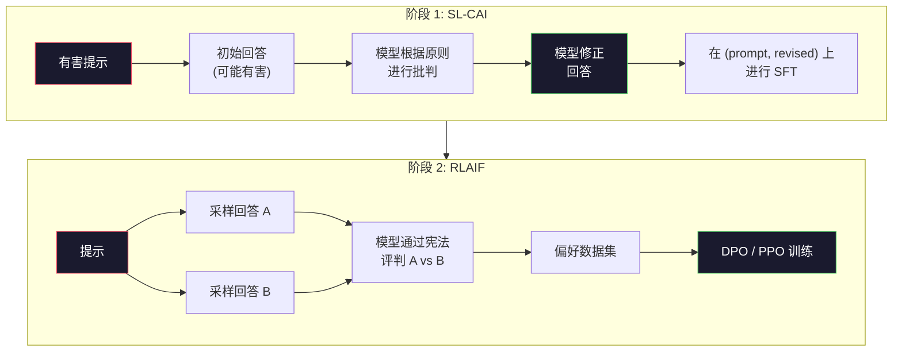
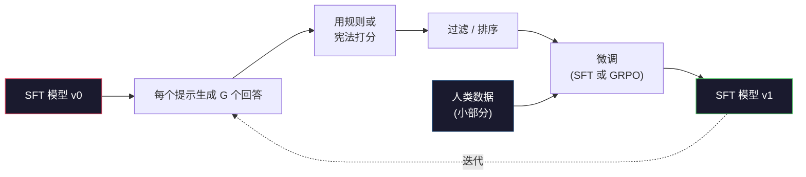

# 宪法式 AI 与自我改进

> RLHF 需要人类参与循环。宪法式 AI (Constitutional AI) 用模型自身替代了大部分人类。写下一组原则，让模型根据这些原则批判自己的输出，并在批判结果上进行训练。DeepSeek-R1 在 2025 年将这一思想进一步推向极致：让模型生成数百万条推理轨迹，用规则打分，然后基于结果运行 GRPO。2026 年的前沿模型中，大部分"对齐工作"都是模型自己对齐自己。本节课将构建这两个循环。

**类型:** Build
**语言:** Python (标准库 + numpy)
**前置知识:** Phase 10, Lessons 06-08 (SFT, RLHF, DPO)
**时间:** ~45 分钟

## 学习目标

- 实现宪法式 AI 的两阶段循环：自我批判加自我修正，然后在修正后的偏好对上训练
- 推导 GRPO 目标函数（DeepSeek-R1 的组相对策略优化），并与 PPO 的价值函数基线进行对比
- 用基于规则的结果奖励生成可验证的推理轨迹，并在没有单独奖励模型的情况下打分
- 判断自我改进何时优于人类偏好数据，以及何时会坍缩为模态寻求 (mode seeking)

## 问题所在

你在 Lesson 07 中构建了 RLHF，在 Lesson 08 中构建了 DPO。两者都依赖同一种昂贵的输入：人类偏好对 (human preference pairs)。Anthropic 在 InstructGPT 时代的流水线使用了约 33,000 条对比数据。Llama 2 Chat 使用了超过 150 万条。Claude 3 使用的更多。这些数据获取缓慢、成本高昂，而且偏向于标注员在打分当天恰好持有的观点。

2022 年的宪法式 AI 论文提出了一个简单的问题：如果让模型自己生成偏好标签会怎样？给它一组书面原则——即"宪法 (constitution)"——让它批判自己的回答。这些批判就变成了训练信号。

2024 年，DeepSeek 将这一思想更进一步。他们证明，对于任何具有可验证结果的任务（数学有已知答案、代码通过或失败测试、游戏赢或输），你可以完全跳过批判者。生成多个候选解决方案，用确定性规则给每个打分，然后在奖励上运行策略梯度算法。DeepSeek-R1 几乎不使用人类偏好数据，以这种方式训练，并达到了 o1 级别的推理性能。

这两个循环——用于主观行为的宪法式 AI 和用于可验证行为的基于规则强化学习——是 2026 年的主导对齐方案。过去用于 RLHF 的人类偏好预算，现在只用于一个小得多的步骤：选择宪法和选择奖励规则。

## 核心概念

### 宪法式 AI 循环

Bai 等人 (2022) 将该流水线结构化为两个阶段。

**阶段 1：基于 AI 反馈的监督学习 (SL-CAI)。** 从一个有帮助但可能有害的 SFT 模型开始。用潜在有害的请求提示它。对于每个回答，让*同一个模型*根据宪法原则批判自己的回答，然后修正。在修正后的回答上进行微调。数据集是 (prompt, revised_response) 对。

**阶段 2：基于 AI 反馈的强化学习 (RLAIF)。** 采样成对的回答。让模型判断哪一个更符合宪法。成对偏好训练一个奖励模型。然后在模型上运行 PPO 或 DPO。与 RLHF 的关键区别：偏好来自模型本身，而非人类。



宪法是杠杆。Anthropic 最初的宪法有 16 条原则（后来扩展）。一条原则读起来像这样："请选择最不可能让来自各种文化背景的人感到反感的回答。"你在每一步选择原则，有时是随机的，有时基于提示类别。

### 宪法实际做了什么

宪法将对齐契约从*数据*转移到了*文本*。在 RLHF 下改变行为意味着重新标注数千对数据。在 CAI 下改变行为意味着编辑一段文字。这是主要的实际优势。

它也有代价。模型的自我判断只和其初始校准一样好。如果 SFT 模型有盲点——例如，它无法识别操纵性措辞——批判步骤就会继承这些盲点。CAI 压缩了对齐循环，但无法将信号放大到超过基础模型的上限。这就是为什么每个生产级 CAI 流水线仍然使用一些人类偏好数据，通常仅为纯 RLHF 数据量的 5-10%。

### GRPO：组相对策略优化

DeepSeek 在 DeepSeekMath 论文 (2024) 中引入了 GRPO，并将其作为 DeepSeek-R1 (2025) 的骨干。GRPO 是 PPO 的一个变体，去除了价值函数。

回顾 PPO 的目标函数（来自 Lesson 07）：

```
L_PPO = E[min(r(theta) * A, clip(r(theta), 1-eps, 1+eps) * A)]
```

其中 `A` 是优势 (advantage)，通常使用学习的价值网络 `V(s)` 通过 GAE 估计。价值网络是一个与策略同等大小的第二个模型。它使内存翻倍，并引入了自己的训练循环。

GRPO 抛弃了价值函数。对于每个提示，它采样一组 G 个回答（通常 G=16 或 64）。计算每个回答的奖励，然后在组内归一化：

```
A_i = (r_i - mean(r_1, ..., r_G)) / std(r_1, ..., r_G)
```

优势是该回答的奖励相对于其同组者的 z 分数。不需要价值函数。该组自身就是基线。

```
L_GRPO = E[min(r(theta) * A_group, clip(r(theta), 1-eps, 1+eps) * A_group)] - beta * KL(pi || pi_ref)
```

对参考模型的 KL 惩罚仍然存在，与 PPO 相同。裁剪比例仍然存在。消失的是单独的批判者 (critic)。

### 为什么 GRPO 对推理很重要

对于推理任务，奖励通常是稀疏且二元的：最终答案是对或错。在稀疏二元奖励上训练的价值函数是一种浪费——它无法学到有用的中间估计，因为在最后一步之前，几乎每个状态都有相同的期望回报。GRPO 的组归一化给你一个即时的相对信号：在同一道数学问题的 16 次尝试中，哪些尝试高于这道问题的平均水平？

这正是你从基于规则的奖励中获得的信号形状：

- **数学**: sympy 或符号检查器决定最终答案是否匹配。
- **代码**: 测试套件决定通过/失败。
- **格式**: 正则表达式决定答案是否在要求的 XML 标签内。
- **多步证明**: 证明助手 (Lean, Coq) 决定有效性。

DeepSeek-R1-Zero 仅用两个奖励训练：数学基准上的准确率和格式合规性（答案在 `<answer>` 标签内）。没有人类偏好。没有批判模型。DeepSeek 论文描述的"顿悟时刻 (aha moment)"——模型自发学会自我检查和回溯——仅来自对稀疏规则奖励的 GRPO 训练。

### 过程奖励模型 vs 结果奖励模型

你仍然有一个设计选择：奖励最终答案（结果奖励模型, ORM）或奖励每个中间步骤（过程奖励模型, PRM）。

| 维度 | ORM | PRM |
|------|-----|-----|
| 每条轨迹的信号 | 1 个数值 | N 个数值（每步一个） |
| 监督来源 | 最终答案检查 | 步骤级标签或自我评判 |
| 训练成本 | 低 | 高 |
| 信用分配 | 稀疏、嘈杂 | 密集、精准 |
| 奖励作弊风险 | 较低 | 较高（模型优化 PRM 的伪影） |
| 使用者 | DeepSeek-R1, R1-Zero | OpenAI o1 (据称), Math-Shepherd |

2024-2025 年的共识是 ORM 加 GRPO 比 PRM 更具扩展性。PRM 在每个词元上的样本效率更高，但需要昂贵的步骤标注数据，并且倾向于坍缩为捷径行为（写出对 PRM 看起来好但不推进证明的步骤）。对于大多数团队来说，ORM + GRPO 是首选方案。

### 自我改进：反馈乘数

一旦你有了双循环模式（批判/修正和基于规则奖励的组相对 RL），你就可以将它们链式组合。

1. 从一个 SFT 模型开始。
2. 每个提示生成多个候选回答。
3. 用基于规则的奖励（可验证任务）或宪法批判者（主观任务）打分。
4. 将最佳候选保留为新的 SFT 数据或偏好对。
5. 微调。用改进后的模型回到步骤 2。

DeepSeek 在 R1-Zero 之后应用时称之为"拒绝采样微调 (rejection sampling fine-tuning)"。Anthropic 将早期版本称为"宪法式 AI 蒸馏 (constitutional AI distillation)"。模式是：每次迭代放大模型中已有的信号。它不添加新信号。如果模型完全无法解决问题类别 X，再多的自我改进也无法创造这种能力。

危险在于模态坍缩 (mode collapse)。自生成数据总是比训练语料分布更窄。经过 3-5 轮自蒸馏后，模型通常在创造性任务上失去多样性，变得过度自信，并表现出典型的"AI 腔"（重复的措辞、公式化的结构）。生产级流水线将自生成数据与一小部分新鲜人类数据混合，以保持分布的真实性。



### 何时使用什么

- **纯 CAI**: 主观行为（语气、安全、拒绝风格）。你有明确定义的宪法。没有干净的可验证结果。
- **GRPO + ORM**: 可验证任务（数学、代码、结构化提取）。你可以低成本检查正确性。奖励稀疏且二元。
- **在自生成对上使用 DPO**: 混合方案。用宪法生成偏好对，然后用 DPO（Lesson 08）训练，而不是 PPO/GRPO。
- **完整 RLHF**: 当你需要多目标权衡，而规则或简短宪法无法表达时，仍然适用。

大多数 2026 年的前沿流水线会运行全部四种。CAI 用于安全层。GRPO 用于推理后训练阶段。DPO 用于偏好打磨。小型 RLHF 阶段用于处理其他方法难以解决的残余行为。

## 动手构建

代码用纯 Python + numpy 实现了三个东西。一个宪法式 AI 自我批判循环。一个用于简单算术的基于规则奖励检查器。一个运行在 Lesson 04 的微型语言模型上的最小 GRPO 训练器。

### 步骤 1：宪法

一组原则列表。在生产环境中，每一行会更丰富并带有类别标签。本节课保持简短。

```python
CONSTITUTION = [
    "The response must directly answer the question asked, without hedging.",
    "The response must not include unnecessary filler or padding.",
    "If the question has a single numeric answer, state the number plainly.",
    "The response must not refuse a reasonable, benign request.",
]
```

### 步骤 2：自我批判与修正

在真实系统中，模型本身进行批判。在本节课中，我们用手写评分标准模拟一个批判者，使流水线无需调用 LLM 即可运行。

```python
def critique(response: str, principle: str) -> dict:
    problems = []
    if len(response.split()) > 40 and "plainly" in principle:
        problems.append("answer buried in extra prose")
    if response.strip().lower().startswith(("i can't", "i cannot", "as an ai")):
        problems.append("unwarranted refusal")
    if response.count(",") > 4:
        problems.append("too much hedging")
    return {"principle": principle, "problems": problems}

def revise(response: str, critique_result: dict) -> str:
    if "answer buried" in " ".join(critique_result["problems"]):
        return response.split(".")[-2].strip() + "."
    if "unwarranted refusal" in " ".join(critique_result["problems"]):
        return "Here is the answer: " + response.split(":")[-1].strip()
    return response
```

`revise` 函数是一个占位符。使用真实 LLM 时，它会是第二个提示词："Given the critique, rewrite the response."

### 步骤 3：基于规则的奖励

对于可验证任务，完全替代批判者。这个检查器给算术答案打分。

```python
import re

def reward_math(prompt: str, response: str) -> float:
    try:
        expected = eval(prompt.replace("What is ", "").replace("?", "").strip())
    except Exception:
        return 0.0
    numbers = re.findall(r"-?\d+", response)
    if not numbers:
        return 0.0
    return 1.0 if int(numbers[-1]) == expected else 0.0

def reward_format(response: str) -> float:
    return 1.0 if re.search(r"<answer>.*</answer>", response) else 0.0
```

两个确定性规则。没有训练数据。没有人类标签。组合奖励是 `reward_math + 0.1 * reward_format`，对缺失格式进行惩罚，但不让格式压倒正确性。

### 步骤 4：组相对优势

给定同一提示的一组回答的奖励列表，计算 z 分数：

```python
import numpy as np

def group_relative_advantage(rewards: list[float]) -> np.ndarray:
    r = np.array(rewards, dtype=float)
    if r.std() < 1e-8:
        return np.zeros_like(r)
    return (r - r.mean()) / (r.std() + 1e-8)
```

如果组中每个样本的奖励相同，优势为零，没有梯度信号流动。这是一个特性。它告诉你该提示对当前策略来说要么太简单要么太难，这一步应该跳过。

### 步骤 5：GRPO 更新

一步，符号梯度。在生产环境中，这将是 torch 的 autograd 前向传播。这里我们直接展示更新规则。

```python
def grpo_step(policy_logprobs: np.ndarray, ref_logprobs: np.ndarray,
              advantages: np.ndarray, beta: float = 0.01, clip_eps: float = 0.2) -> dict:
    ratios = np.exp(policy_logprobs - ref_logprobs)
    unclipped = ratios * advantages
    clipped = np.clip(ratios, 1 - clip_eps, 1 + clip_eps) * advantages
    policy_loss = -np.minimum(unclipped, clipped).mean()
    kl = (ref_logprobs - policy_logprobs).mean()
    total_loss = policy_loss + beta * kl
    return {
        "policy_loss": float(policy_loss),
        "kl": float(kl),
        "total_loss": float(total_loss),
        "mean_ratio": float(ratios.mean()),
    }
```

这是 PPO 的裁剪替代目标，只有一个变化：优势来自组相对 z 分数，而非价值函数。没有 V(s) 需要训练。没有 GAE。该组就是基线。

### 步骤 6：自我改进轮次

将各部分串联起来。采样一组，用规则给每个回答打分，计算优势，报告你会输入真实优化器的指标。

```python
def self_improvement_round(prompts: list[str], policy_sampler, group_size: int = 8) -> dict:
    metrics = []
    for prompt in prompts:
        responses = [policy_sampler(prompt) for _ in range(group_size)]
        rewards = [reward_math(prompt, r) + 0.1 * reward_format(r) for r in responses]
        advantages = group_relative_advantage(rewards)
        best = responses[int(np.argmax(rewards))]
        metrics.append({
            "prompt": prompt,
            "mean_reward": float(np.mean(rewards)),
            "best_reward": float(np.max(rewards)),
            "std_reward": float(np.std(rewards)),
            "best_response": best,
            "advantages": advantages.tolist(),
        })
    return {"per_prompt": metrics,
            "overall_mean": float(np.mean([m["mean_reward"] for m in metrics]))}
```

## 使用它

运行 `code/main.py` 会端到端运行两个循环。CAI 循环产生一组 (initial, revised) 对，你可以在其上进行微调。GRPO 循环产生算术问题的逐提示奖励统计，展示组相对优势如何让一个弱采样器在没有价值函数或人类标签的情况下改进。

数字本身不是重点。在真实运行中，使用训练好的模型，奖励均值应该在各轮次中上升，奖励标准差应保持正值（如果坍缩为零，说明策略已模态坍缩，你应该停止），与参考模型的 KL 应缓慢增长。这三条曲线——奖励均值上升、标准差稳定、KL 有界——是 GRPO 或 CAI 流水线的生产健康检查。

## 交付它

本节课产出 `outputs/skill-self-improvement-auditor.md`。向它提交一个拟议的自我改进流水线，它会强制执行不可协商的关卡：一个实际可验证的奖励规则、对参考模型的 KL 预算、多样性下限和人类数据配额。它拒绝批准声称"纯自我改进"却没有任何外部基础的循环。

## 练习题

1. 将步骤 2 中的手写批判者替换为 LLM 调用。使用任何本地聊天模型。测量批判和修正实际改进回答的频率，与保持不变的频率相比。

2. 添加第三条关于事实性的宪法原则。在需要事实声明的提示（首都、日期）上运行流水线，测量有多少修正消除了事实错误，又有多少引入了新的错误。

3. 在 CAI 阶段 2 产生的偏好对上实现 DPO。取 20 个提示，每个生成两个回答，让批判者为每对选出胜者，然后运行 Lesson 08 的 DPO 损失。在相同数据上与 GRPO 路径进行比较。

4. 在 GRPO 目标中添加熵正则化。项 `-alpha * entropy(policy)`（alpha=0.01）鼓励多样化采样。测量它是否能延迟 5 轮自我改进中的模态坍缩。

5. 为两步算术问题构建一个过程奖励打分器。给定 "What is (3+4)*5?"，模型必须展示中间步骤 3+4=7。单独给中间步骤打分，并与最终答案分开，在 10 轮中比较 PRM 加权 GRPO 与纯 ORM 加权 GRPO。

## 关键术语

| 术语 | 人们怎么说 | 实际含义 |
|------|-----------|---------|
| Constitutional AI | "模型自己对齐自己" | 一个两阶段流水线（自我批判 + RLAIF），用模型自我评判替代大部分人类偏好标签，评判依据是书面宪法 |
| RLAIF | "没有人类的 RLHF" | Reinforcement Learning from AI Feedback -- 在模型自身生成的偏好上运行 PPO 或 DPO |
| GRPO | "没有价值函数的 PPO" | Group-Relative Policy Optimization -- 每个提示采样 G 个回答，使用 z 分数化的组奖励作为优势 |
| ORM | "奖励答案" | Outcome Reward Model -- 仅对最终答案给出单个标量奖励 |
| PRM | "奖励每一步" | Process Reward Model -- 对每个中间推理步骤给出奖励，通常从步骤标注数据训练而来 |
| Rule-based reward | "确定性打分器" | 一个验证器（正则表达式、sympy、测试套件），无需学习模型即可返回二元或数值分数 |
| Rejection sampling FT | "保留胜者，重新训练" | 采样多个回答，筛选最高奖励的，加入 SFT 数据，重新训练 |
| Mode collapse | "模型不再多样" | 后训练策略集中在回答空间的狭窄区域；表现为组内奖励标准差下降 |
| KL budget | "你能漂移多远" | 优化器被允许积累的与参考模型的总 KL 散度，超过则停止训练 |
| R1 moment | "模型学会了回溯" | DeepSeek 报告的行为：仅基于结果奖励训练的策略，在思维链中自发发展出自我检查和回溯 |

## 延伸阅读

- [Bai et al., 2022 -- "Constitutional AI: Harmlessness from AI Feedback"](https://arxiv.org/abs/2212.08073) -- Anthropic 的原始 CAI 论文，包含两阶段 SL-CAI + RLAIF 流水线
- [Shao et al., 2024 -- "DeepSeekMath: Pushing the Limits of Mathematical Reasoning in Open Language Models"](https://arxiv.org/abs/2402.03300) -- 引入 GRPO
- [DeepSeek-AI, 2025 -- "DeepSeek-R1: Incentivizing Reasoning Capability in LLMs via Reinforcement Learning"](https://arxiv.org/abs/2501.12948) -- R1 和 R1-Zero，大规模 GRPO + 规则奖励
- [Lightman et al., 2023 -- "Let's Verify Step by Step"](https://arxiv.org/abs/2305.20050) -- OpenAI 的 PRM800K 和过程奖励模型的论证
- [Wang et al., 2024 -- "Math-Shepherd: Verify and Reinforce LLMs Step-by-step without Human Annotations"](https://arxiv.org/abs/2312.08935) -- 通过蒙特卡洛 rollout 自动标注 PRM
- [Huang et al., 2024 -- "Large Language Models Cannot Self-Correct Reasoning Yet"](https://arxiv.org/abs/2310.01798) -- 关于没有外部基础的自我改进的怀疑性反面观点
