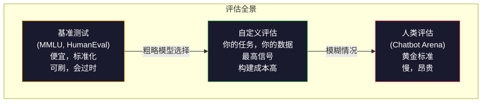
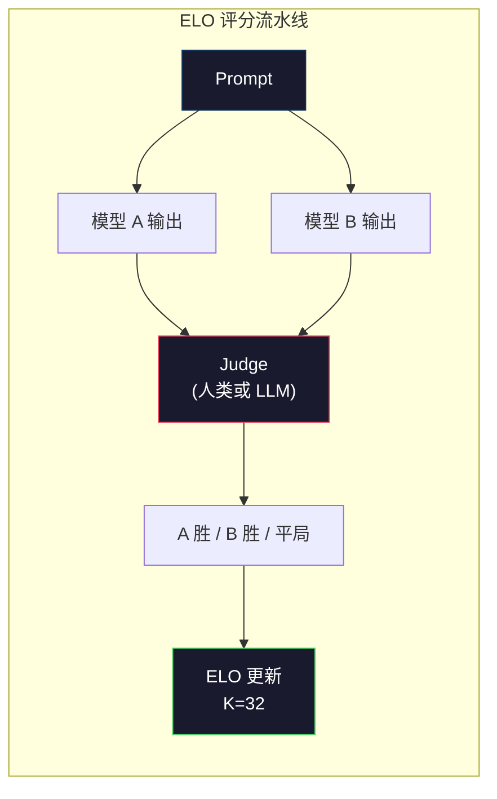

# 评估：基准测试、评估与 LM Harness

> 古德哈特定律（Goodhart's Law）：当一个度量成为目标时，它就不再是一个好的度量。每个前沿实验室都在刷基准测试。MMLU 分数在上升，但模型仍然无法可靠地数出 "strawberry" 中有几个 R。唯一重要的评估是你的评估——用你的数据，在你的任务上。

**类型：** 构建
**语言：** Python
**前置要求：** Phase 10，课程 01-05（从零构建 LLM）
**时间：** 约 90 分钟

## 学习目标

- 构建一个自定义评估 harness，在语言模型上运行多选和开放式基准测试
- 解释为什么标准基准测试（MMLU、HumanEval）会饱和且无法区分前沿模型
- 使用合适的指标实现任务特定评估：exact match、F1、BLEU 和 LLM-as-judge 打分
- 设计针对你具体用例的自定义评估套件，而不是仅依赖公开排行榜

## 问题

MMLU 于 2020 年发布，包含 57 个学科的 15,908 道题目。三年内，前沿模型就使其饱和了。GPT-4 得分 86.4%。Claude 3 Opus 得分 86.8%。Llama 3 405B 得分 88.6%。排行榜压缩到 3 个百分点的范围内，差异只是统计噪声，而非真实能力差距。

与此同时，这些模型在 10 岁小孩毫不费力就能完成的任务上失败。Claude 3.5 Sonnet 在 MMLU 上得分 88.7%，但一开始却数不出 "strawberry" 中有几个字母——这个任务不需要任何世界知识和推理，只需要逐字符遍历。HumanEval 用 164 个问题测试代码生成。模型在上面得分 90%+，但仍然生成会在任何初级开发者都能发现的边界情况下崩溃的代码。

基准测试表现和实际可靠性之间的差距是 LLM 评估的核心问题。基准测试告诉你模型在基准测试上的表现。它们几乎无法告诉你该模型在你的具体任务、你的具体数据、你的具体失败模式下的表现。如果你在构建客服机器人，MMLU 无关紧要。如果你在构建代码助手，HumanEval 只覆盖函数级生成——它对跨文件的调试、重构或代码解释毫无涉及。

你需要自定义评估。不是因为基准测试没用——它们对粗略的模型选择有用——而是因为最终评估必须与你的部署条件精确匹配。

## 核心概念

### 评估全景

有三类评估，每类有不同的成本和信号质量。

**基准测试（Benchmarks）** 是标准化测试套件。MMLU、HumanEval、SWE-bench、MATH、ARC、HellaSwag。你对基准测试运行模型并得到分数。优势：所有人使用相同的测试，所以可以比较模型。劣势：模型和训练数据越来越多地污染这些基准测试。实验室在包含基准测试问题的数据上训练。分数上升。能力可能没有。

**自定义评估（Custom evals）** 是你为具体用例构建的测试套件。你定义输入、期望输出和评分函数。法律文档摘要器在法律文档上评估。SQL 生成器在你的数据库 schema 上评估。创建成本高，但它们是唯一能预测生产性能的评估。

**人类评估（Human evals）** 使用付费标注者来评判模型输出的有用性、正确性、流畅性和安全性等标准。自动化评分失败的开放式任务的黄金标准。Chatbot Arena 已经在 100+ 个模型上收集了超过 200 万个人类偏好投票。缺点：成本（每个判断 $0.10-$2.00）和速度（数小时到数天）。



### 为什么基准测试会失效

三种机制导致基准测试分数不再反映真实能力。

**数据污染（Data contamination）。** 训练语料库爬取互联网。基准测试问题存在于互联网上。模型在训练期间看到了答案。这不是传统意义上的作弊——实验室不是故意包含基准测试数据的。但网络规模的爬取使排除它们几乎不可能。

**应试教育（Teaching to the test）。** 实验室针对基准测试性能优化训练混合比例。如果训练混合的 5% 是 MMLU 风格的多选题，模型就会学习格式和答案分布。MMLU 是四选一多选题。模型学到答案分布在 A/B/C/D 之间大致均匀，即使不知道答案也有帮助。

**饱和（Saturation）。** 当每个前沿模型在某个基准测试上都得分 85-90% 时，基准测试就停止区分能力了。剩下的 10-15% 题目可能是模糊的、标注错误的或需要冷门领域知识的。在 MMLU 上从 87% 提高到 89% 可能只是模型多记住了两道冷门题，而不是变聪明了。

### Perplexity：快速健康检查

Perplexity 衡量模型对一个 token 序列的"惊讶程度"。形式上，它是指数化的平均负对数似然：

```
PPL = exp(-1/N * sum(log P(token_i | context)))
```

Perplexity 为 10 意味着模型平均在每个 token 位置上有等同于从 10 个选项中均匀选择的不确定性。越低越好。GPT-2 在 WikiText-103 上的 perplexity 约为 30。GPT-3 约为 20。Llama 3 8B 约为 7。

Perplexity 在同一测试集上比较模型是有用的，但它有盲点。一个模型可以通过擅长预测常见模式来获得低 perplexity，同时在罕见但重要的模式上表现糟糕。它也不涉及指令遵循、推理或事实准确性。把它当作完整性检查（sanity check），而非最终判定。

### LLM-as-Judge

使用一个强模型来评估较弱模型的输出。想法很简单：让 GPT-4o 或 Claude Sonnet 对回答在正确性、有用性和安全性上打 1-5 分。使用 GPT-4o-mini 每个判断约 $0.01，与人类判断的相关性出奇地好——大多数任务约 80% 一致。

评分 prompt 比模型更重要。模糊的 prompt（"给这个回答评分"）产生噪声分数。带评分标准（rubric）的结构化 prompt（"如果回答事实正确且引用了来源打 5 分，正确但未注明来源打 4 分，部分正确打 3 分……"）产生一致、可复现的分数。

失败模式：judge 模型表现出位置偏差（在成对比较中偏好第一个回答）、冗长偏差（偏好更长的回答）和自我偏好（GPT-4 对 GPT-4 输出的评分高于等效的 Claude 输出）。缓解措施：随机化顺序、按长度归一化、使用与被评估模型不同的 judge。

### 成对比较的 ELO 评分

Chatbot Arena 的方法。向不同模型展示对同一 prompt 的两个回答。一个人类（或 LLM judge）选择更好的那个。从数千次这样的比较中，计算每个模型的 ELO 评分——与国际象棋使用的相同系统。

ELO 的优势：相对排名比绝对评分更可靠、优雅地处理平局、比独立评分每个输出需要更少的比较次数即可收敛。截至 2026 年初，Chatbot Arena 排名显示 GPT-4o、Claude 3.5 Sonnet 和 Gemini 1.5 Pro 在顶部相差不到 20 个 ELO 分。



### 评估框架

**lm-evaluation-harness**（EleutherAI）：标准的开源评估框架。支持 200+ 个基准测试。一条命令即可对任何 Hugging Face 模型运行 MMLU、HellaSwag、ARC 等。Open LLM Leaderboard 使用它。

**RAGAS**：专门针对 RAG 流水线的评估框架。衡量 faithfulness（回答是否匹配检索到的上下文？）、relevance（检索到的上下文是否与问题相关？）和回答正确性。

**promptfoo**：配置驱动的 prompt 工程评估。在 YAML 中定义测试用例，对多个模型运行，获得通过/失败报告。对 prompt 回归测试很有用——确保 prompt 变更不会破坏现有测试用例。

### 构建自定义评估

对生产而言唯一重要的评估。流程：

1. **定义任务。** 模型到底应该做什么？要精确。"回答问题"太模糊。"给定一封客户投诉邮件，提取产品名称、问题类别和情感"就是一个你可以评估的任务。

2. **创建测试用例。** 原型评估最少 50 个，生产环境 200+ 个。每个测试用例是一个 (input, expected_output) 对。包括边界情况：空输入、对抗性输入、模糊输入、其他语言的输入。

3. **定义评分。** 结构化输出用 exact match。文本相似度用 BLEU/ROUGE。开放式质量用 LLM-as-judge。提取任务用 F1。用权重组合多个指标。

4. **自动化。** 每次评估一条命令运行。没有手动步骤。以支持跨时间比较的格式存储结果。

5. **随时间追踪。** 单独一个评估分数毫无意义。你需要趋势线。分数在上次 prompt 变更后是否改善了？切换模型后是否回归了？将评估与 prompt 一起版本化。

| 评估类型 | 每次判断成本 | 与人类的一致性 | 最适合 |
|---------|------------|--------------|-------|
| Exact match | ~$0 | 100%（适用时） | 结构化输出，分类 |
| BLEU/ROUGE | ~$0 | ~60% | 翻译，摘要 |
| LLM-as-judge | ~$0.01 | ~80% | 开放式生成 |
| 人类评估 | $0.10-$2.00 | N/A（本身就是标准） | 模糊、高风险任务 |

```figure
perplexity-loss
```

## 动手构建

### 步骤 1：最小评估框架

定义核心抽象。一个评估用例有输入、期望输出和可选的元数据字典。一个评分器接受预测和参考，返回 0 到 1 之间的分数。

```python
import json
from collections import Counter

class EvalCase:
    def __init__(self, input_text, expected, metadata=None):
        self.input_text = input_text
        self.expected = expected
        self.metadata = metadata or {}

class EvalSuite:
    def __init__(self, name, cases, scorers):
        self.name = name
        self.cases = cases
        self.scorers = scorers

    def run(self, model_fn):
        results = []
        for case in self.cases:
            prediction = model_fn(case.input_text)
            scores = {}
            for scorer_name, scorer_fn in self.scorers.items():
                scores[scorer_name] = scorer_fn(prediction, case.expected)
            results.append({
                "input": case.input_text,
                "expected": case.expected,
                "prediction": prediction,
                "scores": scores,
            })
        return results
```

### 步骤 2：评分函数

构建 exact match、token F1 和模拟的 LLM-as-judge 评分器。

```python
def exact_match(prediction, expected):
    return 1.0 if prediction.strip().lower() == expected.strip().lower() else 0.0

def token_f1(prediction, expected):
    pred_tokens = set(prediction.lower().split())
    exp_tokens = set(expected.lower().split())
    if not pred_tokens or not exp_tokens:
        return 0.0
    common = pred_tokens & exp_tokens
    precision = len(common) / len(pred_tokens)
    recall = len(common) / len(exp_tokens)
    if precision + recall == 0:
        return 0.0
    return 2 * (precision * recall) / (precision + recall)

def llm_judge_simulated(prediction, expected):
    pred_words = set(prediction.lower().split())
    exp_words = set(expected.lower().split())
    if not exp_words:
        return 0.0
    overlap = len(pred_words & exp_words) / len(exp_words)
    length_penalty = min(1.0, len(prediction) / max(len(expected), 1))
    return round(overlap * 0.7 + length_penalty * 0.3, 3)
```

### 步骤 3：ELO 评分系统

实现带 ELO 更新的成对比较。这正是 Chatbot Arena 用来排名模型的系统。

```python
class ELOTracker:
    def __init__(self, k=32, initial_rating=1500):
        self.ratings = {}
        self.k = k
        self.initial_rating = initial_rating
        self.history = []

    def _ensure_player(self, name):
        if name not in self.ratings:
            self.ratings[name] = self.initial_rating

    def expected_score(self, rating_a, rating_b):
        return 1 / (1 + 10 ** ((rating_b - rating_a) / 400))

    def record_match(self, player_a, player_b, outcome):
        self._ensure_player(player_a)
        self._ensure_player(player_b)

        ea = self.expected_score(self.ratings[player_a], self.ratings[player_b])
        eb = 1 - ea

        if outcome == "a":
            sa, sb = 1.0, 0.0
        elif outcome == "b":
            sa, sb = 0.0, 1.0
        else:
            sa, sb = 0.5, 0.5

        self.ratings[player_a] += self.k * (sa - ea)
        self.ratings[player_b] += self.k * (sb - eb)

        self.history.append({
            "a": player_a, "b": player_b,
            "outcome": outcome,
            "rating_a": round(self.ratings[player_a], 1),
            "rating_b": round(self.ratings[player_b], 1),
        })

    def leaderboard(self):
        return sorted(self.ratings.items(), key=lambda x: -x[1])
```

### 步骤 4：Perplexity 计算

使用 token 概率计算 perplexity。实际中你会从模型的 logits 获取这些。这里我们用概率分布模拟。

```python
import numpy as np

def perplexity(log_probs):
    if not log_probs:
        return float("inf")
    avg_neg_log_prob = -np.mean(log_probs)
    return float(np.exp(avg_neg_log_prob))

def token_log_probs_simulated(text, model_quality=0.8):
    np.random.seed(hash(text) % 2**31)
    tokens = text.split()
    log_probs = []
    for i, token in enumerate(tokens):
        base_prob = model_quality
        if len(token) > 8:
            base_prob *= 0.6
        if i == 0:
            base_prob *= 0.7
        prob = np.clip(base_prob + np.random.normal(0, 0.1), 0.01, 0.99)
        log_probs.append(float(np.log(prob)))
    return log_probs
```

### 步骤 5：聚合结果

计算评估运行的汇总统计：均值、中位数、阈值通过率和按指标细分。

```python
def summarize_results(results, threshold=0.8):
    all_scores = {}
    for r in results:
        for metric, score in r["scores"].items():
            all_scores.setdefault(metric, []).append(score)

    summary = {}
    for metric, scores in all_scores.items():
        arr = np.array(scores)
        summary[metric] = {
            "mean": round(float(np.mean(arr)), 3),
            "median": round(float(np.median(arr)), 3),
            "std": round(float(np.std(arr)), 3),
            "min": round(float(np.min(arr)), 3),
            "max": round(float(np.max(arr)), 3),
            "pass_rate": round(float(np.mean(arr >= threshold)), 3),
            "n": len(scores),
        }
    return summary

def print_summary(summary, suite_name="Eval"):
    print(f"\n{'=' * 60}")
    print(f"  {suite_name} Summary")
    print(f"{'=' * 60}")
    for metric, stats in summary.items():
        print(f"\n  {metric}:")
        print(f"    Mean:      {stats['mean']:.3f}")
        print(f"    Median:    {stats['median']:.3f}")
        print(f"    Std:       {stats['std']:.3f}")
        print(f"    Range:     [{stats['min']:.3f}, {stats['max']:.3f}]")
        print(f"    Pass rate: {stats['pass_rate']:.1%} (threshold >= 0.8)")
        print(f"    N:         {stats['n']}")
```

### 步骤 6：运行完整流水线

把所有东西连接起来。定义一个任务，创建测试用例，模拟两个模型，运行评估，从成对比较计算 ELO，打印排行榜。

```python
def demo_model_good(prompt):
    responses = {
        "What is the capital of France?": "Paris",
        "What is 2 + 2?": "4",
        "Who wrote Hamlet?": "William Shakespeare",
        "What language is PyTorch written in?": "Python and C++",
        "What is the boiling point of water?": "100 degrees Celsius",
    }
    return responses.get(prompt, "I don't know")

def demo_model_bad(prompt):
    responses = {
        "What is the capital of France?": "Paris is the capital city of France",
        "What is 2 + 2?": "The answer is four",
        "Who wrote Hamlet?": "Shakespeare",
        "What language is PyTorch written in?": "Python",
        "What is the boiling point of water?": "212 Fahrenheit",
    }
    return responses.get(prompt, "Unknown")

cases = [
    EvalCase("What is the capital of France?", "Paris"),
    EvalCase("What is 2 + 2?", "4"),
    EvalCase("Who wrote Hamlet?", "William Shakespeare"),
    EvalCase("What language is PyTorch written in?", "Python and C++"),
    EvalCase("What is the boiling point of water?", "100 degrees Celsius"),
]

suite = EvalSuite(
    name="General Knowledge",
    cases=cases,
    scorers={
        "exact_match": exact_match,
        "token_f1": token_f1,
        "llm_judge": llm_judge_simulated,
    },
)

results_good = suite.run(demo_model_good)
results_bad = suite.run(demo_model_bad)

print_summary(summarize_results(results_good), "Model A (concise)")
print_summary(summarize_results(results_bad), "Model B (verbose)")
```

"好"模型给出精确答案。"差"模型给出冗长的改述。Exact match 严重惩罚冗长模型。Token F1 和 LLM-as-judge 更宽容。这说明了为什么指标选择很重要：同一个模型看起来很好或很差取决于你如何打分。

### 步骤 7：ELO 锦标赛

跨多轮运行模型间的成对比较。

```python
elo = ELOTracker(k=32)

for case in cases:
    pred_a = demo_model_good(case.input_text)
    pred_b = demo_model_bad(case.input_text)

    score_a = token_f1(pred_a, case.expected)
    score_b = token_f1(pred_b, case.expected)

    if score_a > score_b:
        outcome = "a"
    elif score_b > score_a:
        outcome = "b"
    else:
        outcome = "tie"

    elo.record_match("model_a_concise", "model_b_verbose", outcome)

print("\nELO Leaderboard:")
for name, rating in elo.leaderboard():
    print(f"  {name}: {rating:.0f}")
```

### 步骤 8：Perplexity 比较

比较不同质量"模型"的 perplexity。

```python
test_text = "The quick brown fox jumps over the lazy dog in the garden"

for quality, label in [(0.9, "Strong model"), (0.7, "Medium model"), (0.4, "Weak model")]:
    log_probs = token_log_probs_simulated(test_text, model_quality=quality)
    ppl = perplexity(log_probs)
    print(f"  {label} (quality={quality}): perplexity = {ppl:.2f}")
```

## 使用场景

### lm-evaluation-harness (EleutherAI)

在任何模型上运行基准测试的标准工具。

```python
# pip install lm-eval
# Command line:
# lm_eval --model hf --model_args pretrained=meta-llama/Llama-3.1-8B --tasks mmlu --batch_size 8

# Python API:
# import lm_eval
# results = lm_eval.simple_evaluate(
#     model="hf",
#     model_args="pretrained=meta-llama/Llama-3.1-8B",
#     tasks=["mmlu", "hellaswag", "arc_easy"],
#     batch_size=8,
# )
# print(results["results"])
```

### promptfoo

配置驱动的 prompt 工程评估。在 YAML 中定义测试并对多个提供商运行。

```yaml
# promptfoo.yaml
providers:
  - openai:gpt-4o-mini
  - anthropic:claude-3-haiku

prompts:
  - "Answer in one word: {{question}}"

tests:
  - vars:
      question: "What is the capital of France?"
    assert:
      - type: contains
        value: "Paris"
  - vars:
      question: "What is 2 + 2?"
    assert:
      - type: equals
        value: "4"
```

### RAGAS 用于 RAG 评估

```python
# pip install ragas
# from ragas import evaluate
# from ragas.metrics import faithfulness, answer_relevancy, context_precision
#
# result = evaluate(
#     dataset,
#     metrics=[faithfulness, answer_relevancy, context_precision],
# )
# print(result)
```

RAGAS 衡量通用评估遗漏的内容：模型的回答是否基于检索到的上下文，而不仅仅是回答是否"正确"。

## 交付产出

本课产出 `outputs/prompt-eval-designer.md`——一个可复用的 prompt，为任何任务设计自定义评估套件。给它一个任务描述，它就生成测试用例、评分函数和通过/失败阈值建议。

同时产出 `outputs/skill-llm-evaluation.md`——一个根据你的任务类型、预算和延迟要求选择正确评估策略的决策框架。

## 练习

1. 添加一个"一致性"评分器，对同一输入运行模型 5 次并衡量输出匹配的频率。确定性输入上的不一致答案揭示了脆弱的 prompt 或高温度设置。

2. 扩展 ELO tracker 支持多个 judge 函数（exact match、F1、LLM-as-judge）并加权。比较当权重偏向 exact match vs F1 时排行榜如何变化。

3. 为特定任务构建评估套件：将邮件分类为 5 个类别。创建 100 个包含多样样本的测试用例，包括边界情况（可能属于多个类别的邮件、空邮件、其他语言的邮件）。衡量不同"模型"（基于规则、关键词匹配、模拟 LLM）的表现。

4. 实现数据污染检测：给定一组评估问题和训练语料库，检查评估问题（或近义改述）中有多少百分比出现在训练数据中。这就是研究人员审计基准测试有效性的方式。

5. 构建一个"模型 diff"工具。给定两个模型版本的评估结果，高亮显示哪些具体测试用例改善了、哪些回归了、哪些保持不变。这是评估版的代码 diff——对理解变更是帮助还是伤害至关重要。

## 关键术语

| 术语 | 常见说法 | 实际含义 |
|------|---------|---------|
| MMLU | "那个基准测试" | Massive Multitask Language Understanding——57 个学科的 15,908 道多选题，2025 年已饱和至 88% 以上 |
| HumanEval | "代码评估" | OpenAI 的 164 个 Python 函数补全问题，仅测试孤立的函数生成 |
| SWE-bench | "真正的代码评估" | 12 个 Python 仓库的 2,294 个 GitHub issue，衡量包括测试生成在内的端到端 bug 修复 |
| Perplexity | "模型有多困惑" | exp(-avg(log P(token_i given context)))——越低意味着模型对实际 token 赋予了更高概率 |
| ELO rating | "模型的国际象棋排名" | 从成对胜负记录计算的相对技能评分，Chatbot Arena 用它来排名 100+ 个模型 |
| LLM-as-judge | "用 AI 给 AI 打分" | 强模型根据评分标准为弱模型的输出打分，~80% 与人类 judge 一致，每判断约 $0.01 |
| Data contamination | "模型看到了测试题" | 训练数据包含基准测试问题，膨胀了分数但没有提升真实能力 |
| Eval suite | "一组测试" | 用于衡量特定能力的 (input, expected_output, scorer) 三元组的版本化集合 |
| Pass rate | "正确百分比" | 超过阈值的评估用例比例——比均值分数更具可操作性，因为它衡量可靠性 |
| Chatbot Arena | "模型排名网站" | LMSYS 平台，200 万+ 人类偏好投票，通过 ELO 评分产生最受信赖的 LLM 排行榜 |

## 延伸阅读

- [Hendrycks et al., 2021 -- "Measuring Massive Multitask Language Understanding"](https://arxiv.org/abs/2009.03300) -- MMLU 论文，尽管已饱和但仍是最常被引用的 LLM 基准测试
- [Chen et al., 2021 -- "Evaluating Large Language Models Trained on Code"](https://arxiv.org/abs/2107.03374) -- OpenAI 的 HumanEval 论文，建立了代码生成评估方法论
- [Zheng et al., 2023 -- "Judging LLM-as-a-Judge"](https://arxiv.org/abs/2306.05685) -- 使用 LLM 评估 LLM 的系统分析，包括位置偏差和冗长偏差发现
- [LMSYS Chatbot Arena](https://chat.lmsys.org/) -- 众包模型比较平台，200 万+ 投票，最受信赖的真实世界 LLM 排名
