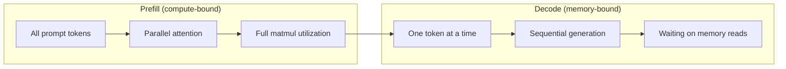
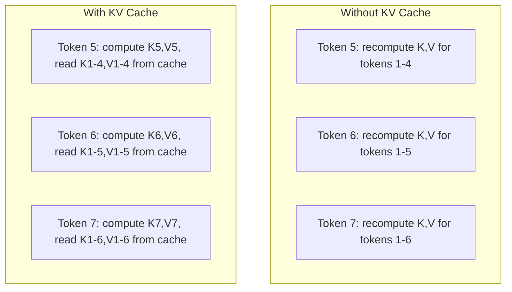
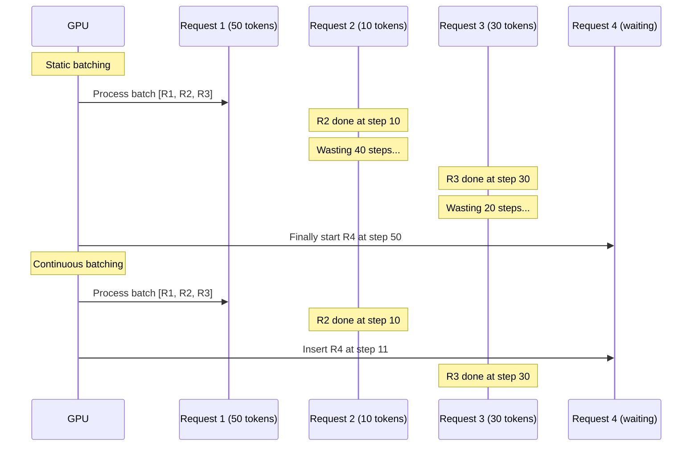
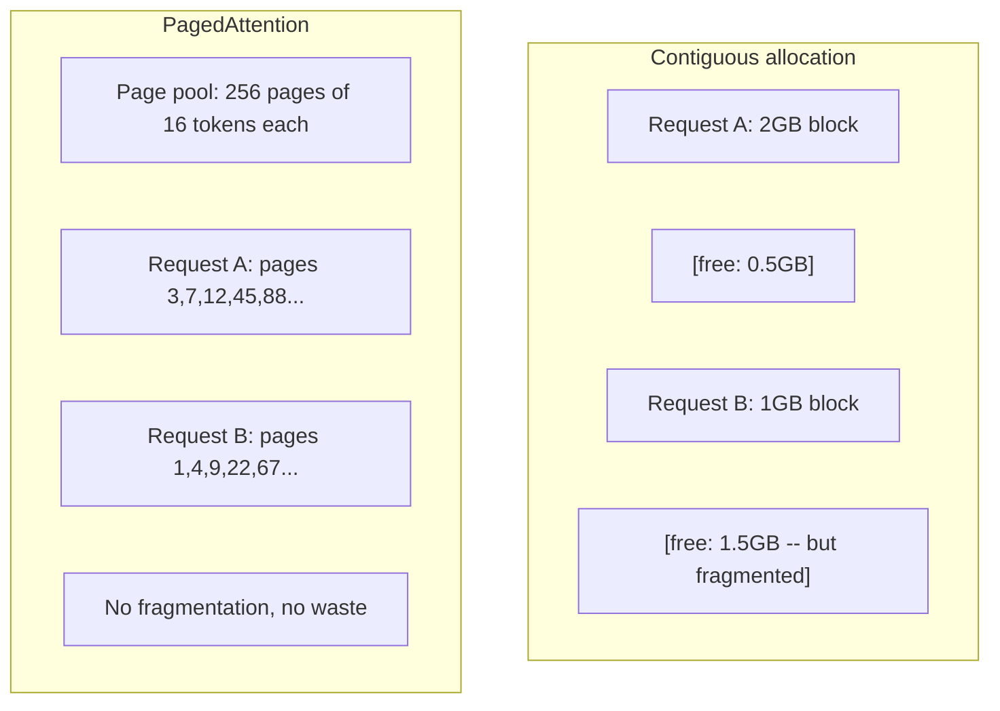
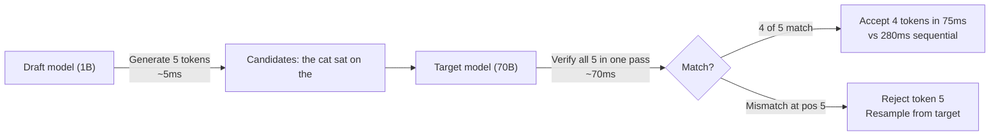

# 推理优化

> 大语言模型 (LLM) 的推理由两个阶段定义。预填充 (Prefill) 阶段并行处理你的提示词——受限于计算能力。解码 (Decode) 阶段逐个生成词元——受限于内存带宽。每项优化都针对其中一个或两个阶段。

**类型：** 构建
**语言：** Python
**前置条件：** 第 10 阶段，第 01-08 课（Transformer 架构、注意力机制）
**时间：** ~120 分钟

## 学习目标

- 实现 KV 缓存 (KV-cache)，以消除自回归词元生成过程中的冗余计算
- 解释大语言模型推理的预填充 (Prefill) 与解码 (Decode) 阶段，以及为什么每个阶段有不同的瓶颈（计算受限 vs 内存受限）
- 实现连续批处理 (continuous batching) 和分页注意力 (PagedAttention) 概念，以在并发请求下最大化 GPU 利用率
- 比较推理优化技术（KV 缓存、投机解码、Flash Attention）及其吞吐量/延迟权衡

## 问题所在

你将 Llama 3 70B 部署在 4 块 A100 GPU 上。单个用户获得约每秒 50 个词元。感觉很快。然后 100 个用户同时访问端点。吞吐量降至每秒每个用户 3 个词元。你每月 25,000 美元的 GPU 账单正在以比人类打字还慢的速度提供响应。

模型本身在 1 个用户和 100 个用户之间没有变化。相同的权重、相同的架构、相同的数学运算。变化的是你如何调度工作。朴素的推理浪费了 90% 以上的可用 GPU 计算能力。一个等待第 47 个词元的用户占用着整个批次槽位，而 GPU 内存总线在等待下一次矩阵乘法时处于空闲状态。与此同时，一个新用户的 2,000 词元提示词本可以利用这些空闲时间进行有用的计算。

这不是一个扩展问题。这是一个调度问题。本课中的技术——KV 缓存、连续批处理、分页注意力、投机解码、前缀缓存——区分了每月 25,000 美元和每月 5,000 美元的推理账单，而它们处理的是相同的流量。

vLLM 在 4xA100-80GB 上服务 Llama 3 70B，在低并发时达到约每秒每个用户 50 个词元，在 100 个并发请求时通过连续批处理和分页注意力维持每秒每个用户 15-25 个词元。没有这些优化，相同的硬件在该并发度下仅能提供每秒每个用户 5 个词元。相同的 GPU，相同的模型，4 倍的吞吐量。

## 核心概念

### 预填充 vs 解码

每个大语言模型推理请求都有两个不同的阶段。

**预填充 (Prefill)** 处理整个输入提示词。所有词元都是已知的，因此注意力可以在整个序列上并行计算。这是一个大型矩阵乘法——GPU 核心保持忙碌。瓶颈是计算能力：你的硬件每秒能提供的 FLOPs 数量。一块 A100 提供 312 TFLOPS (BF16)。在单块 A100 上，对 70B 模型进行 4,096 个词元的预填充大约需要 400 毫秒。

**解码 (Decode)** 逐个生成输出词元。每个新词元都会关注所有之前的词元，但每次前向传播只产生一个词元。权重矩阵与预填充阶段大小相同，但你是用单个向量而不是矩阵来乘以它们。GPU 核心在微秒内完成计算，然后等待下一批权重从内存到达。瓶颈是内存带宽：你能以多快的速度将模型权重从 HBM 传输到计算单元。一块 A100 的带宽为 2 TB/s。一个 FP16 格式的 70B 模型为 140 GB。完整读取一次模型需要 70 毫秒——这就是单个解码步骤的下限。



**运算字节比 (ops:byte ratio)**（也称为算术强度）捕捉了这种权衡。它衡量每从内存读取一个字节所执行的操作数量。

```
ops:byte ratio = FLOPs per token / bytes read from memory
```

在预填充阶段，批次大小为 4,096 个词元时，每加载一个权重你执行约 4,096 次乘加运算。比率很高——你受限于计算能力。在解码阶段，批次大小为 1 时，每加载一个权重你执行约 1 次操作。比率很低——你受限于内存带宽。

核心洞察：*解码受限于内存带宽，因为你需要读取整个模型来生成一个词元*。下面的每项优化要么减少你读取的内容，要么增加每次读取处理的词元批次，要么完全避免读取。

### KV 缓存

在注意力机制中，每个词元的查询 (query) 都会关注每个先前词元的键 (key) 和值 (value) 向量。如果没有缓存，生成第 N 个词元需要重新计算所有 N-1 个先前词元的键和值投影。生成第 2 个词元时会投影第 1 个词元，生成第 3 个词元时再次投影，生成第 4 个词元时又一次。到第 1,000 个词元时，你已经将第 1 个词元投影了 999 次。

KV 缓存存储所有先前词元的键和值投影。生成第 N 个词元时，你只需计算第 N 个词元的键和值，然后将它们与第 1 到 N-1 个词元的缓存 K/V 拼接起来。



**KV 缓存的内存公式：**

```
KV cache size = 2 * num_layers * num_kv_heads * head_dim * seq_len * bytes_per_param
```

对于 Llama 3 70B（80 层，8 个 KV 头，使用 GQA，head_dim=128，BF16）：

```
per token: 2 * 80 * 8 * 128 * 2 bytes = 327,680 bytes = 320 KB
at 4,096 tokens: 320 KB * 4,096 = 1.28 GB
at 128K tokens: 320 KB * 131,072 = 40 GB
```

Llama 3 70B 的单个 128K 上下文对话消耗 40 GB 的 KV 缓存——占 A100 内存的一半。100 个并发用户，每人 4K 词元，仅 KV 缓存就需要 128 GB。这就是为什么 KV 缓存管理是推理优化的核心挑战。

### 连续批处理

静态批处理等待 N 个请求的批次到达，一起处理它们，并等到*所有*请求完成后才接受新请求。如果一个请求需要 500 个词元，另一个需要 10 个，短请求在完成后的 490 个解码步骤中处于空闲状态。

连续批处理（也称为迭代级批处理）在任意请求完成时立即将新请求插入批次。批次在每个解码步骤重新评估。一个在 10 个词元后完成的请求会立即被等待中的请求替换。



吞吐量提升取决于输出长度的变化程度。如果长度均匀，连续批处理与静态批处理相当。如果长度变化（常见情况），连续批处理可以提供 2-5 倍的更高吞吐量，因为 GPU 槽位永远不会空着。

### 分页注意力 (PagedAttention)

每个请求的 KV 缓存是一个连续的内存块。随着请求的到来和离开，内存会碎片化——就像操作系统中的 RAM 碎片化一样。一个 4K 词元的请求需要 1.28 GB 的连续内存。即使你总共有 2 GB 空闲内存，你也可能没有 1.28 GB 的*连续*内存。你要么浪费内存，要么拒绝请求。

分页注意力（来自 vLLM）将操作系统风格的虚拟内存应用于 KV 缓存。它不为每个请求分配一个连续块，而是分配固定大小的"页面"（通常为每页 16 个词元）。页面可以位于 GPU 物理内存的任何位置。页表将每个请求的逻辑序列位置映射到物理页面位置。



分页注意力还通过写时复制 (copy-on-write) 实现共享前缀。如果 50 个请求共享相同的系统提示词，该系统提示词的 KV 缓存页面只存储一次，并被所有 50 个请求引用。只有当请求出现分歧（不同的用户消息）时，它才会获得自己的页面。这极大地减少了具有共享系统提示词的应用程序的内存使用。

vLLM 报告称，通过分页注意力实现了接近零的内存浪费（约 4% vs 朴素分配中的约 60-80%）。

### 投机解码 (Speculative Decoding)

解码速度慢是因为它是顺序的——你生成一个词元，反馈回去，再生成下一个。但如果你能以低成本猜测接下来的 5 个词元，然后一次性验证它们呢？

投机解码使用一个小的、快速的**草稿模型 (draft model)** 来生成 K 个候选词元。然后，大的**目标模型 (target model)** 在单次前向传播中处理所有 K 个候选词元（这看起来像预填充——并行、计算受限、高效）。如果目标模型同意草稿模型的预测，你就在一次目标前向传播的时间内接受了所有 K 个词元。如果它在位置 j 处不同意，你就接受第 1 到 j-1 个词元并丢弃其余部分。



加速效果取决于**接受率 (acceptance rate)**——即草稿模型的预测与目标模型匹配的频率。对于 Llama 3 8B 为 Llama 3 70B 起草的情况，在自然语言上典型的接受率为 70-85%。这转化为 2-3 倍的解码加速。

投机解码的三种方法：

| 方法 | 草稿来源 | 接受率 | 开销 |
|--------|-------------|-----------------|----------|
| Draft-target (Leviathan et al.) | 独立的小模型 | 70-85% | 草稿模型内存 |
| EAGLE (Li et al.) | 目标模型上的轻量级头 | 75-90% | ~1% 额外参数 |
| N-gram 查找 | 词元 n-gram 表 | 40-60% | 可忽略不计 |

**EAGLE** 在目标模型的隐藏状态之上训练一个小的自回归头。它使用目标模型倒数第二层的特征来预测下一个词元的嵌入。因为它操作的是目标模型自身的表示（而不是独立模型的表示），所以它在极小的额外内存下实现了更高的接受率。EAGLE-2 添加了一个动态草稿树，根据上下文调整候选数量。

**N-gram 投机解码** 维护一个来自当前上下文或预建语料库的 n-gram 延续表。如果草稿与同一对话中之前出现的内容匹配（重复模式、代码、结构化输出），它以零神经网络开销触发。平均接受率较低，但每次投机的成本基本为零。

投机解码是*数学上精确的*——输出分布与目标模型的分布完全相同。它不是近似。验证步骤确保每个被接受的词元都具有目标模型会分配的确切概率。

### 前缀缓存 (Prefix Caching)

许多请求共享相同的前缀。一个聊天机器人的系统提示词。一个 RAG 上下文块。一组少样本示例。没有前缀缓存，每个请求都会从头开始重新计算这些共享词元的 KV 缓存。

前缀缓存存储常见前缀的 KV 缓存并在请求之间复用它。当一个带有已知前缀的新请求到达时，系统复制（或引用）缓存的 KV 条目，只计算唯一后缀的 KV。

对于所有请求共享的 2,000 词元系统提示词，前缀缓存消除了每个请求约 400 毫秒的预填充时间。在每秒 100 个请求的情况下，每秒节省 40 秒的 GPU 计算时间——超过一块 GPU 的工作量。

SGLang 的 RadixAttention 使用基数树 (radix tree)（字典树）通过词元内容索引前缀来实现前缀缓存。任何与存储前缀匹配的请求都可以免费获得其 KV 缓存。该树支持部分前缀匹配——如果你与缓存条目共享 2,000 个前缀词元中的 1,500 个，你就复用这 1,500 个并只重新计算 500 个。

### 推理引擎

三个引擎主导着生产级大语言模型服务：

| 引擎 | 关键创新 | 最适用于 |
|--------|---------------|----------|
| vLLM | 分页注意力、连续批处理 | 通用服务、最高兼容性 |
| SGLang | RadixAttention（前缀缓存）、结构化生成 | 多轮聊天机器人、受限解码 |
| TensorRT-LLM | NVIDIA 内核融合、FP8 量化 | NVIDIA 硬件上的最大单 GPU 吞吐量 |

**vLLM** 是默认的起点。它支持最广泛的模型范围，可在任何 GPU 供应商（NVIDIA、AMD、Intel）上运行，并通过分页注意力 + 连续批处理实现强大的吞吐量。兼容 OpenAI 的 API 意味着你可以将其作为任何 OpenAI API 调用的替代品直接接入。

**SGLang** 建立在 vLLM 的相同基础之上，但增加了用于前缀缓存的 RadixAttention 和用于结构化大语言模型程序的特定领域语言。如果你的工作负载涉及多轮对话、工具使用或受限解码（JSON 输出、正则表达式引导生成），SGLang 通常通过前缀复用比 vLLM 快 2-5 倍。

**TensorRT-LLM** 将模型编译为优化的 NVIDIA GPU 内核。它融合操作（注意力 + 线性 + 激活在一个内核中），在 H100 GPU 上使用 FP8，并与 NVIDIA Triton 推理服务器集成以进行生产部署。它在 NVIDIA 硬件上实现了最高的单 GPU 吞吐量，但需要更多设置且仅在 NVIDIA GPU 上工作。

Llama 3 70B 的实际数据（4xA100-80GB，BF16）：

| 指标 | vLLM | SGLang | TensorRT-LLM |
|--------|------|--------|---------------|
| 吞吐量（1 个用户） | ~50 TPS | ~55 TPS | ~65 TPS |
| 吞吐量（100 个用户） | ~2,500 总 TPS | ~3,200 总 TPS | ~3,000 总 TPS |
| 首词元时间 | ~400ms | ~300ms（前缀命中） | ~350ms |
| 最大上下文 | 128K | 128K | 128K |

### 运算字节比框架

你无法优化你无法测量的东西。运算字节比告诉你你是受限于计算能力还是内存带宽，这决定了哪些优化措施是重要的。

```
Compute roof: peak FLOPS of the GPU
Memory roof:  peak bandwidth * ops:byte ratio
```

当运算字节比低时（解码、小批次），你达到内存带宽上限。增加更多计算能力（更高时钟、更多核心）没有帮助。你需要减少内存读取（量化、KV 缓存压缩）或增加批次大小以将读取分摊到更多有用工作上。

当运算字节比高时（预填充、大批次），你达到计算上限。内存带宽优化没有帮助。你需要更快的 GPU、内核融合或降低精度以挤压更多 FLOPs。

| 场景 | 运算字节比 | 瓶颈 | 优化手段 |
|----------|----------|-------|---------------|
| 预填充，批次=1 | ~4,096 | 计算 | 内核融合、FP8 |
| 解码，批次=1 | ~1 | 内存 | 量化、KV 压缩 |
| 解码，批次=32 | ~32 | 内存 | 更大批次、连续批处理 |
| 解码，批次=256 | ~256 | 过渡 | 两者都重要 |
| 解码，批次=1024 | ~1,024 | 计算 | 内核融合、张量并行 |

A100 上的交叉点大约在 运算字节比 = 156（312 TFLOPS / 2 TB/s）。低于 156，你受限于内存带宽。高于 156，你受限于计算能力。连续批处理通过每次迭代打包更多词元，将解码推向这个交叉点。

## 动手构建

### 步骤 1：从零实现 KV 缓存

我们构建一个多头 KV 缓存，按层、按头存储键和值投影，并展示内存增长模式。

```python
import numpy as np

class KVCache:
    def __init__(self, num_layers, num_heads, head_dim, max_seq_len, dtype=np.float16):
        self.num_layers = num_layers
        self.num_heads = num_heads
        self.head_dim = head_dim
        self.max_seq_len = max_seq_len
        self.dtype = dtype

        self.k_cache = np.zeros(
            (num_layers, num_heads, max_seq_len, head_dim), dtype=dtype
        )
        self.v_cache = np.zeros(
            (num_layers, num_heads, max_seq_len, head_dim), dtype=dtype
        )
        self.seq_len = 0

    def update(self, layer_idx, new_keys, new_values):
        num_new = new_keys.shape[1]
        end = self.seq_len + num_new
        self.k_cache[layer_idx, :, self.seq_len:end, :] = new_keys
        self.v_cache[layer_idx, :, self.seq_len:end, :] = new_values
        return (
            self.k_cache[layer_idx, :, :end, :],
            self.v_cache[layer_idx, :, :end, :]
        )

    def advance(self, num_tokens):
        self.seq_len += num_tokens

    def memory_bytes(self):
        return self.k_cache.nbytes + self.v_cache.nbytes

    def used_bytes(self):
        per_token = 2 * self.num_layers * self.num_heads * self.head_dim * np.dtype(self.dtype).itemsize
        return per_token * self.seq_len
```

### 步骤 2：使用 KV 缓存的注意力机制

一个简化的多头注意力机制，在解码步骤中使用 KV 缓存。

```python
def scaled_dot_product_attention(query, keys, values):
    head_dim = query.shape[-1]
    scores = np.matmul(query, keys.transpose(0, 1, 3, 2)) / np.sqrt(head_dim)
    seq_len_q = scores.shape[-2]
    seq_len_k = scores.shape[-1]
    if seq_len_q > 1:
        mask = np.triu(np.ones((seq_len_q, seq_len_k), dtype=np.float32), k=seq_len_k - seq_len_q + 1)
        scores = scores + mask * (-1e9)
    max_scores = np.max(scores, axis=-1, keepdims=True)
    exp_scores = np.exp(scores - max_scores)
    attn_weights = exp_scores / np.sum(exp_scores, axis=-1, keepdims=True)
    return np.matmul(attn_weights, values)


class MultiHeadAttention:
    def __init__(self, d_model, num_heads):
        self.num_heads = num_heads
        self.head_dim = d_model // num_heads
        scale = np.sqrt(2.0 / d_model)
        self.W_q = np.random.randn(d_model, d_model).astype(np.float32) * scale
        self.W_k = np.random.randn(d_model, d_model).astype(np.float32) * scale
        self.W_v = np.random.randn(d_model, d_model).astype(np.float32) * scale
        self.W_o = np.random.randn(d_model, d_model).astype(np.float32) * scale

    def forward(self, x, kv_cache=None, layer_idx=0):
        batch, seq_len, d_model = x.shape
        Q = np.matmul(x, self.W_q).reshape(batch, seq_len, self.num_heads, self.head_dim).transpose(0, 2, 1, 3)
        K = np.matmul(x, self.W_k).reshape(batch, seq_len, self.num_heads, self.head_dim).transpose(0, 2, 1, 3)
        V = np.matmul(x, self.W_v).reshape(batch, seq_len, self.num_heads, self.head_dim).transpose(0, 2, 1, 3)

        if kv_cache is not None:
            K_full, V_full = kv_cache.update(layer_idx, K[0], V[0])
            K = K_full[np.newaxis, :, :, :]
            V = V_full[np.newaxis, :, :, :]
            if seq_len == 1:
                kv_cache.advance(1)

        attn_out = scaled_dot_product_attention(Q, K, V)
        attn_out = attn_out.transpose(0, 2, 1, 3).reshape(batch, -1, d_model)
        return np.matmul(attn_out, self.W_o)
```

### 步骤 3：连续批处理模拟器

这模拟了静态批处理和连续批处理之间的调度差异。

```python
import heapq

class Request:
    def __init__(self, request_id, prompt_tokens, output_tokens, arrival_step):
        self.request_id = request_id
        self.prompt_tokens = prompt_tokens
        self.output_tokens = output_tokens
        self.arrival_step = arrival_step
        self.tokens_generated = 0
        self.start_step = None
        self.end_step = None

    def is_done(self):
        return self.tokens_generated >= self.output_tokens


def simulate_static_batching(requests, batch_size):
    step = 0
    completed = []
    queue = list(requests)
    queue.sort(key=lambda r: r.arrival_step)

    while queue:
        batch = []
        while queue and len(batch) < batch_size:
            r = queue.pop(0)
            r.start_step = max(step, r.arrival_step)
            batch.append(r)

        if batch:
            step = max(step, max(r.start_step for r in batch))
            max_output = max(r.output_tokens for r in batch)
            for r in batch:
                r.tokens_generated = r.output_tokens
                r.end_step = step + max_output
            step += max_output
            completed.extend(batch)

    return completed


def simulate_continuous_batching(requests, batch_size):
    step = 0
    completed = []
    queue = sorted(requests, key=lambda r: r.arrival_step)
    queue_idx = 0
    active = []
    waiting = []

    while queue_idx < len(queue) or active or waiting:
        while queue_idx < len(queue) and queue[queue_idx].arrival_step <= step:
            waiting.append(queue[queue_idx])
            queue_idx += 1

        while waiting and len(active) < batch_size:
            r = waiting.pop(0)
            r.start_step = step
            active.append(r)

        if not active:
            if waiting:
                step += 1
                continue
            elif queue_idx < len(queue):
                step = queue[queue_idx].arrival_step
                continue
            else:
                break

        for r in active:
            r.tokens_generated += 1

        done = [r for r in active if r.is_done()]
        for r in done:
            r.end_step = step + 1
            completed.append(r)
        active = [r for r in active if not r.is_done()]

        step += 1

    return completed


def batching_stats(completed):
    latencies = [r.end_step - r.arrival_step for r in completed]
    total_time = max(r.end_step for r in completed) - min(r.arrival_step for r in completed)
    total_tokens = sum(r.output_tokens for r in completed)
    return {
        "avg_latency": np.mean(latencies),
        "p50_latency": np.median(latencies),
        "p99_latency": np.percentile(latencies, 99),
        "total_time": total_time,
        "throughput": total_tokens / total_time if total_time > 0 else 0,
    }
```

### 步骤 4：前缀缓存

一个基于字典树的前缀缓存，为共享前缀存储 KV 条目。

```python
class TrieNode:
    def __init__(self):
        self.children = {}
        self.kv_data = None
        self.hit_count = 0


class PrefixCache:
    def __init__(self, max_entries=1000):
        self.root = TrieNode()
        self.max_entries = max_entries
        self.total_entries = 0
        self.hits = 0
        self.misses = 0

    def _walk(self, token_ids):
        node = self.root
        depth = 0
        for tid in token_ids:
            if tid not in node.children:
                break
            node = node.children[tid]
            depth += 1
        return node, depth

    def lookup(self, token_ids):
        node, depth = self._walk(token_ids)
        if depth > 0:
            self.hits += 1
            current = self.root
            for tid in token_ids[:depth]:
                current = current.children[tid]
                current.hit_count += 1
            kv_entries = []
            current = self.root
            for tid in token_ids[:depth]:
                current = current.children[tid]
                if current.kv_data is not None:
                    kv_entries.append(current.kv_data)
            return depth, kv_entries
        self.misses += 1
        return 0, []

    def insert(self, token_ids, kv_per_token):
        node = self.root
        for i, tid in enumerate(token_ids):
            if tid not in node.children:
                if self.total_entries >= self.max_entries:
                    return i
                node.children[tid] = TrieNode()
                self.total_entries += 1
            node = node.children[tid]
            if i < len(kv_per_token):
                node.kv_data = kv_per_token[i]
        return len(token_ids)

    def hit_rate(self):
        total = self.hits + self.misses
        return self.hits / total if total > 0 else 0.0
```

### 步骤 5：投机解码模拟器

我们模拟具有可配置接受率的草稿-目标投机解码。

```python
class DraftModel:
    def __init__(self, vocab_size, acceptance_rate=0.8):
        self.vocab_size = vocab_size
        self.acceptance_rate = acceptance_rate

    def generate(self, context, num_tokens):
        tokens = np.random.randint(0, self.vocab_size, size=num_tokens)
        return tokens

    def get_probs(self, context, token):
        probs = np.random.dirichlet(np.ones(self.vocab_size))
        return probs


class TargetModel:
    def __init__(self, vocab_size):
        self.vocab_size = vocab_size

    def get_probs(self, context, tokens=None):
        if tokens is not None:
            return [np.random.dirichlet(np.ones(self.vocab_size)) for _ in tokens]
        return np.random.dirichlet(np.ones(self.vocab_size))


def speculative_decode(draft_model, target_model, context, num_speculative=5,
                       draft_cost=1.0, target_cost=10.0, verify_cost=12.0):
    total_tokens = 0
    total_cost = 0.0
    accepted_counts = []
    context = list(context)

    max_tokens = 100

    while total_tokens < max_tokens:
        draft_tokens = draft_model.generate(context, num_speculative)
        total_cost += draft_cost * num_speculative

        target_probs = target_model.get_probs(context, draft_tokens)
        total_cost += verify_cost

        accepted = 0
        for i, token in enumerate(draft_tokens):
            draft_p = draft_model.get_probs(context + list(draft_tokens[:i]), token)
            target_p = target_probs[i]

            r = np.random.random()
            acceptance_prob = min(1.0, target_p[token] / (draft_p[token] + 1e-10))

            if r < draft_model.acceptance_rate:
                accepted += 1
                context.append(token)
                total_tokens += 1
            else:
                new_token = np.random.choice(draft_model.vocab_size, p=target_p)
                context.append(new_token)
                total_tokens += 1
                break

        accepted_counts.append(accepted)

        if accepted == num_speculative:
            bonus_probs = target_model.get_probs(context)
            bonus_token = np.random.choice(draft_model.vocab_size, p=bonus_probs)
            context.append(bonus_token)
            total_tokens += 1

    sequential_cost = total_tokens * target_cost
    return {
        "total_tokens": total_tokens,
        "speculative_cost": total_cost,
        "sequential_cost": sequential_cost,
        "speedup": sequential_cost / total_cost if total_cost > 0 else 1.0,
        "avg_accepted": np.mean(accepted_counts),
        "acceptance_rate": np.mean(accepted_counts) / num_speculative,
    }


def compare_speculation_strategies(vocab_size=1000, num_trials=20):
    results = {}

    for name, acceptance_rate, spec_tokens in [
        ("Draft-target (8B->70B)", 0.78, 5),
        ("EAGLE", 0.85, 6),
        ("N-gram", 0.50, 4),
        ("No speculation", 0.0, 0),
    ]:
        if spec_tokens == 0:
            results[name] = {
                "speedup": 1.0,
                "acceptance_rate": 0.0,
                "avg_accepted": 0.0,
            }
            continue

        trial_results = []
        for _ in range(num_trials):
            draft = DraftModel(vocab_size, acceptance_rate=acceptance_rate)
            target = TargetModel(vocab_size)
            context = list(np.random.randint(0, vocab_size, size=10))
            result = speculative_decode(draft, target, context, num_speculative=spec_tokens)
            trial_results.append(result)

        results[name] = {
            "speedup": np.mean([r["speedup"] for r in trial_results]),
            "acceptance_rate": np.mean([r["acceptance_rate"] for r in trial_results]),
            "avg_accepted": np.mean([r["avg_accepted"] for r in trial_results]),
        }

    return results
```

### 步骤 6：KV 缓存内存分析器

计算真实模型配置的 KV 缓存内存需求。

```python
MODEL_CONFIGS = {
    "Llama-3-8B": {
        "num_layers": 32, "num_kv_heads": 8, "head_dim": 128,
        "model_params_b": 8, "gqa": True,
    },
    "Llama-3-70B": {
        "num_layers": 80, "num_kv_heads": 8, "head_dim": 128,
        "model_params_b": 70, "gqa": True,
    },
    "Llama-3-405B": {
        "num_layers": 126, "num_kv_heads": 8, "head_dim": 128,
        "model_params_b": 405, "gqa": True,
    },
    "Mistral-7B": {
        "num_layers": 32, "num_kv_heads": 8, "head_dim": 128,
        "model_params_b": 7, "gqa": True,
    },
    "GPT-4-est": {
        "num_layers": 120, "num_kv_heads": 96, "head_dim": 128,
        "model_params_b": 1800, "gqa": False,
    },
}


def kv_cache_memory(config, seq_len, dtype_bytes=2):
    per_token = 2 * config["num_layers"] * config["num_kv_heads"] * config["head_dim"] * dtype_bytes
    total = per_token * seq_len
    return {
        "per_token_bytes": per_token,
        "per_token_kb": per_token / 1024,
        "total_bytes": total,
        "total_mb": total / (1024 ** 2),
        "total_gb": total / (1024 ** 3),
    }


def memory_budget(config, gpu_memory_gb, model_dtype_bytes=2, kv_dtype_bytes=2):
    model_memory_gb = config["model_params_b"] * 1e9 * model_dtype_bytes / (1024 ** 3)
    overhead_gb = gpu_memory_gb * 0.1
    available_for_kv = gpu_memory_gb - model_memory_gb - overhead_gb

    if available_for_kv <= 0:
        return {"error": "Model does not fit in GPU memory", "model_memory_gb": model_memory_gb}

    per_token = 2 * config["num_layers"] * config["num_kv_heads"] * config["head_dim"] * kv_dtype_bytes
    max_tokens = int(available_for_kv * (1024 ** 3) / per_token)

    return {
        "gpu_memory_gb": gpu_memory_gb,
        "model_memory_gb": round(model_memory_gb, 1),
        "overhead_gb": round(overhead_gb, 1),
        "available_for_kv_gb": round(available_for_kv, 1),
        "max_total_tokens": max_tokens,
        "max_users_at_2k": max_tokens // 2048,
        "max_users_at_4k": max_tokens // 4096,
        "max_users_at_32k": max_tokens // 32768,
    }
```

## 使用它

使用 vLLM：

```python
from vllm import LLM, SamplingParams

llm = LLM(
    model="meta-llama/Llama-3-70B-Instruct",
    tensor_parallel_size=4,
    enable_prefix_caching=True,
    max_model_len=8192,
    gpu_memory_utilization=0.9,
)

params = SamplingParams(temperature=0.7, max_tokens=256)
outputs = llm.generate(["Explain inference optimization in one paragraph."], params)
```

使用 SGLang 进行前缀缓存 + 结构化输出：

```python
import sglang as sgl

@sgl.function
def classify(s, text):
    s += sgl.system("You are a classifier. Output JSON only.")
    s += sgl.user(f"Classify this text: {text}")
    s += sgl.assistant(sgl.gen("result", regex=r'\{"label": "(positive|negative|neutral)"\}'))

runtime = sgl.Runtime(model_path="meta-llama/Llama-3-70B-Instruct", tp_size=4)
sgl.set_default_backend(runtime)

results = classify.run_batch([
    {"text": "This product is amazing!"},
    {"text": "Terrible experience."},
    {"text": "It was okay I guess."},
])
```

使用 TensorRT-LLM：

```python
import tensorrt_llm
from tensorrt_llm.runtime import ModelRunner

runner = ModelRunner.from_dir("./llama-70b-trt-engine/", rank=0)

outputs = runner.generate(
    batch_input_ids=[tokenizer.encode("Explain KV caching.")],
    max_new_tokens=256,
    temperature=0.7,
)
```

## 交付它

本课产出：
- `outputs/skill-inference-optimization.md` —— 一个用于诊断和优化大语言模型推理服务的技能

## 练习

1. 修改 KV 缓存分析器以比较 FP16 vs FP8 vs INT4 KV 缓存量化。对于 4K 上下文下的 Llama 3 70B，计算每种在 4xA100-80GB 上的最大并发用户数。INT4 KV 量化应该大致将用户容量提升 4 倍。

2. 扩展连续批处理模拟器以跟踪 GPU 利用率（每步填充的批次槽位比例）。为静态和连续批处理绘制随时间变化的利用率，使用 50 个输出长度服从帕累托分布（shape=1.5, scale=20）的请求。连续批处理应维持 >80% 的利用率。

3. 实现一个分组查询注意力 (GQA) 版本的 KV 缓存，其中 `num_kv_heads < num_query_heads`。Llama 3 70B 使用 64 个查询头但只有 8 个 KV 头。计算与完整多头注意力相比的内存节省（KV 缓存大小减少 8 倍）。

4. 构建一个使用 LRU 淘汰策略的前缀缓存。将 max_entries 设置为 500，并生成 1,000 个请求，其中 60% 共享 5 个常见前缀之一。测量命中率并与无限制缓存进行比较。通过良好的淘汰策略，命中率应保持在 55% 以上。

5. 扩展投机解码模拟器以实现基于树的投机（EAGLE-2 风格）。不是单个 K 个草稿词元链，而是生成候选树（例如，3 个层级每个分支 2 个 = 8 个叶候选）。比较每轮验证接受的总词元数 vs 线性投机。

## 关键术语

| 术语 | 人们怎么说 | 实际含义 |
|------|----------------|----------------------|
| 预填充 (Prefill) | "处理提示词" | 并行计算所有输入词元的注意力——计算受限，因为完整的矩阵乘法使 GPU 核心保持忙碌 |
| 解码 (Decode) | "生成词元" | 每次前向传播产生一个词元，每次读取完整的模型权重——内存受限，因为计算在下一批权重到达前就已经完成 |
| KV 缓存 | "缓存注意力状态" | 存储所有先前词元的键和值投影，使其在每个解码步骤中无需重新计算——用内存换取计算 |
| 连续批处理 | "动态批处理" | 在任意请求完成时立即将新请求插入运行中的批次，在每个解码迭代时评估，而不是等待整个批次完成 |
| 分页注意力 | "KV 缓存的虚拟内存" | 以固定大小的页面而非连续块分配 KV 缓存，消除内存碎片化并实现共享前缀的写时复制 |
| 投机解码 | "草稿和验证" | 使用快速的草稿模型提出多个词元，然后在一个目标模型前向传播中验证它们——数学上精确，2-3 倍加速 |
| EAGLE | "自投机解码" | 一种投机解码变体，在目标模型自身的隐藏状态上训练一个轻量级头，比独立草稿模型实现更高的接受率 |
| 前缀缓存 | "复用系统提示词 KV" | 存储常见前缀（系统提示词、少样本示例）的计算 KV 缓存条目，并在请求之间复用以跳过冗余预填充 |
| 运算字节比 | "算术强度" | 计算操作数与读取内存字节数的比率——决定工作负载是计算受限（高比率）还是内存受限（低比率） |
| 首词元时间 | "TTFT" | 从接收请求到产生第一个输出词元的延迟——对于长提示词，由预填充时间主导 |

## 延伸阅读

- Kwon et al., "Efficient Memory Management for Large Language Model Serving with PagedAttention" (2023) —— 介绍分页 KV 缓存管理的 vLLM 论文，现已成为推理服务的行业标准
- Leviathan et al., "Fast Inference from Transformers via Speculative Decoding" (2023) —— 证明草稿-验证投机产生精确目标模型分布同时实现 2-3 倍加速的基础论文
- Li et al., "EAGLE: Speculative Sampling Requires Rethinking Feature Uncertainty" (2024) —— 通过在目标模型自身特征上训练一个头来实现更高的接受率，而不是使用独立草稿模型
- Zheng et al., "SGLang: Efficient Execution of Structured Language Model Programs" (2024) —— 介绍用于前缀缓存的 RadixAttention 和多调用大语言模型程序的编程模型
- Williams et al., "Roofline: An Insightful Visual Performance Model for Multicore Architectures" (2009) —— 形式化运算字节框架以推理计算与内存瓶颈的原始屋顶线论文
