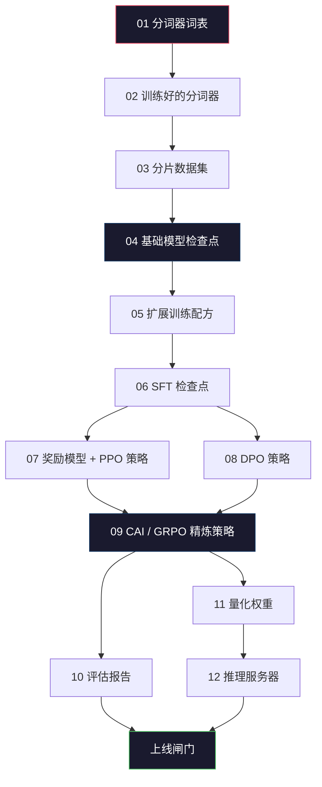
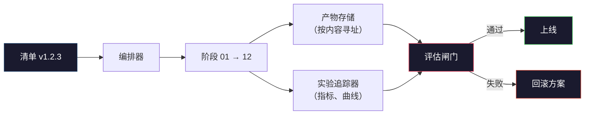

# 构建完整的 LLM 流水线

> 从第 01 课到第 12 课的所有内容都是一条流水线的各个阶段。本课将这些阶段搭建成一个端到端运行的框架：分词、预训练、扩展、SFT、对齐、评估、量化、部署。你不会在笔记本电脑上训练一个 700 亿参数的模型。你将产出编排层、运行清单、评估闸门和回滚方案——这些是 2026 年前沿团队用来决定什么可以上线的工具。这是毕业设计。

**类型：** 构建
**语言：** Python（标准库）
**前置要求：** 第 10 阶段第 01-12 课
**时间：** 约 120 分钟

## 学习目标

- 将前十一课（分词器、数据、预训练、扩展、SFT、RLHF、DPO、CAI、评估、量化、推理）组合成一份可复现的流水线规范
- 定义各阶段之间的产物契约：每个阶段消费什么、产出什么，以及下一阶段如何验证输入
- 构建一个编排器，用于追踪实验、哈希产物，并根据评估阈值决定是否可以上线
- 设计回滚方案：哪些产物重新运行成本低，哪些成本高，以及一个损坏的检查点意味着什么代价

## 问题

前面的每一课都能独立工作。分词器训练好了。微型 GPT 预训练完成。SFT 数据集已组装。奖励模型训练完毕。DPO 运行结束。评估指标已测量。量化权重已导出。推理服务器已启动。每一课都是一个笔记本。每一课都有自己的约定、自己的输出路径、自己的随机种子。

前沿训练运行不是一个笔记本。Llama 3 405B 在大约 54 天内消耗了 3000 万 H100 小时。DeepSeek-V3 使用了约 280 万 H800 小时。在此期间，一个损坏的检查点、一次数据污染、一次评估回退都可能让团队损失一周的挂钟时间和一个月的 GPU 预算。团队能够生存下来的秘诀在于流水线卫生：每个阶段都有确定性的输入、确定性的输出、一份清单、一个哈希值和一个闸门。

这是毕业设计。你不会在笔记本电脑上端到端运行整个流水线。你将编写编排器来协调各个阶段、描述运行的清单、决定能否上线的验证器，以及让第三方仅凭一份文件就能复现你工作的重放方案。代码量很小；纪律性要求很高。

这个模式从 1 亿到 1 万亿参数都保持不变。同样的四个组件——清单、编排器、评估闸门、产物存储——既用于运行 Llama 3，也用于运行你的个人 GPT 项目。区别仅在于每个阶段配置中的数字大小，而非流水线的结构。

## 概念

### 十二个阶段

第 10 阶段的每一课都是一个阶段。以下是完整的依赖关系图。



阶段 07 和 08 可以并行运行。其余阶段都是硬依赖关系。阶段 02（分词器）的变更会使所有下游产物失效。阶段 10（评估）的变更仅会使上线决策失效。

### 清单

清单是一份单一文件，它完整地描述了一次运行，足以支持重放。流水线产出的任何东西都不应依赖于清单中未包含的状态。字段是枯燥且强制性的。

```
pipeline_version: 1.2.3
seed: 42
git_commit: a1b2c3d4
stages:
  01_tokenizer:
    recipe: bpe_32k
    input_hash: sha256:...
    output_hash: sha256:...
    wall_clock_sec: 3600
    cost_usd: 12
```

阶段 N 的输出哈希值是阶段 N+1 的输入哈希值。任何偏差都会导致流水线停止。这就是你及早发现数据损坏的方式。这也是大洲另一端的队友验证他们的重放是否产出了与你相同产物的方式。

在实践中，团队使用一个小型 YAML 模式加上一个清单检查器，与上一次成功运行进行差异对比。任何超出预期字段（成本、挂钟时间）的增量都是危险信号。

### 产物类型

每个阶段的输出都是一个带类型的产物。不是目录块，不是 pickle 文件，而是一个具有已知模式的命名类型。

| 阶段 | 产物类型 | 关键字段 |
|------|----------|---------|
| 01-02 | 分词器 | vocab.json, merges.txt, config.json, hash |
| 03 | 数据集 | shards[], 行数, 词元数, 去重统计 |
| 04-05 | 检查点 | weights.safetensors, config.json, 优化器状态, 步数 |
| 06 | SFT 模型 | 检查点 + SFT 配方 + 数据混合 |
| 07 | 奖励模型 | RM 检查点 + 偏好数据哈希 |
| 08-09 | 策略 | 检查点 + 参考哈希 + beta + 已消耗 KL 预算 |
| 10 | 评估报告 | 基准分数 + 回退差异 + 评估数据哈希 |
| 11 | 量化模型 | 量化权重 + 校准数据 + 与 FP16 的精度差异 |
| 12 | 服务器规范 | 端点 + 模型哈希 + 配置 + 可观测性钩子 |

类型化防止了最常见的失败模式：将阶段 08 的输出用作阶段 06 的输入，将经过 DPO 训练的模型通过 SFT 路径上线。带类型的产物和带类型的阶段签名使这些错误成为编译时失败，而非第五天的失败。

### 评估闸门

上线不是"训练完成了"。上线是"训练完成了，且评估闸门通过了"。闸门在运行开始前就已定义。

```
gates:
  mmlu:      >= baseline + 0.5   # 无回退
  humaneval: >= baseline + 1.0
  truthfulqa: >= baseline         # 无下降
  safety_refusal_rate: <= 0.05
  kl_from_reference: <= 25.0
  cost_total_usd: <= 50000
```

每个闸门都是一个数值阈值。没有"看起来不错"的闸门。没有主观签字。如果所有闸门都通过，产物就被标记为可上线。如果有任何闸门失败，运行将被暂停，等待指定审阅者的明确覆盖，而覆盖行为本身也会被记录在清单中。

两个闸门能捕获大多数灾难。*回退*闸门（新模型在核心基准上必须至少与上一版本一样好）捕获训练错误。*KL 预算*闸门（对齐策略与参考策略的距离不得超过 X）捕获对齐过度调整。每个生产流水线都有这两个闸门。

### 编排器

一段小型代码，读取清单、调度阶段、追踪产物，并在任何契约违规时停止。这不是 Airflow。这不是 Kubeflow。对于流水线卫生，你需要自己写一些简单的东西。

编排器的工作范围很窄：

1. 从清单中解析 DAG。
2. 对于每个阶段，检查预期输出是否已以正确的哈希值存在（如果是则跳过）。
3. 运行阶段，捕获 stdout/stderr，测量挂钟时间和成本。
4. 验证输出哈希值与下游阶段的预期输入哈希值是否匹配。
5. 失败时，写入包含确切失败阶段的部分清单并以非零状态退出。

这就是 200 行 Python 代码。它看起来就像本课 `code/main.py` 文件中的样子。在底层，真正的流水线使用 `torchrun` 或 `ray` 在集群上执行各个阶段，但编排器本身运行在单台机器上。

### 实验追踪与产物存储

两个外部系统锚定了流水线。

**实验追踪器（wandb、neptune、mlflow）。** 记录每个阶段的损失曲线、评估指标、系统遥测数据。当你需要在三周后比较运行 A 与运行 B 时，追踪器就是你要去的地方。团队几乎总是为此使用托管追踪器——自己写一个会浪费本应用于训练的时间。

**产物存储（S3、R2、GCS）。** 用于检查点、数据集、分词器、评估报告的不可变对象存储。产物按哈希值寻址，而非按文件名。像 `latest.pt` 这样的文件名是陷阱；`ckpt-7b-step-20000-sha256:abc123.safetensors` 才是一份契约。

编排器同时写入两者。追踪器是给人类看图表用的。产物存储是给下一阶段查找输入用的。

### 成本核算

一次前沿运行附带一个美元数字。预算纪律体现在两个地方。

**运行前估算。** 从清单中计算预期 FLOPs（预训练：6 x 参数量 x 词元数）、预期 GPU 小时数（FLOPs / 峰值吞吐量 / 利用率），以及按当前租赁费率计算的美元成本。如果估算值超过预算闸门，流水线拒绝启动。

**运行中追踪。** 每个阶段的挂钟时间和成本被记录到清单中。每个阶段之后，检查剩余预算。如果某个阶段超支，下一个阶段的闸门将用新的剩余预算进行评估。你不会在 VC 打电话时才发现没钱了。

Llama 3 的报告成本是 6100 万美元。DeepSeek-V3 报告主预训练运行的成本为 560 万美元。差距主要在于硬件效率加上混合专家（MoE）——但具体成本之所以可见，是因为两个团队都是按阶段追踪的，而不是按整个运行追踪的。

### 可复现性 vs 确定性

这两者不同。*可复现的*意味着相同的清单加上相同的代码加上相同的基础设施产生的检查点具有等效的下游指标。*确定性的*意味着比特级完全相同的输出。

现代 LLM 训练是可复现的，但不是确定性的。分布式训练的 reduce 顺序、GPU 内核非确定性（cuBLAS、flash-attn）以及混合精度舍入共同导致不同运行之间的浮点数在 1e-5 级别存在差异。这对于最终指标来说没问题，它们不会变动。但如果你试图用比特级差异来调试，这就是致命的。解决办法是记录每个阶段的输入哈希、输出哈希和核心指标——如果这些匹配，即使权重不是比特级相同的，该运行也算"复现"了。



### 回滚方案

在运行开始前，写下每个阶段失败时的应对措施。分为三类。

- **重新运行成本低**（小时级）：分词器、评估、量化、推理服务器。直接重新运行。
- **中等成本**（天级）：SFT、DPO、CAI。保留基础模型；仅重新运行对齐阶段。
- **昂贵**（周级和百万美元级）：预训练。这里的回滚方案不是"重新运行"，而是"使用上一个好的检查点，用修订后的数据重新运行成本较低的下游阶段"。

因为阶段依赖关系是带类型和哈希的，编排器可以自动计算回滚集合：使失败阶段及其所有后代失效。阶段 06（SFT）的失败会使 06、07、08、09、10、11、12 失效。阶段 11（量化）的失败仅使 11 和 12 失效。提前命名这些可以避免团队在凌晨 4 点筋疲力尽时临时想对策。

### 2026 年观察到的生产配方

大多数前沿团队都收敛到了相同的骨架。

- 分词器：128k BPE，带字节回退。在一个小型、平衡的多语言子集上训练。
- 预训练：10-20T 词元，主要是网页、代码和合成数据。Muon 或 AdamW 优化器。FSDP2 或 DeepSpeed ZeRO-3。梯度检查点。BF16 权重，FP32 主权重。
- SFT：50 万-200 万指令对，混合人工和合成数据，与评估集严格去重。
- 对齐：DPO 或 CAI + GRPO。仅在偏好信号过于多维而不适合 DPO 时使用 RLHF。
- 评估：MMLU-Pro、MATH、HumanEval+、GPQA、SWE-Bench Verified、LiveBench，外加公众从未见过的私有保留集。
- 量化：4 位 GPTQ 或 AWQ 用于部署，8 位用于安全评估（精度差异很重要的地方）。
- 部署：vLLM、TensorRT-LLM 或自研。连续批处理。投机解码。KV 缓存淘汰。

数字每六个月变化一次。骨架不会。

## 构建

本课的代码是一个编排器和一个清单检查器，而不是十二个训练脚本。每个阶段都用一个占位符模拟，该占位符产出正确形状和哈希值的输出产物。端到端运行编排器可以证明流水线的管道在你在真实阶段上烧 GPU 资金之前是通的。

完整实现见 `code/main.py`。关键部分：

- `Manifest` 数据类：流水线版本、随机种子、git 提交、阶段、闸门。
- `Stage` 数据类：名称、类型、输入（哈希）、输出（哈希）、挂钟时间、成本。
- `Orchestrator.run()`：解析 DAG、调度阶段、验证哈希、更新清单。
- `EvalGate.check()`：读取阈值，与最新评估报告比较，返回通过/失败。
- `ArtifactStore`（内存存根）：按哈希存取，模拟 S3。
- `CostTracker`：按阶段和累计，超出上限时停止。

`main.py` 中的流水线运行十二个占位阶段，产出一份清单，并演练一个失败的评估闸门以展示被暂停的运行是什么样子。将每个占位替换为对应课程中的真实训练脚本，你就拥有了真实前沿流水线使用的骨架。

## 使用

规范工作流有三个命令。

```
python code/main.py plan    # 验证清单，计算成本估算，打印 DAG
python code/main.py run     # 执行阶段，写入 manifest.out.yaml
python code/main.py gate    # 读取 manifest.out.yaml，应用评估闸门，决定上线或暂停
```

每次都先运行 `plan`。大多数流水线错误在 plan 阶段就会暴露——缺失的闸门阈值、过期的哈希、预算超支。运行 `plan` 是免费的。运行 `run` 是昂贵的。在便宜的一边捕获错误，省钱。

`gate` 的输出要么是 `SHIP`，要么是 `HOLD: <原因>`。被暂停的运行不是失败；它是一个决策点。指定审阅者要么覆盖（覆盖行为被记录），要么批准回滚。

## 上线

本课产出 `outputs/skill-llm-pipeline-reviewer.md`。给它一份提议的流水线清单，它会检查所有契约：阶段类型、哈希链、闸门、回滚方案、成本估算。如果清单缺失评估闸门、KL 预算无上限，或运行混合了评估和训练数据，它会拒绝批准。

## 练习

1. 扩展编排器以支持阶段 07 和 08 的并行执行。使用标准库 `concurrent.futures` 模块。确认最终清单记录了两个阶段的输出，且阶段 09 的输入哈希是两者的确定性组合。

2. 添加一个"污染检查"闸门。给定评估数据集哈希和训练数据集分片，计算重叠（精确字符串匹配或 13-gram 匹配）。如果重叠超过 0.1%，闸门失败。输入一个被污染的训练集，确认闸门暂停了运行。

3. 从头开始实现一个成本估算器。对于阶段 04（预训练），将 FLOPs 估算为 6 x 参数量 x 词元数，假设在 H100 上 BF16 989 TFLOPs 的 40% MFU（模型 FLOPs 利用率），按 $2.50/GPU-小时。报告一个 70 亿参数模型在 2T 词元上训练的估算值。与已发布的 Llama 2 数字进行比较。

4. 构建部分回滚。模拟阶段 09（CAI）的失败，然后重新运行阶段 09 到 12，同时保留 01-08 的缓存。编排器应通过哈希检测缓存的产物并跳过它们。测量与完整重新运行相比节省的挂钟时间。

5. 添加可观测性。为每个阶段发出 OpenTelemetry 跨度，属性包括参数量、已见词元数、损失和成本。将跨度发送到本地收集器。重点不是仪表板；重点是每个阶段的健康状况都可以从单个追踪 ID 中追踪。

## 关键术语

| 术语 | 人们怎么说 | 实际含义 |
|------|-----------|---------|
| 清单 (Manifest) | "配方文件" | YAML 或 JSON，描述流水线版本、随机种子、每阶段配置和闸门阈值——足以重放一次运行 |
| 按内容寻址 (Content-addressed) | "按哈希而非名称" | 产物按内容的 SHA-256 存储，因此你永远无法混淆版本 A 和版本 B |
| 评估闸门 (Eval gate) | "上线标准" | 基准指标和安全分数上的数值阈值，必须在产物被标记为可上线之前通过 |
| KL 预算 (KL budget) | "对齐漂移了多远" | 对齐阶段累积 KL(policy \|\| reference) 的上限，作为闸门强制执行 |
| MFU | "用了多少 GPU" | 模型 FLOPs 利用率——实际 FLOPs 除以理论峰值。700 亿参数规模典型值为 40%，70 亿参数为 55% |
| 回滚方案 (Rollback plan) | "坏了怎么办" | 每个阶段失败时的预写行动集：重新运行、回退、用修订后的输入重新训练 |
| 编排器 (Orchestrator) | "指挥者" | 读取清单、调度阶段、验证哈希、在任何契约违规时停止的进程 |
| 产物存储 (Artifact store) | "权重的版本化 S3" | 不可变的按内容寻址的对象存储——检查点、数据集、评估报告的单一事实来源 |
| 可复现的 (Reproducible) | "重放时指标相同" | 比特级权重不同但下游指标等效——分布式 LLM 训练的现实目标 |
| 成本闸门 (Cost gate) | "不能超过 X" | 运行前成本估算加运行中追踪器——如果估算超过预算，流水线拒绝启动 |

## 延伸阅读

- [Dubey et al., 2024 -- "The Llama 3 Herd of Models"](https://arxiv.org/abs/2407.21783) -- 关于前沿流水线最详细的公开描述，包括数据、训练、对齐、评估
- [DeepSeek-AI, 2024 -- "DeepSeek-V3 Technical Report"](https://arxiv.org/abs/2412.19437) -- 以效率为先的流水线，成本约为 Llama 3 级别训练的 1/10
- [Kaplan et al., 2020 -- "Scaling Laws for Neural Language Models"](https://arxiv.org/abs/2001.08361) -- 最初的计算-数据-参数扩展关系
- [Hoffmann et al., 2022 -- "Training Compute-Optimal Large Language Models (Chinchilla)"](https://arxiv.org/abs/2203.15556) -- 对 Kaplan 的修正，重新校准了现代数据预算
- [PyTorch FSDP2 文档](https://pytorch.org/docs/stable/fsdp.html) -- PyTorch 2.4+ 中取代 FSDP1 的分布式训练原语
- [Weights & Biases LLM Reports](https://wandb.ai/site/llms) -- 开源 LLM 运行的真实清单和实验追踪器输出，可作为可借鉴的模板
