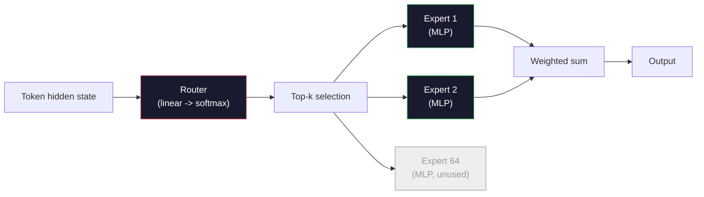

# 开源模型：架构逐行解析

> 你在第04课中从零构建了 GPT-2 Small。2026年的前沿开源模型属于同一家族，只是做了五到六项具体的改动：RMSNorm 替代 LayerNorm，SwiGLU 替代 GELU，RoPE 替代可学习位置编码，GQA 或 MLA 替代完整 MHA，以及在规模上的混合专家 (Mixture-of-Experts)。你已有的数学知识足以覆盖其中95%的内容。本课将并排阅读 Llama 3、DeepSeek-V3、Mixtral、Qwen 和 Gemma 的架构，并指出每种架构在哪一行代码上发生了分歧。

**类型：** 学习
**语言：** Python (标准库)
**前置知识：** 第10阶段，第04、05、12课（预训练、扩展、推理）
**时间：** 约45分钟

## 学习目标

- 阅读 Llama 3、Mistral、Mixtral、Gemma 2、Qwen 2.5 和 DeepSeek-V3 的 config.json，并解释其中每个字段的含义
- 说出每个模型相对于 GPT-2 Small 的具体架构改动，并从第一性原理上论证其合理性
- 仅根据配置信息，计算任意开源模型的参数数量、KV 缓存大小和激活内存
- 在给定延迟、内存和能力约束的情况下，为部署目标选择合适的开源模型

## 问题所在

在第04课中，你写了350行 numpy 代码，就得到了一个 GPT-2 形状的模型。而 Llama 3 405B 有一份200页的技术报告。你的直觉是它们是完全不同的东西。事实并非如此。这200页描述的是同一个对象，只是做了五到六项动机充分的修改，再加上大量关于扩展的实现细节。骨架——嵌入、Transformer 块、注意力、MLP、归一化、输出头——完全没有改变。

本课就是一份 diff（差异对比）。对于每个主要的开源模型家族，我们列出它相对于 GPT-2 具体改了什么、为什么改、以及代价是什么。学完之后，当你看到一份新的模型卡片时，就能在脑中把它翻译回 GPT-2 的基线。

实际的收获是：当 Meta 发布 Llama 5 或 DeepSeek 发布 V4 时，你不需要建立新的心智模型。你会查看配置，看到哪些已知的旋钮被拨动了，并知道其下游影响是什么。2026年的架构是一个有限的工具箱。每个新模型只是选择了不同的子集。

## 核心概念

### 不变的核心

所有自回归开源模型都共享：

- 词元嵌入矩阵 (vocab_size x hidden_dim)。
- N 个解码器块的堆叠：归一化、自注意力、残差、归一化、MLP、残差。
- 最终的归一化和线性输出头，投影到 vocab_size（通常与嵌入权重共享）。
- 因果掩码、下一个词元的交叉熵损失。

这就是形状。其余的都是旋钮。

### 真正会动的六个旋钮

纵观2024-2026年的每一个前沿开源模型，同样的六个设计选择被反复挑选：

1. **归一化 (Normalization)。** LayerNorm -> RMSNorm。
2. **位置编码 (Positional encoding)。** 可学习绝对位置 -> RoPE（及变体：YaRN、NTK）。
3. **激活函数 (Activation)。** GELU -> SwiGLU（或 GeGLU）。
4. **注意力头共享 (Attention head sharing)。** MHA -> GQA -> MQA -> MLA。
5. **稠密 vs 稀疏 MLP (Dense vs sparse MLP)。** 稠密 -> 混合专家 (Mixture-of-Experts)。
6. **Pre-norm 放置 (Pre-norm placement)。** Pre-norm 保留。Post-norm 已淘汰。

其他一切（学习率调度、数据混合、批次大小、上下文长度）都存在于训练配置中，而非架构里。六个旋钮。

### 旋钮1：RMSNorm

LayerNorm 减去均值、除以标准差、缩放并偏移。RMSNorm 只保留缩放：

```
RMSNorm(x) = x / sqrt(mean(x^2) + eps) * gamma
```

没有均值减法。没有偏置。每个词元少一次矩阵乘法。Zhang 和 Sennrich (2019) 论证了它在机器翻译上能匹敌 LayerNorm，同时快10%。每个现代开源模型都在使用它。

代价：无。收益：微小的吞吐量提升，更简洁的代码。

### 旋钮2：RoPE

可学习位置嵌入在 GPT-2 中是一个1024槽的查找表。上下文长度达到1025时就超出了表的末尾。模型无法外推到训练长度之外。

旋转位置编码 (Rotary Position Embedding, RoPE, Su et al. 2021) 通过在注意力点积之前，以成对方式旋转每个 Q 和 K 向量来注入位置信息。旋转角度是位置的确定性函数，因此没有可学习的内容，也不会用完。借助缩放技巧（NTK感知插值、YaRN），一个在8k上下文上训练的模型可以在推理时扩展到128k，且精度损失不大。

```
q_rotated = rotate(q, angle(pos))
k_rotated = rotate(k, angle(pos))
score = q_rotated . k_rotated
```

每个 Llama、Mistral、Qwen、DeepSeek 和 Gemma 都使用 RoPE。Gemma 2 使用混合方案（大多数层用 RoPE，部分层用局部滑动窗口注意力）。

### 旋钮3：SwiGLU

GPT-2 的 MLP 是 `x -> gelu(xW1 + b1) -> (...)W2 + b2`。SwiGLU (Shazeer 2020) 将激活函数替换为门控乘积：

```
SwiGLU(x) = (xW1) * sigmoid(xW1) * xV
```

两个投影并行进行，由 Swish 激活函数门控。经验上，在单位参数量的困惑度 (perplexity) 上表现更强。Llama 2 采用了它，之后所有人都跟进了。MLP 的隐藏大小通常被设置为使总参数量与原始稠密 MLP 匹配：如果 GPT-2 使用 `ff_dim = 4 * hidden`，SwiGLU 使用 `ff_dim = (2/3) * 4 * hidden = 8/3 * hidden`。

### 旋钮4：注意力头共享

GPT-2 使用**多头注意力 (Multi-Head Attention, MHA)**：每个头有自己的 Q、K、V 投影。

**多查询注意力 (Multi-Query Attention, MQA, Shazeer 2019)** 在所有头之间共享一个 K 和一个 V。将 KV 缓存减少 num_heads 倍，在典型模型上是12倍到32倍的缩减。在困难基准上精度略有下降。

**分组查询注意力 (Grouped-Query Attention, GQA, Ainslie et al. 2023)** 是折中方案：G 组 Q 头共享一个 K 和一个 V。Llama 3 8B 使用 GQA，有32个 Q 头和8个 KV 头 (G=8)，因此 KV 缓存相比完整 MHA 缩小了4倍。

**多头潜在注意力 (Multi-Head Latent Attention, MLA, DeepSeek 2024)** 将 K 和 V 压缩到一个共享的低秩潜在空间中，然后在每个头中投影回来。进一步减少 KV 缓存，同时保留每个头的表达能力。DeepSeek-V2 和 V3 依赖这一点来实现其长上下文性能。

| 方案 | KV 头数 | KV 缓存 | 精度 |
|------|----------|----------|------|
| MHA | num_heads | 完整 | 最佳 |
| GQA | num_groups (G < num_heads) | 缩减为 num_heads / G | 接近 MHA |
| MQA | 1 | 缩减为 num_heads 分之一 | 轻微下降 |
| MLA | 潜在空间，按头解压 | 比 MQA 更小 | 接近 MHA |

对于任何超过约13B参数的模型，GQA 或 MLA 实际上是强制性的。大规模下的完整 MHA 是 KV 缓存的灾难。

### 旋钮5：混合专家 (Mixture of Experts)

稠密 MLP 为每个词元激活其所有参数。MoE MLP 每个块有 K 个专家和一个路由器，为每个词元选择 top-k 个专家（通常是 top-2）。只有这些专家的权重会为该词元经历前向传播。

```
router_logits = xW_r
indices, weights = top_k(router_logits, k=2)
output = sum_i weights[i] * expert[indices[i]](x)
```

其吸引力在于：你可以拥有64个大小为7B的专家（因此总参数量巨大），但每个词元只运行其中2个（因此每个词元的计算量与稠密7B模型相当）。Mixtral 8x7B 总共有470亿参数，但每个词元只激活130亿。DeepSeek-V3 总共有6710亿参数，但每个词元只激活370亿。



优点：相同计算量，更多参数，更强容量。缺点：专家内存仍然需要存放在某处（因此 serving 需要比稠密等效模型更多的显存），路由器的负载均衡很难，在 alignment 阶段微调路由器本身也是一个研究领域。

### 旋钮6：Pre-norm 保留

原始 Transformer 在每个子层之后应用层归一化。自 GPT-2 以来的每个开源模型都把它放在每个子层*之前*。Pre-norm 在深度上严格更容易训练。没什么可争论的。

### 逐模型差异对比

下面是让这一切变得具体的表格。

| 模型 | 年份 | 总参数量 | 激活参数量 | 归一化 | 激活函数 | 位置编码 | 注意力 | MoE | 上下文长度 |
|-------|------|-------------|---------------|------|-----------|----------|-----------|-----|---------|
| GPT-2 Small | 2019 | 124M | 124M | LayerNorm | GELU | 可学习 | MHA (12 heads) | 无 | 1k |
| Llama 3 8B | 2024 | 8B | 8B | RMSNorm | SwiGLU | RoPE | GQA (32/8) | 无 | 128k |
| Llama 3 70B | 2024 | 70B | 70B | RMSNorm | SwiGLU | RoPE | GQA (64/8) | 无 | 128k |
| Llama 3 405B | 2024 | 405B | 405B | RMSNorm | SwiGLU | RoPE | GQA (128/16) | 无 | 128k |
| Mistral 7B | 2023 | 7.2B | 7.2B | RMSNorm | SwiGLU | RoPE | GQA | 无 | 32k |
| Mixtral 8x7B | 2023 | 47B | 13B | RMSNorm | SwiGLU | RoPE | GQA | 是 (8 experts, top-2) | 32k |
| Gemma 2 9B | 2024 | 9B | 9B | RMSNorm (pre+post) | GeGLU | RoPE + sliding | GQA | 无 | 8k |
| Qwen 2.5 72B | 2024 | 72B | 72B | RMSNorm | SwiGLU | RoPE (YaRN) | GQA (64/8) | 无 | 128k |
| DeepSeek V2 236B | 2024 | 236B | 21B | RMSNorm | SwiGLU | RoPE | MLA | 是 (160 experts, top-6) | 128k |
| DeepSeek V3 | 2024 | 671B | 37B | RMSNorm | SwiGLU | RoPE | MLA | 是 (256 experts, top-8) | 128k |

扫描各列。RMSNorm 是通用的。SwiGLU 或其表亲 GeGLU 是通用的。RoPE 是通用的。在7B以上，GQA 是通用的，除非被 MLA 取代。MoE 是高端模型的差异化因素。

### 阅读 config.json

Llama 3 8B 配置：

```
{
  "hidden_size": 4096,
  "intermediate_size": 14336,
  "num_hidden_layers": 32,
  "num_attention_heads": 32,
  "num_key_value_heads": 8,
  "max_position_embeddings": 131072,
  "rope_theta": 500000.0,
  "rms_norm_eps": 1e-5,
  "vocab_size": 128256
}
```

每个字段都对应着你已经实现过的某个东西。

- `hidden_size`：嵌入维度。
- `intermediate_size`：MLP 隐藏大小（hidden 的3.5倍——SwiGLU 的数学）。
- `num_hidden_layers`：堆叠深度。
- `num_attention_heads`：Q 头数。
- `num_key_value_heads`：KV 头数（GQA）。
- `max_position_embeddings`：训练上下文长度。
- `rope_theta`：RoPE 基础频率。Meta 将其从默认的10k提高到500k，用于长上下文外推。
- `rms_norm_eps`：数值稳定性。
- `vocab_size`：词元数量。

仅从这些信息，你就可以计算总参数量、KV 缓存和峰值激活内存。具体公式见 `code/main.py`。

### 激活内存预算

在数十亿参数以上的模型中，激活值主导训练内存。预训练（使用梯度检查点）的经验法则是：

```
activation_mem ~ batch_size * seq_len * hidden_size * num_layers * bytes_per_element
```

对于 Llama 3 8B，batch 为1，seq 为8192，BF16，32层，hidden 为4096：使用检查点时激活值约8 GB，不使用约40 GB。这就是 Flash-Attention 和 Ring-Attention 重要的原因——它们重写了注意力计算，使激活值能够容纳。

### KV 缓存预算

在最大上下文长度下推理：

```
kv_cache = 2 * num_layers * num_kv_heads * head_dim * max_seq_len * bytes_per_element
```

Llama 3 8B 在128k上下文下，BF16，head_dim = hidden / num_heads = 128：
`2 * 32 * 8 * 128 * 131072 * 2 = 17.2 GB` 每个序列。

8B 的权重在 BF16 下是16 GB。单个128k序列的 KV 缓存比权重还大。这就是推动 GQA、MLA 和 KV 缓存量化研究的内存压力。

### 每个模型何时胜出

- **单张80GB GPU，无 MoE**：Llama 3 8B、Mistral 7B、Gemma 2 9B。易于部署，工具链丰富。
- **单节点 (8x80GB)，大容量**：Llama 3 70B、Qwen 2.5 72B。最高的稠密开源能力。
- **最大的开源能力，接受 MoE 复杂性**：DeepSeek V3、Mixtral 8x22B。每激活 FLOP 的最佳能力。
- **长上下文需求**：Llama 3（128k 配合 RoPE 缩放）、DeepSeek（MLA 优势）。
- **低延迟 serving**：Gemma 2 9B（滑动窗口削减长上下文计算量）。

```figure
rmsnorm-vs-layernorm
```

## 动手构建

本课的代码是一个计算器。给定任意 config.json，它按组件打印参数数量、最大上下文下的 KV 缓存、SwiGLU MLP 比例，以及关于架构的简短判断（稠密 / GQA / MLA / MoE）。

```python
config = {
    "hidden_size": 4096, "intermediate_size": 14336,
    "num_hidden_layers": 32, "num_attention_heads": 32,
    "num_key_value_heads": 8, "vocab_size": 128256,
    "max_position_embeddings": 131072,
}
```

脚本逐字段遍历架构，计算嵌入、注意力（含 GQA 缩减）、MLP（含 SwiGLU 扩展）、层归一化和输出头的参数量。然后计算声明的上下文长度下的 KV 缓存并打印摘要。

实现见 `code/main.py`。

## 动手使用

在脚本中捆绑的 Llama 3 8B、Mistral 7B、Mixtral 8x7B 和 DeepSeek V3 配置上运行计算器。比较参数分解。注意 MoE 模型的总参数量远超稠密模型，但激活参数量往往更小。注意 DeepSeek V3 的 KV 缓存比 Llama 3 405B 的更小，尽管总参数量更多——这就是 MLA 在起作用。

然后输入你本地任意模型的配置，阅读摘要，并判断它是否适合你的 GPU。

## 动手部署

本课产出 `outputs/skill-open-model-picker.md`。给定部署目标（GPU类型、显存、上下文长度、延迟预算）和任务画像（聊天、代码、推理、长上下文），它推荐一个开源模型、第11课中的一种量化方案，以及第12课中的一种推理栈，并明确阐述关于六个架构旋钮的推理过程。

## 练习

1. 从 HuggingFace 阅读 Qwen 2.5 72B 的配置。从零计算总参数量。与 HF 报告的值比较，找出任何差异的来源（头维度取整、KV 共享因子等）。

2. DeepSeek V3 使用256个专家，top-8 路由。计算激活专家与总专家的比率，并与 Mixtral 8x7B 的8个中选top-2进行比较。从稀疏（25%）到更密的稀疏（3%）的转变对每 FLOP 的容量意味着什么？

3. 计算 Llama 3 405B 在128k上下文下 FP8 和 BF16 的 KV 缓存。在 FP8 下它是 BF16 数值的一半。在单个 8xH100 节点上（每张80GB = 总共640GB，减去权重内存）可以并行服务多少个序列？

4. Gemma 2 交替使用全注意力层和滑动窗口注意力层。写下一半层使用4096词元滑动窗口而非完整上下文时的 KV 缓存数学公式。在总上下文8k下能节省多少内存？

5. 找一份本课撰写之后发布的近期前沿开源模型。识别它选择了六个旋钮中的哪些，以及是否引入了第七个旋钮。一旦新架构发布，课程就会显得过时——目标是在不重建心智模型的情况下更新你的表格。

## 关键术语

| 术语 | 人们怎么说 | 实际含义 |
|------|----------------|----------------------|
| RMSNorm | "去掉均值的 LayerNorm" | 仅通过均方根归一化，带可学习的缩放因子——更便宜，且与 LayerNorm 相当 |
| RoPE | "旋转位置编码" | 将每个 Q 和 K 向量在2D平面上按位置相关的角度旋转——借助缩放技巧可外推到训练长度之外 |
| SwiGLU | "新的 MLP 激活函数" | 带 Swish 的门控线性单元：`(xW1) * sigmoid(xW1) * xV`——2024年后每个开源模型的标准配置 |
| GQA | "折中注意力" | 分组查询注意力：G 组 Q 头共享一个 K 和一个 V 头——在不牺牲 MQA 精度的情况下缩小 KV 缓存 |
| MLA | "DeepSeek 的注意力" | 多头潜在注意力：将 K/V 压缩到共享的低秩潜在空间，按头解压——大模型中最小的 KV 缓存 |
| MoE | "稀疏专家" | 混合专家：每个块有 N 个 MLP，路由器为每个词元选择 top-k——总参数量巨大，激活参数量小 |
| Top-k 路由 | "为每个词元选 k 个专家" | 路由器计算每个专家的分数，激活最高的 k 个——典型 k 值为2（Mixtral）到8（DeepSeek） |
| YaRN | "拉伸 RoPE" | Yet another RoPE extension —— 插值旋转角度，在推理时将上下文从8k扩展到128k+ |
| 滑动窗口注意力 | "不关注所有内容" | 每个词元只关注最近的 W 个词元——将注意力成本限制在每个词元 O(W)，用于 Gemma 2 和早期 Mistral |
| 激活参数 | "每个词元运行什么" | 对于 MoE 模型，每个词元经历前向传播的参数量（远小于总参数量）——决定每个词元的 FLOPs |

## 延伸阅读

- [Dubey et al., 2024 -- "The Llama 3 Herd of Models"](https://arxiv.org/abs/2407.21783) -- 稠密 Llama 3 家族的架构和训练参考
- [DeepSeek-AI, 2024 -- "DeepSeek-V3 Technical Report"](https://arxiv.org/abs/2412.19437) -- MLA 加上无辅助损失的负载均衡加上671B MoE
- [Jiang et al., 2024 -- "Mixtral of Experts"](https://arxiv.org/abs/2401.04088) -- 经典的 MoE 开源模型论文
- [Su et al., 2021 -- "RoFormer: Enhanced Transformer with Rotary Position Embedding"](https://arxiv.org/abs/2104.09864) -- RoPE 论文
- [Shazeer, 2020 -- "GLU Variants Improve Transformer"](https://arxiv.org/abs/2002.05202) -- SwiGLU、GeGLU 及其变体
- [Ainslie et al., 2023 -- "GQA: Training Generalized Multi-Query Transformer Models"](https://arxiv.org/abs/2305.13245) -- GQA 论文
- [Gemma 2 Team, 2024 -- "Gemma 2: Improving Open Language Models at a Practical Size"](https://arxiv.org/abs/2408.00118) -- 混合全注意力+滑动窗口注意力，pre+post-norm
- [Qwen Team, 2024 -- "Qwen 2.5 Technical Report"](https://arxiv.org/abs/2412.15115) -- YaRN 上下文扩展和长上下文训练配方
