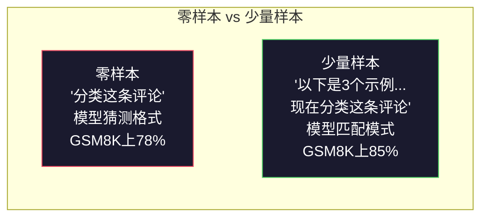
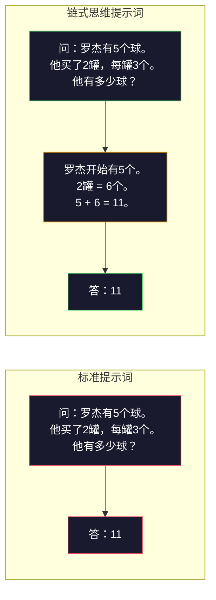
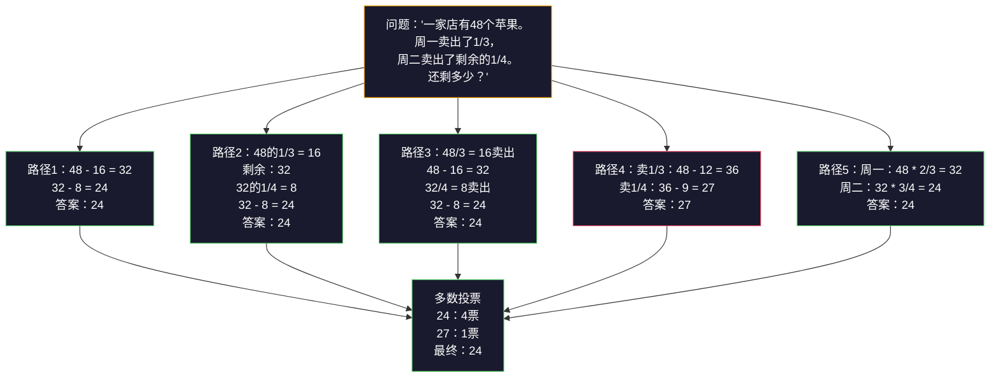
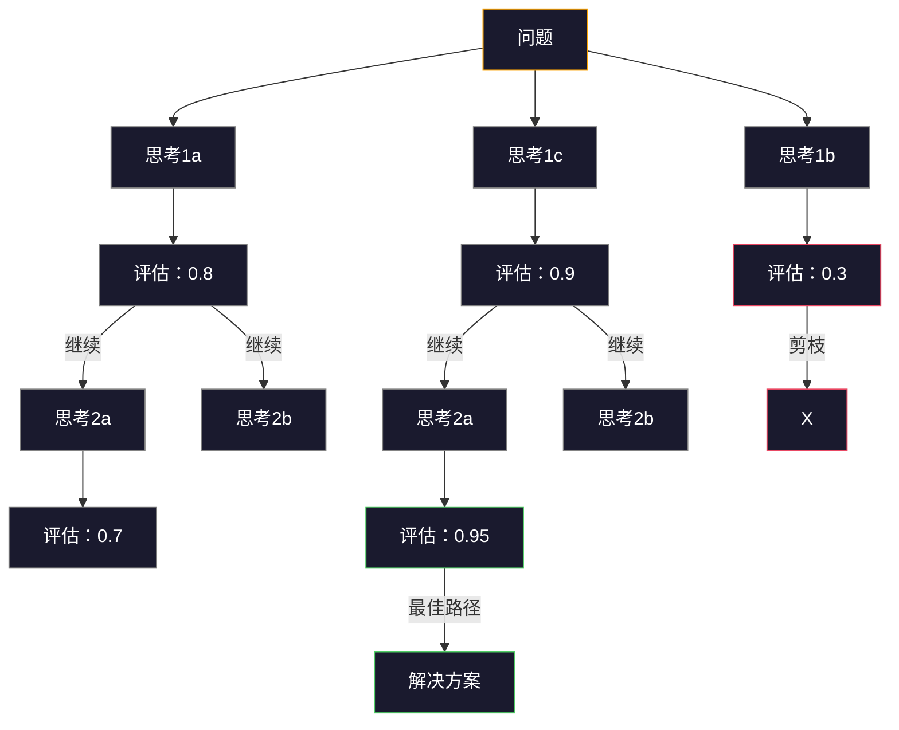

# Few-Shot、链式思维、树状思维

> 告诉模型做什么是提示词工程。展示如何思考是工程。同一个模型、同一任务、同一数据，从78%到91%的准确率差距，不是更好的模型，而是更好的推理策略。

**类型：** 构建
**语言：** Python
**前置知识：** 第十一课01（提示词工程）
**时长：** 约45分钟

## 学习目标

- 通过选择和格式化示例演示来实现少量提示词（few-shot prompting），以最大化任务准确率
- 应用链式思维（CoT）推理来提高多步骤问题（如数学应用题）的准确率
- 构建树状思维提示，探索多条推理路径并选择最佳路径
- 在标准基准测试上测量零样本 vs 少量样本 vs CoT 的准确率提升

## 问题

你开发了一个数学辅导应用。你的提示词说："解这道应用题。" GPT-5在GSM8K（标准小学数学基准）上的准确率是94%。你以为已经到顶了。其实不然——链式思维仍然能提升3-4个百分点。

加上五个字——"让我们逐步思考"——准确率就跃升到91%。加上几个解题示例，就能达到95%。同样的模型、同样的温度、同样的API成本。唯一的区别是你给了模型一张草稿纸。

这不是什么黑科技。这就是推理的工作原理。人类不会一步到位解决多步骤问题。Transformer也不会。当强迫模型生成中间token时，这些token会成为下一个token的上下文。每个推理步骤都喂养下一步。模型实际上是在计算中得出答案。

但"逐步思考"只是开始，不是终点。如果采样五条推理路径并取多数票呢？如果让模型探索一棵可能性树，评估和剪枝分支呢？如果将推理与工具使用交错呢？这些都不是假设。它们是已发表的有明确改进测量的技术，你将在本课中构建所有这些。

## 概念

### 零样本 vs 少量样本：示例何时优于指令

零样本提示词给模型一个任务，没有其他东西。少量样本提示词先给出示例。

Wei等人（2022）在8个基准测试上测量了这一点。对于简单任务如情感分类，零样本和少量样本性能相差2%以内。对于复杂任务如多步骤算术和符号推理，少量样本将准确率提高了10-25%。

直觉是：示例是压缩的指令。不描述输出格式，而是展示它。不解释推理过程，而是演示它。模型在示例上进行模式匹配比解释抽象指令更可靠。



**少量样本胜出的情况：** 格式敏感任务、分类、结构化提取、特定领域术语、任何需要模型匹配特定模式的任务。

**零样本胜出的情况：** 简单事实问题、示例限制创造力的创造性任务、找到好示例比写好指令更难的任务。

### 示例选择：相似优于随机

并非所有示例都相等。选择与目标输入相似的示例在分类任务上比随机选择优5-15%（Liu等，2022）。三个原则：

1. **语义相似性**：选择嵌入空间中与输入最接近的示例
2. **标签多样性**：在示例中覆盖所有输出类别
3. **难度匹配**：匹配目标问题的复杂程度

大多数任务的最佳示例数量是3-5个。低于3个，模型没有足够信号来提取模式。高于5个，收益递减且浪费上下文窗口token。对于多标签分类，每个标签使用一个示例。

### 链式思维：给模型草稿纸

链式思维（CoT）提示词由Google Brain的Wei等人（2022）提出。想法很简单：不要只让模型给出答案，而是让它先展示推理步骤。



为什么这在机制上有效？Transformer生成的每个token成为下一个token的上下文。没有CoT，模型必须将所有推理压缩到单次前向传播的隐藏状态中。有了CoT，模型将中间计算外部化为token。每个推理token都延伸了有效计算深度。

**GSM8K基准测试（小学数学，8500道题）：**

| 模型 | 零样本 | 零样本CoT | 少量样本CoT |
|------|--------|-----------|-------------|
| GPT-4o | 78% | 91% | 95% |
| GPT-5 | 94% | 97% | 98% |
| o4-mini（推理） | 97% | — | — |
| Claude Opus 4.7 | 93% | 97% | 98% |
| Gemini 3 Pro | 92% | 96% | 98% |
| Llama 4 70B | 80% | 89% | 94% |
| DeepSeek-V3.1 | 89% | 94% | 96% |

**关于推理模型的注意事项。** 像OpenAI的o系列（o3、o4-mini）和DeepSeek-R1这样的模型在输出答案之前会在内部运行链式思维。在推理模型上添加"让我们逐步思考"是多余的，有时甚至适得其反——它们已经做到了。

CoT有两种形式：

**零样本CoT**：在提示词后附加"让我们逐步思考"。不需要示例。Kojima等人（2022）表明这一句话就能在算术、常识和符号推理任务上提高准确率。

**少量样本CoT**：提供包含推理步骤的示例。比零样本CoT更有效，因为模型能看到你期望的确切推理格式。

**CoT有害的情况：** 简单事实回忆（"法国的首都是什么？"）、单步分类、速度比准确率更重要的任务。CoT每个查询增加50-200个token的推理开销。对于高吞吐量、低复杂度的任务，这是浪费成本。

### 自洽性：采样多次，投票一次

Wang等人（2023）提出了自洽性。洞察：单条CoT路径可能包含推理错误。但如果你采样N条独立推理路径（使用temperature > 0）并对最终答案取多数票，错误会相互抵消。



自洽性将GSM8K准确率从56.5%（单条CoT）提高到使用N=40时原始PaLM 540B实验的74.4%。在GPT-5上改进很小（97%到98%），因为基础准确率已经饱和。这项技术在基础CoT准确率60-85%的模型上表现最好——这是单路径错误频繁但非系统性的最佳点。对于推理模型（o系列、R1），自洽性已被内置的内部采样所取代。

权衡：N个样本意味着N倍的API成本和延迟。实际上，N=5捕获了大部分收益。N=3是有效投票的最低值。N > 10对大多数任务收益递减。

### 树状思维：分支探索

Yao等人（2023）提出了树状思维（ToT）。CoT遵循一条线性推理路径，而ToT探索多个分支并在继续之前评估哪些最有前景。



ToT有三个组成部分：

1. **思考生成**：产生多个候选的下一步
2. **状态评估**：对每个候选打分（可以使用LLM本身作为评估器）
3. **搜索算法**：通过树的BFS或DFS，剪枝低分分支

在24点游戏任务（用算术运算组合4个数字得到24）上，使用标准提示词的GPT-4解决了7.3%的问题。使用CoT是4.0%（CoT实际上在这里有害，因为搜索空间很宽）。使用ToT是74%。

ToT很昂贵。树中的每个节点都需要一次LLM调用。分支因子为3、深度为3的树最多需要39次LLM调用。只在搜索空间大但可评估的问题上使用——规划、谜题解决、有约束的创造性问题解决。

### ReAct：思考+行动

Yao等人（2022）将推理轨迹与行动结合。模型在思考（生成推理）和行动（调用工具、搜索、计算）之间交替。


ReAct在知识密集型任务上优于纯CoT，因为它能将其推理基于真实数据。在HotpotQA（多跳问答）上，使用GPT-4的ReAct达到35.1%的精确匹配，而纯CoT为29.4%。真正的力量是推理错误会被观察纠正——模型可以在执行过程中更新其计划。

ReAct是现代AI智能体的基础。每个智能体框架（LangChain、CrewAI、AutoGen）都实现了某种形式的思考-行动-观察循环。你将在第14阶段构建完整的智能体。本课涵盖提示词模式。

### 结构化提示词：XML标签、分隔符、标题

随着提示词变得复杂，结构可以防止模型混淆各个部分。三种方法：

**XML标签**（最适合Claude，其他地方也很好用）：
```
<context>
你正在审查一个pull request。
代码库使用TypeScript和React。
</context>

<task>
审查以下diff，查找bug、安全问题和样式违规。
</task>

<diff>
{diff_content}
</diff>

<output_format>
列出每个问题：文件、行号、严重程度（critical/warning/info）、描述。
</output_format>
```

**Markdown标题**（通用）：
```
## 角色
金融科技公司的资深安全工程师。

## 任务
分析这个API端点的漏洞。

## 输入
{api_code}

## 规则
- 关注OWASP Top 10
- 对每个发现评级：critical、high、medium、low
- 包含修复步骤
```

**分隔符**（简洁但有效）：
```
---输入---
{user_text}
---输入结束---

---指令---
用3个要点总结以上内容。
---指令结束---
```

### 提示链：顺序分解

有些任务对单个提示词来说太复杂。提示链将它们分解成步骤，每个提示的输出成为下一个的输入。


链式优于单提示的原因有三个：

1. **每步更简单**：模型处理一个专注的任务而不是同时处理一切
2. **中间输出可检查**：你可以在步骤之间验证和纠正
3. **不同步骤可以使用不同模型**：用便宜模型做提取，用贵的模型做推理

### 性能对比

| 技术 | 最适合 | GSM8K准确率（GPT-5） | API调用 | Token开销 | 复杂度 |
|------|--------|---------------------|---------|-----------|--------|
| 零样本 | 简单任务 | 94% | 1 | 无 | 极简 |
| 少量样本 | 格式匹配 | 96% | 1 | 200-500 token | 低 |
| 零样本CoT | 快速推理提升 | 97% | 1 | 50-200 token | 极简 |
| 少量样本CoT | 最大单次调用准确率 | 98% | 1 | 300-600 token | 低 |
| 自洽性（N=5） | 高风险推理 | 98.5% | 5 | 5倍token成本 | 中 |
| 推理模型（o4-mini） | CoT直接替代 | 97% | 1 | 隐藏（内部2-10倍） | 极简 |
| 树状思维 | 搜索/规划问题 | N/A（24点游戏上74%） | 10-40+ | 10-40倍token成本 | 高 |
| ReAct | 知识基础推理 | N/A（HotpotQA上35.1%） | 3-10+ | 可变 | 高 |
| 提示链 | 复杂多步骤任务 | 96%（管道） | 2-5 | 2-5倍token成本 | 中 |

正确的技术取决于三个因素：准确率要求、延迟预算和成本容忍度。对于大多数生产系统，少量样本CoT配合3样本自洽性回退覆盖90%的用例。

## 构建

我们将构建一个将少量提示词、链式思维推理和自洽性投票组合成单一管道的数学问题求解器。然后我们将添加树状思维来处理难题。

完整实现见`code/advanced_prompting.py`。以下是关键组件。

### 步骤1：少量样本示例库

第一个组件管理少量样本示例，并为给定问题选择最相关的示例。

```python
GSM8K_EXAMPLES = [
    {
        "question": "Janet的鸭子每天下16个蛋。她每天早上吃3个做早餐，每天用4个给朋友烤松饼。她在农贸市场以每个2美元的价格出售剩余的蛋。她每天在农贸市场赚多少钱？",
        "reasoning": "Janet的鸭子每天下16个蛋。她吃3个，烤松饼用4个，共用掉3 + 4 = 7个。所以她还剩16 - 7 = 9个蛋。她每个卖2美元，所以每天赚9 * 2 = 18美元。",
        "answer": "18"
    },
    ...
]
```

每个示例有三部分：问题、推理链和最终答案。推理链是将普通少量样本示例转换为CoT少量样本示例的关键。

### 步骤2：链式思维提示词构建器

提示词构建器将系统消息、带有推理链的少量样本示例和目标问题组合成单个提示词。

```python
def build_cot_prompt(question, examples, num_examples=3):
    system = (
        "你是一个数学问题求解器。"
        "对于每个问题，展示你的分步推理，"
        "然后在最后一行给出最终数值答案，"
        "格式为：'答案是[数字]'。"
    )

    example_text = ""
    for ex in examples[:num_examples]:
        example_text += f"问：{ex['question']}\n"
        example_text += f"答：{ex['reasoning']} 答案是{ex['answer']}。\n\n"

    user = f"{example_text}问：{question}\n答："
    return system, user
```

格式约束（"答案是[数字]"）至关重要。没有它，自洽性无法提取和比较样本间的答案。

### 步骤3：自洽性投票

采样N条推理路径并取多数答案。

```python
def self_consistency_solve(question, examples, client, model, n_samples=5):
    system, user = build_cot_prompt(question, examples)

    answers = []
    reasonings = []
    for _ in range(n_samples):
        response = client.chat.completions.create(
            model=model,
            messages=[
                {"role": "system", "content": system},
                {"role": "user", "content": user}
            ],
            temperature=0.7
        )
        text = response.choices[0].message.content
        reasonings.append(text)
        answer = extract_answer(text)
        if answer is not None:
            answers.append(answer)

    vote_counts = Counter(answers)
    best_answer = vote_counts.most_common(1)[0][0] if vote_counts else None
    confidence = vote_counts[best_answer] / len(answers) if best_answer else 0

    return best_answer, confidence, reasonings, vote_counts
```

temperature 0.7很重要。在temperature 0.0时，所有N个样本都相同，这就破坏了目的。你需要足够的随机性来获得不同的推理路径，但又不能太多以致模型产生乱码。

### 步骤4：树状思维求解器

对于线性推理失败的问题，ToT探索多种方法并评估哪个方向最有前景。

```python
def tree_of_thought_solve(question, client, model, breadth=3, depth=3):
    thoughts = generate_initial_thoughts(question, client, model, breadth)
    scored = [(t, evaluate_thought(t, question, client, model)) for t in thoughts]
    scored.sort(key=lambda x: x[1], reverse=True)

    for current_depth in range(1, depth):
        next_thoughts = []
        for thought, score in scored[:2]:
            extensions = extend_thought(thought, question, client, model, breadth)
            for ext in extensions:
                ext_score = evaluate_thought(ext, question, client, model)
                next_thoughts.append((ext, ext_score))
        scored = sorted(next_thoughts, key=lambda x: x[1], reverse=True)

    best_thought = scored[0][0] if scored else ""
    return extract_answer(best_thought), best_thought
```

评估器本身就是一次LLM调用。你问模型："以0.0到1.0的尺度，这个问题解决前景如何？"这是ToT的关键洞察——模型评估自己的部分解决方案。

### 步骤5：完整管道

管道以升级策略组合所有技术。

```python
def solve_with_escalation(question, examples, client, model):
    system, user = build_cot_prompt(question, examples)
    single_response = call_llm(client, model, system, user, temperature=0.0)
    single_answer = extract_answer(single_response)

    sc_answer, confidence, _, _ = self_consistency_solve(
        question, examples, client, model, n_samples=5
    )

    if confidence >= 0.8:
        return sc_answer, "self_consistency", confidence

    tot_answer, _ = tree_of_thought_solve(question, client, model)
    return tot_answer, "tree_of_thought", None
```

升级逻辑：先尝试便宜的（单次CoT）。如果自洽性置信度低于0.8（不到5个样本中的4个一致），升级到ToT。这平衡了成本和准确率——大多数问题便宜解决，难题获得更多计算。

## 使用

### 使用LangChain

LangChain为提示词模板和输出解析提供内置支持，简化了少量样本和CoT模式：

```python
from langchain_core.prompts import FewShotPromptTemplate, PromptTemplate
from langchain_openai import ChatOpenAI

example_prompt = PromptTemplate(
    input_variables=["question", "reasoning", "answer"],
    template="问：{question}\n答：{reasoning} 答案是{answer}。"
)

few_shot_prompt = FewShotPromptTemplate(
    examples=examples,
    example_prompt=example_prompt,
    suffix="问：{input}\n答：让我们逐步思考。",
    input_variables=["input"]
)

llm = ChatOpenAI(model="gpt-4o", temperature=0.7)
chain = few_shot_prompt | llm
result = chain.invoke({"input": "如果一列火车2小时行驶120公里..."})
```

LangChain还有用于语义相似度选择的`ExampleSelector`类：

```python
from langchain_core.example_selectors import SemanticSimilarityExampleSelector
from langchain_openai import OpenAIEmbeddings

selector = SemanticSimilarityExampleSelector.from_examples(
    examples,
    OpenAIEmbeddings(),
    k=3
)
```

### 使用DSPy

DSPy将提示词策略视为可优化的模块。你定义一个签名，让DSPy优化提示词，而不是手工制作CoT提示词：

```python
import dspy

dspy.configure(lm=dspy.LM("openai/gpt-4o", temperature=0.7))

class MathSolver(dspy.Module):
    def __init__(self):
        self.solve = dspy.ChainOfThought("question -> answer")

    def forward(self, question):
        return self.solve(question=question)

solver = MathSolver()
result = solver(question="Janet的鸭子每天下16个蛋...")
```

DSPy的`ChainOfThought`自动添加推理跟踪。`dspy.majority`实现自洽性：

```python
result = dspy.majority(
    [solver(question=q) for _ in range(5)],
    field="answer"
)
```

### 对比：从头构建 vs 框架

| 特性 | 从头构建（本课） | LangChain | DSPy |
|------|-----------------|-----------|------|
| 提示词格式控制 | 完全 | 基于模板 | 自动 |
| 自洽性 | 手动投票 | 手动 | 内置（`dspy.majority`） |
| 示例选择 | 自定义逻辑 | `ExampleSelector` | `dspy.BootstrapFewShot` |
| 树状思维 | 自定义树搜索 | 社区链 | 非内置 |
| 提示词优化 | 手动迭代 | 手动 | 自动编译 |
| 最适合 | 学习、自定义管道 | 标准工作流 | 研究、优化 |

## 发布

本课产生两个产物。

**1. 推理链提示词**（`outputs/prompt-reasoning-chain.md`）：用于少量样本CoT与自洽性的生产就绪提示词模板。插入你的示例和问题领域。

**2. CoT模式选择技能**（`outputs/skill-cot-patterns.md`）：根据任务类型、准确率要求和成本约束选择正确推理技术的决策框架。

## 练习

1. **测量差距**：取10道GSM8K问题。用零样本、少量样本、零样本CoT和少量样本CoT分别求解。记录每个的准确率。哪种技术给你的模型带来最大提升？

2. **示例选择实验**：对于同样的10个问题，比较随机示例选择与手动挑选相似示例。测量准确率差异。示例质量在什么时候比示例数量更重要？

3. **自洽性成本曲线**：在20道GSM8K问题上运行N=1、3、5、7、10的自洽性。绘制准确率vs成本（总token）曲线。你的模型的曲线拐点在哪里？

4. **构建ReAct循环**：用计算器工具扩展管道。当模型生成数学表达式时，用Python的`eval()`（在沙箱中）执行它并将结果反馈。测量工具基础推理是否优于纯CoT。

5. **用于创意任务的ToT**：将树状思维求解器适配于创意写作任务："写一个既幽默又悲伤的6字故事。"使用LLM作为评估器。分支探索是否比单次生成产生更好的创意输出？

## 关键术语

| 术语 | 人们怎么说 | 实际含义 |
|------|-----------|---------|
| 少量提示词 | "给它一些示例" | 在提示词中包含输入-输出演示，以锚定模型的输出格式和行为 |
| 链式思维 | "让它逐步思考" | 引出中间推理token，在产生最终答案之前延伸模型的有效计算 |
| 自洽性 | "运行它多次" | 在temperature > 0时采样N条多样推理路径，并通过多数票选择最常见的最终答案 |
| 树状思维 | "让它探索选项" | 对推理分支进行结构化搜索，每个部分解决方案都被评估，只有有前景的路径才会被扩展 |
| ReAct | "思考+工具使用" | 在思考-行动-观察循环中将推理轨迹与外部行动（搜索、计算、API调用）交错 |
| 提示链 | "把它分解成步骤" | 将复杂任务分解为顺序提示，每个输出都作为下一个的输入 |
| 零样本CoT | "只需加上'逐步思考'" | 在没有任何示例的情况下将推理触发短语附加到提示词，依赖模型的潜在推理能力 |

## 进一步阅读

- [Chain-of-Thought Prompting Elicits Reasoning in Large Language Models](https://arxiv.org/abs/2201.11903) -- Wei等人，2022。Google Brain的原始CoT论文。阅读第2-3节获取核心结果。
- [Self-Consistency Improves Chain of Thought Reasoning in Language Models](https://arxiv.org/abs/2203.11171) -- Wang等人，2023。自洽性论文。表1有你需要的所有数据。
- [Tree of Thoughts: Deliberate Problem Solving with Large Language Models](https://arxiv.org/abs/2305.10601) -- Yao等人，2023。ToT论文。第4节的24点游戏结果是亮点。
- [ReAct: Synergizing Reasoning and Acting in Language Models](https://arxiv.org/abs/2210.03629) -- Yao等人，2022。现代AI智能体的基础。第3节解释了思考-行动-观察循环。
- [Large Language Models are Zero-Shot Reasoners](https://arxiv.org/abs/2205.11916) -- Kojima等人，2022。"让我们逐步思考"论文。就其简单性而言，效果出奇地好。
- [DSPy: Compiling Declarative Language Model Calls into Self-Improving Pipelines](https://arxiv.org/abs/2310.03714) -- Khattab等人，2023。将提示词视为编译问题。如果你想超越手动提示词工程，阅读此文献。
- [OpenAI — 推理模型指南](https://platform.openai.com/docs/guides/reasoning) -- 关于链式思维何时成为内部按token计费的"推理"模式而非提示词级别技巧的供应商指导。
- [Lightman等人，"让我们逐步验证"（2023）](https://arxiv.org/abs/2305.20050) -- 过程奖励模型（PRM），对链的每一步进行评分；成功的推理监督信号优于仅结果奖励。
- [Snell等人，"最优扩展LLM测试时计算"（2024）](https://arxiv.org/abs/2408.03314) -- CoT长度、自洽性采样和MCTS的系统研究；当准确率比延迟更重要时，"逐步思考"何去何从。