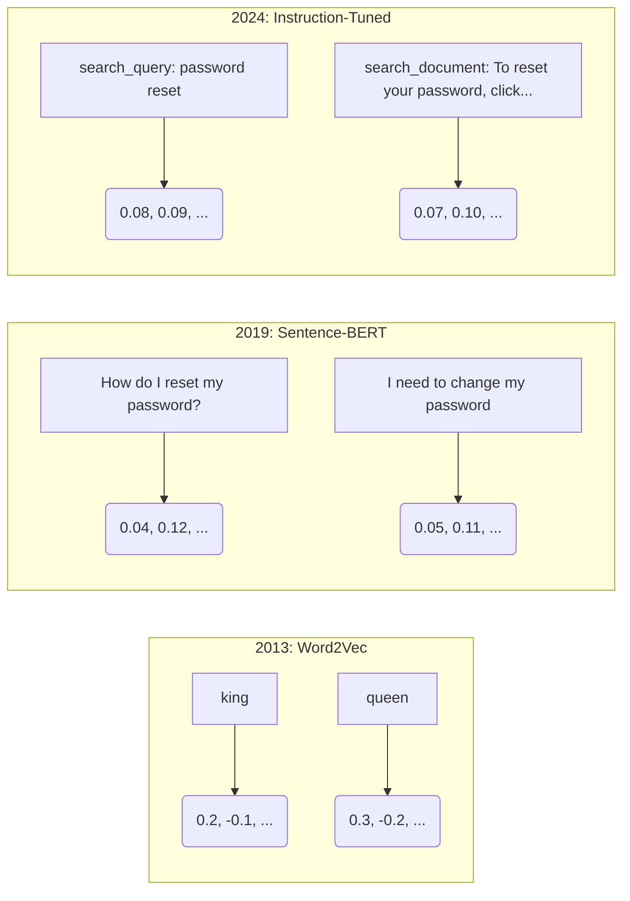
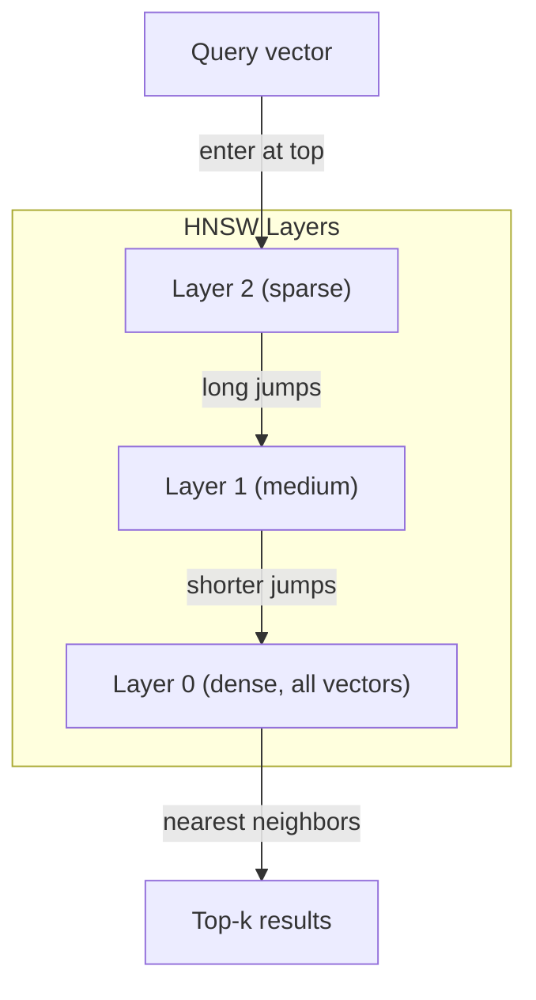
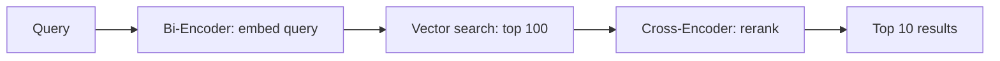

# 嵌入与向量表示

> 文本是离散的。数学是连续的。每次你让 LLM 查找"相似"文档、比较含义或进行关键词搜索以外的搜索时，你都依赖于连接这两个世界的桥梁。那座桥就是嵌入。如果你不理解嵌入，你就不理解现代 AI。你只是在使用它。

**类型：** Build
**语言：** Python
**前置要求：** Phase 11，课程 01（Prompt Engineering）
**时间：** 约 75 分钟
**相关内容：** Phase 5 · 22（嵌入模型深度探索）涵盖了 dense vs sparse vs multi-vector、Matryoshka 截断和按轴模型选择。本课程专注于生产管道（向量数据库、HNSW、相似度计算）。在选择模型之前请先阅读 Phase 5 · 22。

## 学习目标

- 使用 API 提供商和开源模型生成文本嵌入，并计算它们之间的余弦相似度
- 解释嵌入如何解决关键词搜索无法处理的词汇不匹配问题
- 构建语义搜索索引，通过含义而非精确关键词匹配来检索文档
- 使用检索基准（precision@k、recall）评估嵌入质量，并为你的任务选择正确的嵌入模型

## 问题

你有 10,000 张支持工单。客户写道"我的付款没有通过"。你需要找到相似的历史工单。关键词搜索找到包含"payment"和"didn't go through"的工单。它错过了"transaction failed"、"charge was declined"和"billing error"。这些工单用完全不同的词语描述了完全相同的问题。

这就是词汇不匹配问题。人类语言对同一件事有数十种表达方式。关键词搜索将每个词视为一个没有含义的独立符号。它无法知道"declined"和"didn't go through"指的是同一个概念。

你需要一种文本表示，其中含义而非拼写决定相似性。你需要一种方法，将"my payment didn't go through"和"transaction was declined"在某个数学空间中放得很近，同时将"my payment arrived on time"推得很远，尽管它们共享"payment"这个词。

这种表示就是嵌入。

## 概念

### 什么是嵌入？

嵌入是一个密集的浮点数向量，表示文本的含义。"密集"这个词很重要——每个维度都携带信息，不像稀疏表示（词袋、TF-IDF）那样大多数维度为零。

"The cat sat on the mat" 变成了类似 `[0.023, -0.041, 0.087, ..., 0.012]` 的东西——根据模型不同，一个包含 768 到 3072 个数字的列表。这些数字编码了含义。你从不直接检查它们。你比较它们。

### Word2Vec 突破

2013 年，Google 的 Tomas Mikolov 和同事发表了 Word2Vec。核心洞察：训练一个神经网络从邻居预测一个词（或者从词预测邻居），隐藏层的权重成为有意义的向量表示。

著名的结果：

```
king - man + woman = queen
```

词嵌入上的向量运算捕捉了语义关系。从"man"到"woman"的方向与从"king"到"queen"的方向大致相同。这一刻该领域意识到几何可以编码含义。

Word2Vec 生成 300 维向量。每个词获得一个向量，无论上下文如何。"river bank"中的"Bank"和"bank account"中的"Bank"有相同的嵌入。这个局限性推动了接下来十年的研究。

### 从词到句子

词嵌入表示单个 token。生产系统需要嵌入整个句子、段落或文档。出现了四种方法：

**平均法**：取句子中所有词向量的均值。便宜、有损、对于短文本出奇地好。完全丢失词序——"dog bites man"和"man bites dog"获得相同的嵌入。

**CLS token**：transformer 模型（BERT，2018）输出一个特殊的 [CLS] token 嵌入，表示整个输入。比平均法更好，但 [CLS] token 是为下一个句子预测训练的，而不是为相似性训练的。

**对比学习**：明确训练模型将相似的对推在一起，将不相似的对分开。Sentence-BERT（Reimers & Gurevych，2019）使用这种方法，成为现代嵌入模型的基础。对于"How do I reset my password?"和"I need to change my password"，模型学习这些应该有几乎相同的向量。

**指令调优嵌入**：最新方法。像 E5 和 GTE 这样的模型接受任务前缀（"search_query:"、"search_document:"），告诉模型生成什么类型的嵌入。这让一个模型可以服务多个任务。




### 现代嵌入模型

市场已经稳定在少数几个生产级选项中（2026 年初的 MTEB 分数，MTEB v2）：

| 模型 | 提供商 | 维度 | MTEB | 上下文 | 每 1M token 成本 |
|-------|----------|-----------|------|---------|------------------|
| Gemini Embedding 2 | Google | 3072 (Matryoshka) | 67.7 (retrieval) | 8192 | $0.15 |
| embed-v4 | Cohere | 1024 (Matryoshka) | 65.2 | 128K | $0.12 |
| voyage-4 | Voyage AI | 1024/2048 (Matryoshka) | 66.8 | 32K | $0.12 |
| text-embedding-3-large | OpenAI | 3072 (Matryoshka) | 64.6 | 8192 | $0.13 |
| text-embedding-3-small | OpenAI | 1536 (Matryoshka) | 62.3 | 8192 | $0.02 |
| BGE-M3 | BAAI | 1024 (dense+sparse+ColBERT) | 63.0 multilingual | 8192 | Open-weight |
| Qwen3-Embedding | Alibaba | 4096 (Matryoshka) | 66.9 | 32K | Open-weight |
| Nomic-embed-v2 | Nomic | 768 (Matryoshka) | 63.1 | 8192 | Open-weight |

MTEB（Massive Text Embedding Benchmark）v2 涵盖检索、分类、聚类、重排序和摘要的 100+ 任务。越高越好。到 2026 年，开源模型（Qwen3-Embedding、BGE-M3）在大多数指标上匹配或超越闭源托管模型。Gemini Embedding 2 在纯检索方面领先；Voyage/Cohere 在特定领域（金融、法律、代码）领先。在承诺之前始终用你自己的查询进行基准测试。

### 相似度指标

给定两个嵌入向量，有三种方法测量它们的相似程度：

**余弦相似度**：两个向量之间夹角的余弦。范围从 -1（相反）到 1（相同方向）。忽略幅度——一个 10 词的句子和一个 500 词的文档如果指向相同方向可以得 1.0。这是 90% 用例的默认值。

```
cosine_sim(a, b) = dot(a, b) / (||a|| * ||b||)
```

**点积**：两个向量的原始内积。当向量归一化（单位长度）时与余弦相似度相同。计算更快。OpenAI 的嵌入是归一化的，所以点积和余弦给出相同的排名。

```
dot(a, b) = sum(a_i * b_i)
```

**欧几里得（L2）距离**：向量空间中的直线距离。越小 = 越相似。对幅度差异敏感。当绝对位置重要而不仅仅是方向时使用。

```
L2(a, b) = sqrt(sum((a_i - b_i)^2))
```

何时使用哪个：

| 指标 | 适用场景 | 避免场景 |
|----------|----------|------------|
| 余弦相似度 | 比较不同长度的文本；大多数检索任务 | 幅度携带信息 |
| 点积 | 嵌入已经归一化；追求最大速度 | 向量幅度不同 |
| 欧几里得距离 | 聚类；空间最近邻问题 | 比较长度差异很大的文档 |

### 向量数据库和 HNSW

暴力相似度搜索将查询与每个存储的向量进行比较。在 100 万个向量、1536 维的情况下，每次查询需要进行 15 亿次乘加运算。太慢了。

向量数据库用近似最近邻（ANN）算法解决这个问题。主导算法是 HNSW（Hierarchical Navigable Small World）：

1. 构建向量的多层图
2. 顶层稀疏——遥远聚类之间的长程连接
3. 底层密集——附近向量之间的细粒度连接
4. 搜索从顶层开始，贪心地向下细化
5. 以 O(log n) 时间返回近似 top-k 结果，而不是 O(n)

HNSW 以小的精度损失（通常 95-99% recall）换取巨大的速度提升。在 1000 万个向量上，暴力搜索需要秒级。HNSW 需要毫秒级。



生产选项：

| 数据库 | 类型 | 最佳场景 | 最大规模 |
|----------|------|----------|-----------|
| Pinecone | Managed SaaS | 零运维生产 | 数十亿 |
| Weaviate | 开源 | 自托管、混合搜索 | 100M+ |
| Qdrant | 开源 | 高性能、过滤 | 100M+ |
| ChromaDB | 嵌入式 | 原型、本地开发 | 1M |
| pgvector | Postgres 扩展 | 已使用 Postgres | 10M |
| FAISS | 库 | 进程内、研究 | 1B+ |

### 分块策略

文档太长了，无法作为单个向量嵌入。一份 50 页的 PDF 涵盖数十个主题——它的嵌入变成了一切事物的平均，类似于 nothing specific。你将文档分割成块并嵌入每个块。

**固定大小分块**：以 M-token 重叠分割每个 N token。简单且可预测。当文档没有明显结构时效果很好。512 token 块，50 token 重叠：块 1 是 token 0-511，块 2 是 token 462-973。

**基于句子的分块**：在句子边界分割，将句子分组直到达到 token 限制。每个块至少是一个完整的句子。比固定大小更好，因为你永远不会把一个想法切成两半。

**递归分块**：首先尝试在最大边界分割（章节标题）。如果仍然太大，尝试段落边界。然后句子边界。然后字符限制。这是 LangChain 的 `RecursiveCharacterTextSplitter`，对混合格式语料库效果很好。

**语义分块**：嵌入每个句子，然后将嵌入相似的连续句子分组。当嵌入相似度低于阈值时，开始一个新的块。昂贵（需要单独嵌入每个句子）但产生最连贯的块。

| 策略 | 复杂度 | 质量 | 最佳场景 |
|----------|-----------|---------|----------|
| 固定大小 | 低 | 尚可 | 非结构化文本、日志 |
| 基于句子 | 低 | 好 | 文章、邮件 |
| 递归 | 中 | 好 | Markdown、HTML、混合文档 |
| 语义 | 高 | 最佳 | 关键检索质量 |

大多数系统的最佳点：256-512 token 块，50 token 重叠。

### Bi-Encoder 与 Cross-Encoder

Bi-encoder 独立嵌入查询和文档，然后比较向量。快——你嵌入查询一次，然后与预计算的文档嵌入比较。这是你用于检索的方式。

Cross-encoder 将查询和文档作为单个输入并输出相关性分数。慢——它通过完整模型处理每个查询-文档对。但更准确得多，因为它可以同时关注查询和文档 token。

生产模式：bi-encoder 检索 top-100 候选，cross-encoder 将它们重排序为 top-10。这是检索然后重排序管道。



重排序模型：Cohere Rerank 3.5（$2 每 1000 查询）、BGE-reranker-v2（免费、开源）、Jina Reranker v2（免费、开源）。

### Matryoshka 嵌入

传统嵌入是全有或全无。1536 维向量使用 1536 个浮点数。你无法在不重新训练的情况下截断到 256 维。

Matryoshka Representation Learning（Kusupati et al.，2022）修复了这个问题。模型被训练成前 N 个维度捕获最重要的信息，就像一个俄罗斯套娃。将 1536-d Matryoshka 嵌入截断到 256 维会损失一些 accuracy 但保持功能。

OpenAI 的 text-embedding-3-small 和 text-embedding-3-large 通过 `dimensions` 参数支持 Matryoshka 截断。请求 256 维而不是 1536 维将存储减少 6 倍，MTEB 基准上的 accuracy 损失约为 3-5%。

### 二值量化

1536 维嵌入存储为 float32 使用 6,144 字节。乘以 1000 万文档：仅向量就需要 61 GB。

二值量化将每个浮点数转换为单个位：正值变为 1，负值变为 0。存储从 6,144 字节减少到 192 字节——减少 32 倍。相似度使用汉明距离（计算不同位数）计算，CPU 可以在单条指令中完成。

Accuracy 损失在检索 recall 上约为 5-10%。常见模式：对数百万向量的第一遍搜索使用二值量化，然后用全精度向量对 top-1000 进行重新评分。这以 32 倍更少的内存获得 95%+ 的全精度 accuracy。

```figure
cosine-similarity
```

## 构建它

我们从头开始构建语义搜索引擎。没有向量数据库。没有外部嵌入 API。纯 Python 和 numpy 做数学。

### 步骤 1：文本分块

```python
def chunk_text(text, chunk_size=200, overlap=50):
    words = text.split()
    chunks = []
    start = 0
    while start < len(words):
        end = start + chunk_size
        chunk = " ".join(words[start:end])
        chunks.append(chunk)
        start += chunk_size - overlap
    return chunks


def chunk_by_sentences(text, max_chunk_tokens=200):
    sentences = text.replace("\n", " ").split(".")
    sentences = [s.strip() + "." for s in sentences if s.strip()]
    chunks = []
    current_chunk = []
    current_length = 0
    for sentence in sentences:
        sentence_length = len(sentence.split())
        if current_length + sentence_length > max_chunk_tokens and current_chunk:
            chunks.append(" ".join(current_chunk))
            current_chunk = []
            current_length = 0
        current_chunk.append(sentence)
        current_length += sentence_length
    if current_chunk:
        chunks.append(" ".join(current_chunk))
    return chunks
```

### 步骤 2：从头构建嵌入

我们使用 TF-IDF 和 L2 归一化实现一个简单的密集嵌入。这不是神经嵌入，但它遵循相同的契约：文本输入，固定大小向量输出，相似文本产生相似向量。

```python
import math
import numpy as np
from collections import Counter

class SimpleEmbedder:
    def __init__(self):
        self.vocab = []
        self.idf = []
        self.word_to_idx = {}

    def fit(self, documents):
        vocab_set = set()
        for doc in documents:
            vocab_set.update(doc.lower().split())
        self.vocab = sorted(vocab_set)
        self.word_to_idx = {w: i for i, w in enumerate(self.vocab)}
        n = len(documents)
        self.idf = np.zeros(len(self.vocab))
        for i, word in enumerate(self.vocab):
            doc_count = sum(1 for doc in documents if word in doc.lower().split())
            self.idf[i] = math.log((n + 1) / (doc_count + 1)) + 1

    def embed(self, text):
        words = text.lower().split()
        count = Counter(words)
        total = len(words) if words else 1
        vec = np.zeros(len(self.vocab))
        for word, freq in count.items():
            if word in self.word_to_idx:
                tf = freq / total
                vec[self.word_to_idx[word]] = tf * self.idf[self.word_to_idx[word]]
        norm = np.linalg.norm(vec)
        if norm > 0:
            vec = vec / norm
        return vec
```

### 步骤 3：相似度函数

```python
def cosine_similarity(a, b):
    dot = np.dot(a, b)
    norm_a = np.linalg.norm(a)
    norm_b = np.linalg.norm(b)
    if norm_a == 0 or norm_b == 0:
        return 0.0
    return float(dot / (norm_a * norm_b))


def dot_product(a, b):
    return float(np.dot(a, b))


def euclidean_distance(a, b):
    return float(np.linalg.norm(a - b))
```

### 步骤 4：带暴力搜索的向量索引

```python
class VectorIndex:
    def __init__(self):
        self.vectors = []
        self.texts = []
        self.metadata = []

    def add(self, vector, text, meta=None):
        self.vectors.append(vector)
        self.texts.append(text)
        self.metadata.append(meta or {})

    def search(self, query_vector, top_k=5, metric="cosine"):
        scores = []
        for i, vec in enumerate(self.vectors):
            if metric == "cosine":
                score = cosine_similarity(query_vector, vec)
            elif metric == "dot":
                score = dot_product(query_vector, vec)
            elif metric == "euclidean":
                score = -euclidean_distance(query_vector, vec)
            else:
                raise ValueError(f"Unknown metric: {metric}")
            scores.append((i, score))
        scores.sort(key=lambda x: x[1], reverse=True)
        results = []
        for idx, score in scores[:top_k]:
            results.append({
                "text": self.texts[idx],
                "score": score,
                "metadata": self.metadata[idx],
                "index": idx
            })
        return results

    def size(self):
        return len(self.vectors)
```

### 步骤 5：语义搜索引擎

```python
class SemanticSearchEngine:
    def __init__(self, chunk_size=200, overlap=50):
        self.embedder = SimpleEmbedder()
        self.index = VectorIndex()
        self.chunk_size = chunk_size
        self.overlap = overlap

    def index_documents(self, documents, source_names=None):
        all_chunks = []
        all_sources = []
        for i, doc in enumerate(documents):
            chunks = chunk_text(doc, self.chunk_size, self.overlap)
            all_chunks.extend(chunks)
            name = source_names[i] if source_names else f"doc_{i}"
            all_sources.extend([name] * len(chunks))
        self.embedder.fit(all_chunks)
        for chunk, source in zip(all_chunks, all_sources):
            vec = self.embedder.embed(chunk)
            self.index.add(vec, chunk, {"source": source})
        return len(all_chunks)

    def search(self, query, top_k=5, metric="cosine"):
        query_vec = self.embedder.embed(query)
        return self.index.search(query_vec, top_k, metric)

    def search_with_scores(self, query, top_k=5):
        results = self.search(query, top_k)
        return [
            {
                "text": r["text"][:200],
                "source": r["metadata"].get("source", "unknown"),
                "score": round(r["score"], 4)
            }
            for r in results
        ]
```

### 步骤 6：比较相似度指标

```python
def compare_metrics(engine, query, top_k=3):
    results = {}
    for metric in ["cosine", "dot", "euclidean"]:
        hits = engine.search(query, top_k=top_k, metric=metric)
        results[metric] = [
            {"score": round(h["score"], 4), "preview": h["text"][:80]}
            for h in hits
        ]
    return results
```

## 使用它

使用生产嵌入 API，架构保持不变。只有 embedder 改变：

```python
from openai import OpenAI

client = OpenAI()

def openai_embed(texts, model="text-embedding-3-small", dimensions=None):
    kwargs = {"model": model, "input": texts}
    if dimensions:
        kwargs["dimensions"] = dimensions
    response = client.embeddings.create(**kwargs)
    return [item.embedding for item in response.data]
```

OpenAI 的 Matryoshka 截断——相同的模型，更少的维度，更低的存储：

```python
full = openai_embed(["semantic search query"], dimensions=1536)
compact = openai_embed(["semantic search query"], dimensions=256)
```

256-d 向量使用 6 倍更少的存储。对于 1000 万文档，那是 10 GB 对 61 GB。标准基准上的 accuracy 损失约为 3-5%。

对于使用 Cohere 的重排序：

```python
import cohere

co = cohere.ClientV2()

results = co.rerank(
    model="rerank-v3.5",
    query="What is the refund policy?",
    documents=["Full refund within 30 days...", "No refunds after 90 days..."],
    top_n=3
)
```

对于没有 API 依赖的本地嵌入：

```python
from sentence_transformers import SentenceTransformer

model = SentenceTransformer("BAAI/bge-small-en-v1.5")
embeddings = model.encode(["semantic search query", "another document"])
```

VectorIndex 类与任何这些一起使用。换掉嵌入函数，保留搜索逻辑。

## 发货

本课程生成：
- `outputs/prompt-embedding-advisor.md` ——用于为特定用例选择嵌入模型和策略的 prompt
- `outputs/skill-embedding-patterns.md` ——教代理如何在生产中有效使用嵌入的 skill

## 练习

1. **指标比较**：使用余弦相似度、点积和欧几里得距离对样本文档运行相同的 5 个查询。记录每个的前 3 名结果。指标在哪里不一致？为什么？

2. **块大小实验**：用 50、100、200 和 500 词的块大小索引样本文档。对于每个，运行 5 个查询并记录 top-1 相似度分数。绘制块大小和检索质量之间的关系。找到更大的块开始损害性能的拐点。

3. **Matryoshka 模拟**：构建一个产生 500-d 向量的 SimpleEmbedder。截断到 50、100、200 和 500 维。测量每个截断级别下检索 recall 如何下降。这模拟了 Matryoshka 行为而不需要真正的训练技巧。

4. **二值量化**：从搜索引擎获取嵌入，将它们转换为二进制（正为 1，负为 0），并实现汉明距离搜索。将 top-10 结果与全精度余弦相似度进行比较。测量重叠百分比。

5. **基于句子的分块**：用 `chunk_by_sentences` 替换固定大小分块。运行相同的查询并比较检索分数。尊重句子边界是否改善了结果？

## 关键术语

| 术语 | 人们怎么说 | 实际含义 |
|------|----------------|----------------------|
| Embedding | "Text to numbers" | 一个密集向量，其中几何邻近性编码语义相似性 |
| Word2Vec | "The OG embedding" | 2013 年通过预测上下文词学习词向量的模型；证明了向量运算编码含义 |
| Cosine similarity | "How similar are two vectors" | 向量之间夹角的余弦；1 = 相同方向，0 = 正交，-1 = 相反 |
| HNSW | "Fast vector search" | Hierarchical Navigable Small World 图——多层结构，实现 O(log n) 近似最近邻搜索 |
| Bi-encoder | "Embed separately, compare fast" | 独立将查询和文档编码为向量；支持预计算和快速检索 |
| Cross-encoder | "Slow but accurate reranker" | 通过完整模型联合处理查询-文档对；更高的准确性，无预计算 |
| Matryoshka embeddings | "Truncatable vectors" | 嵌入被训练成前 N 个维度捕获最重要的信息，支持可变大小存储 |
| Binary quantization | "1-bit embeddings" | 将浮点向量转换为二进制（仅符号位）以实现 32 倍存储减少和汉明距离搜索 |
| Chunking | "Split docs for embedding" | 将文档分成 256-512 token 段，以便每个可以独立嵌入和检索 |
| Vector database | "Search engine for embeddings" | 优化用于存储向量和大规模执行近似最近邻搜索的数据存储 |
| Contrastive learning | "Train by comparison" | 将相似对嵌入推在一起、将不相似的对嵌入分开的训练方法 |
| MTEB | "The embedding benchmark" | Massive Text Embedding Benchmark——56 个数据集横跨 8 个任务；比较嵌入模型的标准 |

## 进一步阅读

- Mikolov et al., "Efficient Estimation of Word Representations in Vector Space" (2013) -- 开始了嵌入革命的 Word2Vec 论文，用 king-queen 类比
- Reimers & Gurevych, "Sentence-BERT: Sentence Embeddings using Siamese BERT-Networks" (2019) -- 如何训练用于句子级相似度的 bi-encoders，现代嵌入模型的基础
- Kusupati et al., "Matryoshka Representation Learning" (2022) -- OpenAI 为 text-embedding-3 采用的可变维度嵌入技术背后的原理
- Malkov & Yashunin, "Efficient and Robust Approximate Nearest Neighbor using Hierarchical Navigable Small World Graphs" (2018) -- HNSW 论文，大多数生产向量搜索背后的算法
- OpenAI Embeddings Guide (platform.openai.com/docs/guides/embeddings) -- text-embedding-3 模型的实用参考，包括 Matryoshka 维度缩减
- MTEB Leaderboard (huggingface.co/spaces/mteb/leaderboard) -- 实时基准测试，跨任务和语言比较所有嵌入模型
- [Muennighoff et al., "MTEB: Massive Text Embedding Benchmark" (EACL 2023)](https://arxiv.org/abs/2210.07316) -- 定义 8 个任务类别的基准（分类、聚类、配对分类、重排序、检索、STS、摘要、双语挖掘），排行榜报告这些；在信任任何单一 MTEB 分数之前阅读。
- [Sentence Transformers documentation](https://www.sbert.net/) -- bi-encoder vs cross-encoder、池化策略和 ingest-split-embed-store RAG 管道的规范参考，本课程实现了该管道。
