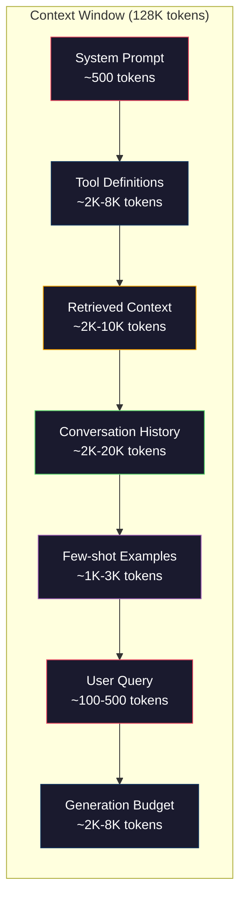
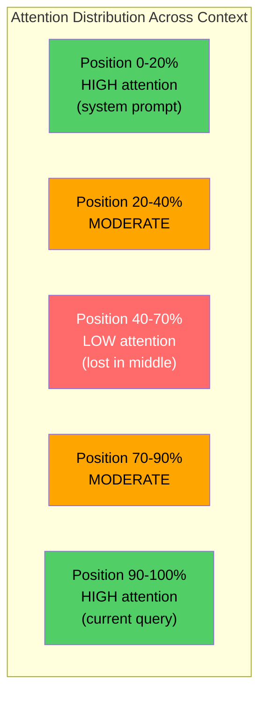
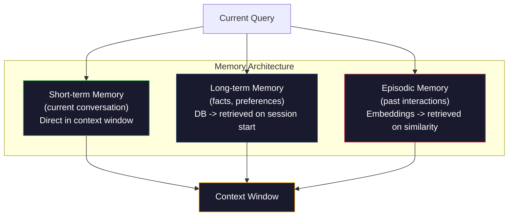

# 上下文工程：窗口、预算、记忆与检索

> Prompt 工程只是一个子集。上下文工程才是整盘游戏。Prompt 是你输入的一个字符串。上下文是进入模型窗口的一切：系统指令、检索到的文档、工具定义、对话历史、少样本示例，以及 prompt 本身。2026 年最优秀的 AI 工程师都是上下文工程师。他们决定什么放进去、什么排除在外、以及以什么顺序。

**类型：** Build
**语言：** Python
**前置要求：** Phase 10（从零构建 LLM）、Phase 11 课程 01-02
**时间：** 约 90 分钟
**相关内容：** Phase 11 · 15（Prompt 缓存）——缓存友好布局是上下文工程的扩展。Phase 5 · 28（长上下文评估）关于如何使用 NIAH/RULER 测量中间丢失。

## 学习目标

- 计算所有上下文窗口组件的 token 预算（系统 prompt、工具、历史、检索到的文档、生成预留空间）
- 实现上下文窗口管理策略：截断、摘要和对话历史的滑动窗口
- 优先排序上下文组件以最大化模型对最相关信息的注意力
- 构建一个基于查询类型和可用窗口空间动态分配 token 的上下文组装器

## 问题

Claude Opus 4.7 有 200K token 窗口（beta 中 1M）。GPT-5 有 400K。Gemini 3 Pro 有 2M。Llama 4 声称 10M。这些数字听起来很大，直到你填满它们。

以下是一个编码助手的真实分解。系统 prompt：500 token。50 个工具的工具定义：8,000 token。检索到的文档：4,000 token。对话历史（10 轮）：6,000 token。当前用户查询：200 token。生成预算（最大输出）：4,000 token。总计：22,700 token。这只是 128K 窗口的 18%。

但注意力并不随上下文长度线性扩展。具有 128K token 上下文的模型支付二次注意力成本（ vanilla transformer 中为 O(n^2)，尽管大多数生产模型使用高效注意力变体）。更重要的是，检索准确性会下降。"大海捞针"测试表明，模型难以找到放在长上下文中间的信息。Liu et al. (2023) 的研究表明，LLM 在长上下文开头和结尾检索信息的准确性接近完美，但对于放在中间（上下文 40-70% 位置）的信息，准确性下降 10-20%。这种"中间丢失"效果因模型而异，但影响所有当前架构。

实际教训：拥有 200K 可用 token 并不意味着使用 200K token 是有效的。精心策划的 10K token 上下文通常优于随意填充的 100K token 上下文。上下文工程是在上下文窗口内最大化信噪比的学科。

你放入窗口的每个 token 都取代了一个可能携带更相关信息的 token。每个不相关的工具定义、每个过时的对话轮次、每段不回答问题的检索文本——每一个都使模型在任务上稍差一些。

## 概念

### 上下文窗口是一种稀缺资源

把上下文窗口想象成 RAM，而不是磁盘。它很快且可直接访问，但有限。你不能装下所有东西。你必须选择。



每个组件争夺空间。添加更多工具定义意味着对话历史的空间减少。添加更多检索上下文意味着少样本示例的空间减少。上下文工程是分配这笔预算以最大化任务性能的艺术。

### 中间丢失

上下文工程中最重要的经验发现。模型对上下文开头和结尾的信息关注更好。中间的信息获得更低的注意力分数，更容易被忽略。

Liu et al. (2023) 系统地测试了这一点。他们将相关文档放在 20 个不相关文档中的不同位置，并测量答案准确性。当相关文档在第一个或最后一个时，准确性为 85-90%。当它在中间（第 20 个中的第 10 个）时，准确性下降到 60-70%。

这有直接的工程含义：

- 把最重要的信息放在前面（系统 prompt、关键指令）
- 把当前查询和最相关的上下文放在最后（近因偏差有帮助）
- 将上下文的中间视为最低优先级区域
- 如果必须在中间包含信息，在结尾重复关键点



### 上下文组件

**系统 prompt**：设置角色、约束和行为规则。这放在最前面，在各轮次中保持不变。Claude Code 的系统 prompt 大约使用 6,000 token，包括工具定义和行为指令。保持简洁。系统 prompt 中的每个词在每次 API 调用时都会重复。

**工具定义**：每个工具添加 50-200 token（名称、描述、参数 schema）。50 个工具每个 150 token 是 7,500 token，在任何对话发生之前。动态工具选择——只包含与当前查询相关的工具——可以减少 60-80%。

**检索上下文**：来自向量数据库、搜索结果、文件内容的文档。检索质量直接决定响应质量。差的检索比不检索更糟糕——它用噪声填充窗口并积极误导模型。

**对话历史**：每个之前的用户消息和助手回复。随着对话长度线性增长。50 轮对话每轮 200 token 是 10,000 token 的历史。大多数与当前查询无关。

**少样本示例**：展示期望行为的输入/输出对。两到三个精心选择的示例通常比数千 token 的指令更能提高输出质量。但它们占用空间。

**生成预算**：为模型的响应预留的 token。如果将窗口填充到容量，模型就没有空间回答。至少预留 2,000-4,000 token 用于生成。

### 上下文压缩策略

**历史摘要**：不要保留所有先前的对话轮次，而是定期对对话进行摘要。"我们讨论了 X，决定了 Y，用户想要 Z"，用 100 token 替换占用 2,000 token 的 10 轮对话。当历史超过阈值时运行摘要（例如 5,000 token）。

**相关性过滤**：根据当前查询对每个检索到的文档进行评分，丢弃低于阈值的文档。如果检索了 10 个块但只有 3 个相关，丢弃其他 7 个。3 个高度相关的块优于 10 个平庸的块。

**工具修剪**：分类用户查询意图，只包含与该意图相关的工具。代码问题不需要日历工具。调度问题不需要文件系统工具。这可以将工具定义从 8,000 token 减少到 1,000。

**递归摘要**：对于非常长的文档，分阶段摘要。首先摘要每个部分，然后摘要摘要。一份 50 页的文档变成 500 token 的摘要，捕获关键点。

### 记忆系统

上下文工程跨越三个时间范围。

**短期记忆**：当前对话。直接存储在上下文窗口中。随每轮增长。由摘要和截断管理。

**长期记忆**：跨对话持久化的事实和偏好。"用户偏好 TypeScript。""项目使用 PostgreSQL。"存储在数据库中，在会话开始时检索。Claude Code 将其存储在 CLAUDE.md 文件中。ChatGPT 将其存储在其记忆功能中。

**情景记忆**：可能相关的特定过去交互。"上周二，我们在 auth 模块中调试了一个类似的问题。"存储为嵌入，当当前对话匹配过去事件时检索。



### 动态上下文组装

关键洞察：不同的查询需要不同的上下文。静态系统 prompt + 静态工具 + 静态历史是浪费的。最好的系统为每个查询动态组装上下文。

1. 分类查询意图
2. 选择相关工具（不是所有工具）
3. 检索相关文档（不是固定集合）
4. 包含相关历史轮次（不是所有历史）
5. 添加匹配任务类型的少样本示例
6. 按重要性排序：关键在前，重要在后，可选在中间

这就是区分好的 AI 应用和伟大 AI 应用的关键。模型是一样的。上下文是差异化因素。

## 构建它

### 步骤 1：Token 计数器

你无法预算你无法衡量的东西。构建一个简单的 token 计数器（使用空白分割的近似值，因为精确计数取决于分词器）。

```python
import json
import numpy as np
from collections import OrderedDict

def count_tokens(text):
    if not text:
        return 0
    return int(len(text.split()) * 1.3)

def count_tokens_json(obj):
    return count_tokens(json.dumps(obj))
```

### 步骤 2：上下文预算管理器

核心抽象。预算管理器跟踪每个组件使用多少 token 并强制执行限制。

```python
class ContextBudget:
    def __init__(self, max_tokens=128000, generation_reserve=4000):
        self.max_tokens = max_tokens
        self.generation_reserve = generation_reserve
        self.available = max_tokens - generation_reserve
        self.allocations = OrderedDict()

    def allocate(self, component, content, max_tokens=None):
        tokens = count_tokens(content)
        if max_tokens and tokens > max_tokens:
            words = content.split()
            target_words = int(max_tokens / 1.3)
            content = " ".join(words[:target_words])
            tokens = count_tokens(content)

        used = sum(self.allocations.values())
        if used + tokens > self.available:
            allowed = self.available - used
            if allowed <= 0:
                return None, 0
            words = content.split()
            target_words = int(allowed / 1.3)
            content = " ".join(words[:target_words])
            tokens = count_tokens(content)

        self.allocations[component] = tokens
        return content, tokens

    def remaining(self):
        used = sum(self.allocations.values())
        return self.available - used

    def utilization(self):
        used = sum(self.allocations.values())
        return used / self.max_tokens

    def report(self):
        total_used = sum(self.allocations.values())
        lines = []
        lines.append(f"Context Budget Report ({self.max_tokens:,} token window)")
        lines.append("-" * 50)
        for component, tokens in self.allocations.items():
            pct = tokens / self.max_tokens * 100
            bar = "#" * int(pct / 2)
            lines.append(f"  {component:<25} {tokens:>6} tokens ({pct:>5.1f}%) {bar}")
        lines.append("-" * 50)
        lines.append(f"  {'Used':<25} {total_used:>6} tokens ({total_used/self.max_tokens*100:.1f}%)")
        lines.append(f"  {'Generation reserve':<25} {self.generation_reserve:>6} tokens")
        lines.append(f"  {'Remaining':<25} {self.remaining():>6} tokens")
        return "\n".join(lines)
```

### 步骤 3：中间丢失重排序

实现重排序策略：最重要的项放在前面和后面，最不重要的放在中间。

```python
def reorder_lost_in_middle(items, scores):
    paired = sorted(zip(scores, items), reverse=True)
    sorted_items = [item for _, item in paired]

    if len(sorted_items) <= 2:
        return sorted_items

    first_half = sorted_items[::2]
    second_half = sorted_items[1::2]
    second_half.reverse()

    return first_half + second_half

def score_relevance(query, documents):
    query_words = set(query.lower().split())
    scores = []
    for doc in documents:
        doc_words = set(doc.lower().split())
        if not query_words:
            scores.append(0.0)
            continue
        overlap = len(query_words & doc_words) / len(query_words)
        scores.append(round(overlap, 3))
    return scores
```

### 步骤 4：对话历史压缩器

摘要旧的对话轮次以回收 token 预算。

```python
class ConversationManager:
    def __init__(self, max_history_tokens=5000):
        self.turns = []
        self.summaries = []
        self.max_history_tokens = max_history_tokens

    def add_turn(self, role, content):
        self.turns.append({"role": role, "content": content})
        self._compress_if_needed()

    def _compress_if_needed(self):
        total = sum(count_tokens(t["content"]) for t in self.turns)
        if total <= self.max_history_tokens:
            return

        while total > self.max_history_tokens and len(self.turns) > 4:
            old_turns = self.turns[:2]
            summary = self._summarize_turns(old_turns)
            self.summaries.append(summary)
            self.turns = self.turns[2:]
            total = sum(count_tokens(t["content"]) for t in self.turns)

    def _summarize_turns(self, turns):
        parts = []
        for t in turns:
            content = t["content"]
            if len(content) > 100:
                content = content[:100] + "..."
            parts.append(f"{t['role']}: {content}")
        return "Previous: " + " | ".join(parts)

    def get_context(self):
        parts = []
        if self.summaries:
            parts.append("[Conversation Summary]")
            for s in self.summaries:
                parts.append(s)
        parts.append("[Recent Conversation]")
        for t in self.turns:
            parts.append(f"{t['role']}: {t['content']}")
        return "\n".join(parts)

    def token_count(self):
        return count_tokens(self.get_context())
```

### 步骤 5：动态工具选择器

只包含与当前查询相关的工具。分类意图，然后过滤。

```python
TOOL_REGISTRY = {
    "read_file": {
        "description": "Read contents of a file",
        "tokens": 120,
        "categories": ["code", "files"],
    },
    "write_file": {
        "description": "Write content to a file",
        "tokens": 150,
        "categories": ["code", "files"],
    },
    "search_code": {
        "description": "Search for patterns in codebase",
        "tokens": 130,
        "categories": ["code"],
    },
    "run_command": {
        "description": "Execute a shell command",
        "tokens": 140,
        "categories": ["code", "system"],
    },
    "create_calendar_event": {
        "description": "Create a new calendar event",
        "tokens": 180,
        "categories": ["calendar"],
    },
    "list_emails": {
        "description": "List recent emails",
        "tokens": 160,
        "categories": ["email"],
    },
    "send_email": {
        "description": "Send an email message",
        "tokens": 200,
        "categories": ["email"],
    },
    "web_search": {
        "description": "Search the web for information",
        "tokens": 140,
        "categories": ["research"],
    },
    "query_database": {
        "description": "Run a SQL query on the database",
        "tokens": 170,
        "categories": ["code", "data"],
    },
    "generate_chart": {
        "description": "Generate a chart from data",
        "tokens": 190,
        "categories": ["data", "visualization"],
    },
}

def classify_intent(query):
    query_lower = query.lower()

    intent_keywords = {
        "code": ["code", "function", "bug", "error", "file", "implement", "refactor", "debug", "test"],
        "calendar": ["meeting", "schedule", "calendar", "appointment", "event"],
        "email": ["email", "mail", "send", "inbox", "message"],
        "research": ["search", "find", "what is", "how does", "explain", "look up"],
        "data": ["data", "query", "database", "chart", "graph", "analytics", "sql"],
    }

    scores = {}
    for intent, keywords in intent_keywords.items():
        score = sum(1 for kw in keywords if kw in query_lower)
        if score > 0:
            scores[intent] = score

    if not scores:
        return ["code"]

    max_score = max(scores.values())
    return [intent for intent, score in scores.items() if score >= max_score * 0.5]

def select_tools(query, token_budget=2000):
    intents = classify_intent(query)
    relevant = {}
    total_tokens = 0

    for name, tool in TOOL_REGISTRY.items():
        if any(cat in intents for cat in tool["categories"]):
            if total_tokens + tool["tokens"] <= token_budget:
                relevant[name] = tool
                total_tokens += tool["tokens"]

    return relevant, total_tokens
```

### 步骤 6：完整上下文组装管道

将所有内容连接在一起。给定一个查询，动态组装最佳上下文。

```python
class ContextEngine:
    def __init__(self, max_tokens=128000, generation_reserve=4000):
        self.budget = ContextBudget(max_tokens, generation_reserve)
        self.conversation = ConversationManager(max_history_tokens=5000)
        self.system_prompt = (
            "You are a helpful AI assistant. You have access to tools for "
            "code editing, file management, web search, and data analysis. "
            "Use the appropriate tools for each task. Be concise and accurate."
        )
        self.knowledge_base = [
            "Python 3.12 introduced type parameter syntax for generic classes using bracket notation.",
            "The project uses PostgreSQL 16 with pgvector for embedding storage.",
            "Authentication is handled by Supabase Auth with JWT tokens.",
            "The frontend is built with Next.js 15 using the App Router.",
            "API rate limits are set to 100 requests per minute per user.",
            "The deployment pipeline uses GitHub Actions with Docker multi-stage builds.",
            "Test coverage must be above 80% for all new modules.",
            "The codebase follows the repository pattern for data access.",
        ]

    def assemble(self, query):
        self.budget = ContextBudget(self.budget.max_tokens, self.budget.generation_reserve)

        system_content, _ = self.budget.allocate("system_prompt", self.system_prompt, max_tokens=1000)

        tools, tool_tokens = select_tools(query, token_budget=2000)
        tool_text = json.dumps(list(tools.keys()))
        tool_content, _ = self.budget.allocate("tools", tool_text, max_tokens=2000)

        relevance = score_relevance(query, self.knowledge_base)
        threshold = 0.1
        relevant_docs = [
            doc for doc, score in zip(self.knowledge_base, relevance)
            if score >= threshold
        ]

        if relevant_docs:
            doc_scores = [s for s in relevance if s >= threshold]
            reordered = reorder_lost_in_middle(relevant_docs, doc_scores)
            doc_text = "\n".join(reordered)
            doc_content, _ = self.budget.allocate("retrieved_context", doc_text, max_tokens=3000)

        history_text = self.conversation.get_context()
        if history_text.strip():
            history_content, _ = self.budget.allocate("conversation_history", history_text, max_tokens=5000)

        query_content, _ = self.budget.allocate("user_query", query, max_tokens=500)

        return self.budget

    def chat(self, query):
        self.conversation.add_turn("user", query)
        budget = self.assemble(query)
        response = f"[Response to: {query[:50]}...]"
        self.conversation.add_turn("assistant", response)
        return budget


def run_demo():
    print("=" * 60)
    print("  Context Engineering Pipeline Demo")
    print("=" * 60)

    engine = ContextEngine(max_tokens=128000, generation_reserve=4000)

    print("\n--- Query 1: Code task ---")
    budget = engine.chat("Fix the bug in the authentication module where JWT tokens expire too early")
    print(budget.report())

    print("\n--- Query 2: Research task ---")
    budget = engine.chat("What is the best approach for implementing vector search in PostgreSQL?")
    print(budget.report())

    print("\n--- Query 3: After conversation history builds up ---")
    for i in range(8):
        engine.conversation.add_turn("user", f"Follow-up question number {i+1} about the implementation details of the system")
        engine.conversation.add_turn("assistant", f"Here is the response to follow-up {i+1} with technical details about the architecture")

    budget = engine.chat("Now implement the changes we discussed")
    print(budget.report())

    print("\n--- Tool Selection Examples ---")
    test_queries = [
        "Fix the bug in auth.py",
        "Schedule a meeting with the team for Tuesday",
        "Show me the database query performance stats",
        "Search for best practices on error handling",
    ]

    for q in test_queries:
        tools, tokens = select_tools(q)
        intents = classify_intent(q)
        print(f"\n  Query: {q}")
        print(f"  Intents: {intents}")
        print(f"  Tools: {list(tools.keys())} ({tokens} tokens)")

    print("\n--- Lost-in-the-Middle Reordering ---")
    docs = ["Doc A (most relevant)", "Doc B (somewhat relevant)", "Doc C (least relevant)",
            "Doc D (relevant)", "Doc E (moderately relevant)"]
    scores = [0.95, 0.60, 0.20, 0.80, 0.50]
    reordered = reorder_lost_in_middle(docs, scores)
    print(f"  Original order: {docs}")
    print(f"  Scores:         {scores}")
    print(f"  Reordered:      {reordered}")
    print(f"  (Most relevant at start and end, least relevant in middle)")
```

## 使用它

### Claude Code 的上下文策略

Claude Code 用分层方法管理上下文。系统 prompt 包含行为规则和工具定义（约 6K token）。当你打开文件时，其内容作为上下文注入。当你搜索时，结果被添加。旧的对话轮次被摘要。CLAUDE.md 提供跨会话持久化的长期记忆。

关键工程决策：Claude Code 不会将整个代码库倾倒到上下文中。它按需检索相关文件。这是上下文工程的实践。

### Cursor 的动态上下文加载

Cursor 将整个代码库索引为嵌入。当你输入查询时，它使用向量相似性检索最相关的文件和代码块。只有这些片段进入上下文窗口。一个 500K 行的代码库被压缩成 5-10 个最相关的代码块。

这是模式：嵌入一切，按需检索，只包含重要的东西。

### ChatGPT 记忆

ChatGPT 将用户偏好和事实存储为长期记忆。在每个对话开始时，检索相关记忆并包含在系统 prompt 中。"用户偏好 Python"花费 5 token，但可以在跨会话的重复指令中节省数百 token。

### RAG 作为上下文工程

检索增强生成是正式化的上下文工程。不是将知识塞进模型权重（训练）或系统 prompt（静态上下文），而是在查询时检索相关文档并注入上下文窗口。整个 RAG 管道——分块、嵌入、检索、重排序——存在来解决一个问题：在上下文窗口中放入正确的信息。

## 发货

本课程生成 `outputs/prompt-context-optimizer.md` ——一个可重用的 prompt，审计上下文组装策略并推荐优化。给它你的系统 prompt、工具数量、平均历史长度和检索策略，它识别 token 浪费并提出改进建议。

它还生成 `outputs/skill-context-engineering.md` ——一个基于任务类型、上下文窗口大小和延迟预算设计上下文组装管道的决策框架。

## 练习

1. 在 ContextBudget 类中添加一个"token 浪费检测器"。它应该标记使用超过 30% 预算的组件，并提出针对每个组件类型的压缩策略（摘要历史、修剪工具、对文档重新排序）。

2. 实现检索上下文的语义去重。如果两个检索到的文档超过 80% 相似（通过词重叠或其嵌入的余弦相似度），只保留得分较高的一个。测量这回收了多少 token 预算。

3. 构建一个"上下文回放"工具。给定对话记录，通过 ContextEngine 重放它并可视化预算分配如何逐轮变化。绘制每个组件的 token 使用量随时间的变化。识别上下文开始被压缩的轮次。

4. 实现基于优先级的工具选择器。不是二元包含/排除，而是为每个工具分配与当前查询的相关性分数。按相关性降序包含工具，直到工具预算用完。用 5、10、20 和 50 个包含的工具比较任务性能。

5. 构建多策略上下文压缩器。实现三种压缩策略（截断、摘要、关键句子提取）并在 20 个文档集上对它们进行基准测试。测量压缩率与信息保留之间的权衡（压缩版本是否仍然包含查询的答案？）。

## 关键术语

| 术语 | 人们怎么说 | 实际含义 |
|------|----------------|----------------------|
| Context window | "How much the model can read" | 模型在单次前向传递中处理的最大 token 数（输入 + 输出）——GPT-5 为 400K，Claude Opus 4.7 为 200K（beta 中 1M），Gemini 3 Pro 为 2M |
| Context engineering | "Advanced prompt engineering" | 决定什么进入上下文窗口、以什么顺序、以什么优先级进入的学科——包含检索、压缩、工具选择和记忆管理 |
| Lost-in-the-middle | "Models forget stuff in the middle" | 经验发现，LLM 对上下文开头和结尾的关注更好，对于放在中间的信息准确性下降 10-20% |
| Token budget | "How many tokens you have left" | 跨组件（系统 prompt、工具、历史、检索、生成）的上下文窗口容量的显式分配，每个组件都有限制 |
| Dynamic context | "Loading stuff on the fly" | 基于意图分类、相关工具选择和检索结果为每个查询不同地组装上下文窗口 |
| History summarization | "Compressing the conversation" | 用简洁摘要替换逐字旧对话轮次，在保留关键信息的同时减少 token 成本 |
| Tool pruning | "Only including relevant tools" | 分类查询意图，只包含匹配的工具定义，将工具 token 成本减少 60-80% |
| Long-term memory | "Remembering across sessions" | 存储在数据库中并在会话开始时检索的事实和偏好——CLAUDE.md、ChatGPT Memory 和类似系统 |
| Episodic memory | "Remembering specific past events" | 存储为嵌入的过去交互，当当前查询与过去对话相似时检索 |
| Generation budget | "Room for the answer" | 为模型输出预留的 token——如果上下文完全填充窗口，模型就没有空间响应 |

## 进一步阅读

- [Liu et al., 2023 -- "Lost in the Middle: How Language Models Use Long Contexts"](https://arxiv.org/abs/2307.03172) -- 关于位置依赖注意力的权威研究，表明模型在长上下文中间处理信息时遇到困难
- [Anthropic's Contextual Retrieval blog post](https://www.anthropic.com/news/contextual-retrieval) -- Anthropic 如何处理上下文感知块检索，将检索失败减少 49%
- [Simon Willison's "Context Engineering"](https://simonwillison.net/2025/Jun/27/context-engineering/) -- 命名该学科并将其与 prompt 工程区分开的博客文章
- [LangChain documentation on RAG](https://python.langchain.com/docs/tutorials/rag/) -- 将检索增强生作为上下文工程模式实现的实用指南
- [Greg Kamradt's Needle in a Haystack test](https://github.com/gkamradt/LLMTest_NeedleInAHaystack) -- 揭示所有主要模型位置依赖检索失败的基准
- [Pope et al., "Efficiently Scaling Transformer Inference" (2022)](https://arxiv.org/abs/2211.05102) -- 为什么上下文长度驱动内存和延迟，以及 KV cache、MQA 和 GQA 如何改变预算计算。
- [Agrawal et al., "SARATHI: Efficient LLM Inference by Piggybacking Decodes with Chunked Prefills" (2023)](https://arxiv.org/abs/2308.16369) -- 使长 prompt 在 TTFT 中昂贵但在 TPOT 中便宜的推理的两个阶段；上下文打包权衡的真相。
- [Ainslie et al., "GQA: Training Generalized Multi-Query Transformer Models from Multi-Head Checkpoints" (EMNLP 2023)](https://arxiv.org/abs/2305.13245) -- 在生产解码器中削减 8 倍 KV 内存的分组查询注意力论文，质量无损失。