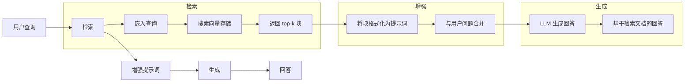
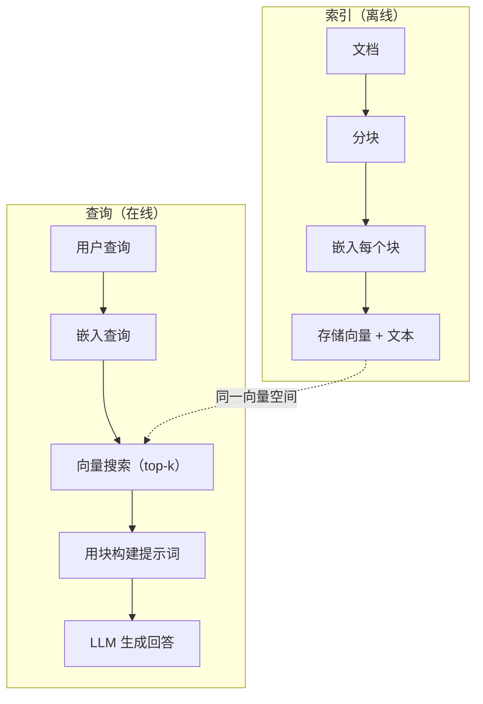

# RAG（检索增强生成）

> 你的 LLM 知道截止到训练日期之前的所有知识，但对企业内部文档、代码库或上周的会议记录一无所知。RAG 通过检索相关文档并将其填充到提示词中来解决这一问题。这是生产环境中部署最广泛的 AI 模式。如果你要从本课程中构建一个东西，就构建一个 RAG 管道。

**类型：** 构建
**语言：** Python
**先修条件：** 阶段 10（从头学 LLM）、阶段 11 第 01-05 课
**时间：** 约 90 分钟
**相关：** 阶段 5 · 23（RAG 分块策略）讲解六种分块算法及其适用场景。阶段 5 · 22（嵌入模型深度研究）讲解如何选择嵌入器。阶段 11 · 07（高级 RAG）讲解混合搜索、重排序和查询转换。

## 学习目标

- 构建完整的 RAG 管道：文档加载、分块、嵌入、向量存储、检索和生成
- 使用向量数据库（ChromaDB、FAISS 或 Pinecone）实现语义搜索，建立正确的索引
- 解释为什么 RAG 在知识落地应用场景中优于微调（成本、更新鲜度、可追溯性）
- 使用检索指标（精确率、召回率）和生成指标（忠实度、相关性）评估 RAG 质量

## 问题背景

你为公司构建了一个聊天机器人。客户问："企业版计划的退款政策是什么？" LLM 给出了关于典型 SaaS 退款政策的一般性回答。而真正的政策埋在一份 200 页的内部 wiki 中，说明企业客户有 60 天的窗口期，按比例退款。LLM 从未见过这份文档。它不可能知道它没有被训练过的内容。

微调是一种解决方案。用内部文档训练 LLM，然后部署更新后的模型。这可行但存在严重问题。微调需要数千美元的算力费用。模型在文档变化的瞬间就会过时。你无法知道模型回答的知识来源。如果公司下个月收购了另一条产品线，你又要重新微调。

RAG 是另一种解决方案。保持模型不变。当问题到来时，在文档存储中搜索相关段落，将它们粘贴到问题的提示词中，然后让模型使用这些段落作为上下文来回答。文档存储可以在几分钟内更新。你可以准确看到检索到了哪些文档。模型本身永不改变。这就是 RAG 成为生产环境主流模式的原因：更便宜、更新鲜、更可审计，且适用于任何 LLM。

## 核心概念

### RAG 模式

整个模式分为四个步骤：



查询 -> 检索 -> 增强提示词 -> 生成。每个 RAG 系统都遵循这一模式。生产级 RAG 系统之间的差异在于每个步骤的细节：如何分块、如何嵌入、如何搜索、如何构建提示词。

### 为什么 RAG 优于微调

| 关注点 | 微调 | RAG |
|--------|------|-----|
| 成本 | 每次训练 $1,000-$100,000+ | 每次查询 $0.01-$0.10（嵌入 + LLM） |
| 新鲜度 | 需重新训练才会更新 | 通过重新索引文档几分钟内更新 |
| 可审计性 | 无法追溯答案来源 | 可以展示精确检索到的段落 |
| 幻觉 | 仍会自由产生幻觉 | 基于检索文档进行回答 |
| 数据隐私 | 训练数据融入了权重 | 文档保留在自有向量存储中 |

微调永久改变模型权重。RAG 临时改变模型上下文。对于大多数应用，临时上下文正是你需要的。

微调唯一胜出的场景：当你需要模型采用特定的风格、语调或推理模式，而这些无法通过提示词实现时。对于事实性知识检索，RAG 每次都胜出。

### 嵌入模型

嵌入模型将文本转换为密集向量。相似的文本在高位空间中产生相近的向量。"How do I reset my password?" 和 "I need to change my password" 产生的向量几乎相同，尽管共享的词很少。"The cat sat on the mat" 则产生非常不同的向量。

常见嵌入模型（2026 年阵容——详见阶段 5 · 22 完整分析）：

| 模型 | 维度 | 提供商 | 备注 |
|------|------|--------|------|
| text-embedding-3-small | 1536（Matryoshka） | OpenAI | 多数场景最佳性价比 |
| text-embedding-3-large | 3072（Matryoshka） | OpenAI | 更高精度，可截断至 256/512/1024 |
| Gemini Embedding 2 | 3072（Matryoshka） | Google | 顶级 MTEB 检索；8K 上下文 |
| voyage-4 | 1024/2048（Matryoshka） | Voyage AI | 领域变体（代码、金融、法律） |
| Cohere embed-v4 | 1024（Matryoshka） | Cohere | 强多语言，128K 上下文 |
| BGE-M3 | 1024（dense + sparse + ColBERT） | BAAI（开放权重） | 一个模型三种视图 |
| Qwen3-Embedding | 4096（Matryoshka） | 阿里巴巴（开放权重） | 顶级开放权重检索分数 |
| all-MiniLM-L6-v2 | 384 | 开放权重（Sentence Transformers） | 原型基线 |

本课程中，我们使用 TF-IDF 构建自己的简单嵌入。不是因为生产系统使用 TF-IDF，而是因为它使概念具体化：文本输入、向量输出、相似的文本产生相似的向量。

### 向量相似度

给定两个向量，如何衡量相似度？三种选择：

**余弦相似度**：两个向量夹角的余弦。范围从 -1（相反）到 1（相同）。忽略大小，只关心方向。这是 RAG 的默认值。

```
cosine_sim(a, b) = dot(a, b) / (||a|| * ||b||)
```

**点积**：原始内积。向量越大得分越高。当大小携带信息时有用（较长的文档可能更相关）。

```
dot(a, b) = sum(a_i * b_i)
```

**L2（欧几里得）距离**：向量空间中的直线距离。距离越小越相似。对大小差异敏感。

```
L2(a, b) = sqrt(sum((a_i - b_i)^2))
```

余弦相似度是标准。它优雅地处理不同长度的文档，因为它按大小归一化。当有人说"向量搜索"时，几乎总是指余弦相似度。

### 分块策略

文档太长了，无法作为单个向量嵌入。一份 50 页的 PDF 可能产生糟糕的嵌入，因为它包含数十个主题。相反，你要将文档分割成块，分别嵌入每个块。

**固定大小分块**：每 N 个 token 分割一次。简单且可预测。512 token 的块配合 50 token 的重叠意味着块 1 是 token 0-511，块 2 是 token 462-973，以此类推。重叠确保你不会在不幸的边界处分割句子。

**语义分块**：在自然边界分割。段落、章节或 markdown 标题。每个块是一个连贯的意义单元。实现更复杂但产生更好的检索。

**递归分块**：首先尝试在最大边界分割（章节标题）。如果章节仍然太大，在段落边界分割。如果段落仍然太大，在句子边界分割。这是 LangChain 的 RecursiveCharacterTextSplitter 方法，在实践中效果很好。

块大小比人们想象的更重要：

- 太小（64-128 token）：每个块缺乏上下文。"It increased 15% last quarter" 不知道"it"指的是什么就毫无意义。
- 太大（2048+ token）：每个块涵盖多个主题，稀释相关性。当你搜索收入数据时，你得到的块 10% 关于收入，90% 关于员工人数。
- 最佳点（256-512 token）：足够上下文以自包含，足够聚焦以相关。

大多数生产 RAG 系统使用 256-512 token 的块配合 50 token 的重叠。Anthropic 的 RAG 指南推荐这个范围。

### 向量数据库

一旦有了嵌入，你需要存储和搜索它们的地方。选项：

| 数据库 | 类型 | 最佳场景 |
|--------|------|----------|
| FAISS | 库（进程内） | 原型开发、中小规模数据集 |
| Chroma | 轻量级 DB | 本地开发、小规模部署 |
| Pinecone | 托管服务 | 无运维负担的生产环境 |
| Weaviate | 开源 DB | 自托管生产环境 |
| pgvector | Postgres 扩展 | 已使用 Postgres |
| Qdrant | 开源 DB | 高性能自托管 |

本课程中，我们构建一个简单的内存向量存储。它将向量存储在列表中并进行暴力余弦相似度搜索。这等价于 FAISS 的 flat 索引。它可以扩展到大约 100,000 个向量，然后才会变慢。生产系统使用近似最近邻（ANN）算法如 HNSW 以毫秒级搜索数百万向量。

### 完整管道



索引阶段每个文档运行一次（或者文档更新时）。查询阶段每次用户请求都运行。在生产环境中，索引可能需要数小时处理数百万文档。查询必须在秒级内响应。

### 真实数字

大多数生产 RAG 系统使用这些参数：

- **k = 5 到 10** 每个查询检索的块数
- **块大小 = 256 到 512 token**，50 token 重叠
- **上下文预算**：每次查询 2,500-5,000 token 的检索内容
- **总提示词**：约 8,000-16,000 token（系统提示词 + 检索块 + 对话历史 + 用户查询）
- **嵌入维度**：384-3072，取决于模型
- **索引吞吐量**：使用 API 嵌入每秒 100-1,000 份文档
- **查询延迟**：检索 50-200ms，生成 500-3000ms

```figure
rag-chunking
```

## 构建

### 步骤 1：文档分块

```python
def chunk_text(text, chunk_size=200, overlap=50):
    words = text.split()
    chunks = []
    start = 0
    while start < len(words):
        end = start + chunk_size
        chunk = " ".join(words[start:end])
        chunks.append(chunk)
        start += chunk_size - overlap
    return chunks
```

### 步骤 2：TF-IDF 嵌入

我们构建一个简单的嵌入函数。TF-IDF（词频-逆文档频率）不是神经嵌入，但它以捕捉词重要性的方式将文本转换为向量。文档中的常见词获得更高的 TF。语料库中的罕见词获得更高的 IDF。乘积给出一个向量，其中重要且有区分度的词具有高值。

```python
import math
from collections import Counter

def build_vocabulary(documents):
    vocab = set()
    for doc in documents:
        vocab.update(doc.lower().split())
    return sorted(vocab)

def compute_tf(text, vocab):
    words = text.lower().split()
    count = Counter(words)
    total = len(words)
    return [count.get(word, 0) / total for word in vocab]

def compute_idf(documents, vocab):
    n = len(documents)
    idf = []
    for word in vocab:
        doc_count = sum(1 for doc in documents if word in doc.lower().split())
        idf.append(math.log((n + 1) / (doc_count + 1)) + 1)
    return idf

def tfidf_embed(text, vocab, idf):
    tf = compute_tf(text, vocab)
    return [t * i for t, i in zip(tf, idf)]
```

### 步骤 3：余弦相似度搜索

```python
def cosine_similarity(a, b):
    dot = sum(x * y for x, y in zip(a, b))
    norm_a = math.sqrt(sum(x * x for x in a))
    norm_b = math.sqrt(sum(x * x for x in b))
    if norm_a == 0 or norm_b == 0:
        return 0.0
    return dot / (norm_a * norm_b)

def search(query_embedding, stored_embeddings, top_k=5):
    scores = []
    for i, emb in enumerate(stored_embeddings):
        sim = cosine_similarity(query_embedding, emb)
        scores.append((i, sim))
    scores.sort(key=lambda x: x[1], reverse=True)
    return scores[:top_k]
```

### 步骤 4：提示词构建

这就是"增强"在 RAG 中发生的地方。获取检索到的块，将它们格式化为提示词，然后让 LLM 基于提供的上下文回答。

```python
def build_rag_prompt(query, retrieved_chunks):
    context = "\n\n---\n\n".join(
        f"[Source {i+1}]\n{chunk}"
        for i, chunk in enumerate(retrieved_chunks)
    )
    return f"""Answer the question based ONLY on the following context.
If the context doesn't contain enough information, say "I don't have enough information to answer that."

Context:
{context}

Question: {query}

Answer:"""
```

### 步骤 5：完整 RAG 管道

```python
class RAGPipeline:
    def __init__(self):
        self.chunks = []
        self.embeddings = []
        self.vocab = []
        self.idf = []

    def index(self, documents):
        all_chunks = []
        for doc in documents:
            all_chunks.extend(chunk_text(doc))
        self.chunks = all_chunks
        self.vocab = build_vocabulary(all_chunks)
        self.idf = compute_idf(all_chunks, self.vocab)
        self.embeddings = [
            tfidf_embed(chunk, self.vocab, self.idf)
            for chunk in all_chunks
        ]

    def query(self, question, top_k=5):
        query_emb = tfidf_embed(question, self.vocab, self.idf)
        results = search(query_emb, self.embeddings, top_k)
        retrieved = [(self.chunks[i], score) for i, score in results]
        prompt = build_rag_prompt(
            question, [chunk for chunk, _ in retrieved]
        )
        return prompt, retrieved
```

### 步骤 6：生成（模拟）

在生产环境中，这里是你调用 LLM API 的地方。对于本课程，我们通过从检索到的上下文中提取最相关的句子来模拟生成。

```python
def simple_generate(prompt, retrieved_chunks):
    query_words = set(prompt.lower().split("question:")[-1].split())
    best_sentence = ""
    best_score = 0
    for chunk in retrieved_chunks:
        for sentence in chunk.split("."):
            sentence = sentence.strip()
            if not sentence:
                continue
            words = set(sentence.lower().split())
            overlap = len(query_words & words)
            if overlap > best_score:
                best_score = overlap
                best_sentence = sentence
    return best_sentence if best_sentence else "I don't have enough information."
```

## 使用

使用真正的嵌入模型和 LLM，代码几乎没有变化：

```python
from openai import OpenAI

client = OpenAI()

def embed(text):
    response = client.embeddings.create(
        model="text-embedding-3-small",
        input=text
    )
    return response.data[0].embedding

def generate(prompt):
    response = client.chat.completions.create(
        model="gpt-4o-mini",
        messages=[{"role": "user", "content": prompt}],
        temperature=0
    )
    return response.choices[0].message.content
```

或使用 Anthropic：

```python
import anthropic

client = anthropic.Anthropic()

def generate(prompt):
    response = client.messages.create(
        model="claude-sonnet-4-20250514",
        max_tokens=1024,
        messages=[{"role": "user", "content": prompt}]
    )
    return response.content[0].text
```

管道是相同的。换掉嵌入函数。换掉生成函数。检索逻辑、分块、提示词构建——无论使用哪些模型都是相同的。

对于规模化向量存储，用正确的向量数据库替换暴力搜索：

```python
import chromadb

client = chromadb.Client()
collection = client.create_collection("my_docs")

collection.add(
    documents=chunks,
    ids=[f"chunk_{i}" for i in range(len(chunks))]
)

results = collection.query(
    query_texts=["What is the refund policy?"],
    n_results=5
)
```

Chroma 内部处理嵌入（默认使用 all-MiniLM-L6-v2）并将向量存储在本地数据库中。相同的模式，不同的管道。

## 输出

本课程产出：
- `outputs/prompt-rag-architect.md` -- 用于为特定用例设计 RAG 系统的提示词
- `outputs/skill-rag-pipeline.md` -- 教 agents 如何构建和调试 RAG 管道的技能

## 练习

1. 用简单的词袋方法（二进制：词存在为 1，不存在为 0）替换 TF-IDF 嵌入。在样本文档上比较检索质量。TF-IDF 应该表现更好，因为它对罕见词赋予更高权重。

2. 实验块大小：在同一文档集上尝试 50、100、200 和 500 个词。对于每个大小，运行相同的 5 个查询，统计有多少在 top-3 中返回相关块。找到检索质量达到峰值的最佳点。

3. 为每个块添加元数据（源文档名、块位置）。修改提示词模板以包含来源归属，让 LLM 引用其来源。

4. 实现简单评估：给定 10 个问答对，将每个问题通过 RAG 管道运行，测量检索到的块中有多少百分比包含答案。这是 k 的召回率。

5. 构建支持对话的 RAG 管道：维护最后 3 次交换的历史，并将它们与检索到的块一起包含在提示词中。用后续问题测试，如问完价格后问"企业版呢？"

## 关键术语

| 术语 | 人们怎么说 | 实际含义 |
|------|-----------|----------|
| RAG | "AI 读取你的文档" | 检索相关文档，将其粘贴到提示词中，基于这些文档生成有依据的回答 |
| 嵌入 | "将文本转换为数字" | 文本的密集向量表示，相似含义产生相似向量 |
| 向量数据库 | "AI 的搜索引擎" | 优化用于存储向量并通过相似度找到最近邻的数据存储 |
| 分块 | "将文档分割成块" | 将文档分割成更小的段（通常 256-512 token），以便每个可以独立嵌入和检索 |
| 余弦相似度 | "两个向量有多相似" | 两个向量夹角的余弦；1 = 相同方向，0 = 正交，-1 = 相反 |
| Top-k 检索 | "获取 k 个最佳匹配" | 从向量存储中返回与查询最相似的 k 个块 |
| 上下文窗口 | "LLM 能看到多少文本" | LLM 可以在单个请求中处理的最大 token 数；检索块必须适合此范围 |
| 增强生成 | "使用给定上下文回答" | 使用检索文档作为上下文生成响应，而非仅依赖训练知识 |
| TF-IDF | "词重要性评分" | 词频乘以逆文档频率；按词在语料库中的区分度加权 |
| 索引 | "准备文档以便搜索" | 离线处理分块、嵌入和存储文档，以便在查询时搜索 |

## 扩展阅读

- Lewis et al., "Retrieval-Augmented Generation for Knowledge-Intensive NLP Tasks" (2020) -- Facebook AI Research 的原始 RAG 论文，形式化了先检索后生成的模式
- Anthropic's RAG documentation (docs.anthropic.com) -- 关于块大小、提示词构建和评估的实用指南
- Pinecone Learning Center, "What is RAG?" -- RAG 管道的清晰可视化解释，包含生产注意事项
- Sentence-BERT: Reimers & Gurevych (2019) -- all-MiniLM 嵌入模型背后的论文，展示了如何训练双编码器进行语义相似度
- [Karpukhin et al., "Dense Passage Retrieval for Open-Domain Question Answering" (EMNLP 2020)](https://arxiv.org/abs/2004.04906) -- DPR 论文，证明密集双编码器检索在开放域 QA 上优于 BM25，并确立了现代 RAG 检索器的模式。
- [LlamaIndex High-Level Concepts](https://docs.llamaindex.ai/en/stable/getting_started/concepts.html) -- 构建 RAG 管道时需要了解的主要概念：数据加载器、节点解析器、索引、检索器、响应合成器。
- [LangChain RAG tutorial](https://python.langchain.com/docs/tutorials/rag/) -- 另一个风格的编排器；同一先检索后生成模式的可运行链视图。
