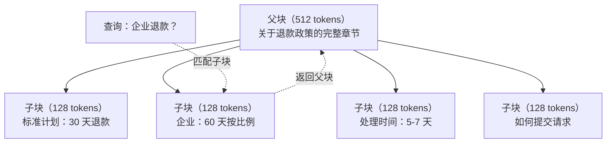
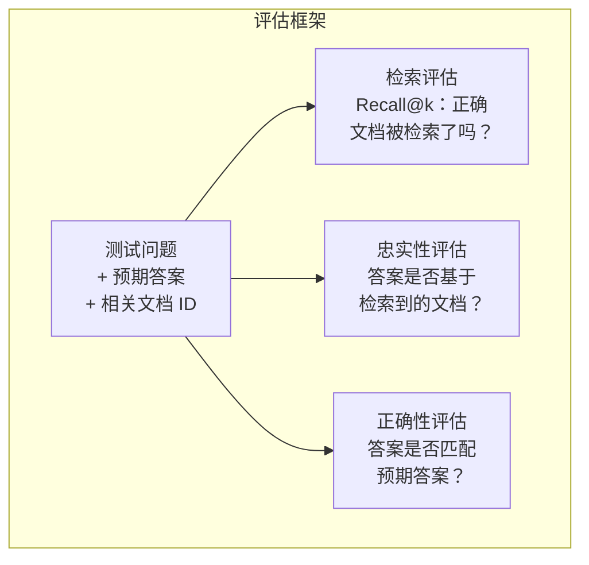

# 高级 RAG（分块、重排序、混合搜索）

> 基础 RAG 检索 top-k 最相似的块。这对简单问题有效。当涉及多跳推理、模糊查询和大规模语料时，它就会崩溃。高级 RAG 是"10 个文档上能演示"和"1000 万个文档上能工作"的区别。

**类型：** 构建
**语言：** Python
**前置条件：** Phase 11，Lesson 06（RAG）
**时间：** 约 90 分钟
**相关：** Phase 5 · 23（用于 RAG 的分块策略）涵盖所有六种分块算法——递归、语义、句子、父文档、后期分块、上下文检索——以及 Vectara/Anthropic 基准测试。本课在此基础上构建：混合搜索、重排序、查询转换。

## 学习目标

- 实现高级分块策略（语义、递归、父-子），保留文档结构和上下文
- 构建结合 BM25 关键词匹配与语义向量搜索的混合搜索管道，以及交叉编码重排序器
- 应用查询转换技术（HyDE、多查询、后退）来改善模糊或复杂问题的检索效果
- 诊断并修复常见 RAG 失败：检索到错误块、答案不在上下文中、多跳推理崩溃

## 问题

你在 Lesson 06 中构建了一个基础 RAG 管道。它在小型语料库的简单问题上效果很好。现在试试这些：

**模糊查询**："上个季度收入是多少？"语义搜索返回关于收入策略、收入预测和 CFO 对收入增长想法的块。这些在语义上都与"收入"一词相似。但没有包含实际数字的块。正确的块写着"2025 年 Q3 盈利 4720 万美元"，但使用的是"盈利"而不是"收入"。嵌入模型认为"收入策略"比"Q3 盈利 4720 万美元"更接近查询。

**多跳问题**："哪个团队的客户满意度评分提升最高？"这需要找到每个团队的满意度评分，进行比较，并确定最大值。没有单个块包含答案。信息分散在各个团队报告中。

**大规模语料问题**：你有 200 万个块。正确答案在第 1,847,293 个块中。你的 top-5 检索拉取了第 14、89,201、1,200,000、44 和 901,333 个块。在嵌入空间中接近，但没有包含答案的块。在这个规模下，近似最近邻搜索引入了足够的误差，导致相关结果被推出 top-k。

基础 RAG 失败是因为向量相似性不等于相关性。一个块可能在语义上与查询相似，但对回答它没有帮助。高级 RAG 用四种技术解决这个问题：混合搜索（添加关键词匹配）、重排序（更仔细地对候选进行评分）、查询转换（搜索前修正查询）和更好的分块（在正确的粒度上检索）。

## 概念

### 混合搜索：语义 + 关键词

语义搜索（向量相似性）擅长理解含义。"如何取消订阅？"与"终止计划的步骤"匹配，即使它们没有共同词汇。但它会错过精确匹配。"错误代码 E-4021"可能不会匹配包含"E-4021"的块，如果嵌入模型将其视为噪声。

关键词搜索（BM25）则相反。它擅长精确匹配。"E-4021"完美匹配。但"取消我的订阅"如果文档说"终止您的计划"则返回零结果。

混合搜索同时运行两者，然后合并结果。

**BM25**（Best Matching 25）是标准的关键词搜索算法。自 1990 年代以来，它一直是搜索引擎的支柱。公式：

```
BM25(q, d) = 对 t 在 q 中的每个项求和：
    IDF(t) * (tf(t,d) * (k1 + 1)) / (tf(t,d) + k1 * (1 - b + b * |d| / avgdl))
```

其中 tf(t,d) 是 t 在文档 d 中的词频，IDF(t) 是逆文档频率，|d| 是文档长度，avgdl 是平均文档长度，k1 控制词频饱和度（默认 1.2），b 控制长度归一化（默认 0.75）。

简单来说：BM25 当文档包含查询词（尤其是稀有词）时给文档更高评分，但对重复词有递减回报。一个包含"收入"50 次的文档不会比只出现一次的文档相关 50 倍。

### 倒数排名融合（RRF）

你有两个排名列表：一个来自向量搜索，一个来自 BM25。如何合并它们？倒数排名融合是标准方法。

```
RRF_score(d) = 对每个排名 R 求和：
    1 / (k + rank_R(d))
```

其中 k 是一个常数（通常为 60），用于防止排名靠前的结果主导。

在向量搜索中排名第 1、BM25 中排名第 5 的文档得：1/(60+1) + 1/(60+5) = 0.0164 + 0.0154 = 0.0318

在向量搜索中排名第 3、BM25 中排名第 2 的文档得：1/(60+3) + 1/(60+2) = 0.0159 + 0.0161 = 0.0320

RRF 自然平衡两个信号。在两个列表中都排名靠前的文档得分最高。在一个列表中排名第 1 但在另一个列表中缺失的文档得到中等分数。这是稳健的，因为它使用排名而非原始分数，因此两个系统之间的分数分布差异无关紧要。

### 重排序

检索（无论是向量、关键词还是混合）速度快但精度低。它使用双编码器：查询和每个文档被独立嵌入，然后比较。嵌入被计算一次并缓存。这可以扩展到数百万个文档。

重排序使用交叉编码器：查询和候选文档被一起输入模型，模型输出一个相关性评分。模型同时查看两个文本，可以捕获它们之间的细粒度交互。交叉编码器可以理解"Q3 盈利是多少？"与包含"4720 万美元在 Q3"的块高度相关，即使双编码器错过了这个联系。

权衡：交叉编码器比双编码器慢 100-1000 倍，因为它们共同处理查询-文档对。你无法为数百万个文档预计算交叉编码器评分。解决方案：从混合搜索中检索更大的候选集（top-50），然后用交叉编码器重排序得到最终的 top-5。


常用重排序模型（2026 年阵容）：
- Cohere Rerank 3.5：托管 API，多语言，混合语料上召回率提升最佳
- Voyage rerank-2.5：托管 API，托管选项中延迟最低
- Jina-Reranker-v2 Multilingual：开源权重，100+ 语言
- bge-reranker-v2-m3：开源权重，强基线
- cross-encoder/ms-marco-MiniLM-L-6-v2：开源权重，CPU 运行用于原型设计
- ColBERTv2 / Jina-ColBERT-v2：后期交互多向量重排序器——评分时为 O(tokens) 而非 O(docs)

### 查询转换

有时问题不在检索而在查询本身。"关于新政策变化的那件事是什么？"是一个很差的搜索查询。它不包含具体术语。嵌入是模糊的。任何检索系统都无法从中找到正确的文档。

**查询重写**：将用户的查询重新表述为更好的搜索查询。LLM 可以做到这一点：

```
用户："关于新政策变化的那件事是什么？"
重写后："最近的政策变化和更新"
```

**HyDE（假设性文档嵌入）**：不直接用查询搜索，而是生成一个假设答案，嵌入那个答案，然后搜索相似的真实文档。

```
查询："企业退款政策是什么？"
假设答案："企业客户有资格在购买后 60 天内获得全额退款。
退款按剩余订阅期按比例计算，并在 5-7 个工作日内处理。"
```

将假设答案嵌入并搜索与之相似的真实文档。直觉：假设答案在嵌入空间中比原始问题更接近真实答案。问题和答案有不同的语言结构。通过生成假设答案，你在嵌入空间中架起了"问题空间"和"答案空间"之间的桥梁。

HyDE 在检索前增加一个 LLM 调用。这会使延迟增加 500-2000ms。当原始查询的检索质量较差时，这是值得的。

### 父-子分块

标准分块强制权衡：小块精确检索，大块充足上下文。父-子分块消除了这种权衡。

索引小块（128 tokens）用于检索。当一个小块被检索到时，返回其父块（512 tokens）用于提示。小块精确匹配查询。父块为 LLM 生成好答案提供足够的上下文。



查询"企业退款？"精确匹配子块 C2。但提示接收完整的父块 P，包括关于处理时间和提交流程的周围上下文。

### 元数据过滤

在运行向量搜索之前，按元数据过滤语料：日期、来源、类别、作者、语言。这减少搜索空间并防止无关结果。

"上个月安全政策有什么变化？"应该只搜索安全类别中最近 30 天的文档。如果没有元数据过滤，你搜索整个语料库，可能会检索到一个 2 年前的安全文档，而它恰好在语义上相似。

生产 RAG 系统将元数据与每个块一起存储：源文档、创建日期、类别、作者、版本。向量数据库支持在相似性搜索前按元数据进行预过滤，这在规模上对性能至关重要。

### 评估

你构建了一个 RAG 系统。如何知道它是否有效？三个指标：

**检索相关性（Recall@k）**：对于一组带有已知相关文档的测试问题，相关文档出现在 top-k 结果中的百分比是多少？如果问题的答案在第 47 个块中，第 47 个块是否出现在 top-5 中？

**忠实性**：生成的答案是否基于检索到的文档？如果检索到的块说"60 天退款窗口"，而模型说"90 天退款窗口"，那就是忠实性失败。尽管有正确的上下文，模型还是产生了幻觉。

**答案正确性**：生成的答案是否与预期答案匹配？这是端到端指标。它结合了检索质量和生成质量。

一个简单的忠实性检查：取生成答案中的每个声明，验证它是否出现在检索到的块中（实质上）。如果答案包含任何检索块中没有的事实，可能是幻觉。



## 构建

### 步骤 1：BM25 实现

```python
import math
from collections import Counter

class BM25:
    def __init__(self, k1=1.2, b=0.75):
        self.k1 = k1
        self.b = b
        self.docs = []
        self.doc_lengths = []
        self.avg_dl = 0
        self.doc_freqs = {}
        self.n_docs = 0

    def index(self, documents):
        self.docs = documents
        self.n_docs = len(documents)
        self.doc_lengths = []
        self.doc_freqs = {}

        for doc in documents:
            words = doc.lower().split()
            self.doc_lengths.append(len(words))
            unique_words = set(words)
            for word in unique_words:
                self.doc_freqs[word] = self.doc_freqs.get(word, 0) + 1

        self.avg_dl = sum(self.doc_lengths) / self.n_docs if self.n_docs else 1

    def score(self, query, doc_idx):
        query_words = query.lower().split()
        doc_words = self.docs[doc_idx].lower().split()
        doc_len = self.doc_lengths[doc_idx]
        word_counts = Counter(doc_words)
        score = 0.0

        for term in query_words:
            if term not in word_counts:
                continue
            tf = word_counts[term]
            df = self.doc_freqs.get(term, 0)
            idf = math.log((self.n_docs - df + 0.5) / (df + 0.5) + 1)
            numerator = tf * (self.k1 + 1)
            denominator = tf + self.k1 * (1 - self.b + self.b * doc_len / self.avg_dl)
            score += idf * numerator / denominator

        return score

    def search(self, query, top_k=10):
        scores = [(i, self.score(query, i)) for i in range(self.n_docs)]
        scores.sort(key=lambda x: x[1], reverse=True)
        return scores[:top_k]
```

### 步骤 2：倒数排名融合

```python
def reciprocal_rank_fusion(ranked_lists, k=60):
    scores = {}
    for ranked_list in ranked_lists:
        for rank, (doc_id, _) in enumerate(ranked_list):
            if doc_id not in scores:
                scores[doc_id] = 0.0
            scores[doc_id] += 1.0 / (k + rank + 1)
    fused = sorted(scores.items(), key=lambda x: x[1], reverse=True)
    return fused
```

### 步骤 3：混合搜索管道

```python
def hybrid_search(query, chunks, vector_embeddings, vocab, idf, bm25_index, top_k=5, fusion_k=60):
    query_emb = tfidf_embed(query, vocab, idf)
    vector_results = search(query_emb, vector_embeddings, top_k=top_k * 3)
    bm25_results = bm25_index.search(query, top_k=top_k * 3)
    fused = reciprocal_rank_fusion([vector_results, bm25_results], k=fusion_k)
    return fused[:top_k]
```

### 步骤 4：简单重排序器

在生产中，你会使用交叉编码器模型。这里我们构建一个使用词重叠、词重要性和短语匹配对查询-文档相关性评分的重排序器。

```python
def rerank(query, candidates, chunks):
    query_words = set(query.lower().split())
    stop_words = {"the", "a", "an", "is", "are", "was", "were", "what", "how",
                  "why", "when", "where", "do", "does", "for", "of", "in",
                  "to", "and", "or", "on", "at", "by", "it", "its", "this",
                  "that", "with", "from", "be", "has", "have", "had", "not", "but"}
    query_terms = query_words - stop_words

    scored = []
    for doc_id, initial_score in candidates:
        chunk = chunks[doc_id].lower()
        chunk_words = set(chunk.split())

        term_overlap = len(query_terms & chunk_words)

        query_bigrams = set()
        q_list = [w for w in query.lower().split() if w not in stop_words]
        for i in range(len(q_list) - 1):
            query_bigrams.add(q_list[i] + " " + q_list[i + 1])
        bigram_matches = sum(1 for bg in query_bigrams if bg in chunk)

        position_boost = 0
        for term in query_terms:
            pos = chunk.find(term)
            if pos != -1 and pos < len(chunk) // 3:
                position_boost += 0.5

        rerank_score = (
            term_overlap * 1.0
            + bigram_matches * 2.0
            + position_boost
            + initial_score * 5.0
        )
        scored.append((doc_id, rerank_score))

    scored.sort(key=lambda x: x[1], reverse=True)
    return scored
```

### 步骤 5：HyDE（假设性文档嵌入）

```python
def hyde_generate_hypothesis(query):
    templates = {
        "what": "'{query}'的答案如下：根据我们的文档，{topic}涉及定义流程如何运作的特定政策和程序。",
        "how": "关于'{query}'：该流程涉及几个步骤。首先，你需要发起请求。然后，系统根据定义的规则处理它。",
        "default": "关于'{query}'：我们的记录表明与此主题相关的具体细节和政策提供了全面的答案。"
    }
    query_lower = query.lower()
    if query_lower.startswith("what"):
        template = templates["what"]
    elif query_lower.startswith("how"):
        template = templates["how"]
    else:
        template = templates["default"]

    topic_words = [w for w in query.lower().split()
                   if w not in {"what", "is", "the", "how", "do", "does", "a", "an",
                                "for", "of", "to", "in", "on", "at", "by", "and", "or"}]
    topic = " ".join(topic_words) if topic_words else "this topic"

    return template.format(query=query, topic=topic)


def hyde_search(query, chunks, vector_embeddings, vocab, idf, top_k=5):
    hypothesis = hyde_generate_hypothesis(query)
    hypothesis_emb = tfidf_embed(hypothesis, vocab, idf)
    results = search(hypothesis_emb, vector_embeddings, top_k)
    return results, hypothesis
```

### 步骤 6：父-子分块

```python
def create_parent_child_chunks(text, parent_size=200, child_size=50):
    words = text.split()
    parents = []
    children = []
    child_to_parent = {}

    parent_idx = 0
    start = 0
    while start < len(words):
        parent_end = min(start + parent_size, len(words))
        parent_text = " ".join(words[start:parent_end])
        parents.append(parent_text)

        child_start = start
        while child_start < parent_end:
            child_end = min(child_start + child_size, parent_end)
            child_text = " ".join(words[child_start:child_end])
            child_idx = len(children)
            children.append(child_text)
            child_to_parent[child_idx] = parent_idx
            child_start += child_size

        parent_idx += 1
        start += parent_size

    return parents, children, child_to_parent
```

### 步骤 7：忠实性评估

```python
def evaluate_faithfulness(answer, retrieved_chunks):
    answer_sentences = [s.strip() for s in answer.split(".") if len(s.strip()) > 10]
    if not answer_sentences:
        return 1.0, []

    grounded = 0
    ungrounded = []
    context = " ".join(retrieved_chunks).lower()

    for sentence in answer_sentences:
        words = set(sentence.lower().split())
        stop_words = {"the", "a", "an", "is", "are", "was", "were", "and", "or",
                      "to", "of", "in", "for", "on", "at", "by", "it", "this", "that"}
        content_words = words - stop_words
        if not content_words:
            grounded += 1
            continue

        matched = sum(1 for w in content_words if w in context)
        ratio = matched / len(content_words) if content_words else 0

        if ratio >= 0.5:
            grounded += 1
        else:
            ungrounded.append(sentence)

    score = grounded / len(answer_sentences) if answer_sentences else 1.0
    return score, ungrounded


def evaluate_retrieval_recall(queries_with_relevant, retrieval_fn, k=5):
    total_recall = 0.0
    results = []

    for query, relevant_indices in queries_with_relevant:
        retrieved = retrieval_fn(query, k)
        retrieved_indices = set(idx for idx, _ in retrieved)
        relevant_set = set(relevant_indices)
        hits = len(retrieved_indices & relevant_set)
        recall = hits / len(relevant_set) if relevant_set else 1.0
        total_recall += recall
        results.append({
            "query": query,
            "recall": recall,
            "hits": hits,
            "total_relevant": len(relevant_set)
        })

    avg_recall = total_recall / len(queries_with_relevant) if queries_with_relevant else 0
    return avg_recall, results
```

## 使用

使用真正的交叉编码器进行重排序：

```python
from sentence_transformers import CrossEncoder

reranker = CrossEncoder("cross-encoder/ms-marco-MiniLM-L-6-v2")

def rerank_with_cross_encoder(query, candidates, chunks, top_k=5):
    pairs = [(query, chunks[doc_id]) for doc_id, _ in candidates]
    scores = reranker.predict(pairs)
    scored = list(zip([doc_id for doc_id, _ in candidates], scores))
    scored.sort(key=lambda x: x[1], reverse=True)
    return scored[:top_k]
```

使用 Cohere 的托管重排序器：

```python
import cohere

co = cohere.Client()

def rerank_with_cohere(query, candidates, chunks, top_k=5):
    docs = [chunks[doc_id] for doc_id, _ in candidates]
    response = co.rerank(
        model="rerank-english-v3.0",
        query=query,
        documents=docs,
        top_n=top_k
    )
    return [(candidates[r.index][0], r.relevance_score) for r in response.results]
```

使用真正的 LLM 的 HyDE：

```python
import anthropic

client = anthropic.Anthropic()

def hyde_with_llm(query):
    response = client.messages.create(
        model="claude-sonnet-4-20250514",
        max_tokens=256,
        messages=[{
            "role": "user",
            "content": f"写一个简短段落，作为这个问题的好答案。不要说你不知道。就写出答案的样子。\n\n问题：{query}"
        }]
    )
    return response.content[0].text
```

使用 Weaviate 的生产级混合搜索：

```python
import weaviate

client = weaviate.connect_to_local()

collection = client.collections.get("Documents")
response = collection.query.hybrid(
    query="enterprise refund policy",
    alpha=0.5,
    limit=10
)
```

alpha 参数控制平衡：0.0 = 纯关键词（BM25），1.0 = 纯向量，0.5 = 等权重。大多数生产系统使用 0.3 到 0.7 之间的 alpha。

## 交付

本课产出：
- `outputs/prompt-advanced-rag-debugger.md` —— 用于诊断和修复 RAG 质量问题的提示
- `outputs/skill-advanced-rag.md` —— 用于构建具有混合搜索和重排序的生产级 RAG 的技能

## 练习

1. 在示例文档上比较 BM25 vs 向量搜索 vs 混合搜索。对于每个测试查询，记录哪种方法在第 1 位返回最相关的块。混合搜索至少应在 5 个中的 3 个上获胜。

2. 实现元数据过滤器。为每个文档添加一个"category"字段（security、billing、api、product）。在运行向量搜索之前，将块过滤到仅相关的类别。使用"使用什么加密？"测试，验证它只搜索 security 类别的块。

3. 使用 Lesson 06 中的简单生成函数构建完整的 HyDE 管道。在所有 5 个测试查询上比较直接查询搜索和 HyDE 搜索的检索质量（top-3 相关性）。HyDE 应改善模糊查询的结果。

4. 在示例文档上实现父-子分块策略。使用 child_size=30 和 parent_size=100。用子块搜索但在提示中返回父块。将生成的答案与 chunk_size=50 的标准分块进行比较。

5. 创建评估数据集：10 个带有已知答案块的问题。测量 (a) 仅向量搜索、(b) 仅 BM25、(c) 混合搜索、(d) 混合 + 重排序的 Recall@3、Recall@5 和 Recall@10。绘制结果并识别重排序最有帮助的地方。

## 关键术语

| 术语 | 人们怎么说 | 实际含义 |
|------|----------------|----------------------|
| BM25 | "关键词搜索" | 一种概率排名算法，通过词频、逆文档频率和文档长度归一化对文档评分 |
| 混合搜索 | "两全其美" | 同时运行语义（向量）和关键词（BM25）搜索，然后用排名融合合并结果 |
| 倒数排名融合 | "合并排名列表" | 通过对每个文档在所有列表中的 1/(k + rank) 求和来组合多个排名列表 |
| 重排序 | "第二遍评分" | 使用更昂贵的交叉编码器模型对初始检索的候选集重新评分 |
| 交叉编码器 | "联合查询-文档模型" | 将查询和文档作为单一输入的模型，产生相关性评分；比双编码器更准确，但对完整语料搜索太慢 |
| 双编码器 | "独立嵌入模型" | 独立嵌入查询和文档的模型；因为嵌入是预计算的所以速度快，但比交叉编码器精度低 |
| HyDE | "用假答案搜索" | 生成查询的假设答案，嵌入它，然后搜索与之相似的真实文档 |
| 父-子分块 | "小搜索，大上下文" | 索引小块以进行精确检索，但返回较大的父块以提供足够的上下文 |
| 元数据过滤 | "搜索前缩小范围" | 在运行向量搜索之前按属性（日期、来源、类别）过滤文档以减少搜索空间 |
| 忠实性 | "它是否保持基于上下文" | 生成的答案是否被检索到的文档支持，而不是从模型的训练数据中幻觉出来的 |

## 延伸阅读

- Robertson & Zaragoza，《概率相关框架：BM25 及 Beyond》（2009）—— BM25 的权威参考，解释了该公式背后的概率基础
- Cormack 等，《倒数排名融合优于 Condorcet 和个体排名学习方法》（2009）—— 原始 RRF 论文，显示它比更复杂的融合方法更好
- Gao 等，《精确零样本密集检索无需相关标签》（2022）—— HyDE 论文，证明假设性文档嵌入可以在没有任何训练数据的情况下改善检索
- Nogueira & Cho，《使用 BERT 进行段落重排序》（2019）—— 展示在 BM25 之上使用交叉编码器重排序显著提高检索质量
- [Khattab 等，《DSPy：将声明性语言模型调用编译成自我改进管道》（2023）](https://arxiv.org/abs/2310.03714) —— 将提示构建和权重选择视为检索管道上的优化问题；阅读"程序化 LLMs"而非"提示化 LLMs"。
- [Edge 等，《从局部到全局：查询聚焦摘要的图 RAG 方法》（Microsoft Research 2024）](https://arxiv.org/abs/2404.16130) —— GraphRAG 论文：实体-关系提取 + Leiden 社区检测用于查询聚焦摘要；全局 vs 局部检索的区别。
- [Asai 等，《Self-RAG：通过自我反思学习检索、生成和批判》（ICLR 2024）](https://arxiv.org/abs/2310.11511) —— 带反思令牌的自我评估 RAG；超越静态检索-然后-生成的智能体前沿。
- [LangChain 查询构建博客](https://blog.langchain.dev/query-construction/) —— 如何将自然语言查询翻译成结构化数据库查询（Text-to-SQL、Cypher）作为预检索步骤。