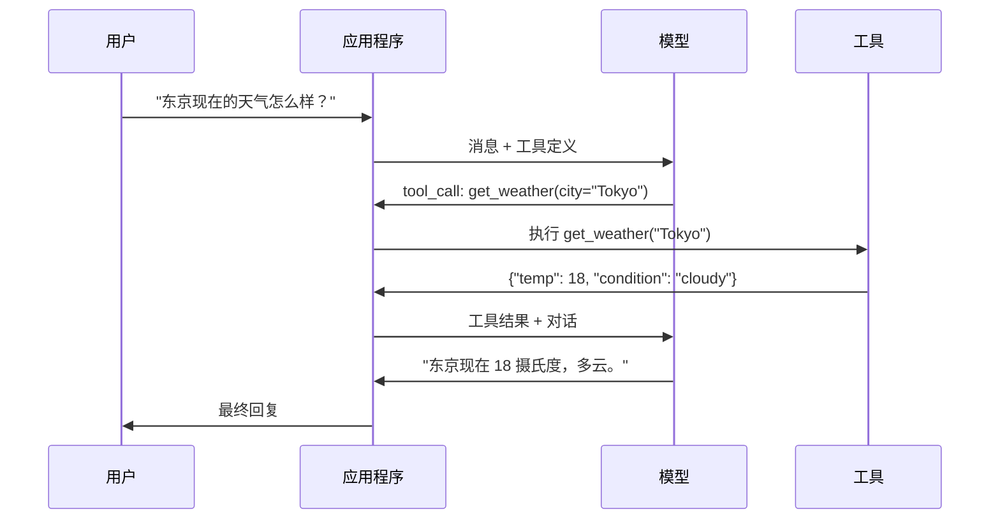

# 函数调用与工具使用

> LLM 什么也做不了。它们只能生成文本。这就是全部能力。它们无法查看天气、查询数据库、发送电子邮件、运行代码或读取文件。你见过的每一个"AI 智能体"都是一个 LLM 生成 JSON 来指定要调用哪个函数——然后由你的代码实际执行它。模型是大脑。工具是双手。函数调用是连接它们的神经系统。

**类型：** 构建
**语言：** Python
**前置条件：** 第十一阶段 第三课（结构化输出）
**时间：** 约 75 分钟
**相关内容：** 第十一阶段 · 14（模型上下文协议）——当一个工具在多个主机间共享时，应从内联函数调用升级为 MCP 服务器。本课涵盖内联情况；MCP 涵盖协议层情况。

## 学习目标

- 实现函数调用循环：定义工具模式、解析模型的工具调用 JSON、执行函数并返回结果
- 设计具有清晰描述和类型化参数的工具模式，使模型能够可靠地调用
- 构建多轮智能体循环，将多个函数调用链接起来以回答复杂查询
- 处理函数调用边缘情况：并行工具调用、错误传播以及防止无限工具循环

## 问题

你构建了一个聊天机器人。用户问："东京现在的天气怎么样？"

模型回答："我无法访问实时天气数据，但根据季节，东京可能大约 15 摄氏度……"

这是一种穿着免责声明外衣的幻觉。模型不知道天气。它永远不会知道。天气每小时都在变化。模型的训练数据是几个月前的。

正确答案需要调用 OpenWeatherMap API，获取当前温度，并返回真实数字。模型无法调用 API。你的代码可以。缺失的部分：一种结构化协议，让模型可以说"我需要用这些参数调用天气 API"，让你的代码执行它并将结果反馈回去。

这就是函数调用。模型输出结构化 JSON，描述要调用哪个函数以及使用什么参数。你的应用程序执行该函数。结果返回到对话中。模型使用结果来生成最终答案。

没有函数调用，LLM 就是百科全书。有了它，它们就变成了智能体。

## 概念

### 函数调用循环

每个工具使用交互都遵循相同的 5 步循环。



步骤 1：用户发送消息。步骤 2：模型接收消息以及工具定义（描述可用函数的 JSON Schema）。步骤 3：模型不是用文本回复，而是输出一个工具调用——一个包含函数名和参数的结构化 JSON 对象。步骤 4：你的代码执行函数并捕获结果。步骤 5：结果返回给模型，模型现在有真实数据来生成最终答案。

模型从不执行任何操作。它只决定调用什么以及使用什么参数。你的代码是执行者。

### 工具定义：JSON Schema 契约

每个工具由一个 JSON Schema 定义，该模式告诉模型函数的作用、接受哪些参数以及这些参数的类型。

```json
{
  "type": "function",
  "function": {
    "name": "get_weather",
    "description": "获取城市的当前天气。返回摄氏温度和天气状况。",
    "parameters": {
      "type": "object",
      "properties": {
        "city": {
          "type": "string",
          "description": "城市名称，例如 'Tokyo' 或 'San Francisco'"
        },
        "units": {
          "type": "string",
          "enum": ["celsius", "fahrenheit"],
          "description": "温度单位"
        }
      },
      "required": ["city"]
    }
  }
}
```

`description` 字段至关重要。模型读取它们来决定何时以及如何使用工具。像"获取天气"这样模糊的描述会产生比"获取城市的当前天气。返回摄氏温度和天气状况。"更差工具选择。描述是用于工具选择的提示。

### 提供商对比

每个主要提供商都支持函数调用，但 API 表面有所不同。

| 提供商 | API 参数 | 工具调用格式 | 并行调用 | 强制调用 |
|--------|--------------|-----------------|---------------|----------------|
| OpenAI（GPT-5、o4） | `tools` | `tool_calls[].function` | 是（每轮多个） | `tool_choice="required"` |
| Anthropic（Claude 4.6/4.7） | `tools` | `content[].type="tool_use"` | 是（多个块） | `tool_choice={"type":"any"}` |
| Google（Gemini 3） | `function_declarations` | `functionCall` | 是 | `function_calling_config` |
| 开源模型（Llama 4、Qwen3、DeepSeek-V3） | Llama 4 原生 `tools`；其他使用 Hermes 或 ChatML | 混合 | 取决于模型 | 基于提示或 `tool_choice`（如果支持） |

到 2026 年，三个闭源提供商已经收敛到几乎相同的基于 JSON Schema 的格式。Llama 4 附带一个与 OpenAI 格式匹配的原生 `tools` 字段。开源微调模型仍然有所不同——Hermes 格式（NousResearch）是第三方微调模型中最常见的格式。对于跨主机共享的工具，优先使用 MCP（第十一阶段 · 14）而不是内联函数调用——服务器对所有主机都是相同的。

### 工具选择：自动、强制、特定

你控制模型何时使用工具。

**自动**（默认）：模型决定是调用工具还是直接回复。"2+2 是多少？"——直接回复。"天气怎么样？"——调用工具。

**强制**：模型必须至少调用一个工具。当你知道用户意图需要工具时使用此选项。防止模型猜测而不是查找真实数据。

**特定函数**：强制模型调用特定函数。`tool_choice={"type":"function", "function": {"name": "get_weather"}}` 保证天气工具被调用，无论查询是什么。当上游逻辑已经确定需要哪个工具时，将其用于路由。

### 并行函数调用

GPT-4o 和 Claude 可以在单轮中调用多个函数。用户问："东京和纽约的天气怎么样？"模型同时输出两个工具调用：

```json
[
  {"name": "get_weather", "arguments": {"city": "Tokyo"}},
  {"name": "get_weather", "arguments": {"city": "New York"}}
]
```

你的代码同时执行两者（理想情况下并发），返回两个结果，模型综合成单一回复。这将往返次数从 2 次减少到 1 次。对于每个查询有 5-10 个工具调用的智能体，并行调用可将延迟降低 60-80%。

### 结构化输出与函数调用

第三课涵盖了结构化输出。函数调用使用相同的 JSON Schema 机制，但用于不同目的。

**结构化输出**：强制模型以特定形状生成数据。输出是最终产品。示例：从文本中提取产品信息为 `{name, price, in_stock}`。

**函数调用**：模型声明执行操作的意图。输出是一个中间步骤。示例：`get_weather(city="Tokyo")`——模型正在请求一个操作，而不是生成最终答案。

当你想提取数据时使用结构化输出。当你想让模型与外部系统交互时使用函数调用。

### 安全：不可协商的规则

函数调用是你可以赋予 LLM 的最危险的能力。模型选择要执行的内容。如果你的工具集包含数据库查询，模型会构造查询。如果它包含 shell 命令，模型会编写它们。

**规则 1：永远不要将模型生成的 SQL 直接传递到数据库。** 模型可以并且会生成 DROP TABLE、UNION 注入或返回每一行的查询。始终参数化。始终验证。始终使用操作白名单。

**规则 2：白名单函数。** 模型只能调用你明确定义的函数。永远不要构建通用的"按名称执行任何函数"的工具。如果你有 50 个内部函数，只暴露用户需要的 5 个。

**规则 3：验证参数。** 模型可能会传递城市名为 `"; DROP TABLE users; --"`。在执行前验证每个参数是否符合预期类型、范围和格式。

**规则 4：净化工具结果。** 如果工具返回敏感数据（API 密钥、PII、内部错误），在发送回模型之前过滤它。模型会原封不动地将工具结果包含在其回复中。

**规则 5：限制工具调用速率。** 循环中的模型可以调用工具数百次。设置最大值（每个对话 10-20 次调用是合理的）。打破无限循环。

### 错误处理

工具会失败。API 会超时。数据库会宕机。文件不存在。模型需要知道工具何时失败以及为什么。

将错误作为结构化工具结果返回，而不是异常：

```json
{
  "error": true,
  "message": "未找到城市 'Toky'。你的意思是 'Tokyo' 吗？",
  "code": "CITY_NOT_FOUND"
}
```

模型读取此消息，调整其参数，然后重试。模型擅长从结构化错误消息中自我纠正。它们不擅长从空回复或通用的"出了点问题"错误中恢复。

### MCP：模型上下文协议

MCP 是 Anthropic 的开放工具互操作性标准。不是每个应用程序定义自己的工具，而是 MCP 提供了一个通用协议：工具由 MCP 服务器提供，由 MCP 客户端（如 Claude Code、Cursor 或你的应用程序）消费。

一个 MCP 服务器可以向任何兼容的客户端公开工具。一个 Postgres MCP 服务器给予任何 MCP 兼容智能体数据库访问权限。一个 GitHub MCP 服务器给予任何智能体仓库访问权限。工具定义一次，到处使用。

MCP 之于函数调用就像 HTTP 之于网络。它标准化了传输层，使工具变得可移植。

## 构建它

### 步骤 1：定义工具注册表

构建一个存储工具定义及其实现的注册表。每个工具都有 JSON Schema 定义（模型看到的）和 Python 函数（你的代码执行的）。

```python
import json
import math
import time
import hashlib


TOOL_REGISTRY = {}


def register_tool(name, description, parameters, function):
    TOOL_REGISTRY[name] = {
        "definition": {
            "type": "function",
            "function": {
                "name": name,
                "description": description,
                "parameters": parameters,
            },
        },
        "function": function,
    }
```

### 步骤 2：实现 5 个工具

构建一个计算器、天气查询、网络搜索模拟器、文件读取器和代码运行器。

```python
def calculator(expression, precision=2):
    allowed = set("0123456789+-*/.() ")
    if not all(c in allowed for c in expression):
        return {"error": True, "message": f"表达式中存在无效字符: {expression}"}
    try:
        result = eval(expression, {"__builtins__": {}}, {"math": math})
        return {"result": round(float(result), precision), "expression": expression}
    except Exception as e:
        return {"error": True, "message": str(e)}


WEATHER_DB = {
    "tokyo": {"temp_c": 18, "condition": "cloudy", "humidity": 72, "wind_kph": 14},
    "new york": {"temp_c": 22, "condition": "sunny", "humidity": 45, "wind_kph": 8},
    "london": {"temp_c": 12, "condition": "rainy", "humidity": 88, "wind_kph": 22},
    "san francisco": {"temp_c": 16, "condition": "foggy", "humidity": 80, "wind_kph": 18},
    "sydney": {"temp_c": 25, "condition": "sunny", "humidity": 55, "wind_kph": 10},
}


def get_weather(city, units="celsius"):
    key = city.lower().strip()
    if key not in WEATHER_DB:
        suggestions = [c for c in WEATHER_DB if c.startswith(key[:3])]
        return {
            "error": True,
            "message": f"未找到城市 '{city}'。",
            "suggestions": suggestions,
            "code": "CITY_NOT_FOUND",
        }
    data = WEATHER_DB[key].copy()
    if units == "fahrenheit":
        data["temp_f"] = round(data["temp_c"] * 9 / 5 + 32, 1)
        del data["temp_c"]
    data["city"] = city
    return data


SEARCH_DB = {
    "python function calling": [
        {"title": "OpenAI 函数调用指南", "url": "https://platform.openai.com/docs/guides/function-calling", "snippet": "了解如何将 LLM 连接到外部工具。"},
        {"title": "Anthropic 工具使用", "url": "https://docs.anthropic.com/en/docs/tool-use", "snippet": "Claude 可以与外部工具和 API 交互。"},
    ],
    "MCP protocol": [
        {"title": "模型上下文协议", "url": "https://modelcontextprotocol.io", "snippet": "将 AI 模型连接到数据源的开放标准。"},
    ],
    "weather API": [
        {"title": "OpenWeatherMap API", "url": "https://openweathermap.org/api", "snippet": "免费天气 API，提供当前、预报和历史数据。"},
    ],
}


def web_search(query, max_results=3):
    key = query.lower().strip()
    for db_key, results in SEARCH_DB.items():
        if db_key in key or key in db_key:
            return {"query": query, "results": results[:max_results], "total": len(results)}
    return {"query": query, "results": [], "total": 0}


FILE_SYSTEM = {
    "data/config.json": '{"model": "gpt-4o", "temperature": 0.7, "max_tokens": 4096}',
    "data/users.csv": "name,email,role\nAlice,alice@example.com,admin\nBob,bob@example.com,user",
    "README.md": "# 我的项目\n一个从零开始构建的工具使用智能体。",
}


def read_file(path):
    if ".." in path or path.startswith("/"):
        return {"error": True, "message": "不允许路径遍历。", "code": "FORBIDDEN"}
    if path not in FILE_SYSTEM:
        available = list(FILE_SYSTEM.keys())
        return {"error": True, "message": f"未找到文件 '{path}'。", "available_files": available, "code": "NOT_FOUND"}
    content = FILE_SYSTEM[path]
    return {"path": path, "content": content, "size_bytes": len(content), "lines": content.count("\n") + 1}


def run_code(code, language="python"):
    if language != "python":
        return {"error": True, "message": f"不支持的语言 '{language}'。只有 'python' 可用。"}
    forbidden = ["import os", "import sys", "import subprocess", "exec(", "eval(", "__import__", "open("]
    for pattern in forbidden:
        if pattern in code:
            return {"error": True, "message": f"禁止的操作: {pattern}", "code": "SECURITY_VIOLATION"}
    try:
        local_vars = {}
        exec(code, {"__builtins__": {"print": print, "range": range, "len": len, "str": str, "int": int, "float": float, "list": list, "dict": dict, "sum": sum, "min": min, "max": max, "abs": abs, "round": round, "sorted": sorted, "enumerate": enumerate, "zip": zip, "map": map, "filter": filter, "math": math}}, local_vars)
        result = local_vars.get("result", None)
        return {"success": True, "result": result, "variables": {k: str(v) for k, v in local_vars.items() if not k.startswith("_")}}
    except Exception as e:
        return {"error": True, "message": f"{type(e).__name__}: {e}"}
```

### 步骤 3：注册所有工具

```python
def register_all_tools():
    register_tool(
        "calculator", "计算数学表达式。支持 +、-、*、/、括号和小数。返回数字结果。",
        {"type": "object", "properties": {"expression": {"type": "string", "description": "数学表达式，例如 '(10 + 5) * 3'"}, "precision": {"type": "integer", "description": "结果的小数位数", "default": 2}}, "required": ["expression"]},
        calculator,
    )
    register_tool(
        "get_weather", "获取城市的当前天气。返回温度、天气状况、湿度和风速。",
        {"type": "object", "properties": {"city": {"type": "string", "description": "城市名称，例如 'Tokyo' 或 'San Francisco'"}, "units": {"type": "string", "enum": ["celsius", "fahrenheit"], "description": "温度单位，默认为摄氏温度"}}, "required": ["city"]},
        get_weather,
    )
    register_tool(
        "web_search", "在网上搜索信息。返回包含标题、URL 和摘要的结果列表。",
        {"type": "object", "properties": {"query": {"type": "string", "description": "搜索查询"}, "max_results": {"type": "integer", "description": "返回的最大结果数", "default": 3}}, "required": ["query"]},
        web_search,
    )
    register_tool(
        "read_file", "读取文件内容。返回文件内容、大小和行数。",
        {"type": "object", "properties": {"path": {"type": "string", "description": "相对文件路径，例如 'data/config.json'"}}, "required": ["path"]},
        read_file,
    )
    register_tool(
        "run_code", "在沙盒环境中执行 Python 代码。设置 'result' 变量以返回输出。",
        {"type": "object", "properties": {"code": {"type": "string", "description": "要执行的 Python 代码"}, "language": {"type": "string", "enum": ["python"], "description": "编程语言"}}, "required": ["code"]},
        run_code,
    )
```

### 步骤 4：构建函数调用循环

这是核心引擎。它模拟模型决定调用哪个工具，执行工具，并将结果反馈。

```python
def simulate_model_decision(user_message, tools, conversation_history):
    msg = user_message.lower()

    if any(word in msg for word in ["weather", "temperature", "forecast"]):
        cities = []
        for city in WEATHER_DB:
            if city in msg:
                cities.append(city)
        if not cities:
            for word in msg.split():
                if word.capitalize() in [c.title() for c in WEATHER_DB]:
                    cities.append(word)
        if not cities:
            cities = ["tokyo"]
        calls = []
        for city in cities:
            calls.append({"name": "get_weather", "arguments": {"city": city.title()}})
        return calls

    if any(word in msg for word in ["calculate", "compute", "math", "what is", "how much"]):
        for token in msg.split():
            if any(c in token for c in "+-*/"):
                return [{"name": "calculator", "arguments": {"expression": token}}]
        if "+" in msg or "-" in msg or "*" in msg or "/" in msg:
            expr = "".join(c for c in msg if c in "0123456789+-*/.() ")
            if expr.strip():
                return [{"name": "calculator", "arguments": {"expression": expr.strip()}}]
        return [{"name": "calculator", "arguments": {"expression": "0"}}]

    if any(word in msg for word in ["search", "find", "look up", "google"]):
        query = msg.replace("search for", "").replace("look up", "").replace("find", "").strip()
        return [{"name": "web_search", "arguments": {"query": query}}]

    if any(word in msg for word in ["read", "file", "open", "cat", "show"]):
        for path in FILE_SYSTEM:
            if path.split("/")[-1].split(".")[0] in msg:
                return [{"name": "read_file", "arguments": {"path": path}}]
        return [{"name": "read_file", "arguments": {"path": "README.md"}}]

    if any(word in msg for word in ["run", "execute", "code", "python"]):
        return [{"name": "run_code", "arguments": {"code": "result = 'Hello from the sandbox!'", "language": "python"}}]

    return []


def execute_tool_call(tool_call):
    name = tool_call["name"]
    args = tool_call["arguments"]

    if name not in TOOL_REGISTRY:
        return {"error": True, "message": f"未知工具: {name}", "code": "UNKNOWN_TOOL"}

    tool = TOOL_REGISTRY[name]
    func = tool["function"]
    start = time.time()

    try:
        result = func(**args)
    except TypeError as e:
        result = {"error": True, "message": f"无效参数: {e}"}

    elapsed_ms = round((time.time() - start) * 1000, 2)
    return {"tool": name, "result": result, "execution_time_ms": elapsed_ms}


def run_function_calling_loop(user_message, max_iterations=5):
    conversation = [{"role": "user", "content": user_message}]
    tool_definitions = [t["definition"] for t in TOOL_REGISTRY.values()]
    all_tool_results = []

    for iteration in range(max_iterations):
        tool_calls = simulate_model_decision(user_message, tool_definitions, conversation)

        if not tool_calls:
            break

        results = []
        for call in tool_calls:
            result = execute_tool_call(call)
            results.append(result)

        conversation.append({"role": "assistant", "content": None, "tool_calls": tool_calls})

        for result in results:
            conversation.append({"role": "tool", "content": json.dumps(result["result"]), "tool_name": result["tool"]})

        all_tool_results.extend(results)
        break

    return {"conversation": conversation, "tool_results": all_tool_results, "iterations": iteration + 1 if tool_calls else 0}
```

### 步骤 5：参数验证

构建一个验证器，在执行前根据 JSON Schema 检查工具调用参数。

```python
def validate_tool_arguments(tool_name, arguments):
    if tool_name not in TOOL_REGISTRY:
        return [f"未知工具: {tool_name}"]

    schema = TOOL_REGISTRY[tool_name]["definition"]["function"]["parameters"]
    errors = []

    if not isinstance(arguments, dict):
        return [f"参数必须是对象，得到 {type(arguments).__name__}"]

    for required_field in schema.get("required", []):
        if required_field not in arguments:
            errors.append(f"缺少必需参数: {required_field}")

    properties = schema.get("properties", {})
    for arg_name, arg_value in arguments.items():
        if arg_name not in properties:
            errors.append(f"未知参数: {arg_name}")
            continue

        prop_schema = properties[arg_name]
        expected_type = prop_schema.get("type")

        type_checks = {"string": str, "integer": int, "number": (int, float), "boolean": bool, "array": list, "object": dict}
        if expected_type in type_checks:
            if not isinstance(arg_value, type_checks[expected_type]):
                errors.append(f"参数 '{arg_name}'：预期 {expected_type}，得到 {type(arg_value).__name__}")

        if "enum" in prop_schema and arg_value not in prop_schema["enum"]:
            errors.append(f"参数 '{arg_name}'：'{arg_value}' 不在 {prop_schema['enum']} 中")

    return errors
```

### 步骤 6：运行演示

```python
def run_demo():
    register_all_tools()

    print("=" * 60)
    print("  函数调用与工具使用演示")
    print("=" * 60)

    print("\n--- 已注册的工具 ---")
    for name, tool in TOOL_REGISTRY.items():
        desc = tool["definition"]["function"]["description"][:60]
        params = list(tool["definition"]["function"]["parameters"].get("properties", {}).keys())
        print(f"  {name}: {desc}...")
        print(f"    参数: {params}")

    print(f"\n--- 参数验证 ---")
    validation_tests = [
        ("get_weather", {"city": "Tokyo"}, "有效调用"),
        ("get_weather", {}, "缺少必需参数"),
        ("get_weather", {"city": "Tokyo", "units": "kelvin"}, "无效的枚举值"),
        ("calculator", {"expression": 123}, "错误类型（应为字符串的整数）"),
        ("unknown_tool", {"x": 1}, "未知工具"),
    ]
    for tool_name, args, label in validation_tests:
        errors = validate_tool_arguments(tool_name, args)
        status = "VALID" if not errors else f"错误: {errors}"
        print(f"  {label}: {status}")

    print(f"\n--- 工具执行 ---")
    direct_tests = [
        {"name": "calculator", "arguments": {"expression": "(10 + 5) * 3 / 2"}},
        {"name": "get_weather", "arguments": {"city": "Tokyo"}},
        {"name": "get_weather", "arguments": {"city": "Mars"}},
        {"name": "web_search", "arguments": {"query": "python function calling"}},
        {"name": "read_file", "arguments": {"path": "data/config.json"}},
        {"name": "read_file", "arguments": {"path": "../etc/passwd"}},
        {"name": "run_code", "arguments": {"code": "result = sum(range(1, 101))"}},
        {"name": "run_code", "arguments": {"code": "import os; os.system('rm -rf /')"}},
    ]
    for call in direct_tests:
        result = execute_tool_call(call)
        print(f"\n  {call['name']}({json.dumps(call['arguments'])})")
        print(f"    -> {json.dumps(result['result'], indent=None)[:100]}")
        print(f"    时间: {result['execution_time_ms']}ms")

    print(f"\n--- 完整函数调用循环 ---")
    test_queries = [
        "东京的天气怎么样？",
        "计算 (100 + 250) * 0.15",
        "搜索 MCP 协议",
        "读取配置文件",
        "运行一些 Python 代码",
        "讲个笑话",
    ]
    for query in test_queries:
        print(f"\n  用户: {query}")
        result = run_function_calling_loop(query)
        if result["tool_results"]:
            for tr in result["tool_results"]:
                print(f"    工具: {tr['tool']} ({tr['execution_time_ms']}ms)")
                print(f"    结果: {json.dumps(tr['result'], indent=None)[:90]}")
        else:
            print(f"    [未调用工具 -- 直接回复]")
        print(f"    迭代次数: {result['iterations']}")

    print(f"\n--- 并行工具调用 ---")
    multi_city_query = "东京和伦敦的天气怎么样？"
    print(f"  用户: {multi_city_query}")
    result = run_function_calling_loop(multi_city_query)
    print(f"  调用工具次数: {len(result['tool_results'])}")
    for tr in result["tool_results"]:
        city = tr["result"].get("city", "unknown")
        temp = tr["result"].get("temp_c", "N/A")
        print(f"    {city}: {temp}C, {tr['result'].get('condition', 'N/A')}")

    print(f"\n--- 安全检查 ---")
    security_tests = [
        ("read_file", {"path": "../../etc/passwd"}),
        ("run_code", {"code": "import subprocess; subprocess.run(['ls'])"}),
        ("calculator", {"expression": "__import__('os').system('ls')"}),
    ]
    for tool_name, args in security_tests:
        result = execute_tool_call({"name": tool_name, "arguments": args})
        blocked = result["result"].get("error", False)
        print(f"  {tool_name}({list(args.values())[0][:40]})：{'已阻止' if blocked else '已允许'}")
```

## 使用它

### OpenAI 函数调用

```python
# from openai import OpenAI
#
# client = OpenAI()
#
# tools = [{
#     "type": "function",
#     "function": {
#         "name": "get_weather",
#         "description": "获取城市的当前天气",
#         "parameters": {
#             "type": "object",
#             "properties": {
#                 "city": {"type": "string"},
#                 "units": {"type": "string", "enum": ["celsius", "fahrenheit"]}
#             },
#             "required": ["city"]
#         }
#     }
# }]
#
# response = client.chat.completions.create(
#     model="gpt-4o",
#     messages=[{"role": "user", "content": "东京的天气怎么样？"}],
#     tools=tools,
#     tool_choice="auto",
# )
#
# tool_call = response.choices[0].message.tool_calls[0]
# args = json.loads(tool_call.function.arguments)
# result = get_weather(**args)
#
# final = client.chat.completions.create(
#     model="gpt-4o",
#     messages=[
#         {"role": "user", "content": "东京的天气怎么样？"},
#         response.choices[0].message,
#         {"role": "tool", "tool_call_id": tool_call.id, "content": json.dumps(result)},
#     ],
# )
# print(final.choices[0].message.content)
```

OpenAI 将工具调用作为 `response.choices[0].message.tool_calls` 返回。每个调用都有一个 `id`，你必须在返回结果时包含它。模型使用此 ID 将结果与调用匹配。GPT-4o 可以在单个响应中返回多个工具调用——迭代并执行所有调用。

### Anthropic 工具使用

```python
# import anthropic
#
# client = anthropic.Anthropic()
#
# response = client.messages.create(
#     model="claude-sonnet-4-20250514",
#     max_tokens=1024,
#     tools=[{
#         "name": "get_weather",
#         "description": "获取城市的当前天气",
#         "input_schema": {
#             "type": "object",
#             "properties": {
#                 "city": {"type": "string"},
#                 "units": {"type": "string", "enum": ["celsius", "fahrenheit"]}
#             },
#             "required": ["city"]
#         }
#     }],
#     messages=[{"role": "user", "content": "东京的天气怎么样？"}],
# )
#
# tool_block = next(b for b in response.content if b.type == "tool_use")
# result = get_weather(**tool_block.input)
#
# final = client.messages.create(
#     model="claude-sonnet-4-20250514",
#     max_tokens=1024,
#     tools=[...],
#     messages=[
#         {"role": "user", "content": "东京的天气怎么样？"},
#         {"role": "assistant", "content": response.content},
#         {"role": "user", "content": [{"type": "tool_result", "tool_use_id": tool_block.id, "content": json.dumps(result)}]},
#     ],
# )
```

Anthropic 将工具调用作为类型为 `"tool_use"` 的内容块返回。工具结果放在带有 `type: "tool_result"` 的用户消息中。注意关键区别：Anthropic 使用 `input_schema` 进行工具参数定义，而 OpenAI 使用 `parameters`。

### MCP 集成

```python
# MCP 服务器通过标准化协议公开工具。
# 任何 MCP 兼容的客户端都可以发现并调用这些工具。
#
# 示例：连接到 Postgres MCP 服务器
#
# from mcp import ClientSession, StdioServerParameters
# from mcp.client.stdio import stdio_client
#
# server_params = StdioServerParameters(
#     command="npx",
#     args=["-y", "@modelcontextprotocol/server-postgres", "postgresql://localhost/mydb"],
# )
#
# async with stdio_client(server_params) as (read, write):
#     async with ClientSession(read, write) as session:
#         await session.initialize()
#         tools = await session.list_tools()
#         result = await session.call_tool("query", {"sql": "SELECT count(*) FROM users"})
```

MCP 将工具实现与工具消费解耦。Postgres 服务器懂 SQL。GitHub 服务器懂 API。你的智能体只发现并调用工具——每个集成不需要特定于提供商的代码。

## 发布它

本课生成 `outputs/prompt-tool-designer.md`——一个用于设计工具定义的可重用提示模板。给它一个关于你希望工具做什么的描述，它会产生具有描述、类型和约束的完整 JSON Schema 定义。

它还生成 `outputs/skill-function-calling-patterns.md`——一个用于在生产环境中实现函数调用的决策框架，涵盖工具设计、错误处理、安全性和特定于提供商的模式。

## 练习

1. **添加第 6 个工具：数据库查询。** 实现一个带有内存表的模拟 SQL 工具。该工具接受表名和过滤条件（不是原始 SQL）。验证表名在白名单中，过滤操作符限制为 `=`、`>`、`<`、`>=`、`<=`。以 JSON 形式返回匹配的行。

2. **实现带错误反馈的重试。** 当工具调用失败时（例如城市未找到），将错误消息反馈给模型决策函数，让它更正其参数。跟踪每次调用使用的重试次数。每个工具调用最多设置 3 次重试。

3. **构建多步智能体。** 某些查询需要链接工具调用："读取配置文件并告诉我配置了什么模型，然后搜索该模型的定价。"实现一个循环，运行直到模型决定不再需要工具，将累积结果传递到每个决策步骤。限制为 10 次迭代以防止无限循环。

4. **测量工具选择准确性。** 创建 30 个带有预期工具名称的测试查询。在所有 30 个查询上运行决策函数，测量它正确选择工具的百分比。识别哪些查询在最混淆的工具之间造成最多混淆。

5. **实现工具调用缓存。** 如果在 60 秒内使用相同参数调用相同工具，返回缓存结果而不是重新执行。使用以 `(tool_name, frozenset(args.items()))` 为键的字典。在包含 20 个查询的对话中测量缓存命中率。

## 关键术语

| 术语 | 人们怎么说 | 实际上是什么意思 |
|------|----------------|----------------------|
| 函数调用 | "工具使用" | 模型输出结构化 JSON，描述要使用特定参数调用的函数——你的代码执行它，而不是模型 |
| 工具定义 | "函数模式" | 描述工具名称、用途、参数和类型的 JSON Schema 对象——模型读取它来决定何时以及如何使用工具 |
| 工具选择 | "调用模式" | 控制模型是否必须调用工具（强制）、可以调用工具（自动）还是必须调用特定工具（命名） |
| 并行调用 | "多工具" | 模型在单轮中输出多个工具调用，减少往返次数——GPT-4o 和 Claude 都支持此功能 |
| 工具结果 | "函数输出" | 执行工具的返回值，作为消息发送回模型，以便它可以在回复中使用真实数据 |
| 参数验证 | "输入检查" | 在执行工具之前验证模型生成的参数是否符合预期类型、范围和约束 |
| MCP | "工具协议" | 模型上下文协议——Anthropic 的开放标准，通过任何兼容客户端都可以发现和调用的服务器公开工具 |
| 智能体循环 | "ReAct 循环" | 模型决定工具、代码执行工具、结果反馈的迭代循环，直到模型有足够的信息来回复 |
| 工具污染 | "通过工具进行提示注入" | 工具结果包含操纵模型行为的指令的攻击——净化所有工具输出 |
| 速率限制 | "调用预算" | 设置每个对话的最大工具调用次数，以防止无限循环和失控的 API 成本 |

## 延伸阅读

- [OpenAI 函数调用指南](https://platform.openai.com/docs/guides/function-calling) ——使用 GPT-4o 进行工具使用的权威参考，包括并行调用、强制调用和结构化参数
- [Anthropic 工具使用指南](https://docs.anthropic.com/en/docs/tool-use) ——Claude 的工具使用实现，包括 input_schema、多工具响应和 tool_choice 配置
- [模型上下文协议规范](https://modelcontextprotocol.io) ——AI 应用程序工具互操作性的开放标准，具有服务器/客户端架构
- [Schick 等，2023 ——"Toolformer：语言模型可以自学使用工具"](https://arxiv.org/abs/2302.04761) ——训练 LLM 决定何时以及如何调用外部工具的基础论文
- [Patil 等，2023 ——"Gorilla：与大量 API 连接的大型语言模型"](https://arxiv.org/abs/2305.15334) ——跨 1,645 个 API 进行准确 API 调用并减少幻觉的大型语言模型微调
- [Berkeley 函数调用排行榜](https://gorilla.cs.berkeley.edu/leaderboard.html) ——实时基准测试，比较 GPT-4o、Claude、Gemini 和开源模型之间的函数调用准确性
- [Yao 等，"ReAct：在语言模型中协同推理和行动"（ICLR 2023）](https://arxiv.org/abs/2210.03629) ——每个工具调用周围的外部智能体循环的思考-行动-观察循环——本课结束的地方，第 14 课继续
- [Anthropic ——构建有效的智能体（2024 年 12 月）](https://www.anthropic.com/research/building-effective-agents) ——从单个工具使用原语构建的五种可组合模式（提示链接、路由、并行化、编排器-工作器和评估器-优化器）