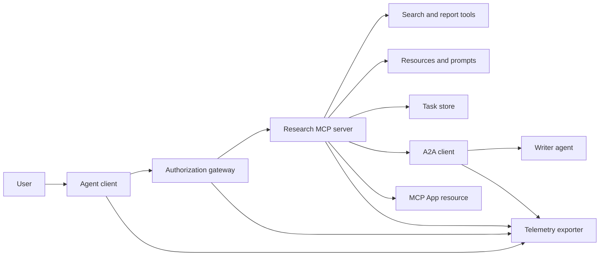
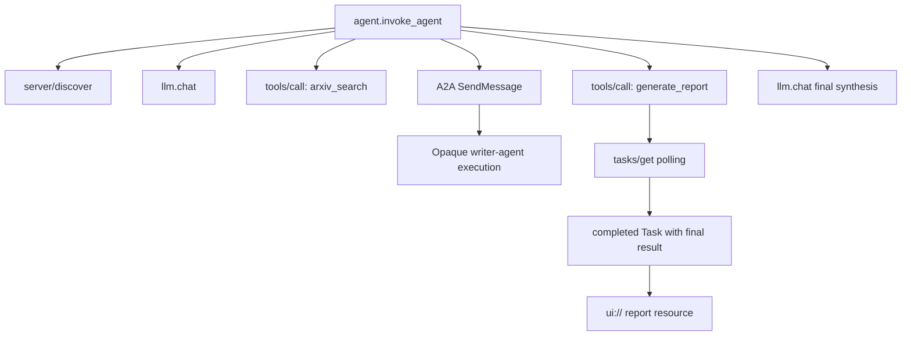
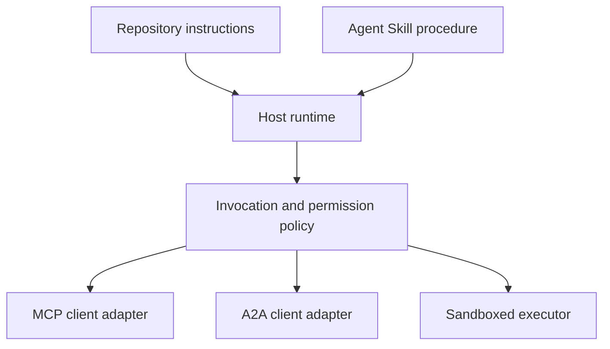

# Capstone: Stateless Tool Ecosystem

> A production agent system is a set of boundaries, not a pile of features. This capstone separates a readable in-process simulation from the protocol clients, authorization server, sandbox, and telemetry exporter a real deployment still needs.

**Type:** Build
**Languages:** Python (stdlib, in-process simulation)
**Prerequisites:** Phase 13 · 01 through 22, using MCP revision `2026-07-28`
**Time:** ~120 minutes

## Learning Objectives

- Compose tool calls, task-shaped results, delegated work, UI resources, authorization policy, and trace records into one flow.
- Carry protocol version, client identity, and capabilities on every MCP request instead of relying on a connection session.
- Discover a server before use and drive long work through the official Tasks extension.
- Distinguish a protocol-shaped simulation from an MCP, A2A, OAuth, or OpenTelemetry implementation.
- Map each simulated boundary to the production component that must replace it.
- Keep `AGENTS.md`, an Agent Skill, runtime adapters, tools, and security policy in their correct roles.
- Explain which claims can be verified from local output and which need live integration tests.

## The Problem

Design a research-and-report system. A user asks for papers on agent protocols. The system searches a paper catalog, delegates summarization, generates a report, returns a UI resource, and records the path through the system.

That sentence hides several independent contracts:

- a model-facing tool schema;
- a stateless request envelope and server discovery contract;
- a gateway decision for actor, scope, and tool identity;
- a long-running operation contract;
- a delegation protocol;
- a host-to-app bridge;
- trace propagation and export;
- a reusable operating procedure.

`code/main.py` keeps those boundaries visible with ordinary Python functions and dictionaries. It does not open a transport, contact arXiv, perform OAuth, call an A2A server, render an MCP App, or export telemetry. This makes the control flow easy to inspect without presenting a simulation as a compliant service.

## The Concept

### Target architecture



The architecture is a conceptual composition of public protocol patterns. It is not a claim about the private internals of any product.

### Target trace



In a real implementation, every hop propagates trace context. Span names and attributes must follow the OpenTelemetry semantic conventions supported by the chosen instrumentation version. A shared trace identifier alone does not prove correct parentage, export, or backend ingestion.

### Current protocol surfaces

Use the method names defined by the current protocol, not names remembered from an older draft:

| Boundary | Current surface | What the capstone simulates |
|---|---|---|
| MCP discovery | Mandatory `server/discover` | A direct function returning versions, capabilities, and server identity |
| MCP request context | Version, capabilities, and client identity in every `params._meta` | Fresh request metadata passed to every simulated call |
| MCP tool call | `tools/call` | Direct Python function dispatch |
| MCP task polling | `io.modelcontextprotocol/tasks` with `tasks/get` | A working handle followed by a completed task carrying its final result |
| A2A delegation | `SendMessage` in gRPC and JSON-RPC; `POST /message:send` in HTTP+JSON | One nested span with no remote call or artificial delay |
| MCP App calling a server tool | `app.callServerTool({ name, arguments })` | An HTML string with no live bridge |
| OAuth authorization | Authorization server, protected-resource metadata, audience and scope validation | Static token lookup and scope membership |
| OpenTelemetry | SDK, propagator, exporter, and collector or backend | In-memory span dictionaries |

Protocol names are only the first layer. Production tests must exercise serialization, authentication failures, cancellation, timeouts, retries, and version compatibility across the real wire.

### Stateless MCP changes the integration boundary

Revision `2026-07-28` removes protocol sessions and the `initialize` / `notifications/initialized` handshake. It also removes `Mcp-Session-Id`. Every request carries these namespaced `_meta` fields:

```json
{
  "io.modelcontextprotocol/protocolVersion": "2026-07-28",
  "io.modelcontextprotocol/clientCapabilities": {
    "extensions": {
      "io.modelcontextprotocol/tasks": {}
    }
  },
  "io.modelcontextprotocol/clientInfo": {
    "name": "capstone-client",
    "version": "1.0.0"
  }
}
```

The server must implement `server/discover`. Ordinary results use `resultType: "complete"`; a task handle uses `resultType: "task"`. Each result should identify the server in `_meta.io.modelcontextprotocol/serverInfo`.

The task extension has `tasks/get`, `tasks/update`, and `tasks/cancel`. A tool may first return `resultType: "task"`; `tasks/get` itself returns `resultType: "complete"`, and the completed `Task` contains the final result. The old `tasks/result` and `tasks/list` methods are not part of the current extension. A client must advertise `io.modelcontextprotocol/tasks` in the same request that may receive a task handle. If it does not, the server returns `-32021` with `requiredCapabilities` shaped as the missing client-capability object, including `extensions.io.modelcontextprotocol/tasks`.

### Security posture

The intended deployment uses defense in depth:

- OAuth authorization with PKCE where the client type requires it;
- resource and audience binding for issued access tokens;
- gateway RBAC that checks the requested tool and scope;
- upstream credentials held outside model-visible context;
- a pinned or reviewed tool-description manifest;
- a Rule of Two review for untrusted input, sensitive data, and consequential actions;
- an execution sandbox whose filesystem, process, network, credential, and resource limits are enforced outside the skill.

The demo implements only static tokens, scope checks, and description hashes. It is useful for policy flow, not security validation.

### Skills are procedure, not transport

An Agent Skill can tell the runtime how to perform the research workflow, which tool contracts to expect, what evidence to save, and when to stop. It cannot make an MCP server exist, establish A2A compatibility, grant scopes, or create a sandbox.



Ship the complete skill directory when the procedure references companion files. The flat artifact in this older capstone is a course blueprint, not evidence that a host preserves a portable bundle. Lessons 24 through 27 build and test the full bundle lifecycle.

### Course artifact metadata is a local adapter

The course catalog and installer recognize flat files named `skill-*.md`, but that is a repository convention rather than the portable Agent Skills package contract. Their minimal frontmatter parser reads only top-level keys. This lesson therefore keeps the portable identity fields and the course catalog fields at the same level:

```yaml
---
name: ecosystem-blueprint
description: Produce a full Phase 13 ecosystem architecture for a product need.
version: "1.0.0"
phase: "13"
lesson: "23"
tags: [mcp, capstone, ecosystem, architecture, a2a, otel]
---
```

`name` and `description` are the portable identity fields. `version`, `phase`, `lesson`, and `tags` are course-specific catalog extensions. The course parser requires `tags` as an inline list so `--tag capstone` can match it.

A portable directory skill may use the optional `metadata` map for string-valued extension data. That does not make `metadata` interchangeable with this repository's catalog schema. If this flat file nests `version` or `tags` below `metadata`, the minimal parser skips those indented keys, the catalog records an empty version, and tag filtering cannot find the artifact. Production hosts should use a safe YAML parser and validate their own documented schema.

### Simulation versus production

| Layer | `code/main.py` | Production replacement | Required evidence |
|---|---|---|---|
| Discovery | `server_discover()` plus static `TOOLS` | `server/discover` followed by cache-aware `tools/list` | Wire transcript, deterministic order, and schema validation |
| Authentication | Token-keyed dictionary | OAuth authorization and resource server validation | Issuer, audience, scope, expiry, and failure tests |
| Authorization | Scope membership | Gateway policy bound to actor, tool, target, and tenant | Allow and deny audit cases |
| Search | Static paper fixtures | Search API or MCP server | Source provenance, ranking, and error tests |
| Tasks | Local handle plus immediate `tasks/get` | Durable `io.modelcontextprotocol/tasks` store with `tasks/get`, `tasks/update`, `tasks/cancel`, and TTL | State-transition, input, cancellation, and recovery tests |
| Delegation | Sleep plus nested span | A2A client and remote Agent Card | Contract, timeout, retry, and opacity tests |
| App | HTML string and URI | MCP Apps resource and `App` bridge | CSP, permissions, tool-call, and browser tests |
| Telemetry | In-memory list | OTel SDK and exporter | Collector receipt and trace-parent assertions |
| Sandbox | None | Host-enforced isolated executor | Escape, egress, secret, and resource-limit tests |

This table is the handoff boundary. A green local run validates the simulation only.

### Phase 13 map

| Lessons | Contribution |
|---|---|
| 01-05 | Tool interfaces, calls, schemas, structured results, and deterministic validation |
| 06-14 | Stateless MCP request envelopes, discovery, transports, resources, prompts, extensions, and Apps |
| 15-18 | Poisoning defenses, OAuth, gateways, registries, and production authentication |
| 19 | A2A message and task delegation |
| 20 | OpenTelemetry GenAI trace design |
| 21 | Model-provider routing |
| 22 | Portable skill contract and runtime boundary |

```figure
t3-capstone-chain
```

## Build It

Run the in-process harness:

```bash
cd phases/13-tools-and-protocols/23-capstone-tool-ecosystem
python3 code/main.py
```

Inspect five things:

1. `server/discover` advertises revision `2026-07-28` and the Tasks extension.
2. Alice can read and generate a report, while Bob's write-scoped call is denied.
3. Every local span in one orchestrator run shares one trace identifier and records parent span identifiers.
4. The report begins as a task handle. `tasks/get` returns a completed task whose final result contains text and a `ui://` reference.
5. The delegated writer remains opaque because the orchestrator records only the boundary span.
6. No output claims a network connection, OAuth exchange, collector export, browser render, or sandbox execution occurred.

The script runs twice, so it produces two root traces. Audit entries are process-local and reset on the next run.

## Use It

Promote one layer at a time:

1. Replace `server_discover()` and the static tool list with real `server/discover` and `tools/list` calls. Send version, identity, and capabilities in every request.
2. Replace static tokens with an authorization server and protected resource validation.
3. Implement the `io.modelcontextprotocol/tasks` extension and test `tasks/get`, `tasks/update`, `tasks/cancel`, timeout, TTL, and restart recovery. Do not add `tasks/result` or `tasks/list`.
4. Replace the delegation stub with an A2A client that resolves an Agent Card and sends a message.
5. Build the App with the official SDK and call server tools through `app.callServerTool`.
6. Export spans to a test collector and assert parentage at the receiver.
7. Run tool and script execution inside the sandbox contract from Lesson 26.
8. Package the procedure as a complete directory bundle and pass the Lesson 27 release gate.

Each promotion needs an integration test that crosses the new boundary. Do not delete the lower-level policy tests when the wire becomes real.

## Ship It

This lesson produces `outputs/skill-ecosystem-blueprint.md`, a legacy single-file course artifact. It asks for a one-page architecture covering primitives, security, delegation, telemetry, packaging, and the hardest operational risk. Its top-level catalog fields are exercised by the repository's real catalog and installer parsers.

Because it is not a directory bundle, it cannot carry references, scripts, assets, or eval fixtures. Use the package format from Lessons 22 and 24 through 27 when publishing a reusable skill outside this course.

## Exercises

1. Run `code/main.py`. Separate facts proven by the output from production claims that still need integration evidence.
2. Add a second static backend and define the collision rule for two tools with the same name. Then replace both lists with real `tools/list` calls.
3. Replace the writer stub with an A2A test server. Record the Agent Card, message request, timeout path, and returned artifact.
4. Add a task store that survives a process restart. Prove a client can resume with `tasks/get`, respect `pollIntervalMs`, and read the completed task's final result without `tasks/result`.
5. Build a minimal MCP App and verify `app.callServerTool` in a browser with a restrictive CSP and explicit permissions.
6. Export the simulated spans through an OTel SDK to a local collector. Assert receipt, trace identifiers, parentage, and error status.
7. Write `AGENTS.md` for repository-wide maintenance rules and a separate skill bundle for the reusable research procedure. Explain why neither file grants tool authority.

## Key Terms

| Term | What people say | What it actually means |
|---|---|---|
| Capstone | "Everything wired together" | A staged integration whose simulated and live boundaries remain explicit |
| Protocol-shaped simulation | "It is basically MCP" | Local data and calls that resemble a protocol without implementing its wire contract |
| Tasks extension | "Long tool call" | An optional `io.modelcontextprotocol/tasks` lifecycle with durable identity, polling, client input, final result, and cancellation semantics |
| Opacity boundary | "The other agent handles it" | The caller sees the declared interface and artifacts, not private reasoning or internal state |
| Runtime adapter | "Skill integration" | Host code that maps portable procedure to discovery, invocation, tools, policy, and context |
| Integration evidence | "It passed" | A transcript, artifact, or receiver-side observation proving the real boundary was crossed |

## Further Reading

- [MCP specification 2026-07-28](https://modelcontextprotocol.io/specification/2026-07-28) for stateless requests, discovery, tools, authorization, and transport behavior.
- [MCP 2026-07-28 key changes](https://modelcontextprotocol.io/specification/2026-07-28/changelog) for session removal, per-request metadata, MRTR, extensions, and deprecations.
- [MCP Tasks extension](https://tasks.extensions.modelcontextprotocol.io/specification/draft/tasks) for `tasks/get`, `tasks/update`, `tasks/cancel`, and final results carried by terminal tasks.
- [MCP Apps SDK](https://github.com/modelcontextprotocol/ext-apps/blob/main/docs/overview.md) for `App` and `app.callServerTool`.
- [A2A protocol](https://a2a-protocol.org/latest/) for Agent Cards, message delivery, tasks, artifacts, and transport bindings.
- [OpenTelemetry GenAI semantic conventions](https://opentelemetry.io/docs/specs/semconv/gen-ai/) for trace and attribute conventions.
- [Agent Skills specification](https://agentskills.io/specification) for the portable package contract used by the procedural layer.
