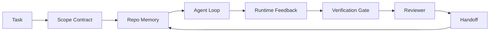

# Agent 工作台工程：为什么强大模型仍然会失败

> 一个强大的模型是不够的。可靠的 agent 需要一个工作台：指令、状态、范围、反馈、验证、审查和交接。去掉这些，即使是前沿模型也会产出不安全、无法交付的工作成果。

**类型：** 学习 + 构建
**语言：** Python (stdlib)
**前置条件：** 第 14 阶段 · 01（Agent 循环），第 14 阶段 · 26（故障模式）
**时间：** ~45 分钟

## 学习目标

- 区分模型能力与执行可靠性。
- 列出决定 agent 是否能交付的七个工作台表面。
- 在小型仓库任务上比较纯提示词运行与工作台引导运行的差异。
- 生成一份故障模式报告，将每个缺失的表面映射到它导致的症状。

## 问题

你将一个前沿模型放入真实仓库，让它添加输入验证。它打开四个文件，写出看似合理的代码，宣布成功并停止。你运行测试。两个失败。第三个文件被改动，但与验证毫无关系。没有记录 agent 假设了什么、首先尝试了什么、或者还有哪些未完成的工作。

模型对 Python 并没有理解错误。它对工作本身理解错误。它不知道什么算作完成、它被允许写入哪里、哪些测试是权威的，或者下一次会话应该如何接续。

这不是模型的 bug。这是工作台的 bug。agent 周围的表面缺少将一次性生成转变为可靠、可恢复工程的组件。

## 概念

工作台是包裹模型的运行时环境。它有七个表面：

| 表面 | 承载内容 | 缺失时的故障 |
|------|----------|--------------|
| 指令 | 启动规则、禁止操作、完成定义 | agent 猜测"交付"意味着什么 |
| 状态 | 当前任务、已触及文件、阻塞项、下一步操作 | 每次会话从零开始 |
| 范围 | 允许的文件、禁止的文件、验收标准 | 编辑泄漏到无关代码 |
| 反馈 | 捕获到循环中的实际命令输出 | agent 在 400 错误时宣布成功 |
| 验证 | 测试、lint、冒烟运行、范围检查 | "看起来没问题"进入 main |
| 审查 | 以不同角色进行的第二轮审查 | 构建者给自己的作业打分 |
| 交接 | 改动了什么、为什么、还剩什么 | 下一次会话重新发现一切 |

工作台独立于模型。你可以更换模型而保留表面。但你不能更换表面而保持可靠性。



循环在状态文件上闭合，而不是在聊天历史记录上。聊天是易失的。仓库才是系统的真实来源。

### 工作台与提示词工程的区别

提示词告诉模型你这一轮想要什么。工作台告诉模型如何跨轮次、跨会话地完成工作。大多数 agent 失败案例都是披着提示词工程外衣的工作台失败。

### 工作台与框架的区别

框架给你一个运行时（LangGraph、AutoGen、Agents SDK）。工作台给 agent 在该运行时内部的一个工作位置。你需要两者。本迷你系列关注的是后者。

### 从原语推理，而非从供应商分类法推理

目前有很多关于"harness 工程"的文章。Addy Osmani、OpenAI、Anthropic、LangChain、Martin Fowler、MongoDB、HumanLayer、Augment Code、Thoughtworks、walkinglabs awesome 列表，以及 Medium 和 Hacker News 上持续出现的文章都在讨论这个话题。他们对 harness 的边界、范围和使用的词汇各执一词。我们不需要选择立场。这七个表面是 UX 层；每个工作台底下都是支撑任何可靠后端的同一组分布式系统原语。

暂时去掉 agent 标签。agent 运行是跨越时间、进程和机器的计算。要使其可靠，你需要任何生产系统都需要的同一组原语。

| 原语 | 是什么 | 对 agent 的意义 |
|------|--------|------------------|
| 函数 | 类型化处理器。尽可能纯函数。拥有自己的输入和输出。 | 工具调用、规则检查、验证步骤、模型调用 |
| 工作进程 | 拥有一个或多个函数和生命周期的长期进程 | 构建者、审查者、验证者、MCP 服务器 |
| 触发器 | 调用函数的事件源 | agent 循环心跳、HTTP 请求、队列消息、cron、文件变更、钩子 |
| 运行时 | 决定什么在哪里运行、使用什么超时和资源的边界 | Claude Code 的进程、LangGraph 的运行时、工作进程容器 |
| HTTP / RPC | 调用者和工作进程之间的通信线路 | 工具调用协议、MCP 请求、模型 API |
| 队列 | 触发器和工作进程之间的持久缓冲区；背压、重试、幂等性 | 任务看板、反馈日志、审查收件箱 |
| 会话持久化 | 在崩溃、重启、模型更换后存活的状态 | `agent_state.json`、检查点、KV 存储、仓库本身 |
| 授权策略 | 谁可以调用哪个函数、使用什么范围 | 允许/禁止的文件、审批边界、MCP 能力列表 |

现在将七个工作台表面映射到这些原语上。

- **指令** — 策略 + 函数元数据。规则是检查（函数）。路由器（`AGENTS.md`）是附加到运行时启动的策略。
- **状态** — 会话持久化。运行时每一步读取的键值存储。文件、KV 或数据库；持久化语义重要，存储后端不重要。
- **范围** — 每个任务的授权策略。允许/禁止的 glob 是 ACL。需要的审批是权限格。
- **反馈** — 写入队列的调用日志。每个 shell 调用都是一条记录，持久化、可重放。
- **验证** — 一个函数。对输入是确定性的。在任务关闭时触发。失败时关闭。
- **审查** — 一个拥有构建者工件只读授权和审查报告只写授权的独立工作进程。
- **交接** — 由会话结束触发器发出的持久记录。下一次会话的启动触发器读取它。

agent 循环本身是一个工作进程，消费事件（用户消息、工具结果、定时器心跳）、调用函数（模型，然后是模型选择的工具）、写入记录（状态、反馈）并发出触发器（验证、审查、交接）。没什么神秘的；和作业处理器是同样的模式。

### 流行模式转译为原语

每种流行的 harness 模式都可以还原为八种原语。转译表。

| 供应商或社区模式 | 实际是什么 |
|------------------|------------|
| Ralph 循环（Claude Code、Codex、agentic_harness 书）— 当 agent 尝试提前停止时，将原始意图重新注入新的上下文窗口 | 一个用干净上下文重新入队任务的触发器；会话持久化将目标向前传递 |
| 计划 / 执行 / 验证（PEV） | 三个工作进程，每个角色一个，通过状态和队列在阶段间通信 |
| Harness-计算分离（OpenAI Agents SDK，2026 年 4 月）— 将控制平面与执行平面分离 | 重新阐述控制平面/数据平面。比 agent 标签早了几十年 |
| 开放 Agent 护照（OAP，2026 年 3 月）— 在执行前对每个工具调用按声明式策略进行签名和审计 | 由预操作工作进程强制执行的授权策略，带有签名审计队列 |
| 指南和传感器（Birgitta Böckeler / Thoughtworks）— 前馈规则 + 反馈可观测性 | 授权策略 + 验证函数 + 可观测性追踪 |
| 渐进式压缩，5 阶段（Claude Code 逆向工程，2026 年 4 月） | 一个状态管理工作进程，以 cron 式运行在会话持久化上，将其保持在预算内 |
| 钩子/中间件（LangChain、Claude Code）— 拦截模型和工具调用 | 包装在运行时调用路径上的触发器 + 函数 |
| 带有渐进式披露的 Markdown 技能（Anthropic、Flue） | 一个函数注册表，函数元数据在需要时即时加载到上下文中 |
| 沙箱 agent（Codex、Sandcastle、Vercel Sandbox） | 计算平面：具有隔离文件系统、网络和生命周期的运行时 |
| MCP 服务器 | 通过稳定 RPC 暴露函数的工作进程，以能力列表作为授权 |

该表中的每个条目都是 agent 社区到达了一个在分布式系统中已有名字的原语，并给它起了一个新名字。对营销有用的标签；但作为工程词汇并不实用。

### 实际证据说了什么

harness 优于模型的主张现在有了数据支撑。值得了解，因为它们也是反对"只要等待更聪明模型就好"的唯一诚实论据。

- Terminal Bench 2.0 — 同一模型，harness 变更将编码 agent 从前三十名之外提升到第五名（LangChain，*Anatomy of an Agent Harness*）。
- Vercel — 删除了 80% 的 agent 工具；成功率从 80% 跳升到 100%（MongoDB）。
- Harvey — 仅通过 harness 优化，法律 agent 准确率翻了一倍多（MongoDB）。
- 88% 的企业 AI agent 项目未能投产。失败集中在运行时，而非推理（preprints.org，*Harness Engineering for Language Agents*，2026 年 3 月）。
- 一项 2025 年对三个流行开源框架的基准研究报告了约 50% 的任务完成率；长上下文 WebAgent 在长上下文条件下从 40-50% 崩溃到低于 10%，主要原因是无限循环和目标丢失（2026 年初被广泛报道）。

结论不是"harness 永远胜利"。模型确实会随时间吸收 harness 技巧。结论是，如今承载负荷的工程围绕模型展开，而非在其内部，而承载这些负荷的原语正是每个生产系统一直需要的。

### 供应商文章的不足之处

这是你不需要客气的部分。

- LangChain 的 *Anatomy of an Agent Harness* 列举了十一个组件——提示词、工具、钩子、沙箱、编排、内存、技能、子 agent 和运行时"哑循环"。它没有提及队列、作为部署单元的工作进程、触发器语义、作为独立关注点的会话持久化或授权策略。它将 harness 视为你配置的对象，而不是你部署的系统。
- Addy Osmani 的 *Agent Harness Engineering* 确立了 `Agent = Model + Harness` 框架和棘轮模式，但没有说明 harness 是由什么构建的。它读起来像是一种立场，而非规范。
- Anthropic 和 OpenAI 在表面上最深入，但停留在自己的运行时内。2026 年 4 月 Agents SDK 中"harness-计算分离"公告是第一个明确支持控制平面/数据平面分离的供应商文章。这是一个原语概念，而非新概念。
- agentic_harness 书将 harness 视为配置对象（Jaymin West 的 *Agentic Engineering*，第 6 章），其中最有力的一句话是"harness 是 agentic 系统中的主要安全边界。"这不过是授权策略的重新表述。
- Hacker News 帖子不断到达同一结论。2026 年 4 月帖子 *The agent harness belongs outside the sandbox* 认为 harness 应该"更像是一个位于一切之外的虚拟机监控程序，根据上下文和用户授权访问。"这同样是将授权策略作为独立平面。

你不需要反对这些文章中的任何一篇就能发现差距。他们是在为一个已经存在的系统撰写 UX 描述。我们是在构建这个系统。当系统构建正确时，七个表面从原语中自然产生。当构建错误时，再多的 `AGENTS.md` 润色也修复不了缺失的队列。

所以当你在其他地方听到"harness 工程"时，将其转译为原语。提示词和规则是策略和函数。脚手架是运行时。护栏是授权 + 验证。钩子是触发器。内存是会话持久化。Ralph 循环是重新入队。子 agent 是工作进程。沙箱是计算平面。词汇变了；工程没变。工作台是面向 agent 的 UX；而 harness，在经得起下一次供应商重新定义的意义上，是正确连接在一起的函数、工作进程、触发器、运行时、队列、持久化和策略。

## 构建它

`code/main.py` 运行一个小仓库任务两次。首先仅使用提示词，然后接入七个表面。同一个模型，同一个任务。脚本统计失败运行中缺失的表面，并打印故障模式报告。

仓库任务故意设计得很小：向一个单文件 FastAPI 风格的处理器添加输入验证，并编写一个通过的测试。

运行它：

```
python3 code/main.py
```

输出：两次运行的并排日志、一个总结纯提示词运行的 `failure_modes.json`，以及工作台运行的一行判定。

agent 是一个基于规则的小型存根；重点是表面，而非模型。在本迷你系列的后续部分，你将把每个表面重建为真实的、可复用的工件。

## 使用它

三个地方已经存在工作台表面，即使没有人这样称呼它们：

- **Claude Code、Codex、Cursor。** `AGENTS.md` 和 `CLAUDE.md` 是指令表面。斜杠命令是范围。钩子是验证。
- **LangGraph、OpenAI Agents SDK。** 检查点和会话存储是状态表面。交接是交接表面。
- **真实仓库上的 CI。** 测试、lint 和类型检查是验证。PR 模板是交接。CODEOWNERS 是审查。

工作台工程是使这些表面明确化和可复用的学科，而不是让每个团队自己重新发现它们。

## 交付它

`outputs/skill-workbench-audit.md` 是一个可移植的技能，用于审计现有仓库的七个工作台表面，并报告哪些缺失、哪些部分存在、哪些健康。将其放在任何 agent 设置旁边；它会告诉你首先修复什么。

## 练习

1. 选择一个你已经运行 agent 的仓库。为七个表面评分 0（缺失）到 2（健康）。你最薄弱的表面是什么？
2. 扩展 `main.py`，使纯提示词运行也产生一个虚假的"成功"声明。验证验证门是否能捕获它。
3. 为你的产品添加第八个表面。论证为什么它不会坍缩到现有七个表面中的一个。
4. 使用一个虚构了额外文件写入的不同存根 agent 重新运行脚本。哪个表面首先捕获它？
5. 将第 14 阶段 · 26 中五个行业反复出现的故障模式映射到七个表面。每个表面设计用于吸收哪种模式？

## 关键术语

| 术语 | 人们怎么说 | 实际含义 |
|------|------------|----------|
| 工作台 | "那套设置" | 围绕模型的工程化表面，使工作可靠 |
| 表面 | "一个文档"或"一个脚本" | 一个命名的、机器可读的输入，agent 每轮读取或写入 |
| 系统真实来源 | "那些笔记" | 当聊天历史消失时，agent 视为真相的文件 |
| 完成定义 | "验收" | 一个客观的、基于文件的清单，agent 无法伪造 |
| 工作台审计 | "仓库就绪检查" | 对七个表面的一轮检查，在工作开始前标记缺失部分 |

## 进一步阅读

将这些作为数据点，而非权威来源。每一篇都是部分分类法。在决定是否采纳之前，将每个概念转译回原语（函数、工作进程、触发器、运行时、HTTP/RPC、队列、持久化、策略）。

供应商文章：

- [Addy Osmani, Agent Harness Engineering](https://addyosmani.com/blog/agent-harness-engineering/) — `Agent = Model + Harness` 和棘轮模式；基础设施内容较薄
- [LangChain, The Anatomy of an Agent Harness](https://blog.langchain.com/the-anatomy-of-an-agent-harness/) — 十一个组件：提示词、工具、钩子、编排、沙箱、内存、技能、子 agent、运行时；省略了队列、部署、授权
- [OpenAI, Harness engineering: leveraging Codex in an agent-first world](https://openai.com/index/harness-engineering/) — Codex 团队对他们运行时周围表面的看法
- [OpenAI, Unrolling the Codex agent loop](https://openai.com/index/unrolling-the-codex-agent-loop/) — agent 循环还原为函数调用上的 `while`
- [Anthropic, Effective harnesses for long-running agents](https://www.anthropic.com/engineering/effective-harnesses-for-long-running-agents) — 特定运行时内的长期表面
- [Anthropic, Harness design for long-running application development](https://www.anthropic.com/engineering/harness-design-long-running-apps) — 应用设计笔记
- [LangChain Deep Agents harness capabilities](https://docs.langchain.com/oss/python/deepagents/harness) — 运行时配置表面

包含可用细节的实践者文章：

- [Martin Fowler / Birgitta Böckeler, Harness engineering for coding agent users](https://martinfowler.com/articles/harness-engineering.html) — 指南（前馈）+ 传感器（反馈）；最清晰的控制论框架
- [HumanLayer, Skill Issue: Harness Engineering for Coding Agents](https://www.humanlayer.dev/blog/skill-issue-harness-engineering-for-coding-agents) — "这不是模型问题，是配置问题"
- [MongoDB, The Agent Harness: Why the LLM Is the Smallest Part of Your Agent System](https://www.mongodb.com/company/blog/technical/agent-harness-why-llm-is-smallest-part-of-your-agent-system) — 证据：Vercel 80% 到 100%，Harvey 2 倍准确率，Terminal Bench 前三十到前五
- [Augment Code, Harness Engineering for AI Coding Agents](https://www.augmentcode.com/guides/harness-engineering-ai-coding-agents) — 约束优先的实践指南
- [Sequoia podcast, Harrison Chase on Context Engineering Long-Horizon Agents](https://sequoiacap.com/podcast/context-engineering-our-way-to-long-horizon-agents-langchains-harrison-chase/) — 运行时关注优先于模型关注

书籍、论文和参考实现：

- [Jaymin West, Agentic Engineering — Chapter 6: Harnesses](https://www.jayminwest.com/agentic-engineering-book/6-harnesses) — 书籍篇幅的处理，将 harness 视为主要安全边界
- [preprints.org, Harness Engineering for Language Agents (March 2026)](https://www.preprints.org/manuscript/202603.1756) — 学术框架：控制/代理/运行时
- [walkinglabs/awesome-harness-engineering](https://github.com/walkinglabs/awesome-harness-engineering) — 跨上下文、评估、可观测性、编排的精选阅读列表
- [ai-boost/awesome-harness-engineering](https://github.com/ai-boost/awesome-harness-engineering) — 备选精选列表（工具、评估、内存、MCP、权限）
- [andrewgarst/agentic_harness](https://github.com/andrewgarst/agentic_harness) — 具有 Redis 支持的内存和评估套件的生产就绪参考实现
- [HKUDS/OpenHarness](https://github.com/HKUDS/OpenHarness) — 具有内置个人 agent 的开放 agent harness

Hacker News 帖子值得阅读，因为分歧而非共识：

- [HN: Effective harnesses for long-running agents](https://news.ycombinator.com/item?id=46081704)
- [HN: Improving 15 LLMs at Coding in One Afternoon. Only the Harness Changed](https://news.ycombinator.com/item?id=46988596)
- [HN: The agent harness belongs outside the sandbox](https://news.ycombinator.com/item?id=47990675) — 主张授权作为独立平面

本课程内部的交叉引用：

- 第 14 阶段 · 23 — OpenTelemetry GenAI 约定：传感器文献指向的可观测性层
- 第 14 阶段 · 26 — 七个表面设计用于吸收的故障模式目录
- 第 14 阶段 · 27 — 位于授权策略原语的提示词注入防御
- 第 14 阶段 · 29 — 生产运行时（队列、事件、cron）：本课中原语的部署位置
