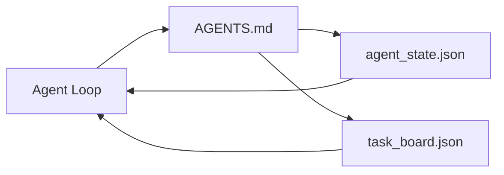

# 最小代理工作台

> 最小且实用的工作台由三个文件组成：一个根路由器、一个状态文件和一个任务板。其他一切都是在此基础上叠加的。如果一个代码仓库无法承载这三个文件，任何模型都无法挽救它。

**类型：** 构建
**语言：** Python（标准库）
**前置课程：** 第 14 阶段 · 31（为什么强大的模型仍然会失败）
**时间：** ~45 分钟

## 学习目标

- 定义构成最小可行工作台的三个文件。
- 解释为什么一个简短的根路由器优于一个冗长的单体 `AGENTS.md`。
- 构建一个代理在每一轮都可以读取、并在结束时写入的状态文件。
- 构建一个能在多会话工作中存活、无需聊天历史的任务板。

## 问题所在

大多数团队在搭建工作台时，会写一个 3000 行的 `AGENTS.md` 就算完事。模型加载它，忽略那些它无法总结的部分，然后仍然在它一直失败的地方失败。

你需要的是相反的做法。一个微小的根文件，仅在相关时将代理路由到更深层的文件。持久的状态，代理在行动前读取、行动后写入。一个任务板，显示正在进行中的任务、被阻塞的任务和接下来的任务。

三个文件。每个文件都有自己的职责。每个文件都足够机器可读，以便后续演进为真正的系统。

## 核心概念



### AGENTS.md 是路由器，而非手册

一个好的 `AGENTS.md` 应该很短。它指向：

- 状态文件（你在哪里）。
- 任务板（还剩什么）。
- 更深层的规则（在 `docs/agent-rules.md` 下）。
- 验证命令（如何知道它能工作）。

任何更长的内容都放在更深层的文档中，仅在需要时加载。冗长的手册会被忽略，简短的路由器会被遵循。

### agent_state.json 是权威记录

状态包含：活跃的任务 ID、已触及的文件、所做的假设、阻塞因素和下一步操作。代理在每一轮都读取它。下一个会话读取它，而不是重放聊天记录。

状态以文件形式存在，因为聊天历史不可靠。会话会终止，对话会被截断，但文件不会。

### task_board.json 是队列

任务板包含每个任务，状态为 `todo | in_progress | done | blocked`。它是代理在状态为空时拉取的队列，也是你想知道代理是否按计划进行时阅读的队列。

板上的任务有 ID、目标、所有者（`builder`、`reviewer` 或 `human`）以及验收标准。任务板故意设计得很小：当它超出一屏时，你面临的是规划问题，而非板的问题。

### 三个文件是底线，而非上限

后续课程会添加范围契约、反馈运行器、验证门、审查员清单和交接包。这里的三个文件是所有这些的基础。

## 动手构建

`code/main.py` 将最小工作台写入一个空仓库，并演示一个完整的代理回合，该回合：

1. 读取 `agent_state.json`。
2. 如果状态为空，从 `task_board.json` 拉取下一个任务。
3. 在范围内修改单个文件。
4. 写回更新后的状态。

运行它：

```
python3 code/main.py
```

该脚本在自身旁边创建 `workdir/` 目录，放置三个文件，运行一个回合，然后打印差异。重新运行以查看第二个回合如何从第一个回合停止的地方继续。

## 使用它

在生产级代理产品中，同样的三个文件以不同的名称出现：

- **Claude Code：** `AGENTS.md` 或 `CLAUDE.md` 作为路由器，`.claude/state.json` 风格的存储作为状态，hooks 作为任务板。
- **Codex / Cursor：** 工作区规则作为路由器，会话记忆作为状态，聊天侧边栏中的排队任务作为任务板。
- **自定义 Python 代理：** 你刚写的相同文件。

名称会变，但结构不变。

## 生产环境中的实践模式

最小工作台在与真实的 monorepo 结合时，当叠加了三种模式后能够经受住考验。它们是相互独立的；根据你的代码仓库实际需要选择使用。

**嵌套 `AGENTS.md` 并采用最近优先的规则。** OpenAI 在其主仓库中部署了 88 个 `AGENTS.md` 文件，每个子组件一个。Codex、Cursor、Claude Code 和 Copilot 都会从工作文件向仓库根目录遍历，并沿途连接每个找到的 `AGENTS.md`。子目录文件扩展根文件。Codex 添加 `AGENTS.override.md` 进行替换而非扩展；该覆盖机制是 Codex 特有的，跨工具工作时应避免使用。Augment Code 的度量结果是关键：最好的 `AGENTS.md` 文件带来的质量提升相当于从 Haiku 升级到 Opus；最差的甚至比没有文件还糟糕。

**要拒绝的反模式，即使它们看起来像是覆盖。** 相互矛盾的指令会悄悄将代理从交互模式降级为贪婪模式（ICLR 2026 AMBIG-SWE：48.8% → 28% 解决率）；用数字优先级而非扁平堆叠。无法验证的样式规则（"遵循 Google Python 风格指南"）没有强制执行命令，会让代理自行发明合规方式；每条样式规则都应配对精确的 lint 命令。以样式而非命令开头会埋没验证路径；命令在前，样式在后。为人类而非代理编写会浪费上下文预算；简洁是一种特性。

**跨工具符号链接。** 一个带有符号链接的根文件（`ln -s AGENTS.md CLAUDE.md`、`ln -s AGENTS.md .github/copilot-instructions.md`、`ln -s AGENTS.md .cursorrules`）使每个编码代理都使用同一事实来源。Nx 的 `nx ai-setup` 可以从单一配置自动为 Claude Code、Cursor、Copilot、Gemini、Codex 和 OpenCode 完成此操作。

## 交付使用

`outputs/skill-minimal-workbench.md` 为任何新仓库生成三文件工作台：一个针对项目调整的 `AGENTS.md` 路由器、一个包含正确键的 `agent_state.json`，以及一个用当前待办事项填充的 `task_board.json`。

## 练习

1. 在 `agent_state.json` 中添加 `last_run` 时间戳。如果文件超过 24 小时未更新，拒绝运行，除非操作员确认。
2. 在任务板中添加 `priority` 字段，并修改拉取器使其始终选择最高优先级的 `todo` 任务。
3. 将 `task_board.json` 迁移为 JSON Lines 格式，使每个任务占一行，差异在版本控制中更清晰。
4. 编写一个 `lint_workbench.py`，如果 `AGENTS.md` 超过 80 行或引用了不存在的文件则报错。
5. 决定三个文件中丢失哪一个损失最大，并为之辩护。

## 关键术语

| 术语 | 人们怎么称呼它 | 实际含义 |
|------|----------------|----------|
| 路由器 | `AGENTS.md` | 指向代理深层文档和文件的简短根文件 |
| 状态文件 | "笔记" | 代理位置的机器可读记录，每轮写入 |
| 任务板 | "待办事项" | 带有状态、所有者、验收标准的 JSON 工作队列 |
| 权威记录 | "事实来源" | 工作台在聊天消失后视为权威的文件 |

## 延伸阅读

- [agents.md — 开放规范](https://agents.md/) — 被 Cursor、Codex、Claude Code、Copilot、Gemini、OpenCode 采用
- [Augment Code, A good AGENTS.md is a model upgrade. A bad one is worse than no docs at all](https://www.augmentcode.com/blog/how-to-write-good-agents-dot-md-files) — 量化质量提升
- [Blake Crosley, AGENTS.md Patterns: What Actually Changes Agent Behavior](https://blakecrosley.com/blog/agents-md-patterns) — 经验上有效和无效的做法
- [Datadog Frontend, Steering AI Agents in Monorepos with AGENTS.md](https://dev.to/datadog-frontend-dev/steering-ai-agents-in-monorepos-with-agentsmd-13g0) — 实践中的嵌套优先级
- [Nx Blog, Teach Your AI Agent How to Work in a Monorepo](https://nx.dev/blog/nx-ai-agent-skills) — 跨六个工具的单一来源生成
- [The Prompt Shelf, AGENTS.md Best Practices: Structure, Scope, and Real Examples](https://thepromptshelf.dev/blog/agents-md-best-practices/) — 经得起审查的章节排序
- [Anthropic, Claude Code subagents and session store](https://docs.anthropic.com/en/docs/agents-and-tools/claude-code/sub-agents)
- 第 14 阶段 · 31 — 本最小工作台所应对的失败模式
- 第 14 阶段 · 34 — 本课预览的持久状态架构
