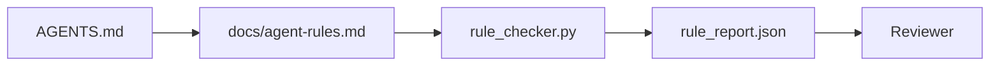

# Agent 指令作为可执行约束

> 以散文形式编写的指令是愿望。以约束形式编写的指令是测试。工作台将每条规则转化为 agent 在运行时可以检查、审查者在事后可以验证的东西。

**类型:** Build
**语言:** Python (stdlib)
**前置条件:** Phase 14 · 32 (Minimal Workbench)
**时间:** ~50 分钟

## 学习目标

- 将路由散文与操作规则分离。
- 将启动规则、禁止操作、完成定义、不确定性处理和审批边界表达为机器可检查的约束。
- 实现一个规则检查器，根据规则集对运行进行评分。
- 使规则集对 diff 友好，以便审查者可以看到更改了什么。

## 问题

典型的 `AGENTS.md` 读起来像入职文档。它告诉 agent "要小心"、"要彻底测试"和"如果不确定就问"。三天后，agent 提交了一个没有测试的更改，写入了被禁止的目录，并且从不询问，因为它从来不知道界限在哪里。

当指令是可操作的时候它们是强大的，当指令是理想化的时候它们是薄弱的。解决方法是编写工作台可以解释、审查者可以评分的规则。

## 概念

规则放在 `docs/agent-rules.md` 中，远离简短的根路由器。每条规则都有一个名称、一个类别和一个检查。



### 覆盖大多数规则的五个类别

| 类别 | 规则回答的问题 | 示例 |
|------|----------------|------|
| Startup | 工作开始前必须满足什么条件？ | "状态文件存在且是最新的" |
| Forbidden | 什么绝不能发生？ | "不要编辑 `scripts/release.sh`" |
| Definition of done | 什么证明任务已完成？ | "pytest 退出码为 0 且验收行通过" |
| Uncertainty | agent 不确定时该怎么做？ | "打开问题笔记而不是猜测" |
| Approval | 什么需要人工审批？ | "任何新依赖、任何生产环境写入" |

不适合这五个类别之一的规则通常应该拆分为两条规则。强制进行拆分。

### 规则是机器可读的

每条规则都有一个 slug、一个类别、一行描述和一个 `check` 字段，该字段指向 `rule_checker.py` 中的一个函数。添加规则意味着添加检查；检查器随工作台一起增长。

### 规则对 diff 友好

规则在单个 markdown 文件中每条规则一个标题。重命名在 diff 中可见。新规则放在其类别的顶部。过时的规则被删除而不是注释掉，因为工作台是真实来源，而不是团队上个季度感受的聊天记录。

### 规则与框架护栏

框架护栏（OpenAI Agents SDK guardrails、LangGraph interrupts）在运行时级别执行规则。本课中的规则集是这些护栏实现的人类可读、可审查的契约。你需要两者：运行时在回合期间捕获违规，规则集证明运行时正在做正确的事情。

### 渐进式披露：地图，而不是百科全书

`AGENTS.md` 不断增长的原因是每个事件都添加一条规则，而没有事件删除一条规则。一年后，文件有两千行，agent 读第一屏，注意力预算耗尽，只对告诉它的一小部分采取行动。巨型指令文件失败的原因与四十页的入职文档失败的原因相同：读者浏览一遍后永远不会再回到重要的部分。

解决方法不是更短的文件，而是分层的文件。根路由器保持足够小，每次会话都可以读取，并且只包含指针。深度存在于主题文件中，agent 只有在任务涉及这些主题时才加载。给 agent 一张地图，而不是整个百科全书，让它走到它需要的页面。

```
AGENTS.md                  # 路由器，< 50 行：这个仓库是什么、在哪里看、5 条硬规则
docs/
  agent-rules.md           # 完整的规则集（本课）
  architecture.md          # 当任务涉及模块边界时加载
  testing.md               # 当任务编写或运行测试时加载
  deploy.md                # 仅在发布工作时加载，受审批规则控制
feature_list.json          # 待办事项（Phase 14 · 36）
```

| 层级 | 位于 | 何时读取 | 大小预算 |
|------|------|----------|----------|
| Router | `AGENTS.md` | 每次会话，始终 | 不超过 ~50 行 |
| Rules | `docs/agent-rules.md` | 每次会话，启动时 | 每个类别一屏 |
| Topic docs | `docs/<topic>.md` | 仅当任务涉及该主题时 | 根据需要深入 |

两个测试保持分层的诚实性。可达性测试：agent 应该最多从路由器两跳到达任何规则，因此路由器必须通过路径链接每个主题文档，而不是用散文描述它。新鲜度测试：路由器足够短，审查者在每个 PR 上都会重新阅读，这是防止它悄悄增长回它所替代的百科全书的唯一方法。一个不再解析的指针比缺失的规则更糟糕的失败，因此路由器中的断开链接本身就是启动检查违规。

## 构建它

`code/main.py` 包含：

- `agent-rules.md` 解析器，将规则加载到 dataclass 中。
- `rule_checker.py` 风格的检查函数，每个 `check` 引用一个。
- 一个演示 agent 运行违反两条规则，以及一个检查通过捕获它们。

运行它：

```
python3 code/main.py
```

输出：解析的规则集、运行跟踪、每个规则的通过/失败，以及保存在脚本旁边的 `rule_report.json`。

## 现实中的生产模式

三种模式将持续一个季度的规则集与一周内衰减的规则集区分开来。

**写入时的严重性标记。** 每条规则都带有 `severity`：`block`、`warn` 或 `info`。检查器报告所有三种；运行时仅在 `block` 时拒绝。大多数团队在早期高估严重性，然后在截止日期压力下悄悄削弱它；写入时标记强制提前校准。与验证门（Phase 14 · 38）配对，该门将任何对 `block` 规则的覆盖签名到 `overrides.jsonl` 审计日志中。

**规则过期作为强制函数。** 每条规则都带有 `expires_at` 日期（默认为创建后 90 天）。当未过时的规则连续 60 天零违规时，检查器发出警告；下一次季度审查要么证明保留它的合理性，要么将其削弱为 `info`，要么删除它。Cloudflare 的生产 AI Code Review 数据（2026 年 4 月，30 天内 5,169 个仓库中的 131,246 次审查运行）显示，具有明确过期时间的规则集每个仓库保持在 30 条规则以下；没有过期时间的规则集增长到 80+ 条，其中大多数从未触发。

**Markdown 作为源，JSON 作为缓存。** `agent-rules.md` 是创作文件；`agent-rules.lock.json` 是检查器在热路径中读取的缓存。锁定文件由 pre-commit hook 重新生成。Markdown diff 可审查；JSON 解析不会出现在每次回合中。与 `package.json` / `package-lock.json` 和 `Cargo.toml` / `Cargo.lock` 形状相同。

## 使用它

在生产中：

- Claude Code、Codex、Cursor 在会话开始时读取规则，并在拒绝操作时引用它们。检查器在 CI 中重新运行它们以捕获静默漂移。
- OpenAI Agents SDK guardrails 将相同的检查注册为输入和输出护栏。markdown 是文档表面；SDK 是运行时表面。
- LangGraph interrupts 在进行中的节点违反规则时触发。中断处理器读取规则，询问人工，然后恢复。

规则集在所有三个之间可移植，因为它只是 markdown 加函数名。

## 交付它

`outputs/skill-rule-set-builder.md` 采访项目所有者，将其现有的散文指令分类到五个类别中，并发出一个版本化的 `agent-rules.md` 加上一个检查器存根。

## 练习

1. 如果你的产品确实需要，添加第六个类别。论证为什么它不会坍缩到五个类别之一。
2. 扩展检查器，使规则可以携带严重性（`block`、`warn`、`info`），报告相应地聚合。
3. 将检查器接入 CI：如果最新 agent 运行中 block 严重性规则失败，则构建失败。
4. 为每条规则添加一个 "expiry" 字段。90 天没有检查失败后，规则进入审查。
5. 找到一个真实的 `AGENTS.md` 并将其重写为五类别规则。它的多少行是可操作的？多少行是理想化的？

## 关键术语

| 术语 | 人们的说法 | 实际含义 |
|------|------------|----------|
| Operational rule | "真正的指令" | 工作台在运行时可以检查的规则 |
| Aspirational rule | "要小心" | 没有检查的规则；要么删除要么升级 |
| Definition of done | "验收" | 客观的、基于文件的证明任务已完成 |
| Block severity | "硬规则" | 违规停止运行；没有操作员无法静默 |
| Rule expiry | "过时规则清理" | N 天没有失败的规则进入退役审查 |

## 延伸阅读

- [OpenAI Agents SDK guardrails](https://platform.openai.com/docs/guides/agents-sdk/guardrails)
- [LangGraph interrupts](https://langchain-ai.github.io/langgraph/how-tos/human_in_the_loop/breakpoints/)
- [Anthropic, Building Effective Agents](https://www.anthropic.com/research/building-effective-agents)
- [Rick Hightower, Agent RuleZ: A Deterministic Policy Engine](https://medium.com/@richardhightower/agent-rulez-a-deterministic-policy-engine-for-ai-coding-agents-9489e0561edf) — 生产中的 block/warn/info 严重性
- [Cloudflare, Orchestrating AI Code Review at Scale](https://blog.cloudflare.com/ai-code-review/) — 131k 次审查运行，规则组合经验教训
- [microservices.io, GenAI development platform — part 1: guardrails](https://microservices.io/post/architecture/2026/03/09/genai-development-platform-part-1-development-guardrails.html) — 规则和 CI 之间的纵深防御
- [Type-Checked Compliance: Deterministic Guardrails (arXiv 2604.01483)](https://arxiv.org/pdf/2604.01483) — Lean 4 作为规则即检查的上限
- [logi-cmd/agent-guardrails](https://github.com/logi-cmd/agent-guardrails) — 合并门实现：作用域、变异测试、违规预算
- Phase 14 · 32 — 此规则集放入的最小工作台
- Phase 14 · 38 — 使用规则报告的验证门
- Phase 14 · 39 — 评分规则遵从性的审查 agent
